# Лекция 1. Операционная система как объект защиты

> От архитектуры и границы привилегий — к модели угроз и проверяемой защите.

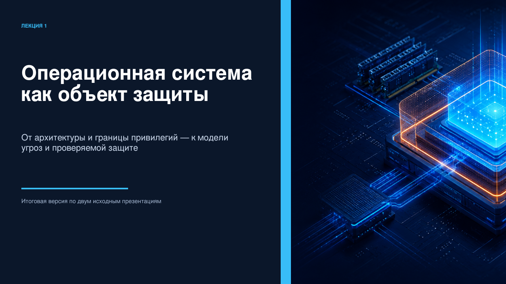

## Назначение лекции

Операционная система обеспечивает выполнение приложений, распределяет аппаратные ресурсы, формирует удобные абстракции и принимает решения о доступе. Поэтому она одновременно является:

- технической основой вычислительной системы;
- посредником между приложениями и оборудованием;
- центром реализации политики безопасности;
- источником данных для контроля, аудита и расследования событий.

Цель лекции — научиться рассматривать защищённость ОС не как набор рекламных характеристик или названий механизмов, а как совокупность **проверяемых свойств**.

После изучения материала студент должен уметь:

1. показать границу, на которой приложение передаёт управление привилегированному коду;
2. определить компоненты доверенной вычислительной базы;
3. построить модель, включающую активы, субъекты, объекты, границы доверия и поверхность атаки;
4. сформулировать положительные и отрицательные тесты;
5. определить, где будет наблюдаться доказательство выполнения политики.

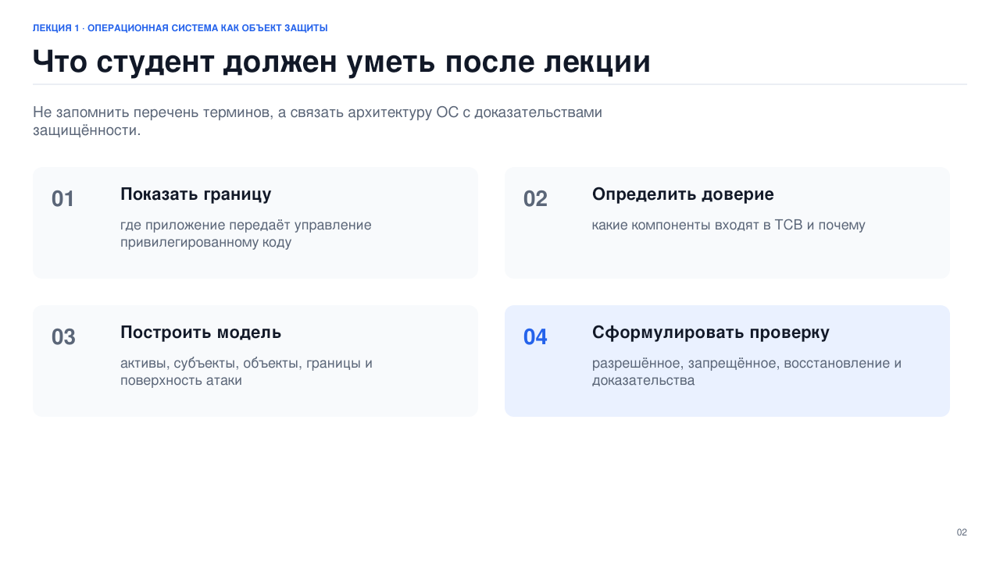

## Оглавление

1. [ОС как контролируемый посредник](#controlled-mediation)
2. [Определение и основные роли ОС](#os-definition)
3. [Слоистая архитектура и граница привилегий](#architecture)
4. [Эволюция и классификация ОС](#evolution)
5. [Политика, механизмы и базовые принципы](#policy)
6. [Доверенная вычислительная база](#tcb)
7. [Активы и требуемые свойства](#assets)
8. [Контролируемый доступ и границы доверия](#trust-boundaries)
9. [Поверхность атаки и риск](#risk)
10. [Практическая цепочка анализа](#analysis)
11. [Базовое состояние и жизненный цикл защиты](#baseline)
12. [Учебный стенд Astra Linux и Kali Linux](#lab)
13. [Практическое задание](#task)
14. [Итоги и вопросы для самопроверки](#summary)

---

## 1. ОС как контролируемый посредник

Представим систему, в которой приложение может напрямую:

- читать произвольные области памяти;
- записывать данные на диск;
- управлять устройствами;
- отправлять сетевые пакеты;
- изменять состояние других процессов.

В такой системе трудно обеспечить изоляцию, разграничение доступа и доказать, кто изменил данные. Для защиты нужен **неизбежный посредник**, через который проходят обращения к ресурсам.

Операционная система превращает непосредственное воздействие на ресурс в контролируемый запрос:

    субъект → запрос → проверка политики → операция над объектом → результат и аудит

Посредничество должно быть полным: субъект не должен иметь альтернативного пути к ресурсу в обход точки контроля.

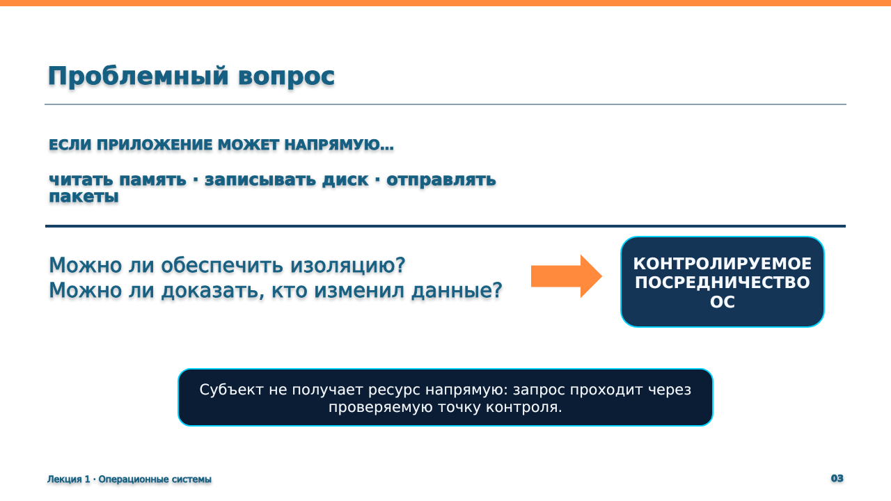

> **Главная идея:** субъект не получает ресурс напрямую. Запрос проходит через проверяемую точку контроля операционной системы.

## 2. Определение и основные роли ОС

**Операционная система** — комплекс взаимосвязанных программ, который:

- организует выполнение приложений;
- управляет ресурсами и состоянием вычислительной системы;
- предоставляет стандартизированные интерфейсы;
- реализует правила взаимодействия субъектов и объектов;
- фиксирует значимые события.

ОС можно рассматривать в двух взаимосвязанных плоскостях.

| Плоскость | Основной вопрос | Состав |
|---|---|---|
| Техническая | Из чего состоит система? | ядро, драйверы, библиотеки, системные службы |
| Логическая | Какие операции допустимы? | модель вычислений, правила доступа, аудит, требования безопасности |

Код реализует механизм, а политика определяет допустимое поведение.

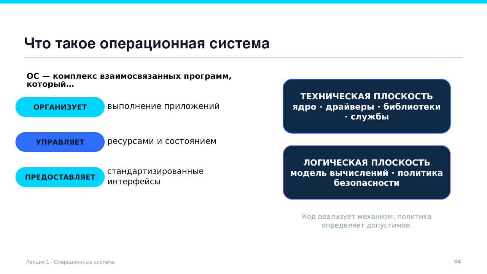

### 2.1. Менеджер ресурсов

ОС учитывает, распределяет и изолирует процессорное время, оперативную память, постоянное хранилище, устройства ввода-вывода, сетевые интерфейсы, процессы и потоки.

### 2.2. Расширенная машина

ОС скрывает аппаратные детали и предоставляет приложениям устойчивые абстракции: файлы и каталоги, процессы и потоки, виртуальную память, сокеты, каналы межпроцессного взаимодействия, системные часы и таймеры.

### 2.3. Посредник политики

ОС идентифицирует субъект, проверяет запрос, определяет допустимость операции и фиксирует результат. Каждый системный интерфейс одновременно предоставляет полезную функцию, создаёт точку взаимодействия и может расширять поверхность атаки.

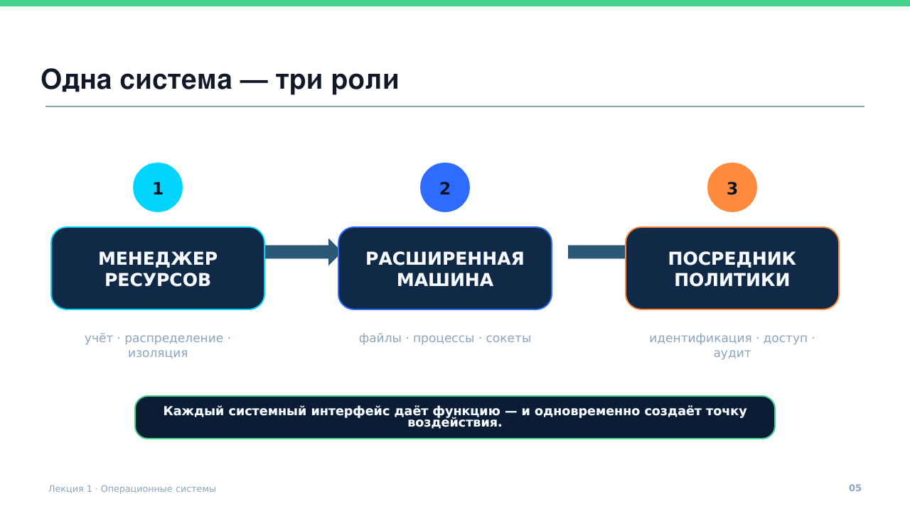

### 2.4. Где концентрируется контроль

Типовой путь запроса:

1. приложение формулирует требуемое действие;
2. библиотека или API подготавливает системный вызов;
3. ядро получает параметры и контекст субъекта;
4. ОС проверяет политику;
5. оборудование выполняет разрешённую операцию;
6. управление и результат возвращаются приложению.

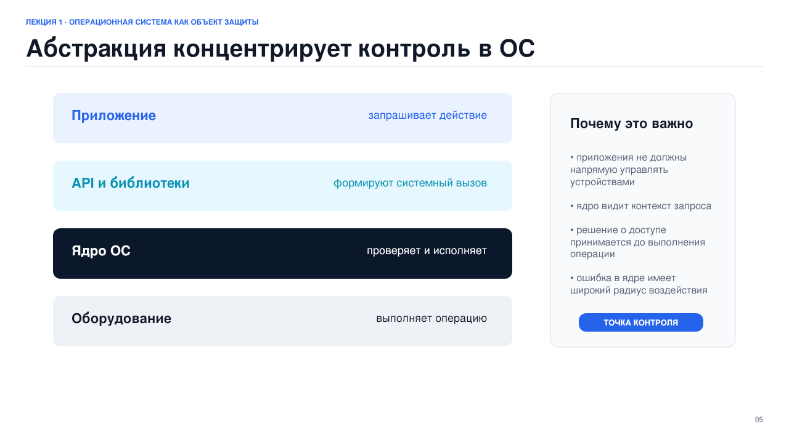

Этот путь важен, потому что приложение не должно напрямую управлять устройствами, ядро видит контекст запроса, решение о доступе принимается до выполнения операции, а ошибка в ядре может иметь широкий радиус воздействия.

---

## 3. Слоистая архитектура и граница привилегий

Упрощённая слоистая модель ОС включает пользовательские данные, приложения, системные службы, библиотеки и API, ядро и драйверы, аппаратное обеспечение.

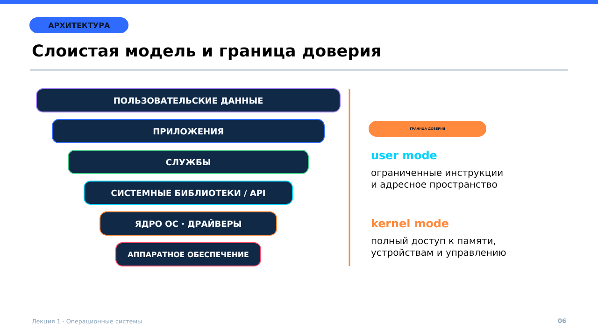

### 3.1. Пользовательский и привилегированный режимы

| Характеристика | Пользовательский режим | Режим ядра |
|---|---|---|
| Исполняемый код | приложения и часть служб | ядро и привилегированные компоненты |
| Инструкции | ограниченный набор | полный набор |
| Память | собственное адресное пространство | доступ к системной памяти |
| Устройства | через интерфейсы ОС | непосредственное управление |
| Ошибка | обычно ограничена процессом | может затронуть всю систему |

Граница доверия проходит между непривилегированным кодом и ядром. Системная библиотека может подготовить вызов, но решение о допуске и выполнение привилегированной операции остаются в ядре.

### 3.2. Системный вызов

Системный вызов — управляемый переход из пользовательского режима в режим ядра. Это контролируемый вход, на котором ОС проверяет идентичность и полномочия субъекта, корректность параметров и состояние объекта, после чего разрешает или запрещает операцию.

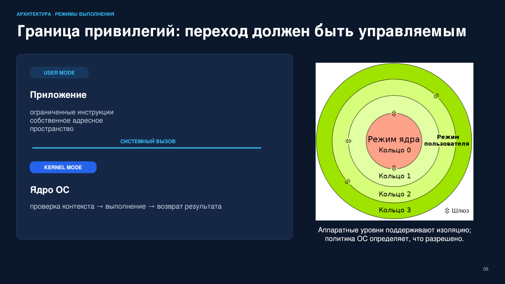

Аппаратные уровни привилегий поддерживают изоляцию, но не определяют политику. Политика формулируется операционной системой и конфигурацией средств защиты.

---

## 4. Эволюция и классификация ОС

История ОС связана с ростом совместного использования ресурсов.

| Этап | Основное изменение | Новое требование |
|---|---|---|
| Ручной запуск | непосредственное управление оператором | контроль последовательности действий |
| Пакетная обработка | автоматическое выполнение заданий | планирование |
| Мультипрограммирование | одновременное нахождение задач в памяти | изоляция процессов |
| Многопользовательские ОС | разные пользователи и полномочия | идентификация и аудит |
| ПК и сети | удалённые взаимодействия | сетевой контроль и защита учётных записей |
| Мобильные и облачные среды | масштаб и распределённость | минимизация доверия, наблюдаемость и восстановление |

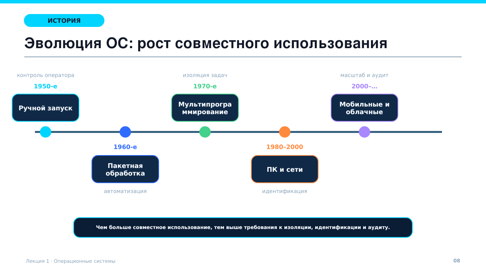

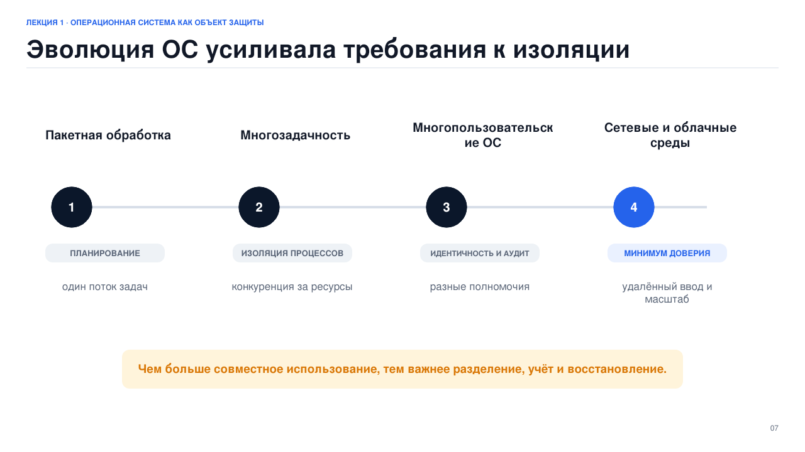

Чем больше субъектов совместно используют процессор, память, файлы и сеть, тем важнее разделение ресурсов, учёт действий, минимизация полномочий, контроль изменений и восстановление доверенного состояния.

### 4.1. Классификация

ОС классифицируют:

- по назначению — настольные, серверные, встроенные;
- по взаимодействию — локальные, сетевые, распределённые;
- по режиму — пакетные, интерактивные, реального времени;
- по архитектуре — монолитные, микроядерные, гибридные.

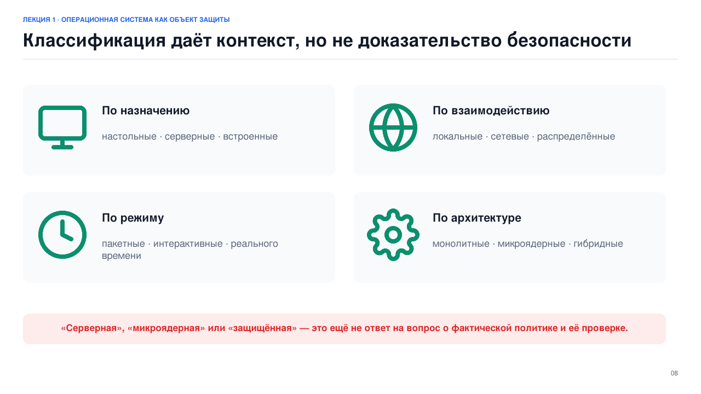

Класс системы помогает понять контекст эксплуатации и ожидаемые угрозы, но не доказывает защищённость. Названия «серверная», «микроядерная» или «защищённая» не отвечают на вопрос о фактической политике и её проверке.

Для оценки нужно задать пять вопросов:

1. **Граница:** что отделено?
2. **Политика:** что разрешено?
3. **Наблюдаемость:** что фиксируется?
4. **Восстановление:** как возвращается доверенное состояние?
5. **Доверенная база:** какие компоненты обязаны работать корректно?

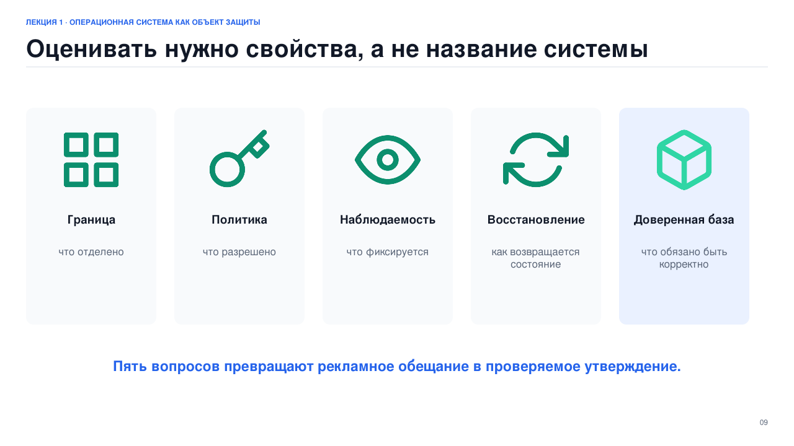

---

## 5. Политика, механизмы и базовые принципы

### 5.1. Политика и механизм

**Политика безопасности** определяет, кто и при каких условиях может выполнить действие над объектом.

**Механизм защиты** — программное, аппаратное или организационное средство, воплощающее правило политики.

| Политика — «что должно быть» | Механизм — «как это сделано» |
|---|---|
| непривилегированный пользователь не должен читать конфиденциальный файл | права доступа, ACL, мандатная метка, изоляция процесса |
| только доверенная служба может изменять конфигурацию | владелец и режим файла, контроль целостности, привилегированная служба |
| действие администратора должно быть подотчётным | аутентификация, журналирование, защищённое хранение журналов |

Один механизм может поддерживать разные политики, а одна политика может реализовываться несколькими механизмами.

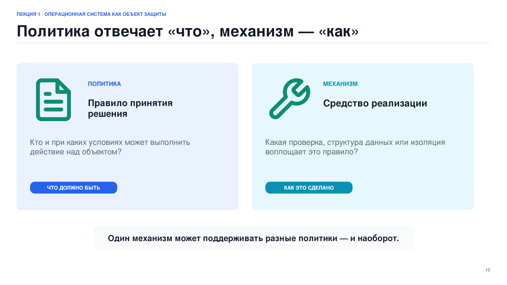

### 5.2. Запрет по умолчанию

Если явного разрешения нет, операция должна быть запрещена. Благодаря этому неизвестный или неописанный сценарий не превращается в неявный доступ.

### 5.3. Минимальные привилегии

Субъект получает только необходимые права, только на необходимые объекты, только на требуемый срок и только в требуемом контексте. Минимизация привилегий уменьшает последствия ошибки или компрометации.

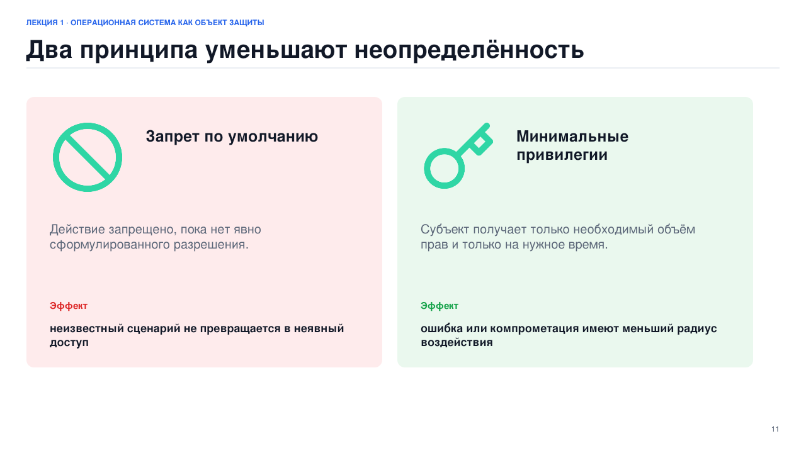

Оба принципа необходимо проверять отрицательными тестами. Наличие разрешённого сценария не доказывает, что запрещённые действия действительно блокируются.

---

## 6. Доверенная вычислительная база

**Доверенная вычислительная база** — набор аппаратных и программных компонентов, корректность которых необходима для соблюдения политики безопасности. Обычно в неё входят ядро, механизмы принятия решений о доступе, привилегированные службы, драйверы, доверенная загрузка, критическая конфигурация, компоненты аудита и контроля целостности.

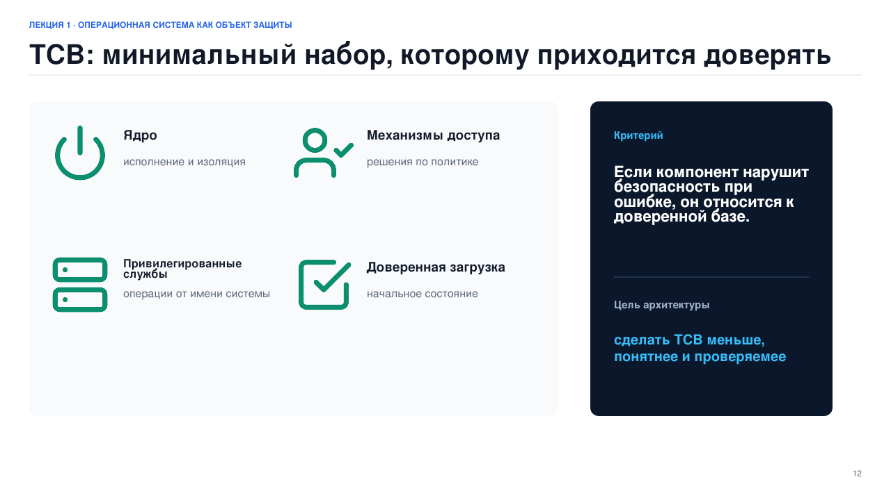

Критерий включения прост: если ошибка компонента способна нарушить безопасность всей системы, компонент относится к TCB.

Цель архитектуры — сделать доверенную базу меньше, понятнее, устойчивее и проще для анализа и тестирования. TCB не следует сводить только к ядру: привилегированная служба или механизм загрузки также может определять фактическую защищённость.

---

## 7. Активы и требуемые свойства

Моделирование защиты начинается не с перечня атак, а с определения ценности.

**Актив** — то, потеря, раскрытие, искажение или недоступность чего создаёт ущерб. Активами могут быть данные, вычисления и результаты, конфигурация, учётные записи и ключи, журналы, программные компоненты и доступность сервиса.

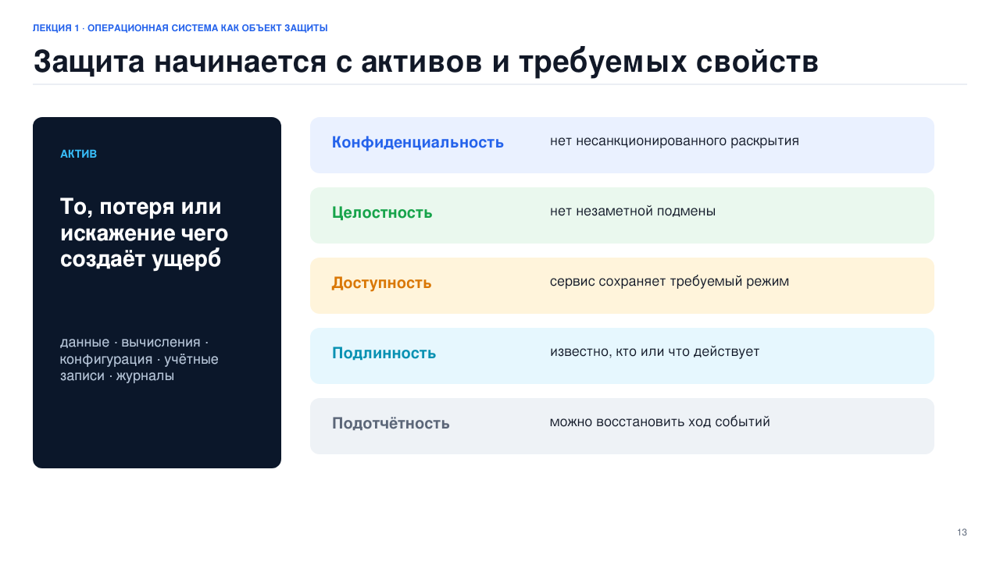

### 7.1. Свойства безопасности

| Свойство | Требуемый результат |
|---|---|
| Конфиденциальность | отсутствует несанкционированное раскрытие |
| Целостность | отсутствует незаметная подмена |
| Доступность | сервис сохраняет требуемый режим работы |
| Подлинность | известно, кто или что действует |
| Подотчётность | можно восстановить ход событий |

Для одного актива могут быть важны несколько свойств. Например, журнал должен быть целостным, доступным и подотчётным.

---

## 8. Контролируемый доступ и границы доверия

### 8.1. Цепочка принятия решения

Контролируемый доступ включает пять элементов:

1. **Субъект** — кто действует.
2. **Запрос** — какое действие требуется.
3. **Политика** — по какому правилу принимается решение.
4. **Объект** — над чем выполняется действие.
5. **Аудит** — какой след остаётся после решения.

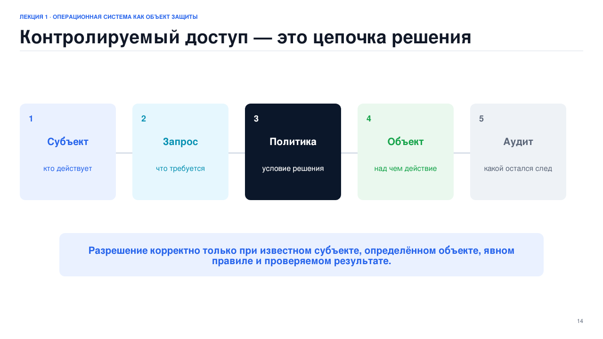

Разрешение корректно только при известном субъекте, определённом объекте, явном правиле и проверяемом результате. Аудит не заменяет контроль доступа: он фиксирует принятое решение и контекст, помогает обнаруживать отклонения и восстанавливать ход событий.

### 8.2. Граница доверия

Граница доверия — место, где меняется уровень уверенности в данных, коде или полномочиях. Пользователь передаёт ввод процессу, процесс обращается к ядру, ядро получает данные от устройства, служба принимает сетевой запрос.

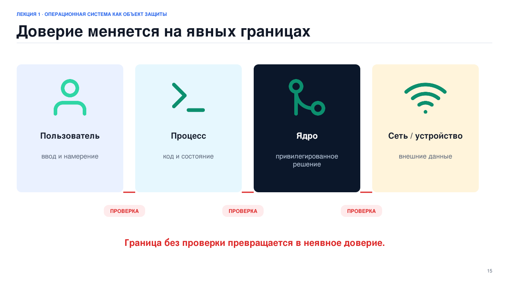

На каждой границе должен быть сформулирован способ проверки: аутентификация, авторизация, валидация параметров, контроль целостности, фильтрация, ограничение формата и размера, журналирование.

> Граница без проверки превращается в неявное доверие.

---

## 9. Поверхность атаки и риск

### 9.1. Поверхность атаки

**Поверхность атаки** — множество доступных точек взаимодействия с системой: сетевые интерфейсы, системные вызовы, файлы, устройства, службы, пользовательские интерфейсы и механизмы администрирования.

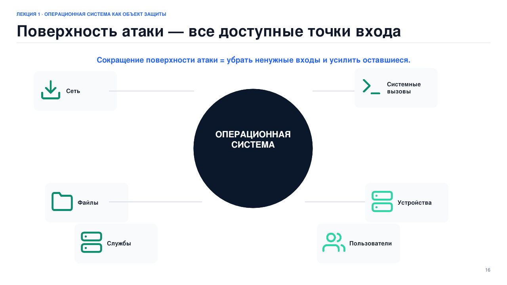

Сокращение поверхности атаки предполагает удаление ненужных входов, ограничение доступа к оставшимся, проверку входных данных, минимизацию привилегий обработчика, наблюдение событий и повторную проверку после изменений.

Поверхность атаки — не перечень известных уязвимостей. Отключение неиспользуемой службы уменьшает поверхность ещё до анализа её конкретных дефектов.

### 9.2. Угроза, уязвимость, атака и последствие

| Понятие | Содержание |
|---|---|
| Угроза | намерение, событие или условие, способное причинить ущерб |
| Уязвимость | слабость, которую можно использовать |
| Атака | реализованное воздействие |
| Последствие | ущерб активу и его свойствам |

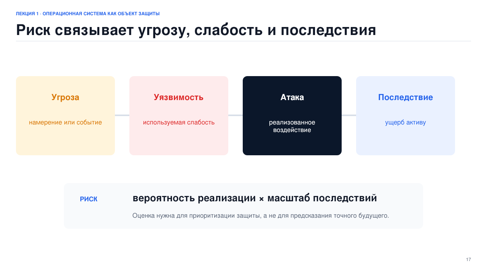

Качественная оценка:

$$
\text{Риск} = \text{вероятность реализации} \times \text{масштаб последствий}
$$

Оценка риска нужна для приоритизации защиты, а не для точного предсказания будущего.

---

## 10. Практическая цепочка анализа

Для каждого защищаемого элемента выполняется семь шагов:

1. определить актив;
2. сформулировать требуемое свойство;
3. назвать субъект;
4. определить объект;
5. отметить границу доверия;
6. связать угрозу с возможной слабостью;
7. сформулировать проверку.

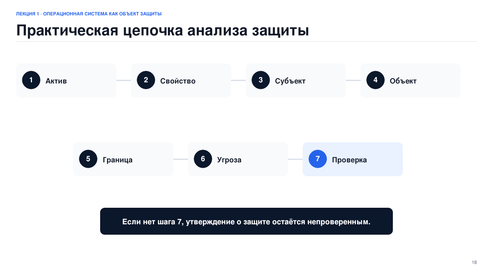

| Шаг | Пример для конфигурационного файла |
|---|---|
| Актив | конфигурация системной службы |
| Свойство | целостность |
| Субъект | администратор или служба управления |
| Объект | файл конфигурации |
| Граница | переход к привилегированной операции записи |
| Угроза | несанкционированное изменение |
| Проверка | разрешённая запись администратором, отказ обычному пользователю, событие аудита |

Если нет седьмого шага, утверждение о защите остаётся непроверенным.

---

## 11. Базовое состояние и жизненный цикл защиты

### 11.1. Базовая линия

**Базовая линия** — зафиксированное ожидаемое состояние системы.

| Область | Что фиксируется |
|---|---|
| Конфигурация | параметры и версии |
| Службы | что запущено и доступно |
| Права | кто и что может делать |
| Журналы | какие события должны появляться |

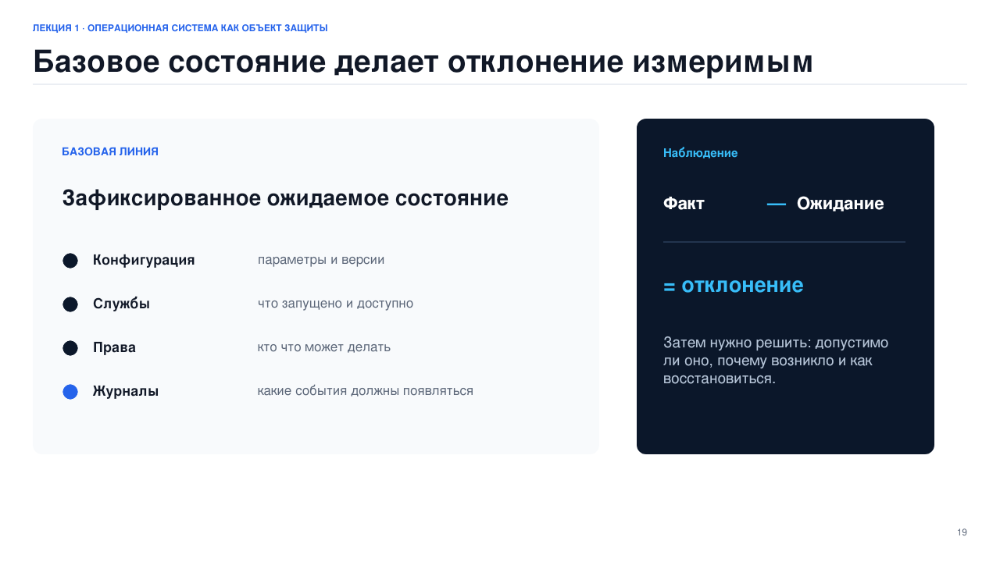

Наблюдаемое состояние сравнивается с ожидаемым:

    факт − ожидание = отклонение

После обнаружения отклонения необходимо определить, допустимо ли оно, почему возникло, нарушено ли требуемое свойство, как восстановить доверенное состояние и предотвратить повторение.

### 11.2. Защита как цикл

1. **Определить** активы и требования.
2. **Ограничить** доступ и поверхность атаки.
3. **Наблюдать** события и отклонения.
4. **Восстановить** доверенное состояние.

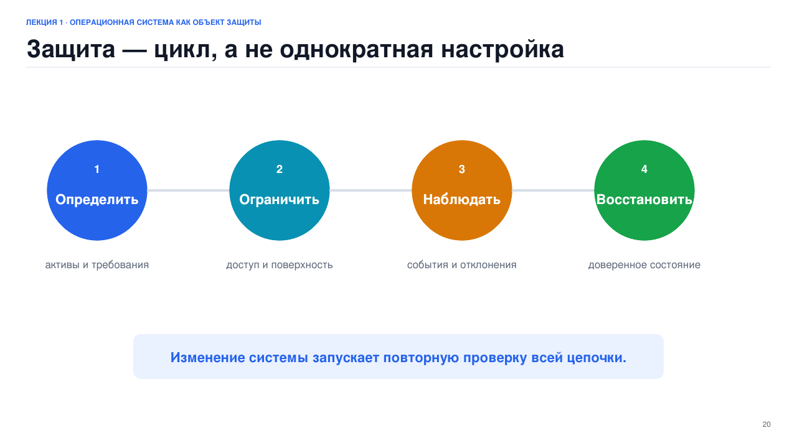

Обновление, смена роли пользователя, подключение устройства или открытие нового интерфейса запускают повторную проверку всей цепочки.

---

## 12. Учебный стенд Astra Linux и Kali Linux

Для практической проверки используется изолированный стенд:

- **Astra Linux** — защищаемая система;
- **Kali Linux** — управляемый источник проверочных воздействий;
- между узлами — изолированная сеть без выхода в производственную среду.

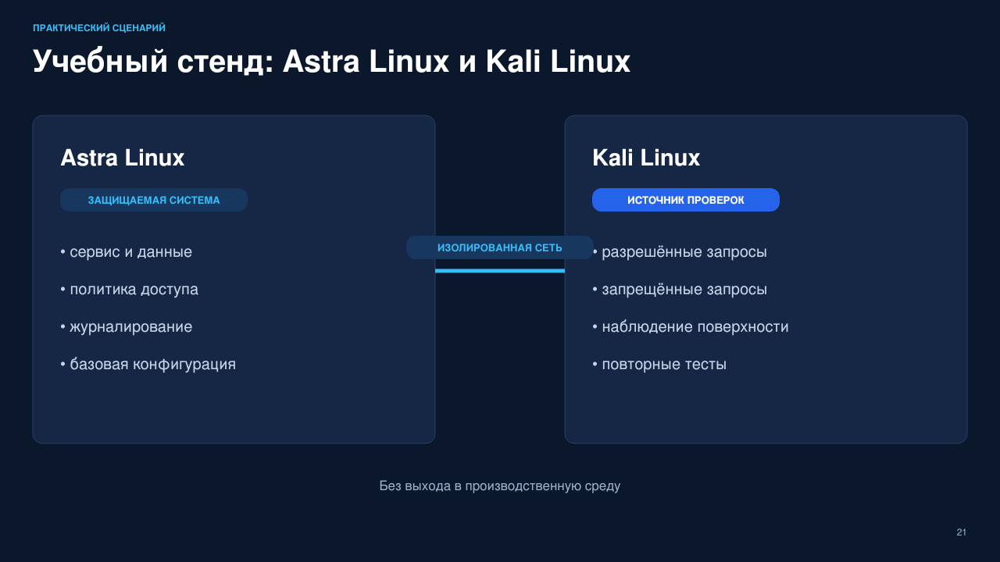

На стороне Astra Linux размещаются сервис и данные, политика доступа, журналирование и базовая конфигурация. Со стороны Kali Linux выполняются разрешённые и запрещённые запросы, наблюдение доступной поверхности и повторные проверки.

### 12.1. Модель защиты стенда

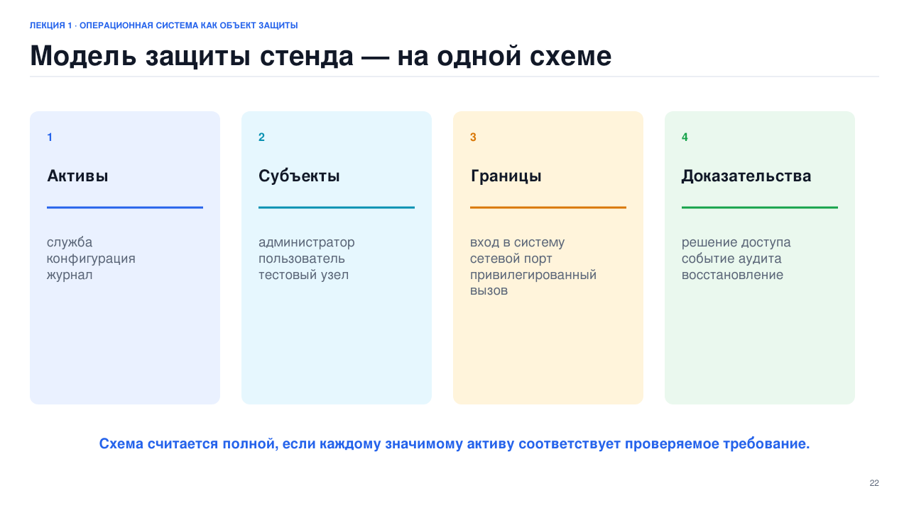

| Группа | Примеры |
|---|---|
| Активы | служба, конфигурация, журнал |
| Субъекты | администратор, пользователь, тестовый узел |
| Границы | вход в систему, сетевой порт, привилегированный вызов |
| Доказательства | решение доступа, событие аудита, восстановление |

Схема считается полной, если каждому значимому активу соответствует проверяемое требование.

### 12.2. Четыре режима проверки

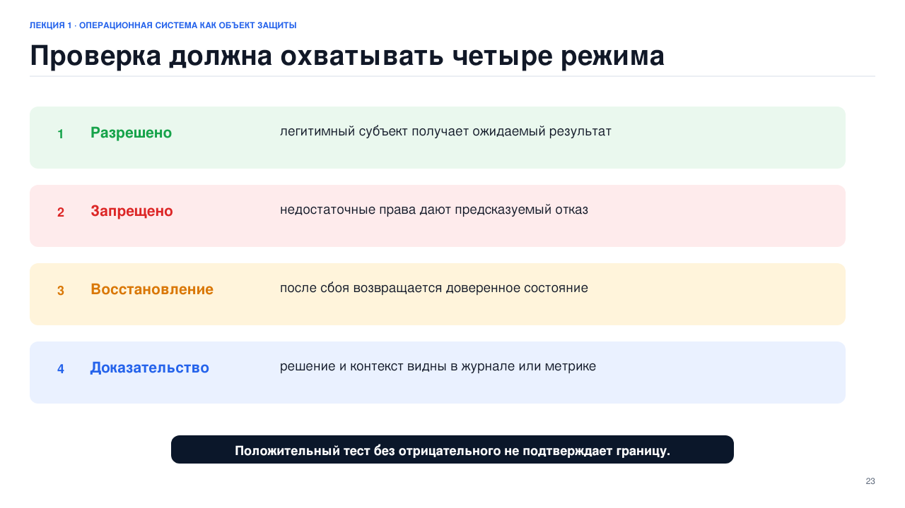

1. **Разрешено:** легитимный субъект получает ожидаемый результат.
2. **Запрещено:** недостаточные права дают предсказуемый отказ.
3. **Восстановление:** после сбоя возвращается доверенное состояние.
4. **Доказательство:** решение и контекст видны в журнале или метрике.

Положительный тест без отрицательного не подтверждает реальность границы.

---

## 13. Практическое задание

Подготовьте модель защиты одного сервиса или узла стенда на одной странице.

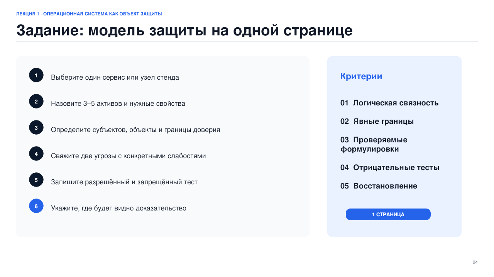

### Порядок выполнения

1. Выберите один сервис или узел стенда.
2. Назовите от трёх до пяти активов и требуемые свойства.
3. Определите субъектов, объекты и границы доверия.
4. Свяжите две угрозы с конкретными слабостями.
5. Запишите разрешённый и запрещённый тесты.
6. Укажите, где будет видно доказательство.

### Критерии оценки

- логическая связность;
- явное указание границ;
- проверяемые формулировки;
- наличие отрицательных тестов;
- описание восстановления.

Оценивается непрерывность логики:

    актив → свойство → граница → риск → тест → доказательство

---

## 14. Итоги

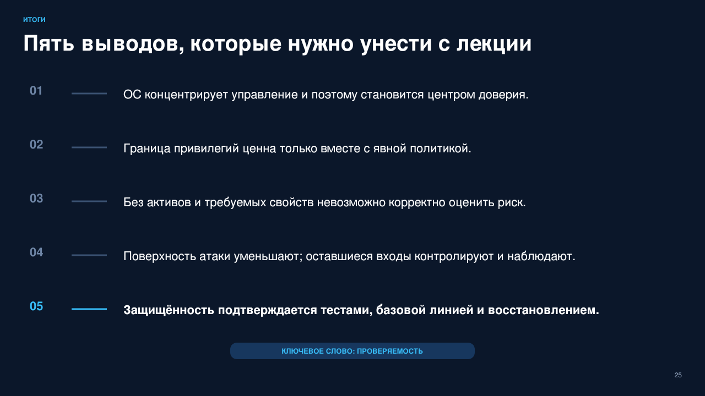

1. ОС концентрирует управление и становится центром доверия.
2. Граница привилегий ценна только вместе с явной политикой.
3. Без активов и требуемых свойств невозможно корректно оценить риск.
4. Поверхность атаки уменьшают, а оставшиеся входы контролируют и наблюдают.
5. Защищённость подтверждается тестами, базовой линией и восстановлением.

Ключевое понятие лекции — **проверяемость**.

## Вопросы для самопроверки

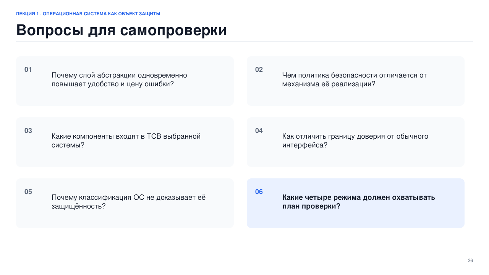

1. Почему слой абстракции одновременно повышает удобство и цену ошибки?
2. Чем политика безопасности отличается от механизма её реализации?
3. Какие компоненты входят в TCB выбранной системы?
4. Как отличить границу доверия от обычного интерфейса?
5. Почему классификация ОС не доказывает её защищённость?
6. Какие четыре режима должен охватывать план проверки?

Хороший ответ должен включать не только определение, но также пример и способ проверки.

---

## Структура каталога для GitHub

    Лекция_1_ОС_как_объект_защиты_GitHub/
    ├── README.md
    └── images/
        ├── slide-01.png
        ├── slide-02.png
        ├── ...
        └── slide-29.png

Для публикации загрузите каталог целиком. GitHub автоматически покажет содержимое README.md, а относительные ссылки на изображения продолжат работать.

## Источник

Материал подготовлен на основе презентации **Лекция_1_ОС_как_объект_защиты_ИТОГ.pptx**. Рисунки получены покадровым экспортом исходных слайдов, поэтому схемы и их оформление сохранены.
