# Операционная система как объект защиты

**Курс:** Операционные системы  
**Специальность:** 10.05.01 «Компьютерная безопасность»  
**Лекция:** 1  
**Продолжительность:** 2 академических часа

## Цель лекции

Сформировать системное представление об операционной системе как о менеджере ресурсов, расширенной машине, доверенной вычислительной базе и обязательном посреднике между субъектом и защищаемым объектом.

После изучения темы обучающийся должен уметь:

- объяснять назначение ОС и различать её узкое и широкое понимание;
- связывать развитие ОС с появлением механизмов изоляции и многопользовательской защиты;
- выделять активы, субъекты, объекты, операции и границы доверия;
- различать угрозу, уязвимость, атаку, последствие и риск;
- описывать доверенную вычислительную базу, монитор обращений и поверхность атаки;
- предлагать эшелонированные меры защиты и способы проверки их работы.

## Логика лекции

1. Назначение и три роли ОС.
2. Слои вычислительной системы и граница привилегий.
3. Эволюция и классификация ОС.
4. Активы, субъекты, объекты и свойства безопасности.
5. Доверенная вычислительная база и монитор обращений.
6. Угрозы, уязвимости, риск и поверхность атаки.
7. Эшелонированная защита, базовая конфигурация и проверка.

Главный вопрос лекции: **если приложение может напрямую читать память, записывать данные на диск или управлять сетью, можно ли обеспечить изоляцию и доказать, кто изменил данные?** Без контролируемого посредничества ОС ответ будет отрицательным.

## 1. Назначение и роли операционной системы

### 1.1. Рабочее определение

**Операционная система** — комплекс взаимосвязанных программ, который организует выполнение приложений, управляет аппаратными и информационными ресурсами и предоставляет стандартизированные интерфейсы пользователям и программам.

В этом определении важны три действия:

- **организует:** создаёт процессы, переключает задачи, обрабатывает события;
- **управляет:** распределяет процессорное время, память, файлы, устройства и сетевые возможности;
- **предоставляет:** заменяет низкоуровневые детали понятными абстракциями, такими как процесс, файл, сокет и виртуальная память.

ОС рассматривают в двух плоскостях:

- **техническая:** ядро, драйверы, системные библиотеки, службы, загрузчик и средства администрирования;
- **логическая:** модель вычислений, идентичности, объектов, допустимых операций и регистрируемых событий.

В узком смысле ОС отождествляют с ядром. При оценке защищённости нужен широкий взгляд: компрометация привилегированной службы, загрузчика, агента обновления или административного средства способна нарушить безопасность даже при корректной работе ядра.

### 1.2. Три роли ОС

1. **Менеджер ресурсов.** ОС учитывает ресурсы, разрешает конкуренцию процессов, ограничивает потребление и освобождает ресурсы после завершения задач.
2. **Расширенная машина.** ОС скрывает сложность оборудования и предоставляет устойчивые программные абстракции.
3. **Посредник принуждения политики.** ОС идентифицирует субъект, проверяет его запрос, принимает решение о доступе, выполняет разрешённую операцию и формирует запись аудита.

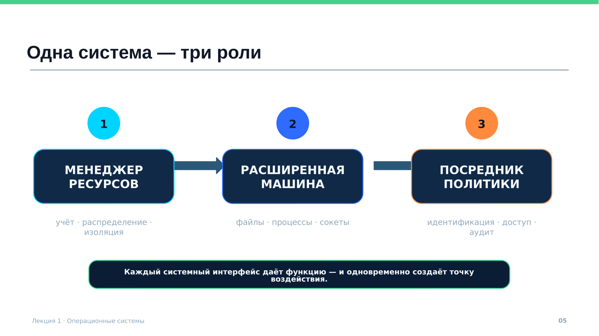

*Рисунок 1. Операционная система как менеджер ресурсов, расширенная машина и посредник политики*

**Ключевой вывод:** каждый системный интерфейс одновременно предоставляет полезную функцию и создаёт потенциальную точку воздействия.

## 2. Слоистая модель и граница привилегий

Слоистая модель показывает зависимости компонентов и помогает установить, где проходит граница доверия.

Снизу вверх выделяют:

1. аппаратное обеспечение;
2. ядро и драйверы;
3. системные библиотеки и API;
4. системные службы;
5. приложения;
6. пользовательские данные.

Аппаратура поддерживает уровни привилегий, обработку исключений и преобразование адресов. Ядро планирует потоки, управляет памятью, обрабатывает прерывания, реализует сетевой стек и контролирует доступ к устройствам. Библиотеки преобразуют прикладные функции в системные вызовы, а службы выполняют долговременные функции, включая аутентификацию и журналирование.

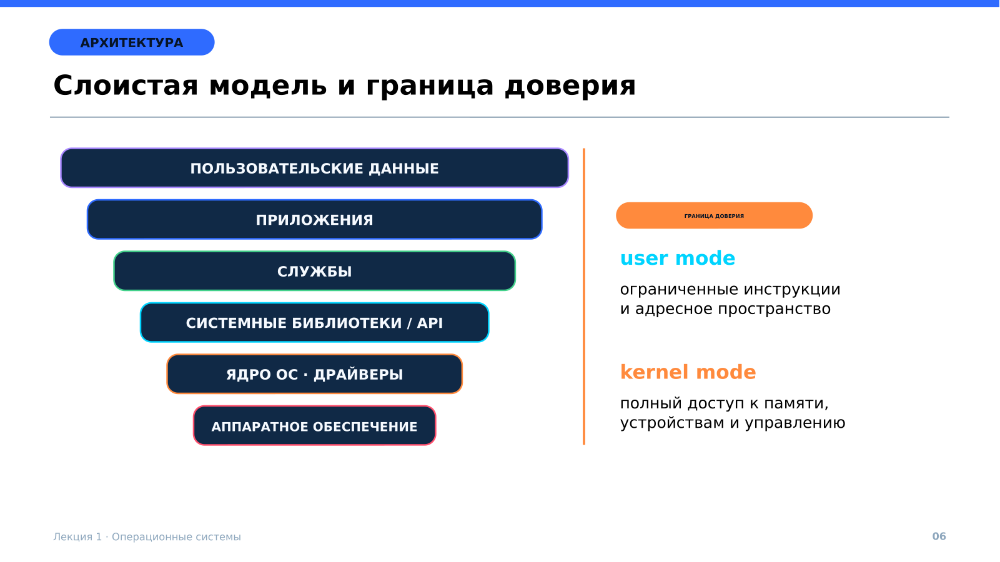

*Рисунок 2. Слои системы и граница между пользовательским и привилегированным режимами*

### 2.1. Пользовательский режим и режим ядра

В пользовательском режиме приложение получает ограниченный набор инструкций и собственное адресное пространство. Оно не может напрямую читать память другого процесса, изменять таблицы страниц или перенастраивать устройство.

Для получения системной услуги приложение выполняет системный вызов:

1. библиотека формирует номер операции и параметры;
2. процессор переключает уровень привилегий;
3. ядро сохраняет контекст и проверяет параметры из пользовательского пространства;
4. механизм доступа проверяет полномочия процесса относительно объекта;
5. ядро выполняет разрешённую операцию и возвращает результат.

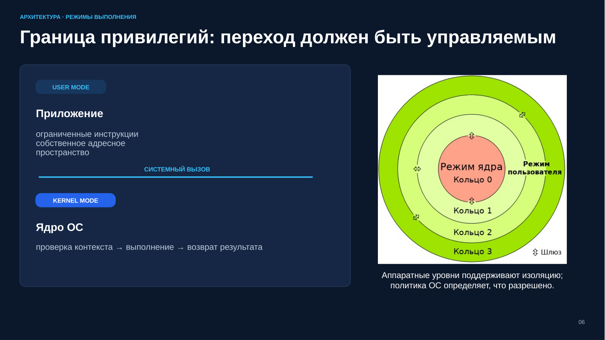

*Рисунок 3. Системный вызов как контролируемый переход из user mode в kernel mode*

Системный вызов является границей доверия. Указатели, длины, флаги и структуры из пользовательского пространства считаются недоверенными. Ошибка проверки особенно опасна, поскольку обработчик работает с высокими привилегиями.

Граница доверия не всегда совпадает с границей ядра. Сопоставимые полномочия могут иметь загрузчик, драйвер, привилегированный демон, агент обновления или консоль гипервизора. Критичность компонента определяется последствиями его компрометации.

## 3. Эволюция операционных систем

История ОС отражает рост совместного использования ресурсов и связности систем.

| Этап | Основная задача | Новые требования безопасности |
|---|---|---|
| Ручной запуск | Выполнение одного задания | Физический контроль и дисциплина оператора |
| Пакетная обработка | Автоматическая последовательность заданий | Защита монитора и данных соседних заданий |
| Мультипрограммирование | Совместное использование процессора и памяти | Защита памяти, таймер, восстановление контекста |
| Разделение времени | Интерактивная работа нескольких пользователей | Учётные записи, права, сессии и аудит |
| Персональные и сетевые ОС | Совместимость и удалённый доступ | Защита сетевых служб и локальных пользователей |
| Мобильные, облачные и киберфизические среды | Масштабирование, мобильность, управление устройствами | Изоляция приложений, защита ключей, постоянный контроль состояния |

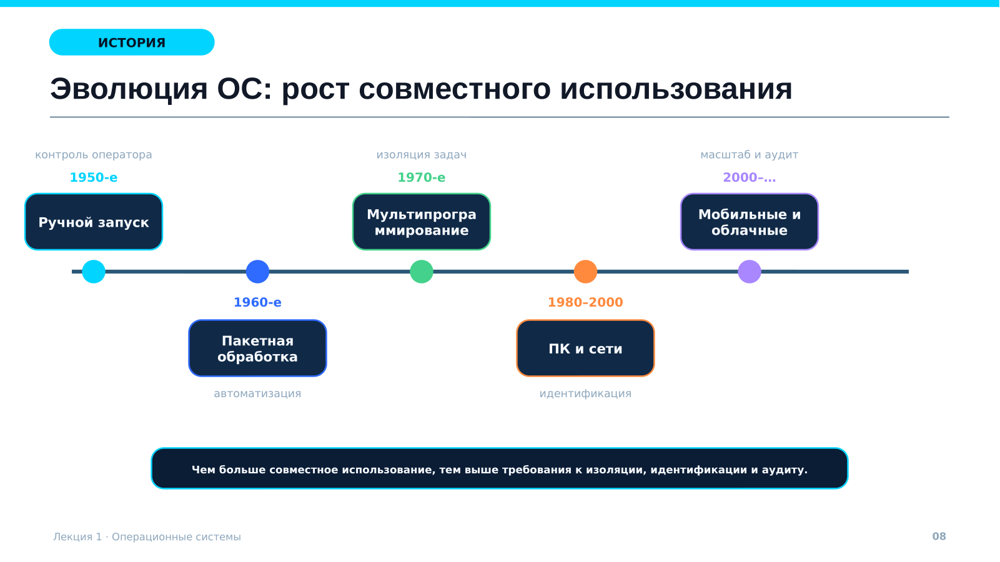

*Рисунок 4. Развитие ОС и усиление требований к изоляции, идентификации и аудиту*

Мультипрограммирование сделало изоляцию обязательной: несколько задач находятся в памяти и конкурируют за процессор. Системы разделения времени добавили интерактивные сессии и разные полномочия пользователей. Сетевые системы превратили локальные ошибки в удалённо достижимые точки входа. Облачные среды добавили гипервизоры, контейнеры и динамическую конфигурацию. В системах реального времени нарушение срока реакции может быть критичнее снижения средней производительности.

**Ключевой вывод:** увеличение совместного использования повышает эффективность, но требует более строгой изоляции, идентификации, наблюдаемости и восстановления.

## 4. Классификация ОС и оценка защищённости

ОС классифицируют:

- по назначению: настольные, серверные, мобильные, встраиваемые;
- по взаимодействию: локальные, сетевые, распределённые;
- по режиму обработки: пакетные, интерактивные, реального времени;
- по архитектуре ядра: монолитные, микроядерные, гибридные;
- по организации среды: физические, виртуализированные, облачные.

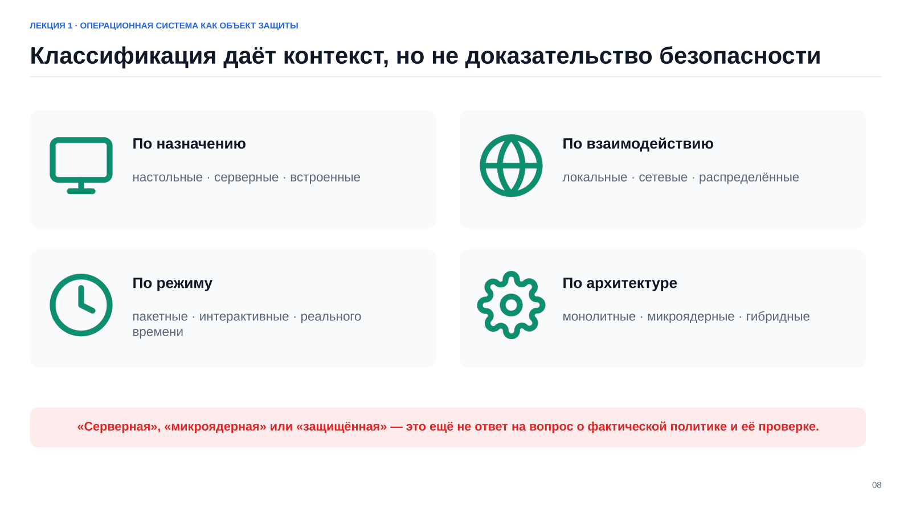

*Рисунок 5. Основные признаки классификации ОС*

Класс системы задаёт контекст, но не доказывает защищённость. Серверная ОС может содержать лишние службы. Микроядро уменьшает объём привилегированного кода, однако ошибочная служба или политика сохраняет риск. Сертифицированный продукт предоставляет проверенные механизмы только для определённых версии, состава и условий применения. Защищённость конкретной установки зависит от фактической конфигурации и эксплуатации.

Оценивать следует проверяемые свойства:

- какие компоненты и данные изолированы;
- какие операции разрешает политика;
- какие события фиксируются;
- как система возвращается в доверенное состояние;
- какие компоненты обязаны работать корректно.

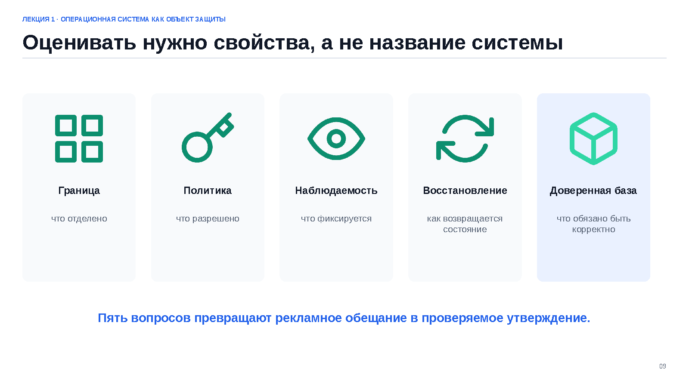

*Рисунок 6. Граница, политика, наблюдаемость, восстановление и доверенная база*

## 5. Функции ОС и безопасность

Каждая базовая функция ОС обеспечивает полезную работу и одновременно ограничивает недопустимое использование ресурса.

### Процессы и процессор

ОС создаёт процессы и потоки, хранит контекст, планирует выполнение и освобождает ресурсы. Процесс выступает контейнером полномочий: он действует с идентификаторами пользователя и групп, набором capabilities, ролью, меткой и другими атрибутами. Служба с постоянными максимальными правами увеличивает последствия любой ошибки. Понижение привилегий и разделение процессов локализуют ущерб.

### Память

Виртуальная память создаёт отдельное адресное пространство каждого процесса. Таблицы страниц определяют права чтения, записи и исполнения. Механизмы NX/DEP, ASLR, W^X и контроль целостности кода усложняют эксплуатацию ошибок памяти, но не устраняют первичную уязвимость. Подкачка, дампы и гибернация также могут хранить чувствительные данные.

### Файлы, устройства и сеть

Файловая подсистема именует данные, хранит метаданные и проверяет права. Символические ссылки, временные файлы, наследование прав и точки монтирования требуют отдельного анализа. Журнал файловой системы помогает восстановить согласованность после сбоя, но не заменяет резервную копию.

Драйверы работают с высокими привилегиями, поэтому ненужные модули расширяют поверхность атаки. Каждый слушающий сетевой порт должен иметь владельца, назначение и ограниченный набор допустимых источников.

### Идентичность, доступ и аудит

- **Аутентификация** подтверждает заявленную идентичность.
- **Авторизация** решает, допустима ли конкретная операция над объектом.
- **Аудит** фиксирует действие и его результат.

Успешный вход не даёт права на любой объект. Наличие права само по себе не доказывает, кто им воспользовался. Полезный журнал позволяет установить время, узел, субъект, процесс, объект, операцию и результат. Для достоверной атрибуции нужны синхронизация времени, персональные учётные записи и защита самого журнала.

### Политика и механизм

**Политика** определяет, кто, над каким объектом, какую операцию и при каких условиях может выполнить. **Механизм** реализует это правило с помощью проверки, структуры данных или изоляции.

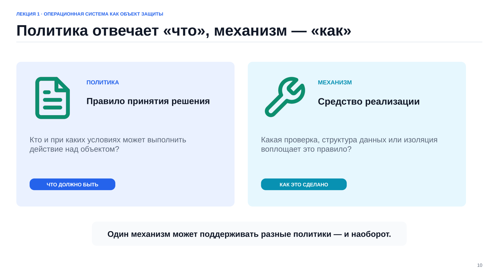

*Рисунок 7. Различие между правилом доступа и техническим средством его реализации*

## 6. ОС как объект защиты

Защита ОС включает сохранение свойств данных и системных функций, а также корректное принуждение политики для приложений, которые доверяют системе.

### 6.1. Защищаемые свойства

| Свойство | Содержание |
|---|---|
| Конфиденциальность | Информация доступна только уполномоченным субъектам |
| Целостность | Исключено несанкционированное или неконтролируемое изменение |
| Доступность | Функция предоставляется в требуемое время и с требуемым качеством |
| Подлинность | Можно подтвердить субъект, компонент или источник обновления |
| Подконтрольность | Событий достаточно для анализа и расследования |
| Восстанавливаемость | Система возвращается к доверенному состоянию после сбоя или компрометации |

Свойства могут конфликтовать. Например, шифрование без надёжного управления ключами снижает доступность, а чрезмерное копирование повышает риск раскрытия данных. Поэтому требования задают измеримыми критериями.

### 6.2. Активы, субъекты и объекты

**Актив** — всё, что имеет ценность и нуждается в защите. Для ОС это данные, учётные записи, ключи, конфигурация, исполняемые файлы, журналы, резервные копии, системное время и доступность сервисов. Для каждого актива определяют владельца, местоположение, требуемые свойства, допустимые операции, срок хранения и способ восстановления.

**Субъект** — активная сущность, которая инициирует действие. Пользователь действует через процесс или сессию. Системная служба также является субъектом.

**Объект** — ресурс, над которым выполняют операцию: файл, каталог, процесс, сокет, разделяемая память, устройство или ключ.

Решение о доступе зависит от реального контекста процесса: идентификаторов, групп, ролей, меток, времени, состояния узла и истории сессии.

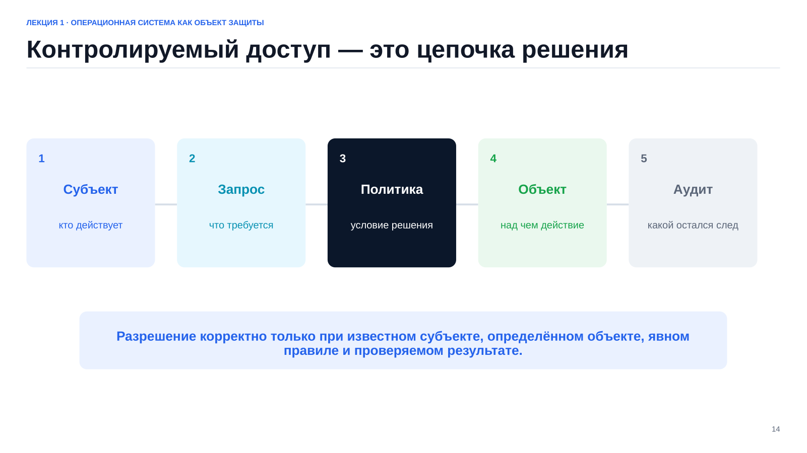

*Рисунок 8. Субъект, запрос, политика, объект и аудит*

### 6.3. Полное посредничество

Защитный механизм должен проверять каждый значимый доступ и не иметь обходного пути. В модель включают не только системные вызовы, но и прямой доступ к диску, загрузку с внешнего носителя, аварийный режим, административный интерфейс и копии данных вне контролируемого хранилища.

## 7. Доверенная вычислительная база и монитор обращений

**Доверенная вычислительная база (TCB)** — аппаратные и программные компоненты, корректность которых необходима для соблюдения политики безопасности. Обычно к ней относят аппаратные механизмы привилегий, прошивку, загрузчик, ядро, критические драйверы, аутентификацию, разграничение доступа, аудит, управление ключами и часть средств администрирования.

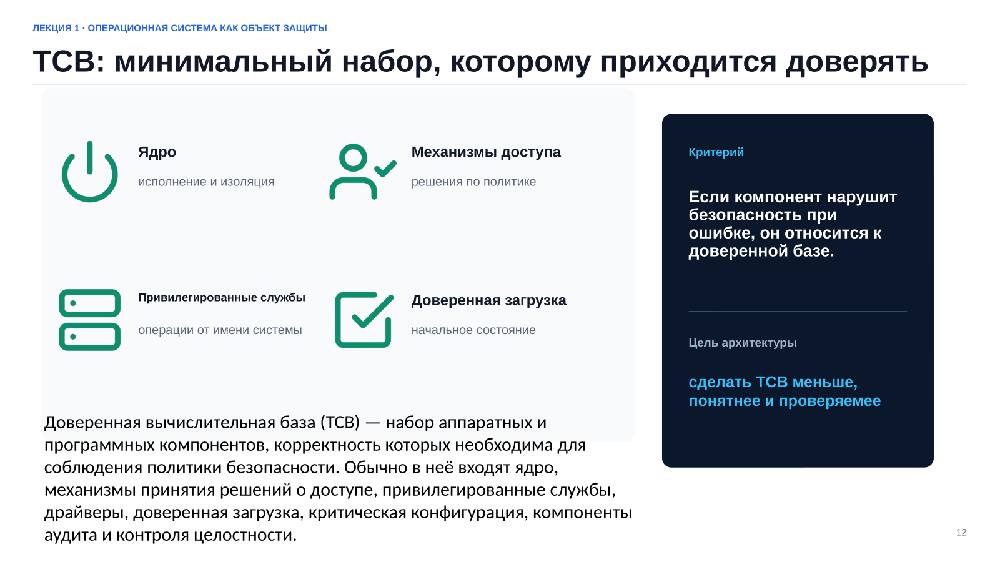

*Рисунок 9. Компоненты TCB и критерий включения в доверенную базу*

Чем больше кода, интерфейсов и администраторов входит в TCB, тем труднее её проверить. Минимизация функций, запрет ненужных модулей, понижение прав служб и разделение обязанностей уменьшают объём вынужденного доверия.

**Монитор обращений** — логическая модель контроля запросов субъектов к объектам. Он должен быть:

1. **неизбежным:** проверку нельзя обойти;
2. **защищённым:** непривилегированный субъект не может изменить механизм или его решение;
3. **проверяемым:** механизм достаточно мал и структурирован для анализа и тестирования.

В реальной ОС функции монитора распределены между аппаратурой, ядром, файловой системой, сетевым стеком, механизмами обязательного контроля и службами идентичности.

### Доверенная загрузка

Доверие формируется до запуска ядра: прошивка выбирает загрузчик, загрузчик проверяет ядро и начальное окружение, затем запускаются службы. Подмена раннего этапа делает последующие проверки недостоверными. Цепочка доверенной загрузки должна закрывать обходы через внешний носитель, настройки прошивки, незашифрованный диск и неконтролируемый режим восстановления.

## 8. Угроза, уязвимость, атака и риск

| Понятие | Определение |
|---|---|
| Угроза | Потенциальная причина нежелательного события, способного причинить ущерб активу |
| Уязвимость | Слабость архитектуры, реализации, конфигурации или эксплуатации |
| Атака | Реализованная попытка использовать доступные условия и слабости |
| Последствие | Фактический ущерб защищаемому свойству |
| Риск | Сочетание вероятности сценария и тяжести последствий с учётом действующих мер |

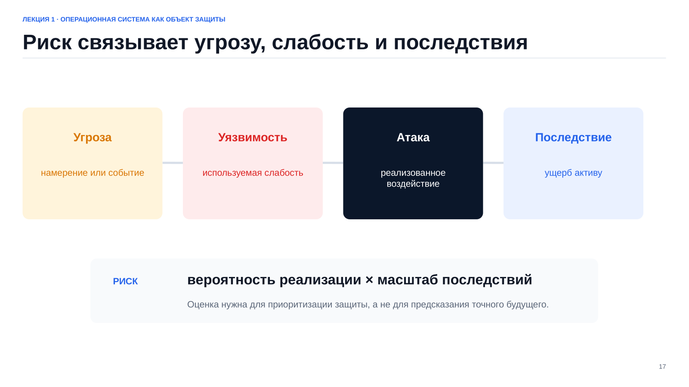

*Рисунок 10. Логическая цепочка анализа риска*

Формула

> риск = вероятность реализации × масштаб последствий

служит ориентиром, а не обязательным требованием точных чисел. Важнее явно записать допущения: нарушителя, его доступ, достижимый интерфейс, уязвимость, действующие меры и последствия успешной атаки.

Источники уязвимостей:

- ошибки кода: выход за границы, гонка, инъекция, ошибка авторизации;
- ошибки конфигурации: лишняя служба, общий пароль, неверные права или правило фильтрации;
- архитектурные слабости: чрезмерные полномочия, общий секрет, отсутствие независимого контроля;
- эксплуатационные слабости: задержка обновлений, отсутствие проверенного восстановления, слабое управление ключами.

Модель нарушителя описывает цели, знания, ресурсы и начальный доступ. Следует учитывать внешнего нарушителя, внутреннего пользователя, администратора, поставщика и цепочку обновления.

Риск можно снизить, избежать, передать или принять. Принятие остаточного риска возможно только уполномоченным владельцем с указанием оснований и срока пересмотра.

## 9. Поверхность атаки ОС

**Поверхность атаки** — совокупность достижимых интерфейсов, входов и доверительных отношений, через которые возможно воздействие на систему.

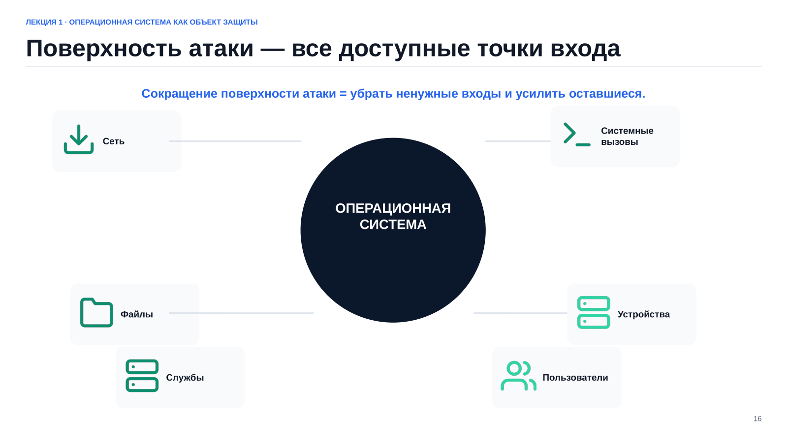

*Рисунок 11. Сетевые, локальные, файловые, аппаратные и пользовательские точки входа*

В неё входят:

- системные вызовы, `ioctl`, псевдофайловые системы, отладка и загрузка модулей;
- сетевые службы и все слушающие порты;
- парсеры документов, архивов, изображений и пакетов;
- драйверы, прошивки, USB и другие съёмные устройства;
- удалённое администрирование, консоль гипервизора, загрузчик и аварийный режим;
- инфраструктура резервного копирования, её ключи и учётные записи;
- доверенные связи между службами и администраторами.

Минимизация начинается с инвентаризации пакетов, процессов, служб, портов, учётных записей, модулей, заданий планировщика, точек монтирования и доверенных ключей. Ненужные входы удаляют или отключают. Необходимые ограничивают по источнику, субъекту, времени и ресурсам.

Минимизация не означает отключение всех функций. Система должна выполнять назначение, оставаться наблюдаемой и допускать безопасное обновление и восстановление.

## 10. Эшелонированная защита и безопасная конфигурация

Одна мера не перекрывает все сценарии. Эшелонированная защита объединяет независимые действия:

- **предотвращение:** фильтрация, аутентификация, авторизация;
- **локализация:** изоляция процессов, сегментация, квоты, минимальные привилегии;
- **обнаружение:** аудит, мониторинг и контроль отклонений;
- **восстановление:** резервные копии и возврат к доверенному состоянию.

Слои должны быть по возможности независимыми. Если доступ, аудит и резервирование используют один административный секрет, его компрометация снимает сразу несколько барьеров.

### 10.1. Базовая линия

**Базовая линия конфигурации** описывает утверждённое ожидаемое состояние: версии и пакеты, службы и порты, пользователей и группы, правила доступа, параметры ядра, источники времени и обновлений, аудит, резервирование и защитные механизмы.

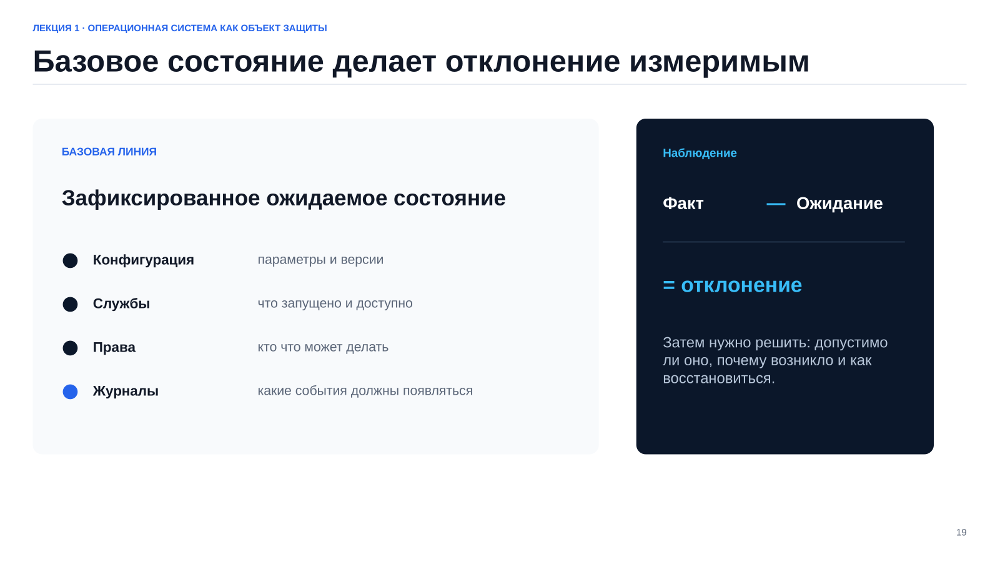

*Рисунок 12. Сравнение фактического состояния с ожидаемым*

Эталон должен быть воспроизводимым и версионируемым. Отклонение имеет владельца, обоснование, компенсирующую меру и срок пересмотра. Автоматизация обнаруживает дрейф, но ответственный процесс решает, допустимо ли изменение.

### 10.2. Безопасные значения по умолчанию и безопасный отказ

Запрет по умолчанию не предоставляет доступ без явного решения. Новая служба не должна автоматически слушать все интерфейсы, новый файл не должен получать запись для всех, новый пользователь не должен становиться администратором.

Безопасный отказ переводит систему в состояние, сохраняющее приоритетные свойства. При сбое аутентификации доступ обычно закрывают. Для систем жизнеобеспечения недоступность сама может создавать опасность, поэтому реакцию на отказ определяет модель системы.

### 10.3. Жизненный цикл

Защита включает проектирование, развёртывание, инвентаризацию, мониторинг, обновление, управление изменениями, реагирование и вывод из эксплуатации. Любое существенное изменение запускает повторную проверку.

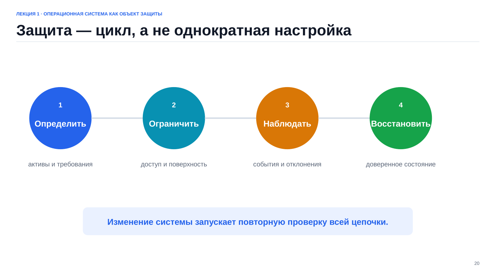

*Рисунок 13. Определение требований, ограничение, наблюдение и восстановление*

## 11. Сквозной пример: файловый сервер кафедры

### 11.1. Назначение и активы

Сервер хранит учебные материалы преподавателей, личные каталоги студентов и общие задания. Активами являются содержимое и метаданные файлов, учётные записи, конфигурация доступа, журналы, резервные копии и доступность сервиса.

Основные требования:

- студент читает общие материалы и управляет только личным каталогом;
- преподаватель публикует материалы и читает сданные работы;
- оператор резервирования создаёт копии, но не изменяет рабочие данные;
- администратор поддерживает ОС с персональной атрибуцией действий;
- восстановление проверяется как для отдельного файла, так и для всего сервера.

### 11.2. Субъекты, объекты и границы

Субъекты: процессы пользователей, файловая служба, служба резервирования, агент журналирования и административные сессии. Объекты: каталоги, файлы, сокеты, конфигурация, журналы и резервное хранилище. Границы проходят по сетевым интерфейсам и между обычными пользователями, службами и административным контуром.

### 11.3. Сценарии риска и меры

| Сценарий | Нарушаемое свойство | Возможные меры | Проверка |
|---|---|---|---|
| Студент читает чужую работу из-за неверной ACL | Конфиденциальность | Минимальные права, группы, MAC | Ожидаемый отказ и событие аудита |
| Служба изменяет системную конфигурацию | Целостность | Отдельная учётная запись, понижение прав, контроль целостности | Запрет записи и контроль хэша |
| Пользователь заполняет диск | Доступность | Квоты и лимиты | Нагрузочный тест в учебном полигоне |
| Общий пароль скрывает исполнителя | Подконтрольность | Персональные учётные записи, `sudo`, удалённый аудит | Связь события с субъектом и временем |
| Сбой уничтожает данные | Восстанавливаемость | Независимая резервная копия | Восстановление тестового файла и узла |

### 11.4. Учебный стенд

Практическую проверку выполняют в изолированной сети. Astra Linux выступает защищаемой системой, Kali Linux — источником только разрешённых проверок. Воздействие на сторонние и производственные системы недопустимо.

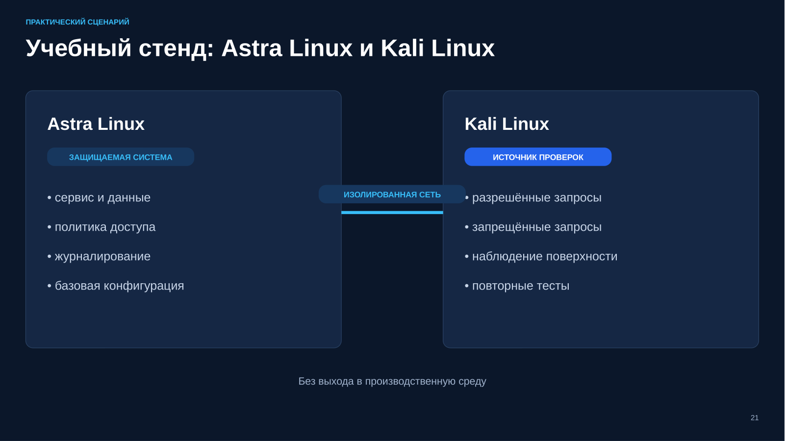

*Рисунок 14. Разделение защищаемой системы и источника проверок в изолированной сети*

Полная модель стенда связывает активы, субъектов, границы и доказательства.

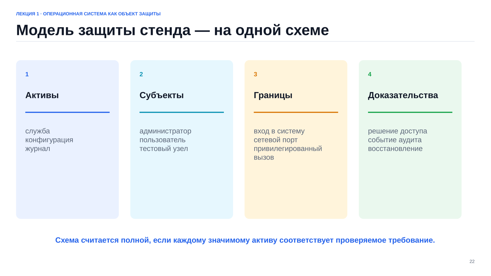

*Рисунок 15. Состав модели защиты стенда*

Проверка должна охватывать четыре режима:

1. разрешённое действие даёт ожидаемый результат;
2. действие с недостаточными полномочиями завершается предсказуемым отказом;
3. после сбоя восстанавливается доверенное состояние;
4. решение и контекст видны в журнале или метрике.

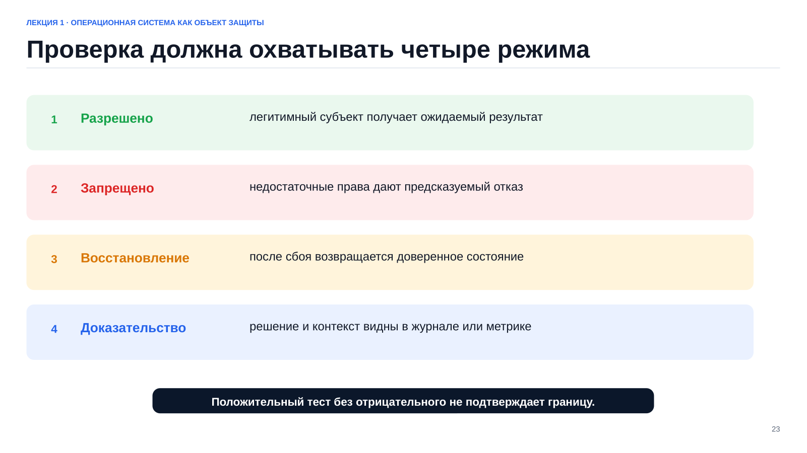

*Рисунок 16. Положительный, отрицательный, восстановительный и доказательный режимы*

Снимок виртуальной машины удобен для лаборатории, но не заменяет независимую резервную копию и проверку её целостности.

## 12. Итоговая схема анализа

Анализ защищённости ОС проводят в следующей последовательности:

1. определить назначение системы;
2. выделить актив и требуемое свойство;
3. определить субъект и его реальный контекст;
4. указать объект и допустимые операции;
5. провести границы доверия;
6. сформулировать угрозу, достижимый интерфейс и уязвимость;
7. выбрать независимые меры;
8. описать положительный и отрицательный тесты;
9. проверить аудит и восстановление;
10. сравнивать состояние с базовой линией.

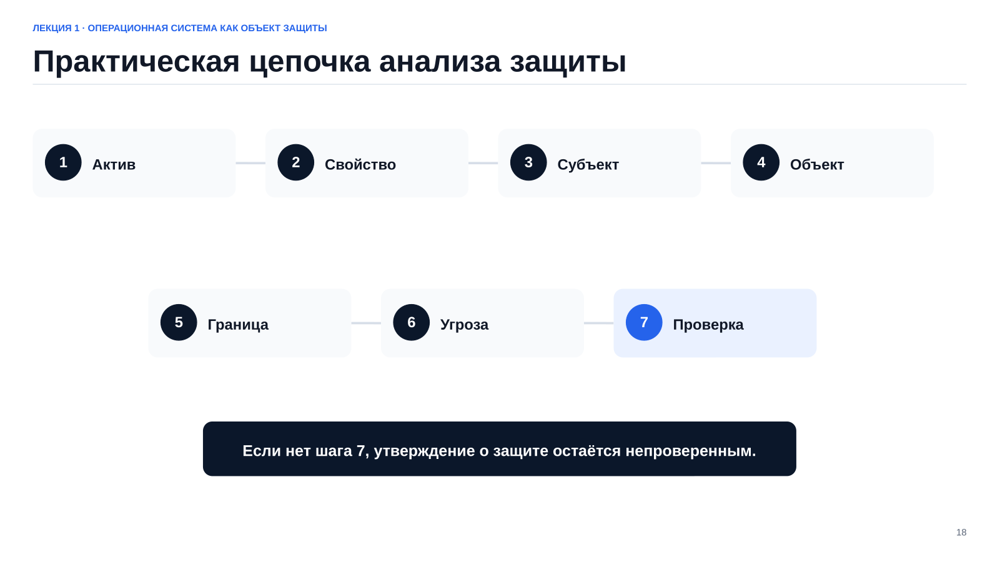

*Рисунок 17. От актива и защищаемого свойства к проверке*

Если модель не завершается проверкой, утверждение о защищённости остаётся недоказанным.

## Типичные заблуждения

### «Если есть антивирус, ОС защищена»

Антивирус обнаруживает часть известных или подозрительных объектов и поведения. Он не исправляет чрезмерные права, не отключает лишние службы и не заменяет обновление, аудит или восстановление. Его следует рассматривать как один из слоёв защиты.

### «Внутренней сети можно доверять»

Внутри сети могут находиться скомпрометированные узлы, гостевые устройства и пользователи с разными полномочиями. Местоположение не подтверждает идентичность или исправность. Доверие должно быть явным, ограниченным и проверяемым.

### «Сертификация отменяет настройку»

Сертификация относится к определённым версии, составу и условиям применения. Ошибочные метки, отключённый аудит, сторонний пакет или слабый пароль нарушают ожидаемый профиль. Организация должна выбрать политику, настроить механизмы и поддерживать состояние установки.

## Сравнение моделей управления доступом

| Модель | Основа решения | Сильная сторона | Ограничение |
|---|---|---|---|
| DAC | Владелец и списки прав | Гибкость делегирования | Права могут распространяться непредсказуемо |
| MAC | Метки и централизованные правила | Контроль информационных потоков | Требует точной классификации |
| RBAC | Роль и рабочие функции | Удобное администрирование полномочий | Не заменяет контроль контекста и объектов |
| Комбинированная | Пересечение нескольких механизмов | Эшелонирование решения | Сложнее объяснять и тестировать |

## Основные выводы

1. ОС концентрирует управление ресурсами и становится центром доверия.
2. Граница привилегий полезна только вместе с явной политикой и контролируемым переходом.
3. Защита начинается с конкретных активов и требуемых свойств.
4. TCB должна быть минимизирована, защищена и проверяема.
5. Поверхность атаки включает сеть, системные вызовы, форматы, устройства, управление, загрузку и резервирование.
6. Защищённость поддерживают базовая линия, независимые меры, аудит и проверенное восстановление.
7. Главный критерий качества модели защиты — **проверяемость**.

## Вопросы для самоконтроля

1. Почему графическая оболочка не является полным определением ОС?
2. Как связаны три роли операционной системы?
3. Почему системный вызов является границей доверия?
4. Чем политика безопасности отличается от механизма её реализации?
5. Почему класс или сертификат ОС не доказывает защищённость установки?
6. Как связаны аутентификация, авторизация и аудит?
7. Какие свойства должен иметь монитор обращений?
8. Чем угроза отличается от уязвимости, атаки и риска?
9. Какие интерфейсы входят в поверхность атаки ОС?
10. Что должна содержать базовая линия конфигурации?
11. Почему положительный тест недостаточен без отрицательного?
12. Почему снимок виртуальной машины не заменяет резервную копию?

## Практическое задание

Для учебной Linux-VM подготовьте модель защищённости на 2–3 страницы:

- опишите назначение системы;
- выделите не менее пяти активов;
- определите субъектов, объекты и границы доверия;
- перечислите элементы поверхности атаки;
- сформулируйте три сценария риска;
- предложите меры защиты;
- для каждой меры укажите положительный или отрицательный тест, событие аудита либо способ проверки восстановления.

Все эксперименты выполняйте только на разрешённых целях в изолированном учебном полигоне.

## Краткий глоссарий

| Термин | Определение |
|---|---|
| Актив | Данные, функция, учётная запись, ключ, конфигурация или иной объект, имеющий ценность |
| Аутентификация | Подтверждение заявленной идентичности субъекта |
| Авторизация | Решение о допустимости конкретной операции над объектом |
| Доверенная вычислительная база | Компоненты, корректность которых необходима для принуждения политики безопасности |
| Монитор обращений | Неизбежный, защищённый и проверяемый контроль обращений субъектов к объектам |
| Объект доступа | Ресурс, над которым выполняется операция |
| Политика безопасности | Правила допустимых действий и информационных потоков |
| Поверхность атаки | Достижимые интерфейсы, входы и доверительные отношения, допускающие воздействие |
| Риск | Вероятность и тяжесть последствий сценария с учётом действующих мер |
| Субъект доступа | Активная сущность, инициирующая действие, обычно процесс с определённым контекстом |

## Литература

1. Востокин С. В. *Операционные системы: учебное пособие*. Самара: Самарский университет, 2018.
2. Таненбаум Э., Бос Х. *Современные операционные системы*. 4-е изд. Санкт-Петербург: Питер, 2015.
3. Документация Astra Linux Special Edition для используемой версии ОС.
4. Linux man-pages: системные вызовы, процессы, память, файловые системы, IPC и сетевые интерфейсы.

