# Архитектуры ОС и системные вызовы

**Курс:** Операционные системы  
**Специальность:** 10.05.01 «Компьютерная безопасность»  
**Лекция:** 2  
**Продолжительность:** 2 академических часа

## Цель лекции

Сформировать представление об архитектуре операционной системы как о системе границ доверия, привилегированных компонентов и контролируемых интерфейсов между приложением, ядром и устройствами.

После изучения темы обучающийся должен уметь:

- объяснять назначение ядра и аппаратных уровней привилегий;
- различать системный вызов, исключение и аппаратное прерывание;
- описывать системный вызов как контракт API и ABI;
- объяснять роль дескрипторов, проверки параметров и атомарности;
- сравнивать монолитную, микроядерную и гибридную архитектуры;
- анализировать жизненный цикл драйвера, DMA и роль IOMMU;
- прослеживать путь запросов `open()` и `read()` через подсистемы Linux.

## Логика лекции

1. Ядро и аппаратно поддержанная граница привилегий.
2. Системные вызовы как контролируемый контракт.
3. Архитектуры ядра и распределение доверия.
4. Прерывания, драйверы и минимизация привилегий.
5. Сквозной пример открытия и чтения файла в Linux.

Главный вопрос: **кто проверяет запрос к ресурсу и что произойдёт при ошибке компонента?** Архитектура ОС определяет точку проверки, состав доверенной вычислительной базы и область распространения отказа.

## 1. Ядро и граница привилегий

### 1.1. Назначение ядра

**Ядро** — центральная часть ОС, которая работает в привилегированном режиме и управляет ресурсами, недоступными приложению напрямую.

Основные функции ядра:

- создание и завершение процессов;
- планирование потоков и процессорного времени;
- формирование виртуальных адресных пространств;
- управление файловыми системами, сетью и устройствами;
- обработка исключений и прерываний;
- принуждение политики доступа;
- локализация ошибок непривилегированных процессов.

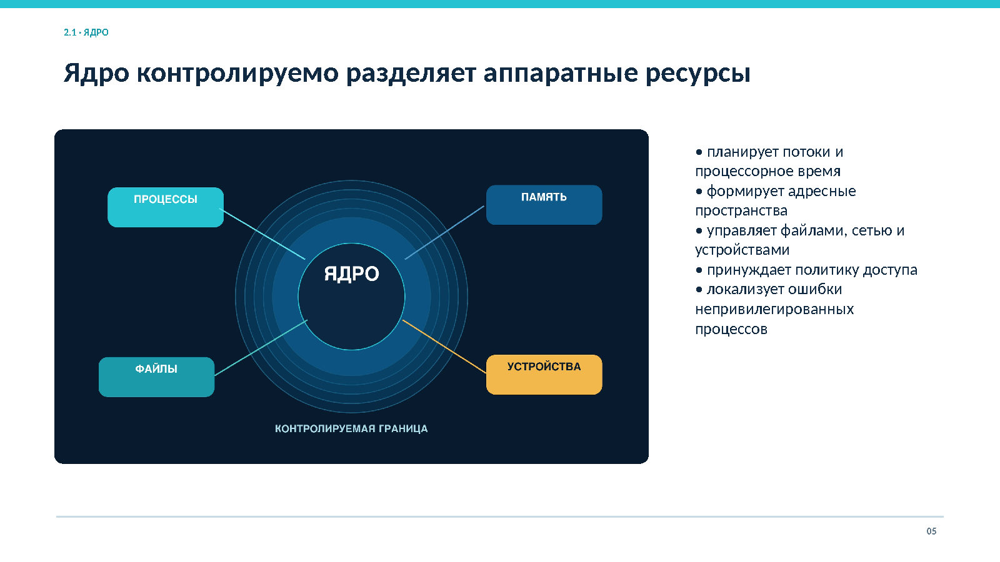

*Рисунок 1. Ядро как контролируемая граница между процессами и аппаратными ресурсами*

Ядро выполняет **контролируемое мультиплексирование** аппаратуры. Один процессор обслуживает несколько потоков, физическая память отображается в разные виртуальные пространства, накопитель принимает параллельные запросы, сетевой интерфейс разделяется между сокетами. Ядро хранит состояние каждого потребителя и не позволяет ошибке одного процесса автоматически нарушить работу остальных.

Для компьютерной безопасности ядро имеет двойную роль:

- оно является основным механизмом защиты;
- оно является критичным активом и частью доверенной вычислительной базы, TCB.

Компрометация приложения в идеале ограничивается его адресным пространством и полномочиями. Компрометация ядра позволяет менять таблицы страниц, скрывать процессы, подменять результаты системных вызовов и отключать аудит.

### 1.2. Аппаратные уровни привилегий

Процессор различает привилегированный и непривилегированный режимы. В x86 универсальные ОС обычно используют:

- **Ring 0** для ядра;
- **Ring 3** для приложений.

К привилегированным относятся инструкции, которые изменяют глобальное состояние машины: таблицы страниц, системные регистры, таймер, прерывания и регистры устройств. Попытка обычного процесса выполнить такую инструкцию создаёт синхронное исключение и передаёт управление ядру.

Уровень привилегий процессора нельзя смешивать с полномочиями пользователя. Ring 0 или Ring 3 описывает режим исполнения кода. UID, группы, роли, capabilities и метки описывают полномочия субъекта в политике ОС.

### 1.3. Контролируемый переход

Приложение получает сервис ОС через заранее определённый шлюз. Оно формирует запрос, выполняет специальную инструкцию, после чего процессор передаёт управление известной точке входа ядра.

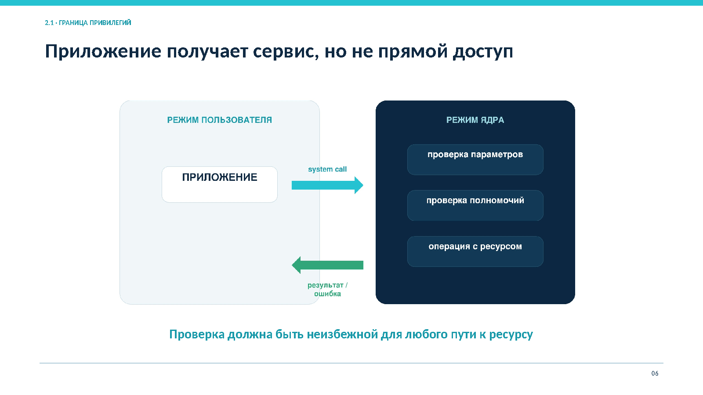

*Рисунок 2. Приложение получает сервис без прямого доступа к защищаемому ресурсу*

Проверка должна оставаться неизбежной для любого пути к ресурсу. Библиотечная функция сама по себе не переводит приложение в режим ядра. Граница пересекается только при выполнении системного вызова, исключения или обработке прерывания.

### 1.4. Защита памяти

MMU преобразует виртуальные адреса в физические и проверяет права при каждом обращении. Для страниц независимо задают чтение, запись и исполнение. Часть отображений доступна только ядру.

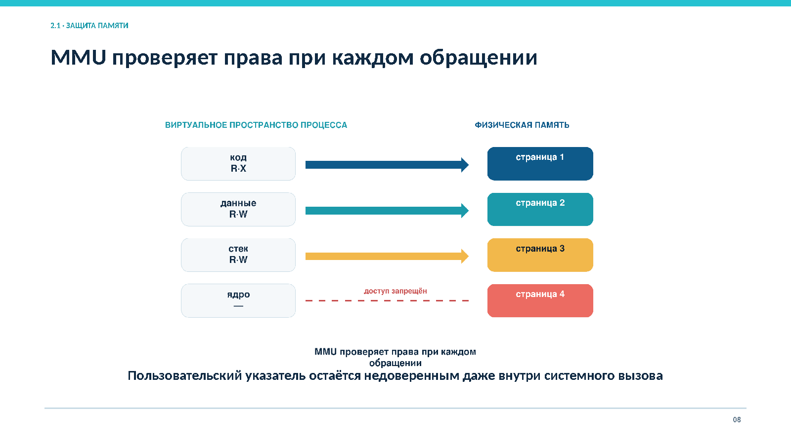

*Рисунок 3. Отображение виртуальных страниц и аппаратная проверка прав*

Исключение страницы может означать штатное событие, например подкачку или copy-on-write, либо ошибку: запись в область только для чтения, исполнение запрещённой страницы или обращение по неверному адресу.

Пользовательский указатель остаётся недоверенным внутри системного вызова. Ядро должно безопасно скопировать данные, проверить длину и корректно обработать ошибку страницы, не разрушая собственное состояние.

### 1.5. Контекст выполнения

Контекст потока включает:

- регистры и указатель инструкций;
- стек;
- адресное пространство;
- состояние процессора;
- атрибуты безопасности;
- состояние блокировок, сигналов и планирования.

При системном вызове поток временно работает в режиме ядра, но остаётся субъектом исходного процесса. Решение о доступе использует UID, группы, capabilities, метки и пространства имён этого процесса. Переход в ядро не превращает пользователя в администратора.

### 1.6. Три причины входа в ядро

| Причина | Инициатор | Связь с текущей инструкцией | Ожидаемая реакция ядра |
|---|---|---|---|
| Системный вызов | Программа | Намеренный переход | Проверить контракт и выполнить либо отклонить запрос |
| Исключение | Процессор | Синхронно связано с инструкцией | Классифицировать событие, исправить состояние или завершить процесс |
| Аппаратное прерывание | Таймер или устройство | Асинхронное событие | Быстро подтвердить источник и запланировать обработку |

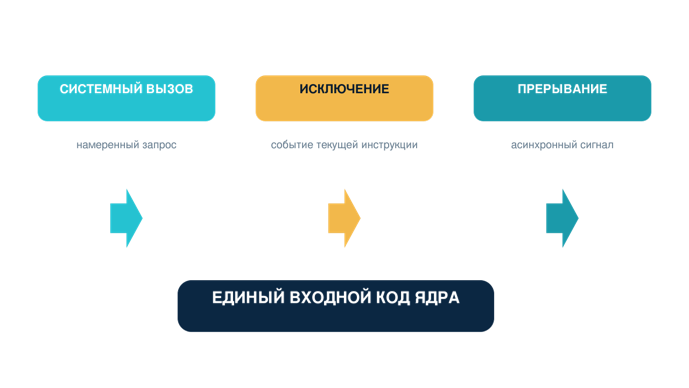

*Рисунок 4. Намеренный запрос, синхронная ошибка и асинхронное событие*

### 1.7. Протокол входа и возврата

Упрощённая последовательность:

1. процессор завершает или приостанавливает текущую инструкцию;
2. сохраняет критическую часть состояния;
3. переключает уровень привилегий и стек;
4. выбирает зарегистрированный обработчик;
5. код ядра сохраняет дополнительные регистры и классифицирует событие;
6. ядро выполняет обработку и выбирает дальнейшее действие;
7. перед возвратом проверяется и восстанавливается состояние;
8. специальная инструкция возвращает непривилегированный режим.

Граница привилегий является протоколом смены состояния, а не простой линией на схеме. Ошибка входного кода может раскрыть данные ядра или вернуть управление по подменённому адресу.

## 2. Системные вызовы как контракт ОС

**Системный вызов** — контролируемый запрос процесса к ядру на выполнение операции с системным ресурсом. Контракт задаёт представление аргументов, проверки, возможные результаты, модель ошибок и побочные эффекты.

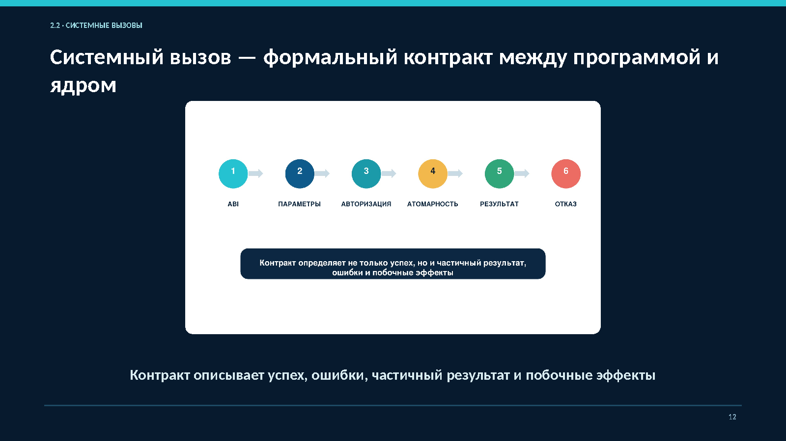

*Рисунок 5. Последовательность от API до результата или отказа*

### 2.1. API, ABI и системный вызов

| Уровень | Что определяет |
|---|---|
| API | Имена функций, типы параметров и правила использования в исходном коде |
| ABI | Регистры и стек, размеры типов, форматы структур, номера вызовов и возврат результата |
| Системный вызов | Конкретный механизм контролируемого перехода к обработчику ядра |

Программа обычно вызывает библиотечную функцию `open`, `read`, `write` или `socket`. Обёртка размещает аргументы согласно ABI и выполняет специальную инструкцию. После возврата она интерпретирует машинный результат и устанавливает `errno`.

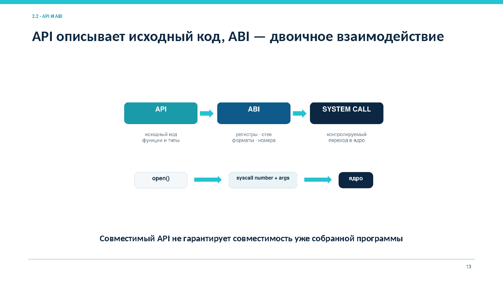

*Рисунок 6. Исходный интерфейс, двоичное соглашение и переход к ядру*

Совместимый API позволяет перекомпилировать исходный код для другой платформы. Уже собранная программа зависит от ABI. Изменение размещения аргументов, номера вызова или формата структуры нарушает двоичную совместимость.

### 2.2. Последовательность системного вызова

| Шаг | Действие | Контрольный смысл |
|---|---|---|
| 1 | Приложение вызывает функцию API | Формирует намерение выполнить операцию |
| 2 | Библиотека размещает аргументы по ABI | Обеспечивает двоичное соглашение |
| 3 | Специальная инструкция переводит процессор в ядро | Использует разрешённый аппаратный шлюз |
| 4 | Ядро сохраняет контекст и определяет вызов | Связывает запрос с текущим субъектом |
| 5 | Проверяются параметры, объект, состояние и полномочия | Не допускает использования недоверенных данных |
| 6 | Операция выполняется или отклоняется | Сохраняет инварианты и предсказуемость |
| 7 | Результат копируется, управление возвращается | Восстанавливает контекст и user mode |

### 2.3. Классы системных вызовов

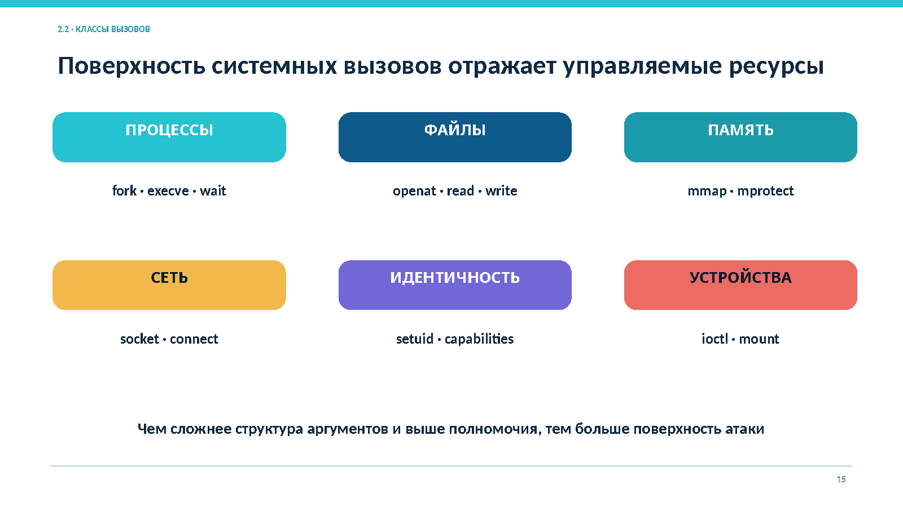

*Рисунок 7. Системные вызовы процессов, файлов, памяти, сети, идентичности и устройств*

| Ресурс | Примеры вызовов | Основной объект контроля |
|---|---|---|
| Процессы | `fork`, `execve`, `wait` | Контекст процесса и жизненный цикл |
| Файлы | `openat`, `read`, `write` | Путь, открытый объект и права |
| Память | `mmap`, `mprotect` | Диапазон адресов и права страниц |
| Сеть | `socket`, `connect` | Сокет, адрес и сетевые ограничения |
| Идентичность | `setuid`, capabilities | Атрибуты безопасности процесса |
| Устройства | `ioctl`, `mount` | Драйвер, структура аргументов и глобальное состояние |

Чем сложнее структура аргументов и выше полномочия операции, тем значительнее соответствующая поверхность атаки.

### 2.4. Дескрипторы и объектная модель

После успешного открытия файла или сокета процесс получает небольшое целое число, которое индексирует таблицу открытых объектов. Дескриптор скрывает внутренние адреса ядра и фиксирует:

- ссылку на объект;
- режим доступа;
- текущее состояние, например позицию в файле;
- связь с таблицей конкретного процесса.

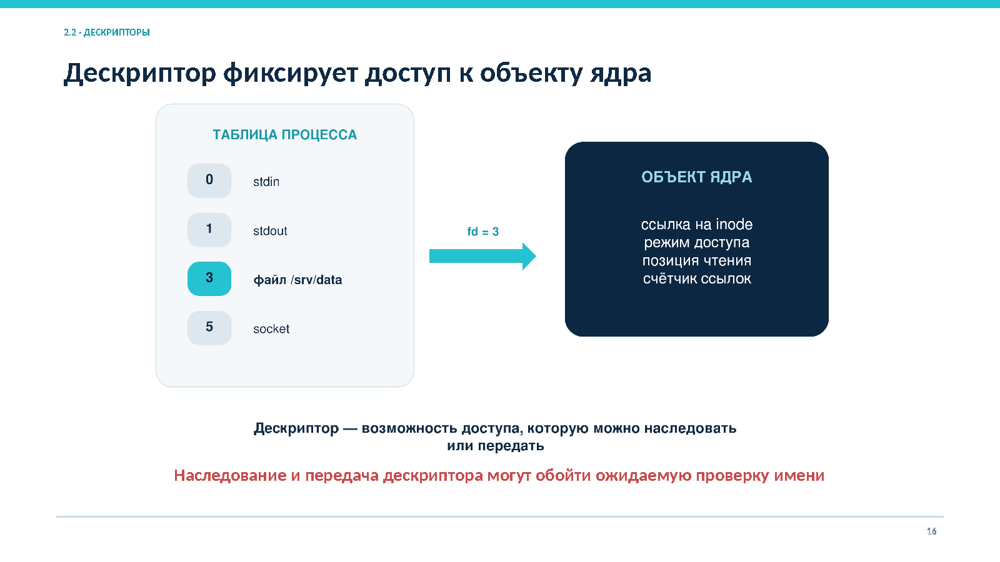

*Рисунок 8. Дескриптор фиксирует доступ к объекту после проверки имени*

Последующие операции используют уже открытый объект и не обязаны заново разрешать имя. Это снижает риск подмены объекта, но создаёт риск утечки возможности. Дескриптор может наследоваться дочерним процессом или передаваться через IPC. Для ограничения применяют `close-on-exec`, явное закрытие и минимальный набор наследуемых объектов.

### 2.5. Передача и проверка данных

Простые аргументы передаются через регистры или стек. Сложные структуры находятся в пользовательской памяти и передаются указателями. Такой указатель может быть неверным, указывать на недоступную страницу или изменяться параллельным потоком.

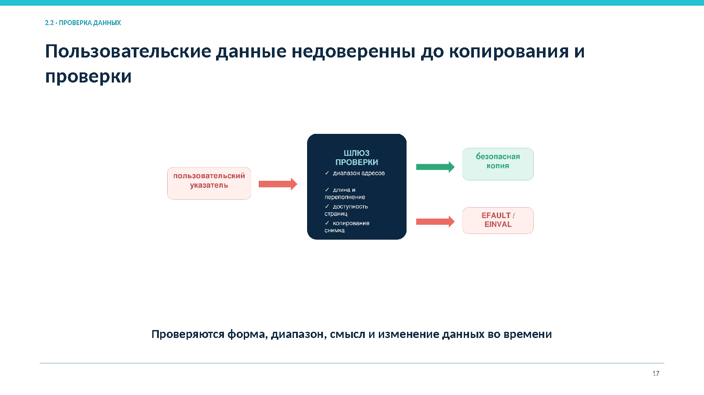

*Рисунок 9. Безопасное копирование и отказ при некорректных данных*

Ядро должно:

1. проверить форму, размер, выравнивание и допустимые флаги;
2. безопасно скопировать входные данные;
3. определить объект и его текущее состояние;
4. выполнить авторизацию относительно контекста субъекта;
5. проверить квоты и доступность ресурсов;
6. выполнить операцию с требуемой атомарностью;
7. корректно освободить временные ресурсы при отказе.

Проверка должна завершиться до изменения защищаемого объекта. При этом код ошибки не всегда означает, что никаких изменений не произошло: запись может быть частичной, а операция может прерваться сигналом.

### 2.6. TOCTOU

**Time-of-check to time-of-use (TOCTOU)** — класс программных ошибок, связанных с **условием гонки**. Возникает, когда есть промежуток времени между проверкой состояния части системы (например, проверки полномочий безопасности) и использованием результата этой проверки.
**TOCTOU** возникает, когда состояние объекта меняется между проверкой и использованием. Типичный пример: привилегированная программа сначала проверяет путь, а затем отдельной операцией открывает файл. Другой субъект может заменить каталог или символическую ссылку между этими действиями.

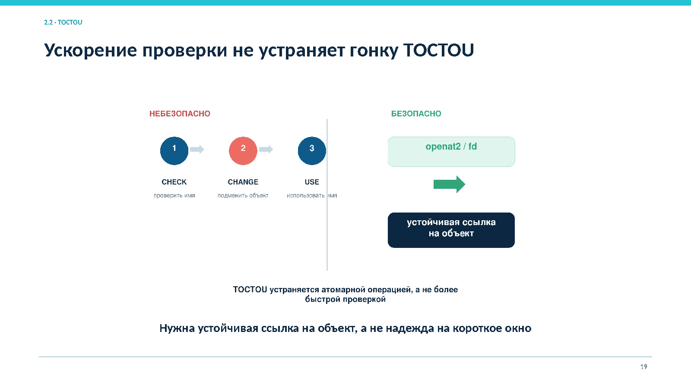

*Рисунок 10. Уязвимая схема check-change-use и устойчивый доступ через дескриптор*

Сокращение временного окна не устраняет гонку. Защита опирается на устойчивую ссылку на проверенный объект:

- дескриптор каталога или файла;
- операции относительно дескриптора;
- атомарные системные вызовы;
- безопасные флаги открытия;
- корректные блокировки и управление временем жизни объекта.

### 2.7. Наблюдение и ограничение

Системные вызовы образуют удобную границу наблюдения. Трассировка показывает запросы процесса, аргументы и результаты. Аудит связывает значимые действия с субъектом, временем и объектом. Фильтрация может ограничивать набор доступных вызовов в службе или контейнере.

Фильтр вызовов не заменяет файловые права или сетевую политику. Один вызов может быть допустим для одного объекта и запрещён для другого. Также не следует записывать каждый вызов без разбора: чрезмерный поток событий ухудшает анализ. Состав аудита определяют по сценариям угроз.

## 3. Архитектуры ядра

Архитектура определяет, какие функции работают с максимальными привилегиями, как взаимодействуют подсистемы и насколько легко локализовать отказ. Ни один архитектурный класс не гарантирует защищённость автоматически.

### 3.1. Критерии сравнения

- объём кода в привилегированном режиме;
- состав и структура TCB;
- стоимость взаимодействия между компонентами;
- число и сложность интерфейсов;
- локализация и восстановление после отказа;
- расширяемость и совместимость драйверов;
- способ обновления;
- предсказуемость времени и проверяемость.

### 3.2. Монолитное ядро

В монолитной архитектуре планировщик, память, файловые системы, сеть и многие драйверы работают в общем привилегированном адресном пространстве. Подсистемы взаимодействуют прямыми внутренними вызовами и используют общие структуры данных.

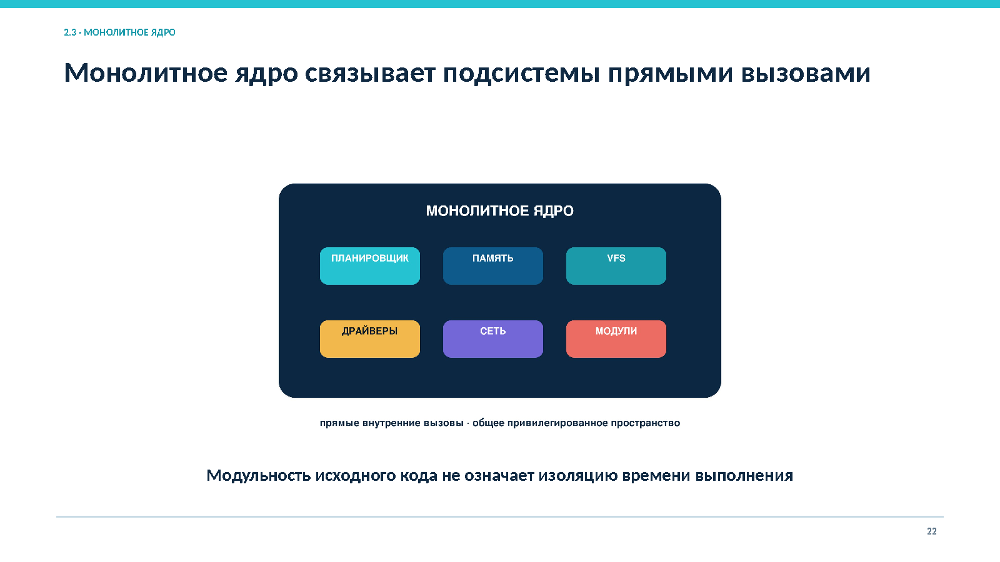

*Рисунок 11. Основные подсистемы в едином привилегированном пространстве*

Преимущества:

- малые накладные расходы на взаимодействие;
- высокая производительность;
- удобство тесной интеграции подсистем.

Основной риск заключается в широкой области последствий дефекта. Ошибка записи в драйвере может повредить память другой подсистемы или всего ядра. Монолитное ядро может быть хорошо структурировано, но загруженный модуль всё равно получает привилегии ядра. Подпись модуля подтверждает происхождение, а не отсутствие дефектов.

### 3.3. Микроядерная архитектура

Микроядро оставляет в привилегированном режиме минимальные механизмы: планирование, базовое управление адресными пространствами, IPC и низкоуровневую обработку событий. Файловые системы, сетевые стеки и драйверы могут работать как пользовательские серверы.

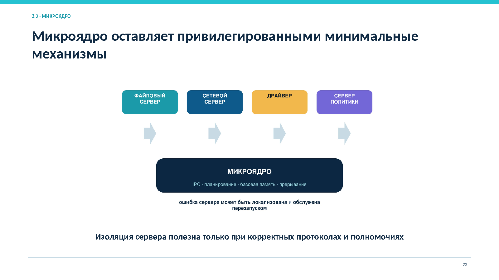

*Рисунок 12. Минимальное привилегированное ядро и изолированные серверы*

Изоляция локализует часть отказов и позволяет перезапускать серверы. Небольшое ядро потенциально проще анализировать. Цена подхода включает дополнительные сообщения, переключения контекста и усложнение протоколов. Безопасность требует корректного IPC, минимальных полномочий серверов и сохранения состояния при их перезапуске.

### 3.4. Гибридный и специализированные подходы

Гибридная система применяет микроядерные идеи, но выполняет часть серверов и драйверов в пространстве ядра ради производительности или совместимости. Термин «гибридное ядро» без карты компонентов мало говорит о фактических границах доверия.

Другие варианты:

- **слоистая система** ограничивает направления зависимостей;
- **экзоядро** минимально разделяет аппаратные ресурсы, передавая больше политики библиотечным ОС;
- **unikernel** объединяет приложение и необходимые службы в специализированный образ;
- ОС реального времени и защищённые ОС выбирают архитектуру по требованиям детерминированности и проверяемости.

### 3.5. Сравнение архитектур

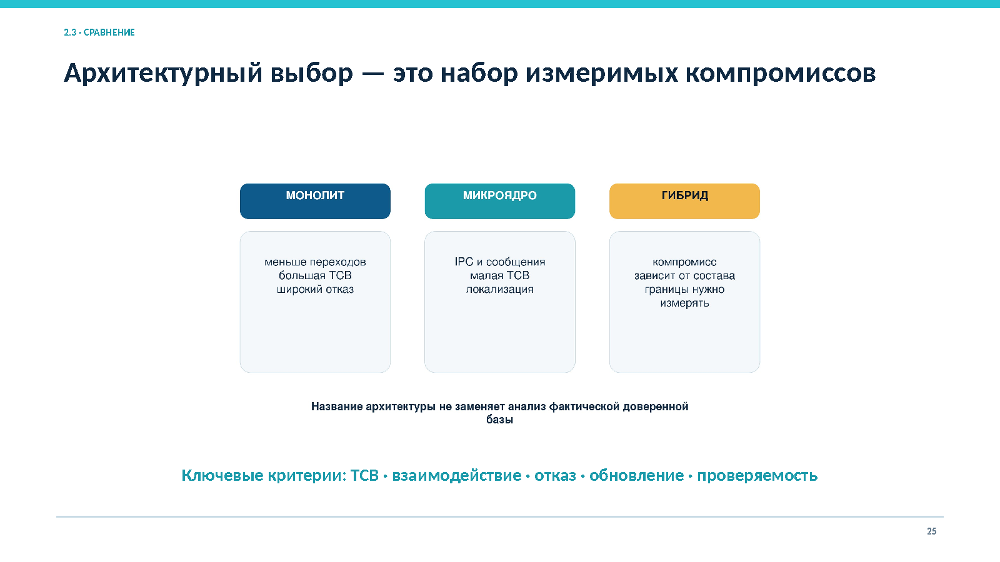

*Рисунок 13. TCB, взаимодействие, отказ, обновление и проверяемость*

| Критерий | Монолитное ядро | Микроядро | Гибридный подход |
|---|---|---|---|
| Привилегированный состав | Большинство подсистем | Минимальные механизмы | Зависит от реализации |
| Взаимодействие | Прямые вызовы | IPC и сообщения | Сочетание вызовов и сообщений |
| Локализация сбоя | Ошибка драйвера может повредить ядро | Сервер или драйвер можно изолировать | Часть отказов изолируется |
| Производительность | Небольшие накладные расходы | Дополнительные переходы и IPC | Зависит от размещения служб |
| Проверяемость | Большая TCB, возможна строгая модульность | Малое ядро проще анализировать | Нужно оценивать фактическую TCB |
| Основной риск | Широкие последствия дефекта | Сложность протоколов и полномочий | Неясные границы и крупная привилегированная часть |

Корректное сравнение отвечает на вопросы: что входит в TCB, как проверяется интерфейс, что произойдёт при отказе и как восстановится функция.

## 4. Прерывания, драйверы и минимальные привилегии

### 4.1. Асинхронное взаимодействие

Системный вызов инициируется процессом, а завершение операции устройства часто приходит позже как аппаратное прерывание. Драйвер связывает общий интерфейс ОС с конкретным оборудованием.

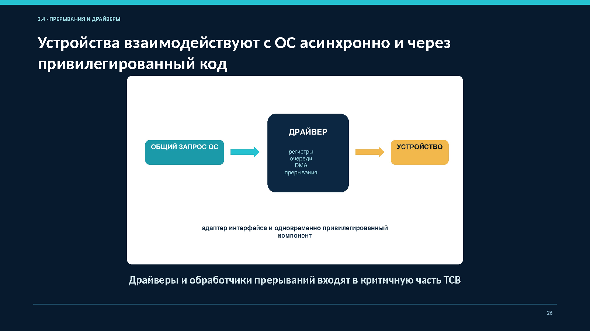

*Рисунок 14. Асинхронное взаимодействие через привилегированный драйвер*

Драйвер:

- инициализирует устройство;
- программирует регистры и очереди;
- настраивает DMA;
- обрабатывает прерывания;
- управляет состоянием запросов;
- сообщает подсистеме ОС о завершении операции.

Недоверенными являются как пользовательские параметры, так и данные устройства, ответы прошивки и состояния шины.

### 4.2. Верхняя и отложенная обработка

Непосредственный обработчик прерывания должен быть коротким. Он подтверждает источник, сохраняет минимум данных и планирует дальнейшую работу. Длительная обработка увеличивает задержки, джиттер и риск блокировки других событий.

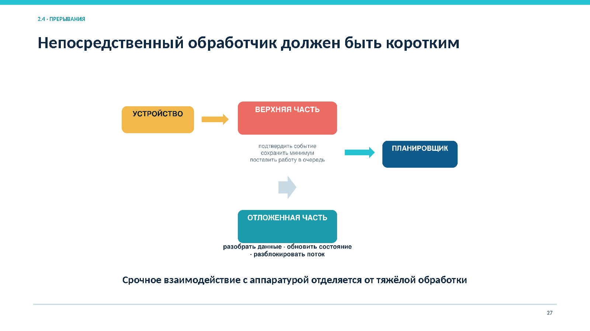

*Рисунок 15. Разделение срочного взаимодействия с аппаратурой и тяжёлой обработки*

Отложенная часть выполняет разбор данных, обновляет состояние и разблокирует ожидающие потоки. Безопасность зависит от правильного владения буферами, проверки длины и синхронизации между пользовательским запросом, прерыванием и выгрузкой драйвера.

### 4.3. Жизненный цикл драйвера

Безопасный жизненный цикл включает:

1. получение драйвера из контролируемого источника;
2. проверку подписи и совместимости с ядром;
3. загрузку с минимально необходимыми параметрами;
4. регистрацию интерфейсов, прерываний и DMA;
5. мониторинг ошибок и действий;
6. безопасное обновление с планом отката;
7. прекращение новых запросов перед выгрузкой;
8. ожидание текущих операций и освобождение ресурсов.

Горячее отключение создаёт особый риск: устройство может исчезнуть, пока процесс держит дескриптор, очередь содержит запрос, а обработчик обращается к структуре драйвера. Для защиты используют состояния завершения, счётчики ссылок и строгий порядок освобождения.

### 4.4. DMA и IOMMU

**DMA (Direct Memory Access)** — это механизм прямого доступа к памяти, который позволяет устройствам обмениваться данными с оперативной памятью, минуя центральный процессор (CPU). **DMA** позволяет устройству читать или записывать память без передачи каждого байта процессором. Ошибка драйвера или устройства может затронуть память ядра, обходя обычные проверки MMU.

**IOMMU (Input-Output Memory Management Unit)** — это аппаратный блок управления памятью, который управляет доступом периферийных устройств к оперативной памяти через механизм DMA (Direct Memory Access). Он преобразует виртуальные адреса, видимые устройствами ввода-вывода, в физические адреса памяти, обеспечивая изоляцию, защиту и контроль доступа.
**IOMMU** ограничивает доступ только буферами, необходимыми для операции.

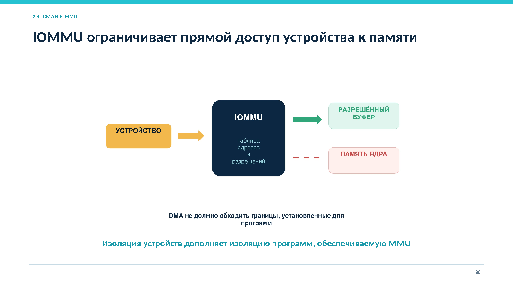

*Рисунок 16. Разрешённые диапазоны памяти устройства и запрет доступа к памяти ядра*

MMU контролирует обращения процессора, IOMMU контролирует обращения устройств. Слишком широкое отображение IOMMU фактически отменяет защиту.

### 4.5. Минимизация привилегий

Для ядра и драйверной подсистемы принцип наименьших привилегий означает:

- минимальный набор загруженных модулей;
- запрет кода из недоверенных источников;
- ограничение административных и отладочных интерфейсов;
- перенос сложной обработки в менее привилегированную среду, когда это возможно;
- отдельные учётные записи и ограниченные capabilities для системных служб;
- контроль открытых дескрипторов, сокетов и наследуемых полномочий;
- журналирование загрузки модулей, изменения параметров и ошибок устройств.

## 5. Сквозной пример: путь `open()` и `read()` в Linux

Пусть непривилегированная программа открывает файл `/srv/course/materials/lecture2.pdf` для чтения:

```c
int fd = open("/srv/course/materials/lecture2.pdf", O_RDONLY);
ssize_t count = read(fd, buffer, size);
```

### 5.1. Открытие файла

1. Программа вызывает библиотечную функцию `open()` или `openat()`.
2. Библиотека формирует аргументы по ABI и выполняет системный вызов.
3. Процессор сохраняет состояние, меняет стек и передаёт управление ядру.
4. Ядро определяет номер вызова и безопасно копирует путь и флаги.
5. VFS разрешает компоненты пути с учётом корня, текущего каталога, точек монтирования и символических ссылок.
6. Политика сопоставляет контекст процесса с владельцем, группой, режимом, ACL и дополнительными механизмами контроля.
7. При успехе ядро создаёт объект открытого файла и помещает ссылку в таблицу дескрипторов.

### 5.2. Чтение данных

1. `read()` передаёт ядру дескриптор, адрес пользовательского буфера и размер.
2. Ядро проверяет дескриптор, режим объекта, позицию и доступность буфера.
3. Если данные находятся в кэше, они копируются пользователю.
4. Иначе файловая система формирует запрос блочному слою и драйверу.
5. Драйвер настраивает очередь и DMA.
6. Устройство выполняет операцию и посылает прерывание.
7. Обработчик подтверждает событие, отложенная часть обновляет состояние и разблокирует поток.
8. Ядро копирует данные в пользовательский буфер и возвращает число прочитанных байтов либо ошибку.

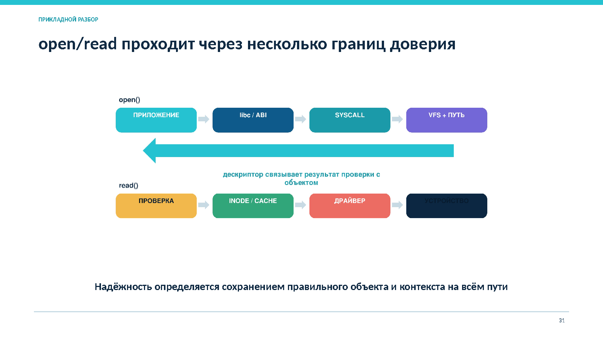

*Рисунок 17. API, ABI, системный вызов, VFS, объект ядра, драйвер и устройство*

### 5.3. Точки риска

- неверная длина строки пути;
- ошибка копирования из пользовательской памяти;
- гонка при разрешении имени;
- неверная проверка ACL;
- утечка или наследование дескриптора;
- использование освобождённой структуры драйвера;
- некорректное отображение DMA;
- загрузка подменённого модуля ядра.

Надёжность обеспечивается сохранением правильного объекта и контекста на всём пути, а не одной локальной проверкой.

## Итоговая модель анализа

Для любого системного вызова следует последовательно определить:

1. функцию API и двоичный интерфейс ABI;
2. причину и точку перехода в ядро;
3. сохранённый контекст и субъект запроса;
4. недоверенные параметры;
5. объект ядра и его жизненный цикл;
6. структурную проверку и авторизацию;
7. требуемую атомарность и модель отказа;
8. задействованные подсистемы и привилегированные компоненты;
9. область последствий ошибки;
10. события аудита и способ восстановления.

## Основные выводы

1. Аппаратные привилегии и виртуальная память делают границу ядра неизбежной для обычного приложения.
2. Вход в ядро происходит через системный вызов, исключение или аппаратное прерывание.
3. Системный вызов является двоичным и семантическим контрактом, а не обычной библиотечной функцией.
4. Пользовательские указатели и данные устройств остаются недоверенными до проверки.
5. Дескриптор фиксирует связь с объектом, но требует контроля наследования и передачи.
6. TOCTOU устраняется устойчивой ссылкой и атомарной операцией, а не ускорением проверки.
7. Архитектурный класс задаёт компромиссы, но не гарантирует безопасность по названию.
8. Драйверы, модули и обработчики прерываний входят в критичную часть TCB.
9. IOMMU дополняет MMU и ограничивает прямой доступ устройств к памяти.
10. Защищённость определяется согласованностью границы, контракта, объектов, наблюдаемости и восстановления.

## Вопросы для самоконтроля

1. Какие функции ядра требуют привилегированного режима?
2. Чем уровень привилегий отличается от полномочий пользователя?
3. Какие три причины передают управление ядру?
4. Чем системный вызов отличается от библиотечной функции?
5. Чем API отличается от ABI?
6. Почему пользовательский указатель считается недоверенным?
7. Какие проверки выполняют до изменения объекта?
8. Как дескриптор фиксирует результат открытия?
9. Какие риски создаёт наследование дескриптора?
10. В чём состоит TOCTOU и почему короткое временное окно не решает проблему?
11. Что входит в TCB монолитной и микроядерной системы?
12. Почему модульность кода не равна изоляции выполнения?
13. За счёт чего микроядро локализует отказ и какую цену за это платит?
14. Почему обработчик прерывания должен быть коротким?
15. Какие недоверенные данные обрабатывает драйвер?
16. Как IOMMU ограничивает последствия ошибочного DMA?
17. Какие границы проходит запрос открытия файла?
18. Какие события нужно журналировать при изменении привилегированной части ОС?

## Практические задания

### Задание 1. Разбор `read()`

Для вызова `read(fd, buffer, 4096)` определите:

- аргументы API и ABI;
- состояние, сохраняемое при переходе в ядро;
- проверки дескриптора, буфера и размера;
- объект ядра и его режим доступа;
- варианты частичного результата и ошибки;
- событие аудита, подтверждающее разрешение или отказ.

### Задание 2. Сравнение архитектур

Необходимо разработать ОС для сетевого устройства, где критичны непрерывная работа и перезапуск драйвера без перезагрузки. Сравните монолитное и микроядерное размещение драйвера по производительности, TCB, IPC, локализации отказа и обновлению.

### Задание 3. Поиск ошибок в рассуждении

Объясните ошибки в утверждениях:

- «Программа вызвала библиотечную функцию, следовательно, уже работает в режиме ядра».
- «Модуль подписан, поэтому в нём не может быть уязвимости».
- «Микроядро маленькое, значит вся система автоматически безопасна».
- «Путь проверен, поэтому файл можно открыть второй операцией без риска подмены».
- «Устройство физически подключено, поэтому его данные можно считать доверенными».

## Самостоятельная работа

Разберите два системных вызова Linux из разных классов, например `openat()` и `mmap()` либо `socket()` и `execve()`. Для каждого укажите:

- назначение и функцию API;
- основные аргументы ABI;
- объекты ядра;
- проверки параметров и полномочий;
- возможные ошибки и частичные результаты;
- значимые события аудита;
- не менее двух сценариев некорректного использования.

Дополнительно сравните монолитную и микроядерную реализацию одной выбранной службы. Рекомендуемый объём работы: 3–4 страницы.

## Краткий глоссарий

| Термин | Определение |
|---|---|
| API | Интерфейс прикладного программирования на уровне исходного кода |
| ABI | Двоичное соглашение о представлении типов, параметров, структур и способе взаимодействия с собранным кодом |
| Системный вызов | Контролируемый запрос процесса к ядру на операцию с системным ресурсом |
| Контекст | Регистры, стек, адресное пространство и атрибуты безопасности потока |
| Дескриптор | Непрямая ссылка процесса на открытый объект ядра и связанные права и состояние |
| Исключение | Синхронная передача управления ядру из-за текущей инструкции |
| Прерывание | Асинхронный сигнал от таймера или устройства |
| Драйвер | Компонент, преобразующий общий интерфейс ОС в команды устройства |
| DMA | Прямой доступ устройства к памяти без передачи каждого байта процессором |
| IOMMU | Механизм преобразования и ограничения адресов памяти для устройств |
| TOCTOU | Гонка, при которой состояние объекта меняется между проверкой и использованием |
| TCB | Компоненты, корректность которых необходима для принуждения политики безопасности |
| Монолитное ядро | Архитектура с основными подсистемами в общем привилегированном пространстве |
| Микроядро | Архитектура с минимальными привилегированными механизмами и отдельными пользовательскими серверами |

## Литература

1. Востокин С. В. *Операционные системы: учебное пособие*. Самара: Самарский университет, 2018.
2. Таненбаум Э., Бос Х. *Современные операционные системы*. 4-е изд. Санкт-Петербург: Питер, 2015.
3. Linux man-pages, разделы 2 и 7: системные вызовы, сигналы, процессы, файлы и сокеты.
4. Документация ядра Linux для используемой версии: системные вызовы, драйверная модель, прерывания, DMA и IOMMU.
5. Документация Astra Linux Special Edition для используемой версии ОС.

> Реализация интерфейсов, состав защитных механизмов и параметры ядра зависят от версии ОС. Перед практической настройкой следует сверяться с актуальной эксплуатационной документацией.

## Использованные материалы

- текст: «Лекция_2_Архитектура_ОС_Системные_вызовы_10.05.01.docx»;
- рисунки: «Лекция_2_Архитектура_ОС_Системные_вызовы_10.05.01_с_заметками.pptx».
