# Процессы, потоки и планирование

**Курс:** Операционные системы  
**Специальность:** 10.05.01 «Компьютерная безопасность»  
**Лекция:** 3  
**Продолжительность:** 2 академических часа

## Цель лекции

Сформировать целостную модель выполнения программ в ОС: от процесса как контейнера ресурсов и полномочий до потоков, распределения процессорного времени и проверяемой изоляции системной службы.

После изучения темы обучающийся должен уметь:

- различать программу, процесс и поток;
- описывать PCB, адресное пространство и жизненный цикл процесса;
- объяснять преимущества и риски многопоточности;
- различать состояния готовности, выполнения и ожидания;
- сравнивать основные алгоритмы планирования;
- анализировать многоядерное планирование и требования реального времени;
- определять фактический контекст безопасности процесса;
- проектировать процессные границы и ограниченный пул потоков для сетевой службы.

## Логика лекции

1. Процесс как контейнер выполнения, ресурсов и полномочий.
2. Поток как планируемая единица внутри процесса.
3. Планирование ограниченного процессорного времени.
4. Контекст безопасности и изоляция процессов.
5. Сквозной пример безопасной сетевой службы.

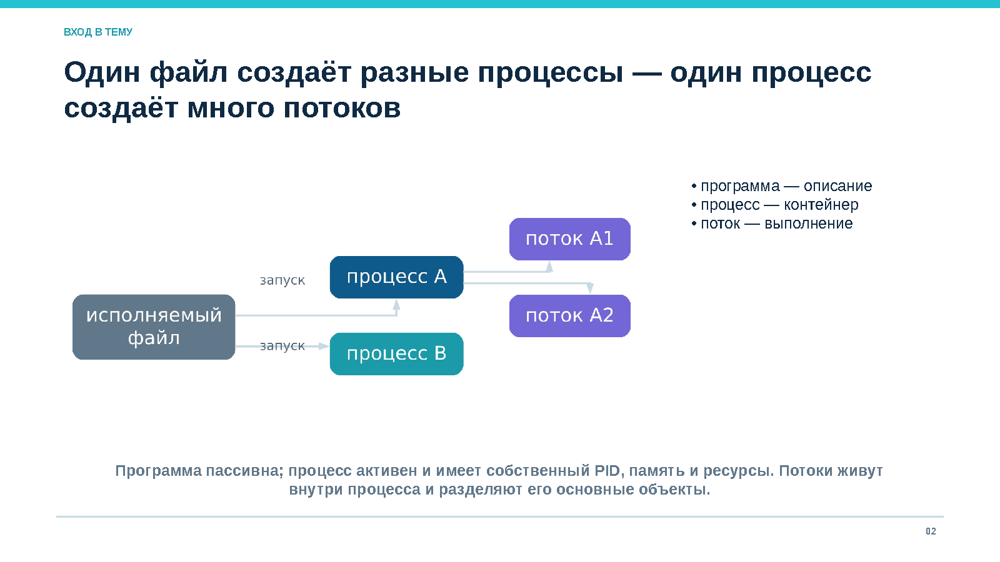

*Рисунок 1. Один исполняемый файл может создавать разные процессы, а процесс может содержать несколько потоков*

## 1. Процесс как контейнер ресурсов

### 1.1. Программа и процесс

**Программа** представляет собой пассивное описание вычисления: исполняемый файл, библиотеки, данные и метаданные. **Процесс** является активным экземпляром программы, которому ОС назначила:

- идентификатор PID;
- виртуальное адресное пространство;
- не менее одного потока;
- набор открытых объектов;
- параметры планирования;
- контекст безопасности;
- контролируемый жизненный цикл.

Один исполняемый файл может быть запущен многократно. Каждый запуск образует отдельный процесс со своей памятью, состоянием, ресурсами и идентификаторами. Независимость процессов обеспечивают таблицы страниц, таблицы дескрипторов, планировщик и контроль доступа.

Процесс выступает сразу в нескольких ролях:

1. единица владения ресурсами;
2. субъект, от имени которого ядро проверяет доступ;
3. объект управления, который можно создать, приостановить, наблюдать, ограничить или завершить.

### 1.2. PCB и сохраняемый контекст

Ядро хранит сведения о процессе в структурах, логически образующих **PCB, Process Control Block**.

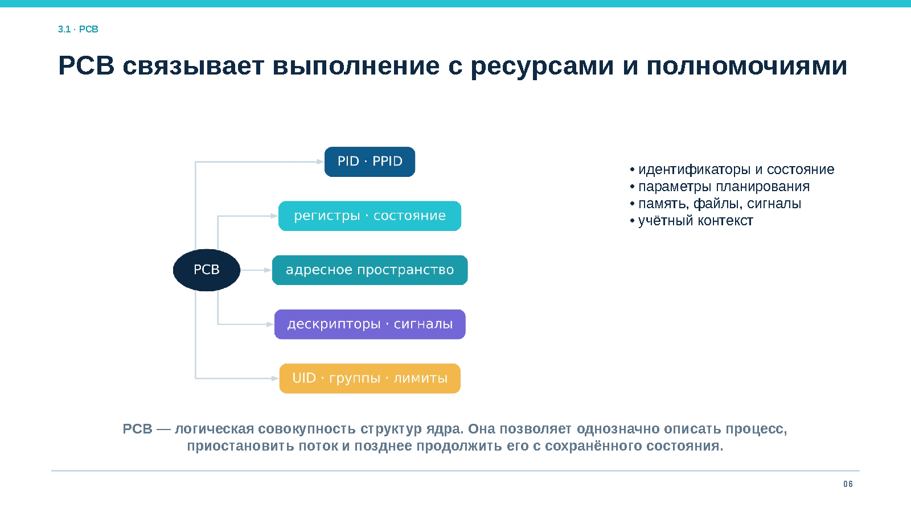

*Рисунок 2. PCB связывает выполнение процесса с ресурсами и полномочиями*

PCB включает:

- PID, PPID и связанные идентификаторы;
- состояние процесса и потоков;
- параметры планирования;
- ссылки на адресное пространство;
- таблицу дескрипторов;
- обработчики сигналов;
- учётный контекст и ограничения;
- статистику использования ресурсов.

Контекст отдельного потока содержит счётчик команд, регистры, указатели стеков, флаги процессора и служебное состояние архитектуры. При переключении ОС сохраняет достаточно данных, чтобы позднее продолжить выполнение так, будто паузы не было.

У каждого потока свои регистры, стек и позиция выполнения. Память, большинство дескрипторов, текущий каталог и многие атрибуты процесса являются общими.

### 1.3. Виртуальное адресное пространство

Типичное адресное пространство процесса содержит код, неизменяемые данные, глобальные переменные, кучу, стеки потоков, отображённые файлы и библиотеки.

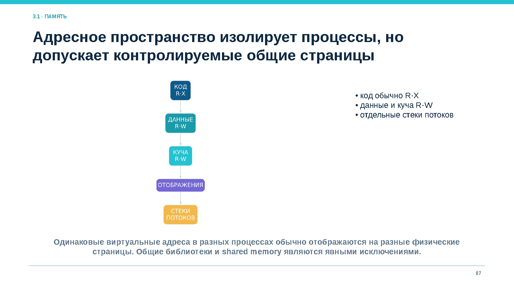

*Рисунок 3. Изолированные адресные пространства и контролируемые общие страницы*

Одинаковые виртуальные адреса разных процессов обычно отображаются на разные физические страницы. Код часто имеет права чтения и исполнения, данные и куча — чтения и записи. Каждый поток получает отдельный стек.

Некоторые страницы разделяются намеренно. Общие библиотеки экономят память, shared memory ускоряет IPC. Следовательно, процессная граница представляет собой набор контролируемых отображений и интерфейсов, а не абсолютную герметичность.

При `fork()` ядро может применять копирование при записи. Родитель и потомок временно используют одни физические страницы только для чтения. Первая запись вызывает исключение и создание частной копии.

### 1.4. Ресурсы процесса

Таблица файловых дескрипторов связывает небольшие целые числа с объектами ядра: файлами, каталогами, каналами, сокетами, таймерами и устройствами. Дескриптор действует в контексте конкретного процесса и не является адресом объекта.

К ресурсам процесса также относятся:

- текущий и корневой каталоги;
- пространства имён;
- лимиты и квоты;
- маска создания файлов;
- обработчики сигналов;
- сетевые и IPC-объекты.

Жизненный цикл объекта определяется ссылками. Закрытие дескриптора уменьшает счётчик ссылок, а окончательное освобождение происходит, когда ссылок не осталось. Непреднамеренное наследование дескриптора переносит доступ в новый процесс и может нарушить ожидаемую изоляцию.

### 1.5. Состояния процесса и потока

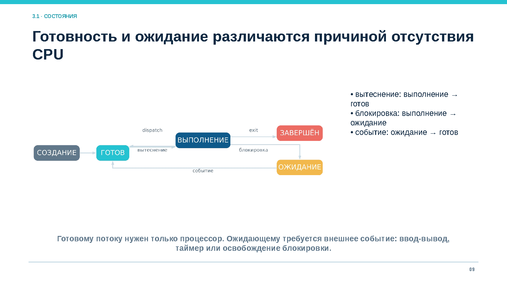

*Рисунок 4. Создание, готовность, выполнение, ожидание и завершение*

| Переход | Причина | Практический смысл |
|---|---|---|
| создание → готов | Контекст сформирован | Поток может конкурировать за CPU |
| готов → выполнение | Решение планировщика | Диспетчер восстанавливает контекст |
| выполнение → ожидание | Блокирующая операция | Поток не использует CPU до события |
| ожидание → готов | Событие произошло | Поток возвращается в очередь |
| выполнение → готов | Вытеснение или квант | CPU передаётся другой задаче |
| выполнение → завершён | `exit`, ошибка или сигнал | Ресурсы освобождаются, статус сохраняется |

**Готовый** поток имеет всё необходимое, кроме процессора. **Ожидающий** поток не может продолжить работу до внешнего события: завершения ввода-вывода, появления данных, освобождения блокировки или истечения таймера.

Большая очередь готовых потоков указывает на конкуренцию за CPU. Много потоков в ожидании может быть нормальным состоянием событийной службы. Для диагностики учитывают причину и длительность ожидания.

### 1.6. Создание, `exec()` и завершение

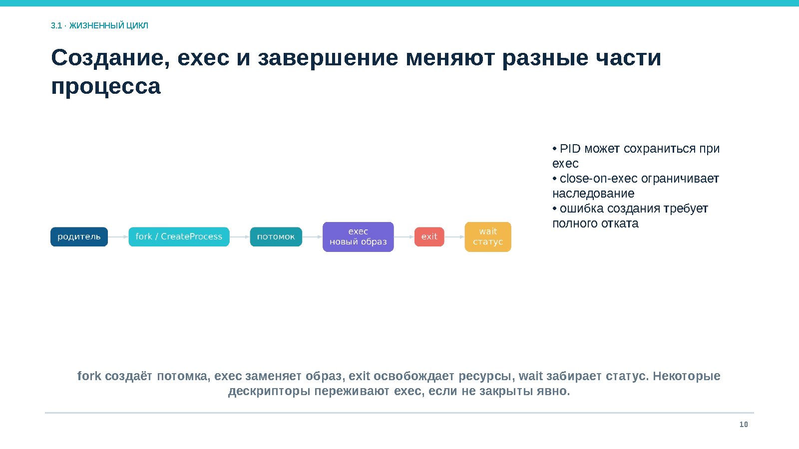

*Рисунок 5. Создание потомка, замена образа, завершение и получение статуса*

В Unix-подобной модели:

- `fork()` создаёт потомка с логической копией состояния родителя;
- `exec()` заменяет код, данные и стеки новым образом программы;
- `exit()` завершает процесс и освобождает ресурсы;
- `wait()` позволяет родителю получить статус завершения.

PID может сохраниться при `exec()`. Часть лимитов, идентификаторов и дескрипторов также сохраняется. Флаг `close-on-exec` закрывает выбранные дескрипторы при замене образа.

Завершённый процесс временно остаётся **зомби**, пока родитель не получит статус. Массовое накопление зомби обычно означает ошибку управления жизненным циклом.

## 2. Потоки и совместное использование

### 2.1. Поток как единица выполнения

**Поток** — планируемая последовательность выполнения с собственными регистрами, счётчиком команд и стеком внутри процесса.

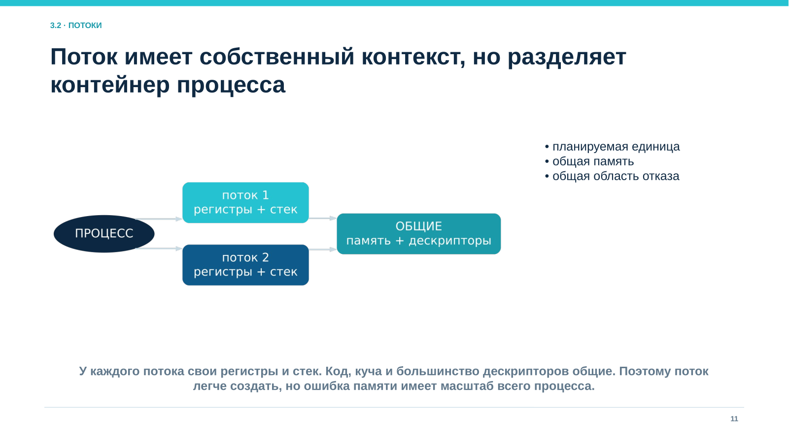

*Рисунок 6. Собственный контекст потоков и общие ресурсы процесса*

Потоки одного процесса разделяют:

- код и глобальные данные;
- кучу;
- большинство дескрипторов;
- адресное пространство;
- учётный контекст процесса.

Создание и переключение потоков обычно дешевле процессов, но не бесплатно. Каждый поток требует стек, структуры ядра, участия планировщика и места в кэше. Избыточное число потоков увеличивает память, переключения и конкуренцию за блокировки.

В современных ОС именно поток чаще всего является планируемой сущностью. Многопоточный процесс способен одновременно использовать несколько ядер.

### 2.2. Зачем нужна многопоточность

Многопоточность применяют для:

- сохранения отзывчивости интерфейса;
- перекрытия ожидания ввода-вывода вычислениями;
- параллельной работы на нескольких ядрах;
- организации управляемой очереди задач.

Для коротких запросов эффективен ограниченный пул. Модель «поток на каждый запрос» может истощить память и вызвать бурю пробуждений. Практические системы часто объединяют событийный цикл, пул рабочих потоков и отдельные процессы для разных зон доверия.

### 2.3. Пользовательские и ядерные потоки

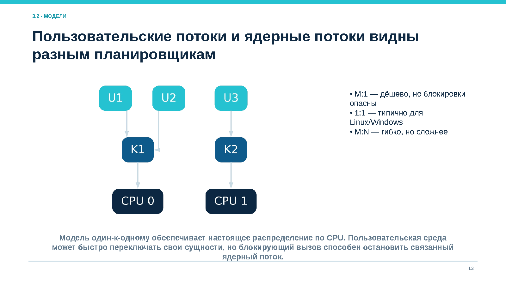

*Рисунок 7. Модели M:1, 1:1 и M:N*

| Модель | Содержание | Преимущество | Ограничение |
|---|---|---|---|
| M:1 | Несколько пользовательских потоков на один ядерный | Быстрое переключение в библиотеке | Блокирующий вызов может остановить все потоки |
| 1:1 | Каждый пользовательский поток имеет ядерный поток | Настоящий параллелизм и независимое ожидание | Более высокие системные расходы |
| M:N | Много пользовательских потоков на несколько ядерных | Гибкое управление средой выполнения | Сложнее сигналы, отладка и планирование |

Модель 1:1 типична для современных Linux и Windows.

### 2.4. Общая память и гонки

Операция высокого уровня может состоять из нескольких машинных инструкций. Если два потока одновременно читают и изменяют одну переменную без согласования, результат зависит от порядка выполнения.

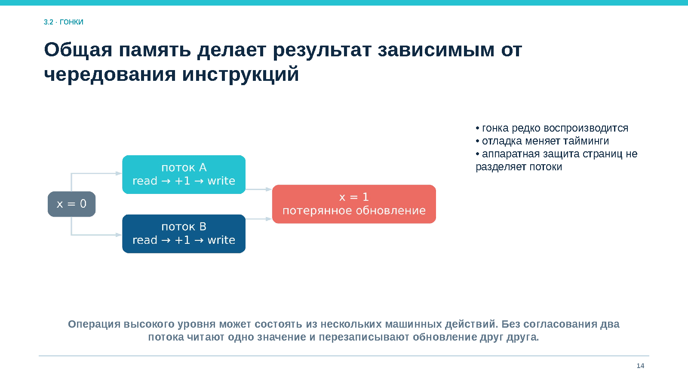

*Рисунок 8. Потерянное обновление при конкурентном изменении общей переменной*

Гонки редко воспроизводятся и могут исчезать во время отладки, поскольку инструменты меняют тайминги. Аппаратная защита страниц не разделяет потоки одного процесса. Ошибка указателя, переполнение буфера или освобождение объекта одним потоком затрагивает остальные потоки.

Безопасная работа с общей памятью требует определить:

1. владельца данных;
2. допустимых читателей и писателей;
3. примитив, защищающий инвариант;
4. момент уничтожения объекта;
5. правила обработки всех допустимых чередований.

### 2.5. Процессы и потоки как границы

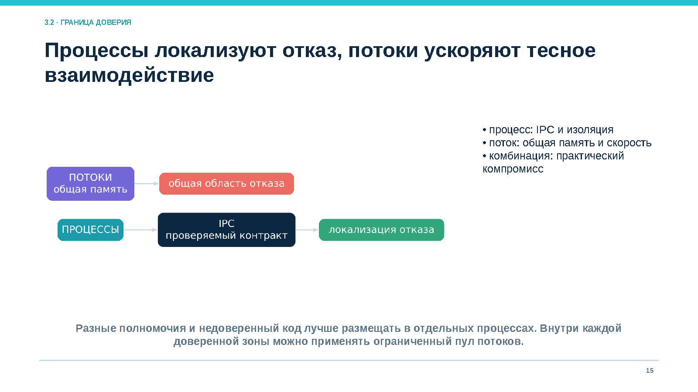

*Рисунок 9. Изоляция отказа процессом и тесное взаимодействие потоков*

| Критерий | Отдельные процессы | Потоки одного процесса |
|---|---|---|
| Адресное пространство | Раздельное по умолчанию | Общее |
| Обмен данными | IPC, сокеты, каналы, отображения | Прямой доступ к общей памяти |
| Стоимость создания | Обычно выше | Обычно ниже |
| Локализация сбоя | Сбой чаще ограничен процессом | Сбой затрагивает весь процесс |
| Разные полномочия | Назначаются естественно | Обычно общий контекст |
| Лучшее применение | Границы доверия и восстановления | Тесно связанный параллелизм |

Недоверенный код и компоненты с разными полномочиями лучше размещать в отдельных процессах. Внутри каждой доверенной зоны ограниченный пул потоков обеспечивает параллелизм.

### 2.6. Диагностика

Для анализа процессов и потоков в Linux применяют `ps`, `top`, `htop`, `/proc`, `strace`, `perf` и средства трассировки. Важно наблюдать:

- дерево процессов и PPID;
- число и состояния потоков;
- использование CPU и памяти;
- причины ожидания;
- добровольные и недобровольные переключения;
- стеки всех потоков при зависании;
- открытые дескрипторы и сетевые соединения.

Дамп только аварийного потока может скрыть причину: другой поток способен удерживать блокировку или завершать общий объект.

## 3. Планирование процессора

Планировщик не ускоряет процессор. Он распределяет ограниченное время между готовыми потоками и выбирает компромисс между откликом, пропускной способностью, справедливостью и сроками.

### 3.1. Планировщик и диспетчер

**Планировщик** выбирает следующий готовый поток. **Диспетчер** сохраняет прежний контекст и восстанавливает новый.

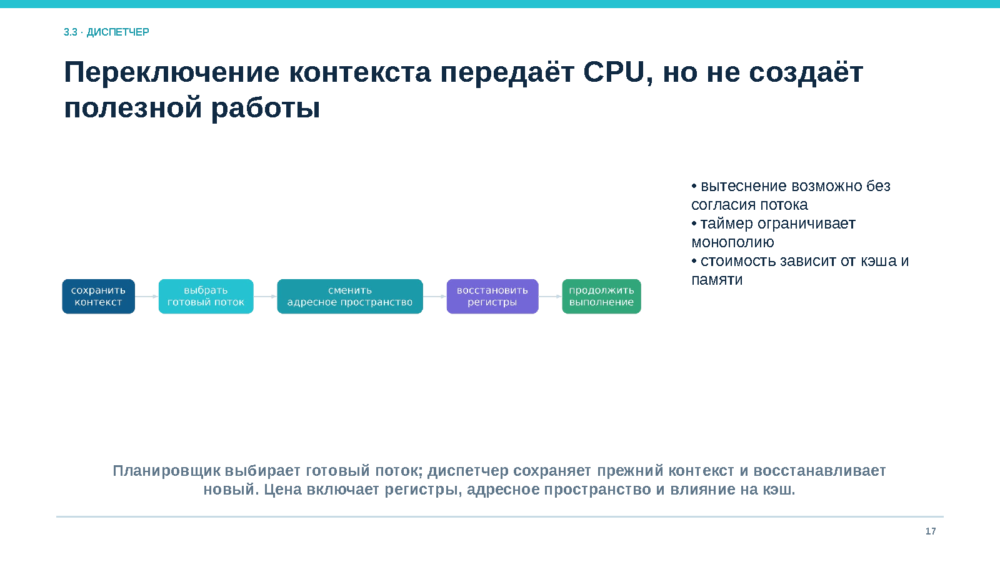

*Рисунок 10. Выбор потока, сохранение контекста и передача процессора*

Решение принимается при блокировке или завершении текущего потока, истечении кванта, появлении более приоритетной задачи или изменении доступности процессора.

Переключение контекста не выполняет полезную работу. Его цена включает сохранение регистров, смену адресного пространства и влияние на кэши и предсказатели. Слишком короткий квант повышает накладные расходы, слишком длинный ухудшает интерактивность.

### 3.2. Критерии качества

| Критерий | Содержание |
|---|---|
| Загрузка CPU | Доля времени полезной занятости процессора |
| Пропускная способность | Число завершённых работ за интервал |
| Время оборота | Интервал от поступления до полного завершения |
| Время ожидания | Время в очереди готовых |
| Время отклика | Задержка до первого наблюдаемого ответа |
| Справедливость | Предотвращение монополизации и голодания |
| Соблюдение сроков | Выполнение до дедлайна |

Среднее значение может скрывать редкие длительные задержки. Поэтому оценивают распределение, квантили, максимальное ожидание и наличие голодания.

### 3.3. FCFS, SJF и SRTF

- **FCFS** обслуживает задачи в порядке поступления. Длинная работа задерживает короткие, создавая эффект конвоя.
- **SJF** выбирает задачу с наименьшей ожидаемой длительностью и улучшает среднее ожидание, но требует оценки будущего CPU burst.
- **SRTF** является вытесняющим вариантом SJF. Новая короткая задача может вытеснить текущую.

SJF и SRTF способны вызвать голодание длинных задач. На практике длительность оценивается по истории и остаётся неопределённой.

### 3.4. Round Robin

Round Robin организует циклическую очередь и выдаёт каждому потоку ограниченный квант.

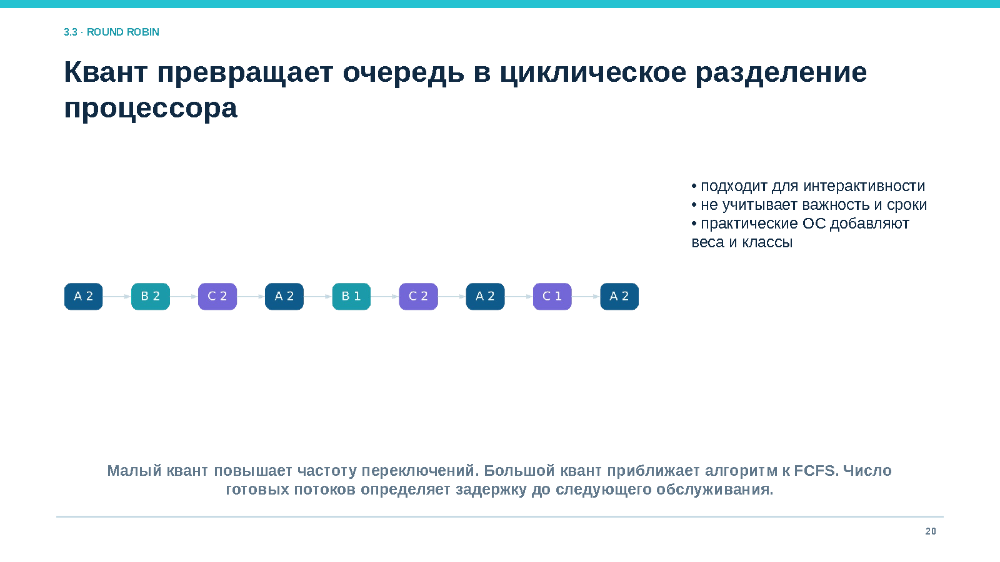

*Рисунок 11. Циклическое распределение CPU между готовыми потоками*

Если поток блокируется раньше, процессор получает следующий. После истечения кванта поток возвращается в конец очереди. Малый квант увеличивает частоту переключений. Большой квант приближает алгоритм к FCFS. При росте числа готовых потоков увеличивается задержка до следующего обслуживания.

### 3.5. Приоритеты, MLFQ и инверсия

Приоритетное планирование выбирает наиболее важный готовый поток. Низкоприоритетная задача может голодать, поэтому применяют **старение**, постепенно повышающее приоритет долго ожидающих задач.

Многоуровневая очередь с обратной связью, MLFQ, адаптируется к поведению. Короткие и часто блокирующиеся задачи получают быстрый отклик, длительные вычисления перемещаются на нижние уровни с более длинными квантами.

**Инверсия приоритетов** возникает, когда высокоприоритетный поток ждёт блокировку, удерживаемую низкоприоритетным, а средние задачи вытесняют владельца ресурса.

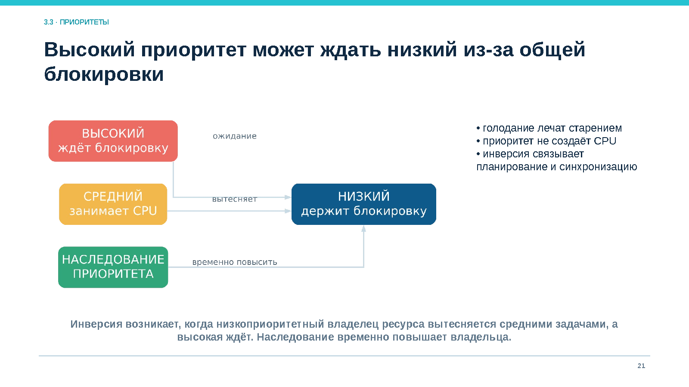

*Рисунок 12. Высокоприоритетный поток ожидает низкоприоритетного владельца блокировки*

Наследование приоритета временно повышает приоритет владельца ресурса, чтобы он быстрее завершил критическую секцию.

### 3.6. Справедливое планирование

Современные планировщики общего назначения распределяют CPU пропорционально весам и учитывают виртуальное время. Поток, получивший меньшую долю, становится более предпочтительным.

Вес или `nice` определяет относительную долю среди конкурентов, но не устраняет перегрузку. Приоритеты дополняют квотами, лимитами и контролем поступления задач.

### 3.7. Многоядерность, аффинность и NUMA

На многоядерной системе планировщик выбирает поток и процессор для его выполнения.

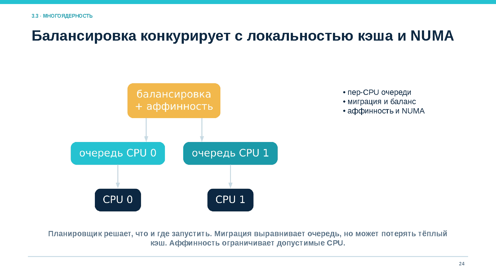

*Рисунок 13. Балансировка нагрузки, аффинность, кэш и NUMA*

Миграция выравнивает очереди, но может потерять тёплый кэш и нарушить локальность памяти NUMA. Аффинность ограничивает допустимые CPU или сохраняет предпочтение к прежнему ядру. Чрезмерное закрепление создаёт узкие места, а чрезмерная миграция увеличивает задержки.

### 3.8. Реальное время

В системах реального времени корректность включает срок получения результата.

- **Жёсткое реальное время:** пропуск дедлайна недопустим.
- **Мягкое реальное время:** редкие пропуски ухудшают качество, но не разрушают систему.

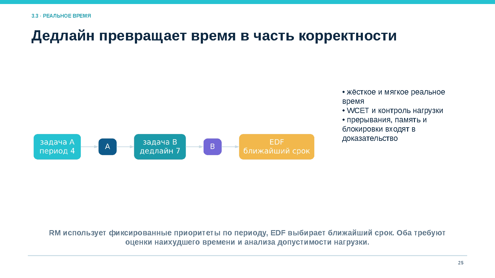

*Рисунок 14. Периодические задачи, блокировки и дедлайн*

Rate Monotonic назначает более высокий фиксированный приоритет задаче с меньшим периодом. Earliest Deadline First динамически выбирает ближайший дедлайн. Оба метода требуют оценки наихудшего времени выполнения, WCET, и проверки допустимости нагрузки.

Высокий приоритет не создаёт гарантию сам по себе. Задержку могут вызвать страничное исключение, прерывание, драйвер или блокировка.

## 4. Контекст безопасности процесса

Ядро принимает решение по фактическому контексту, а не только по имени программы.

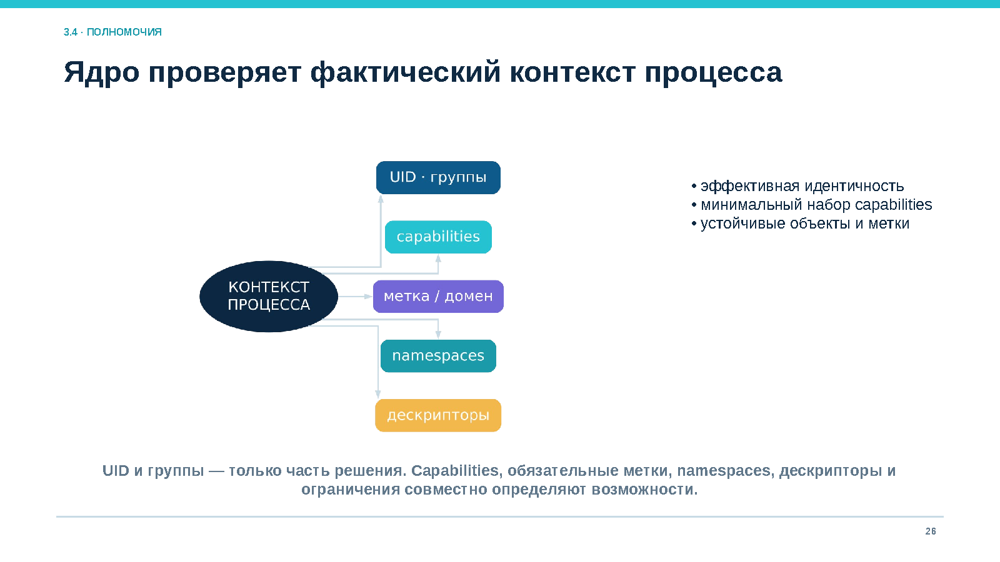

*Рисунок 15. Идентичность, capabilities, метки, namespaces и дескрипторы*

Контекст включает:

- реальные, эффективные и сохранённые UID и GID;
- дополнительные группы;
- capabilities;
- обязательные метки и домены;
- пространства имён;
- cgroups, лимиты и квоты;
- открытые дескрипторы;
- доступные сокеты и IPC-интерфейсы.

Итоговое решение является пересечением применимых механизмов. Корректный UID не отменяет отказ обязательной политики. Одна capability может давать сильное полномочие и требует отдельного обоснования.

### 4.1. Наследование и `exec()`

Потомок наследует учётный контекст, окружение, каталог, маску, ограничения и открытые дескрипторы. `exec()` заменяет программу, но часть контекста сохраняется. Опасность создают:

- лишние дескрипторы без `close-on-exec`;
- поиск программы через недоверенный `PATH`;
- подменённый рабочий каталог;
- настройки динамического загрузчика;
- сохранённые идентификаторы или capabilities.

Привилегированная служба использует абсолютные пути, очищенное окружение и минимальный набор наследуемых объектов.

### 4.2. Независимые слои изоляции

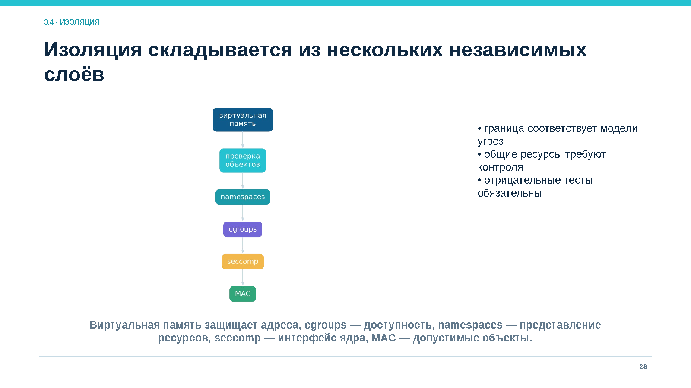

*Рисунок 16. Виртуальная память, cgroups, namespaces, seccomp и MAC*

| Механизм | Что ограничивает |
|---|---|
| Виртуальная память | Доступ к адресам других процессов |
| cgroups | Потребление CPU, памяти и ввода-вывода |
| namespaces | Представление PID, сети, монтирования и других ресурсов |
| seccomp | Доступный процессу интерфейс системных вызовов |
| MAC | Допустимые объекты и переходы между доменами |

Ни один слой не равен отдельной виртуальной машине. Процессы продолжают разделять ядро, аппаратные кэши, время и часть глобальных подсистем. Выбранная граница должна соответствовать модели угроз.

### 4.3. Понижение привилегий

Службе повышенные права часто нужны только на этапе инициализации. После открытия защищённого порта, чтения ключа или настройки устройства она должна:

1. перейти к отдельной учётной записи;
2. сократить группы и capabilities;
3. закрыть лишние дескрипторы;
4. ограничить файловую и сетевую среду;
5. установить фильтр системных вызовов;
6. проверить невозможность вернуть полномочия.

Понижение UID недостаточно, если рабочая часть сохранила привилегированный сокет, capability, дескриптор ключа или управляющий интерфейс.

### 4.4. Сигналы, отладка и IPC

Сигналы изменяют управление процессом и могут завершать его. `ptrace` способен читать и изменять память и регистры. IPC пересекает процессную границу и иногда переносит дескрипторы.

Право подключиться к сокету не означает право выполнить любую команду. Получатель должен аутентифицировать сторону, проверить структуру и размер сообщения, заново авторизовать операцию и ограничить частоту запросов.

### 4.5. Наблюдаемость

Для расследования важны PID, PPID, владелец, хэш образа, время запуска, открытые объекты, сетевые соединения, пространства имён и ограничения. Имя процесса легко изменить, поэтому его недостаточно.

Журналируют создание и завершение процессов, `exec()`, смену идентичности, отказы доступа и аномальные дочерние процессы. Командная строка и окружение могут содержать секреты, поэтому сбор ограничивают необходимыми полями и сроками хранения.

## 5. Прикладной разбор: безопасная сетевая служба

Служба принимает соединения на защищённом порту, читает конфигурацию и ключ, затем обрабатывает недоверенные запросы. Если весь код постоянно работает с широкими правами в одном многопоточном процессе, ошибка парсера получает доступ ко всем секретам и системным объектам.

### 5.1. Разделение ролей

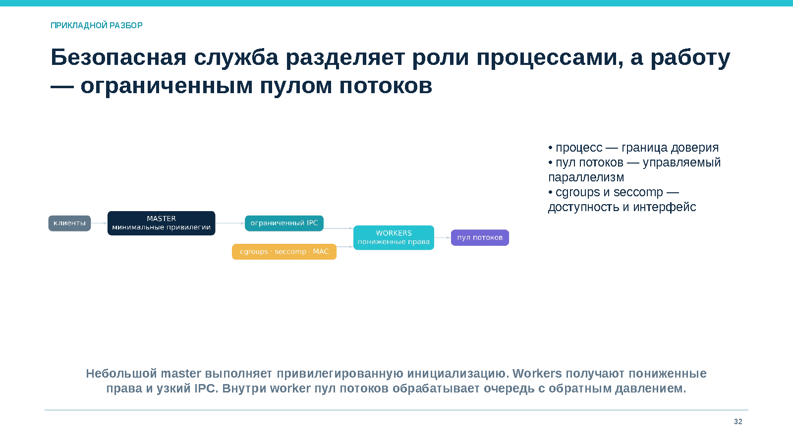

*Рисунок 17. Master-процесс, непривилегированные workers и ограниченный пул потоков*

Рекомендуемая модель:

1. небольшой master-процесс выполняет привилегированную инициализацию;
2. master открывает необходимые объекты и запускает workers;
3. workers получают отдельную учётную запись и минимальные права;
4. связь с master идёт через узкий структурированный IPC;
5. внутри worker ограниченный пул потоков обрабатывает очередь;
6. cgroups ограничивают CPU и память;
7. seccomp сокращает интерфейс ядра;
8. обратное давление ограничивает поступление новых запросов.

Процессная граница локализует отказ и разделяет полномочия. Потоки внутри worker обеспечивают параллелизм для тесно связанных задач.

### 5.2. Планирование и доступность

Пул потоков имеет верхнюю границу. Очередь запросов также ограничена. При перегрузке служба отклоняет новые запросы или замедляет приём, вместо бесконтрольного создания потоков.

При аварии worker мастер закрывает связанные каналы, регистрирует событие и создаёт новый процесс с чистым контекстом. Повторяющиеся сбои переводят службу в ограниченный режим, предотвращая бесконечный цикл перезапуска.

### 5.3. Проверка фактической изоляции

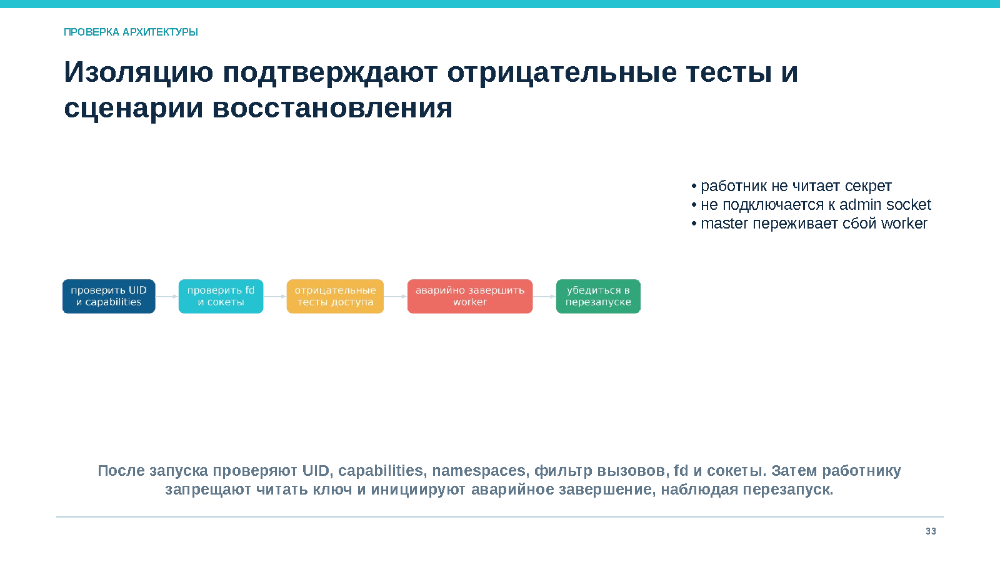

*Рисунок 18. Проверка полномочий worker и перезапуска после сбоя*

После запуска проверяют:

- UID, группы и capabilities каждого процесса;
- namespaces, cgroups и seccomp;
- открытые файлы, дескрипторы и сокеты;
- доступ к ключам и конфигурации;
- наследование при `exec()`;
- очистку окружения и фиксированный путь программы.

Отрицательные тесты должны подтвердить, что worker не читает ключ, не изменяет конфигурацию, не подключается к административному сокету и не создаёт запрещённое соединение. Сценарий восстановления проверяет аварийное завершение worker и наблюдаемый перезапуск.

## Основные выводы

1. Процесс является контейнером ресурсов и полномочий, поток — единицей выполнения.
2. PCB и потоковый контекст позволяют приостанавливать и продолжать вычисление.
3. Готовность и ожидание различаются наличием внешнего события, а не наличием кода или памяти.
4. Потоки ускоряют обмен через общую память, но разделяют область отказа.
5. Процессная граница лучше подходит для разных полномочий и недоверенного кода.
6. Планировщик распределяет CPU по конфликтующим критериям и не устраняет перегрузку.
7. Алгоритмы планирования различаются откликом, ожиданием, справедливостью и гарантиями сроков.
8. Многоядерное планирование учитывает кэш, NUMA, миграцию и аффинность.
9. Контекст безопасности включает идентификаторы, capabilities, метки, пространства имён, лимиты и наследуемые объекты.
10. Надёжная служба сочетает процессные границы, ограниченный пул потоков, квоты, минимальные права и наблюдаемое восстановление.

## Вопросы для самоконтроля

1. Чем программа отличается от процесса?
2. Какие сведения входят в PCB, а какие относятся к потоку?
3. Как копирование при записи ускоряет `fork()`?
4. Чем состояния «готов» и «ожидает» различаются с точки зрения CPU?
5. Почему завершённый процесс может оставаться зомби?
6. Какие ресурсы разделяют потоки одного процесса?
7. Почему поток не подходит как граница для недоверенного кода?
8. Когда пул потоков лучше модели «поток на запрос»?
9. Что входит в стоимость переключения контекста?
10. Чем время отклика отличается от времени оборота?
11. Почему FCFS создаёт эффект конвоя?
12. Как размер кванта влияет на Round Robin?
13. Что такое голодание и старение?
14. Как возникает инверсия приоритетов?
15. Почему повышение приоритета не устраняет перегрузку?
16. Какие компромиссы создаёт миграция между ядрами?
17. Чем жёсткое реальное время отличается от мягкого?
18. Какие атрибуты формируют контекст безопасности процесса?
19. Какие полномочия могут пережить `exec()`?
20. Почему понижение UID недостаточно без проверки capabilities и дескрипторов?
21. Какие риски создают сигналы, `ptrace` и IPC?
22. Какими тестами подтверждается изоляция worker-процесса?

## Практические задания

### Задание 1. Жизненный цикл программы

Для сценария «оболочка запускает программу, программа читает файл и завершается» укажите:

- наследуемые объекты и атрибуты;
- изменения при `exec()`;
- состояния основного потока;
- причину и завершение ожидания;
- ресурсы, освобождаемые при `exit()`;
- процесс, который получает статус завершения.

### Задание 2. Сравнение расписаний

Три процесса поступают одновременно: A — 8 мс CPU, B — 3 мс, C — 5 мс. Постройте диаграммы FCFS, SJF и Round Robin с квантом 2 мс. Для каждого алгоритма вычислите время ожидания и оборота, затем объясните получившиеся компромиссы.

### Задание 3. Выбор границы

Выберите процессы, потоки или комбинированную модель для следующих случаев:

- парсер недоверенного архива и основной интерфейс приложения;
- вычислительные этапы, совместно читающие неизменяемый массив;
- сторонний модуль расширения и служба с секретным ключом;
- сетевой сервер с тысячами соединений и тяжёлыми вычислениями.

Обоснуйте выбор по стоимости обмена, области отказа, полномочиям и восстановлению.

## Самостоятельная работа

Выберите реальный системный сервис Linux и подготовьте разбор объёмом 3–4 страницы:

- дерево процессов и потоков;
- владельцы и состояния;
- открытые сетевые интерфейсы;
- модель создания и параллелизма;
- граница восстановления;
- минимальный набор полномочий;
- три отрицательных теста изоляции.

## Краткий глоссарий

| Термин | Определение |
|---|---|
| Процесс | Контейнер выполнения, ресурсов и контекста безопасности |
| Поток | Планируемая последовательность выполнения с собственными регистрами и стеком |
| PCB | Структуры ядра, описывающие процесс, ресурсы и состояние |
| PID / PPID | Идентификатор процесса и его родителя |
| Контекст | Состояние, необходимое для продолжения выполнения |
| Диспетчер | Механизм передачи CPU выбранному потоку |
| Планировщик | Компонент, выбирающий готовый поток и процессор |
| Вытеснение | Принудительный перевод выполняющегося потока в готовое состояние |
| Квант | Максимальный непрерывный интервал CPU в квантовом алгоритме |
| CPU burst | Интервал выполнения на CPU между ожиданиями или вытеснениями |
| Время отклика | Задержка до первого наблюдаемого ответа |
| Время оборота | Интервал от поступления задачи до завершения |
| Голодание | Неограниченно долгое ожидание при обслуживании других задач |
| Старение | Повышение приоритета долго ожидающей задачи |
| Аффинность | Ограничение или предпочтение определённых CPU |
| Зомби | Завершённый процесс, статус которого ещё не получил родитель |
| Копирование при записи | Совместное использование страниц до первой записи с последующим копированием |

## Литература

1. Востокин С. В. *Операционные системы: учебное пособие*. Самара: Самарский университет, 2018.
2. Таненбаум Э., Бос Х. *Современные операционные системы*. 4-е изд. Санкт-Петербург: Питер, 2015.
3. Linux man-pages: `fork(2)`, `clone(2)`, `execve(2)`, `wait(2)`, `sched(7)`, `capabilities(7)`, `proc(5)`, `namespaces(7)`, `cgroups(7)`.
4. Документация ядра Linux для используемой версии: scheduler, process management, cgroups и namespaces.
5. Документация Astra Linux Special Edition по управлению пользователями, процессами и средствам защиты.

> Реализация планировщика, структура контекста и состав защитных механизмов зависят от версии ОС и ядра. Перед практической настройкой следует сверяться с эксплуатационной документацией используемой версии.

