# Лекция 3. Процессы, потоки и управление процессами

> Курс «Операционные системы»  
> Специальность 10.05.01 «Компьютерная безопасность»  
> Продолжительность: 2 академических часа

Операционная система превращает программу в управляемое, планируемое и изолированное выполнение. Для этого она создаёт процесс, формирует один или несколько потоков, сохраняет их контекст, управляет состояниями и распределяет процессорное время.

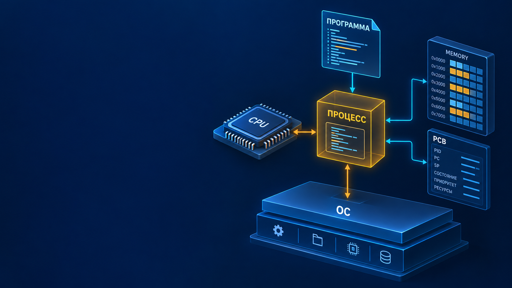

*Рисунок 1. Связь программы, процесса, потока, процессора и ядра ОС*

## Содержание

- [Паспорт лекции](#паспорт-лекции)
- [Цель и планируемые результаты](#цель-и-планируемые-результаты)
- [Процесс как контейнер ресурсов](#31-процесс-как-контейнер-ресурсов)
- [Потоки и совместное использование](#32-потоки-и-совместное-использование)
- [Планирование процессора](#33-планирование-процессора)
- [Контекст безопасности процесса](#34-контекст-безопасности-процесса)
- [Безопасный жизненный цикл сетевой службы](#прикладной-разбор-безопасный-жизненный-цикл-сетевой-службы)
- [Итоги лекции](#итоги-лекции)
- [Вопросы и задания](#вопросы-для-самоконтроля)
- [Глоссарий](#глоссарий)
- [Литература](#рекомендуемая-литература)

# Паспорт лекции

| **Параметр**          | **Содержание**                                                                                                                                    |
|-----------------------|---------------------------------------------------------------------------------------------------------------------------------------------------|
| **Тема**              | Процессы, потоки и планирование                                                                                                                   |
| **Место в курсе**     | Третья лекция; развивает понятие системного контекста и подготавливает изучение синхронизации, IPC и управления памятью                           |
| **Продолжительность** | 2 академических часа (90 минут)                                                                                                                   |
| **Основной вопрос**   | Как ОС представляет выполняемую программу, распределяет процессор и сохраняет границы ресурсов и полномочий?                                      |
| **Результат**         | Обучающийся объясняет жизненный цикл процесса, различает процессы и потоки, сравнивает алгоритмы планирования и анализирует контекст безопасности |

# Цель и планируемые результаты

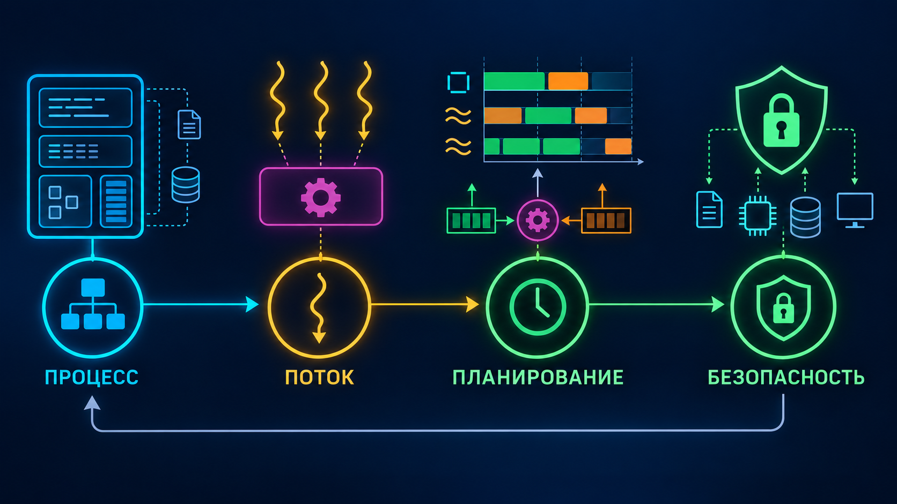

*Рисунок 2. Карта результатов освоения лекции*

Цель лекции — разобрать модель выполнения программ, переключение контекста, алгоритмы планирования и механизмы изоляции процессов.

- различать программу, процесс и поток, а также состояние процесса и потоковый контекст;

- описывать адресное пространство, PCB, дескрипторы и жизненный цикл ресурсов;

- объяснять состояния и переходы, создание, exec, завершение, зомби и осиротевшие процессы;

- описывать этапы создания процесса, иерархию родительских и дочерних процессов, очереди дескрипторов и приостановленные состояния;

- обосновывать выбор между процессами, потоками и комбинированной архитектурой;

- характеризовать стоимость переключения контекста и критерии качества планирования;

- сравнивать FCFS, SJF/SRTF, Round Robin, приоритетные и многоуровневые схемы;

- объяснять многоядерную балансировку, аффинность и основы реального времени;

- анализировать идентичность, наследование, понижение прав и фактическую изоляцию процесса.

# План лекции

1. Процесс как контейнер ресурсов.

2. Потоки и совместное использование.

3. Планирование процессора.

4. Контекст безопасности процесса.

5. Прикладной разбор безопасного жизненного цикла сетевой службы.

# Рекомендуемое распределение времени

| **Этап**         | **Содержание**                                         | **Время** |
|------------------|--------------------------------------------------------|-----------|
| **Вход в тему**  | Программа, процесс и поток как разные сущности         | 7 мин     |
| **Процесс**      | PCB, память, ресурсы, состояния и жизненный цикл       | 28 мин    |
| **Потоки**       | Совместное использование, модели, границы доверия      | 13 мин    |
| **Планирование** | Критерии, алгоритмы, многоядерность и реальное время   | 22 мин    |
| **Безопасность** | Контекст, наследование, понижение прав и наблюдаемость | 13 мин    |
| **Закрепление**  | Архитектура сетевой службы и контрольный вопрос        | 7 мин     |

| **Проблемный вопрос.** Если два процесса запускают один и тот же исполняемый файл, почему они не видят переменные друг друга — и почему два потока одного процесса, наоборот, могут взаимно повредить общие данные? |
|---------------------------------------------------------------------------------------------------------------------------------------------------------------------------------------------------------------------|

# Карта понятий лекции

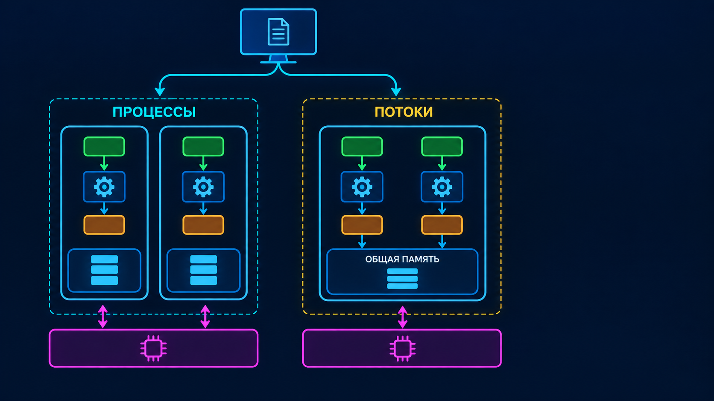

_Рисунок 3. Изоляция процессов и совместная память потоков_

| **Вопрос**                                      | **Понятие**           | **Что проверяем**                                 |
|-------------------------------------------------|-----------------------|---------------------------------------------------|
| **Что выполняется?**                            | Процесс и поток       | Где находятся код, регистры, стек и общие ресурсы |
| **Почему выполнение продолжается после паузы?** | Контекст              | Какие данные сохраняет ядро                       |
| **Почему поток не работает сейчас?**            | Состояние             | Готовность, ожидание, вытеснение и событие        |
| **Кто получает процессор?**                     | Планировщик           | Отклик, ожидание, справедливость и сроки          |
| **От чьего имени выполняется операция?**        | Контекст безопасности | UID, группы, capabilities, метки и дескрипторы    |
| **Где проходит граница ущерба?**                | Процессная изоляция   | Память, IPC, лимиты и восстановление              |

# Базовая модель переходов состояний

| **Переход**               | **Причина**             | **Практический смысл**                    |
|---------------------------|-------------------------|-------------------------------------------|
| **создание → готов**      | Контекст сформирован    | Поток может конкурировать за процессор    |
| **готов → выполнение**    | Решение планировщика    | Диспетчер восстанавливает контекст        |
| **выполнение → ожидание** | Блокирующая операция    | Поток не потребляет CPU до события        |
| **ожидание → готов**      | Событие произошло       | Поток возвращается в очередь              |
| **выполнение → готов**    | Вытеснение или квант    | Процессор передаётся другой задаче        |
| **выполнение → завершён** | exit, ошибка или сигнал | Ресурсы освобождаются, статус сохраняется |

# 3.1. Процесс как контейнер ресурсов

Процесс — не просто выполняемый код. Это управляемый операционной системой контейнер, который связывает поток исполнения, адресное пространство, ресурсы, идентификаторы и контекст безопасности.

## 3.1.1. Программа и процесс

В модели Таненбаума процесс удобно рассматривать как последовательную программу, которой предоставлен собственный виртуальный процессор \[1\]. Физический процессор периодически переключается между готовыми потоками, однако каждый из них продолжает выполнение с той инструкции и с теми значениями регистров, которые ядро сохранило при предыдущем вытеснении. Такая абстракция скрывает чередование и позволяет программе вести себя так, как будто процессор принадлежит ей одной.

Параллелизм следует отличать от псевдопараллелизма. На одном ядре несколько потоков продвигаются за счёт быстрого чередования. На нескольких ядрах часть потоков действительно выполняется одновременно. С точки зрения корректности программы в обоих случаях нельзя рассчитывать на определённый порядок независимых операций: планировщик вправе изменить чередование после прерывания, системного вызова или пробуждения другого потока.

| **Сущность** | **Что содержит**                                                | **Как существует**                                  |
|--------------|-----------------------------------------------------------------|-----------------------------------------------------|
| Программа    | Код и статические данные в файле                                | Пассивный объект; не имеет состояния выполнения     |
| Процесс      | Адресное пространство, ресурсы, полномочия и минимум один поток | Объект ядра с идентификатором и жизненным циклом    |
| Поток        | Счётчик команд, регистры, стек и состояние планирования         | Единица, которую планировщик допускает к процессору |

*Таблица 1. Различие программы, процесса и потока*

Программа представляет собой пассивное описание вычисления: исполняемый файл, библиотеки, данные и метаданные. Процесс — активный экземпляр программы, которому операционная система назначила виртуальное адресное пространство, хотя бы один поток, набор открытых объектов и состояние выполнения. Один исполняемый файл может быть запущен многократно, и каждый запуск образует самостоятельный процесс со своими данными и идентификатором.

Различие хорошо видно на примере текстового редактора. Файл программы на диске один, но два запущенных экземпляра имеют разные окна, буферы, текущие каталоги, открытые документы и права. Изменение памяти одного экземпляра не должно изменять память другого. Эту независимость обеспечивает не сама программа, а механизмы ядра: таблицы страниц, таблицы дескрипторов, планировщик и контроль доступа.

Процесс удобно рассматривать сразу в трёх ролях. Во-первых, это единица владения ресурсами. Во-вторых, это субъект, от имени которого ядро проверяет доступ. В-третьих, это объект управления: его можно создать, приостановить, завершить, наблюдать и ограничить. В некоторых ОС непосредственно планируется поток, однако процесс остаётся контейнером, задающим границы ресурсов и доверия.

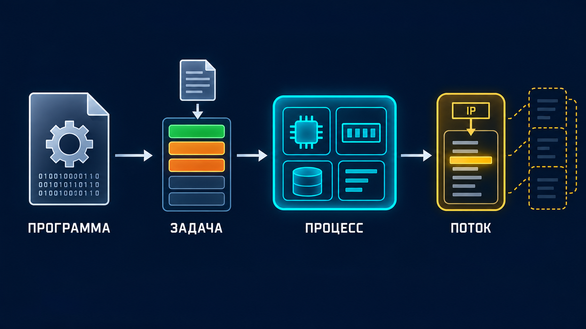

*Рисунок 4. Программа, задача, процесс и поток*

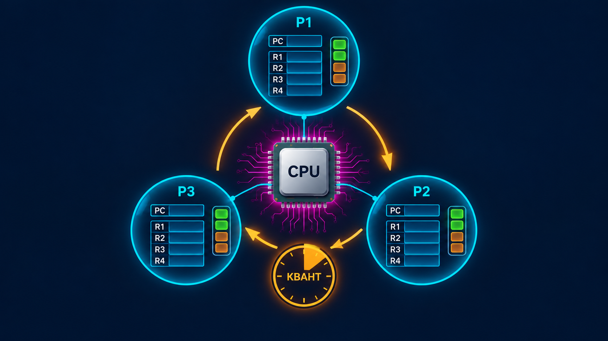

*Рисунок 5. Виртуальный процессор и псевдопараллелизм*

## 3.1.2. Дескриптор процесса и сохраняемый контекст

Столлингс разделяет информацию о процессе на идентификацию, состояние процессора и управляющую информацию \[3\]. Такое разделение полезно при анализе PCB: часть полей отвечает на вопрос «кто это», часть позволяет продолжить выполнение, а часть связывает процесс с памятью, ресурсами, очередями и политиками ядра.

| **Группа полей PCB** | **Примеры**                                        | **Назначение**                             |
|----------------------|----------------------------------------------------|--------------------------------------------|
| Идентификация        | PID, PPID, идентификаторы пользователя и группы    | Поиск процесса, аудит, проверка полномочий |
| Состояние CPU        | PC, SP, регистры общего назначения, флаги          | Точное продолжение прерванного потока      |
| Планирование         | Состояние, приоритет, класс, ссылка на очередь     | Выбор следующего потока и учёт времени     |
| Память               | Корень таблиц страниц, области отображения, лимиты | Активация адресного пространства и защита  |
| Ресурсы              | Таблица дескрипторов, текущий каталог, сигналы     | Доступ к объектам ядра и внешней среде     |
| Учёт                 | CPU time, время запуска, статистика ввода-вывода   | Мониторинг, квоты и расследование          |

*Таблица 2. Логическая структура дескриптора процесса*

Ядро хранит сведения о процессе в наборе внутренних структур, логически соответствующих PCB — блоку управления процессом. В них находятся PID и родственные идентификаторы, состояние, параметры планирования, ссылки на адресное пространство, открытые файлы, обработчики сигналов, учётные данные, статистика и ограничения. Реальная реализация может распределять эти сведения по нескольким структурам, но их назначение едино: однозначно описывать процесс и связывать его с ресурсами.

Контекст выполнения потока включает счётчик команд, регистры общего назначения, указатели стеков, флаги процессора, векторные регистры и служебное состояние архитектуры. Когда выполнение приостанавливается, ОС сохраняет достаточно данных, чтобы позднее продолжить его так, будто паузы не было. Адресное пространство и открытые объекты обычно не копируются при каждом переключении — ядро сохраняет ссылки и активирует нужный контекст.

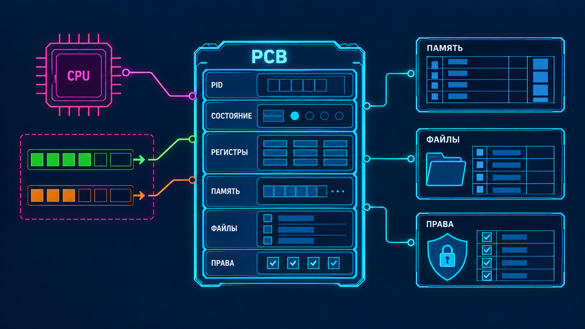

*Рисунок 8. PCB как связующее звено подсистем операционной системы*

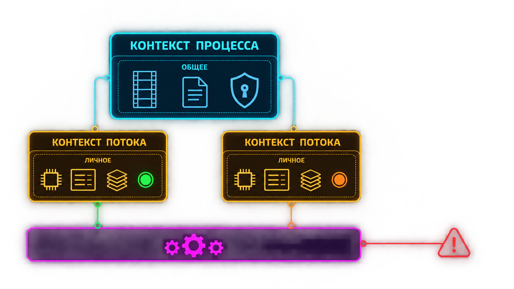

*Рисунок 9. Общий контекст процесса и личный контекст потока*

Важно разделять состояние процесса и состояние его потоков. У каждого потока собственные регистры, стек и позиция выполнения. Общие для процесса данные — виртуальная память, большинство дескрипторов, текущий каталог и учётные атрибуты — доступны всем его потокам. Такое разделение объясняет и эффективность многопоточности, и масштаб последствий ошибки: повреждение общей памяти одним потоком затрагивает весь процесс.

## 3.1.3. Виртуальное адресное пространство

Типичное адресное пространство содержит код, неизменяемые данные, глобальные переменные, динамическую область, стеки потоков, отображённые файлы и библиотеки. Ядро задаёт отображение виртуальных страниц на физическую память и права чтения, записи и исполнения. Одинаковые виртуальные адреса в разных процессах обычно соответствуют разным физическим страницам.

Изоляция памяти позволяет одному процессу аварийно завершиться, не разрушая данные соседнего. Однако отображения могут быть общими намеренно: разделяемые библиотеки экономят память, а совместная память ускоряет IPC. Следовательно, граница процесса — не абсолютная герметичность, а набор контролируемых отображений и интерфейсов. Каждое общее отображение должно иметь понятного владельца и режим доступа.

*Рисунок 7. Типовая структура виртуального адресного пространства*

При создании процесса ОС широко использует копирование при записи. Родитель и потомок первоначально разделяют физические страницы только для чтения. При первой попытке записи возникает исключение, и ядро создаёт частную копию страницы. Это делает создание процесса быстрым, но требует помнить, что логическая независимость появляется сразу, даже если физическое копирование откладывается.

## 3.1.4. Ресурсы процесса

Таблица файловых дескрипторов связывает небольшие целые числа с объектами ядра: файлами, каталогами, каналами, сокетами, таймерами и другими ресурсами. Дескриптор не является адресом объекта; он действует только в контексте конкретного процесса. Для каждого открытого объекта ядро хранит режим, позицию, флаги и счётчики ссылок.

К ресурсам также относятся текущий и корневой каталоги, пространство имён, лимиты, маска создания файлов, обработчики сигналов и статистика времени. Многие атрибуты наследуются потомком, поэтому создание процесса переносит не только код, но и часть окружения. Непреднамеренное наследование дескриптора или привилегии способно нарушить изоляцию.

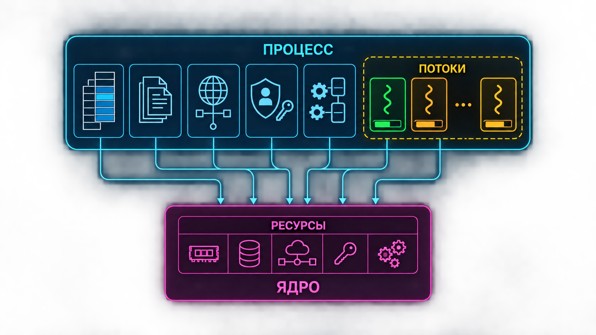

*Рисунок 6. Процесс как контейнер памяти, ресурсов и потоков*

Жизненный цикл ресурса определяется ссылками. Закрытие дескриптора уменьшает счётчик; окончательное освобождение происходит, когда ссылок не осталось. Такая модель необходима при наследовании и передаче дескрипторов, но усложняет диагностику утечек. Процесс может удерживать удалённый файл, сокет или устройство дольше, чем ожидает администратор.

## 3.1.5. Состояния и переходы

Базовая модель включает состояния создания, готовности, выполнения, ожидания и завершения. Готовый процесс имеет всё необходимое, кроме процессора. Выполняющийся занимает ядро процессора. Ожидающий не может продолжить работу до события: завершения ввода-вывода, появления данных, освобождения блокировки или истечения таймера.

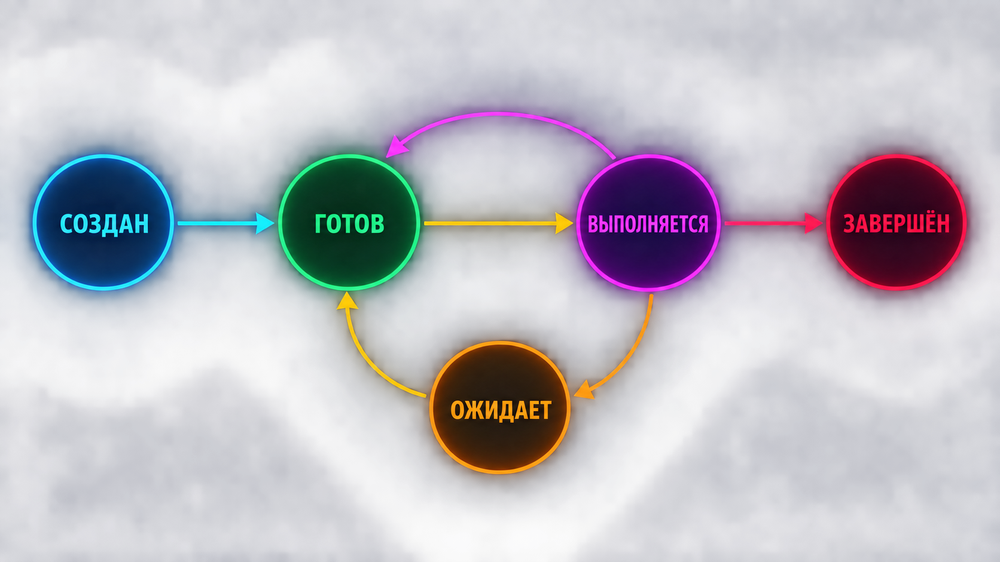

*Рисунок 16. Базовые состояния процесса*

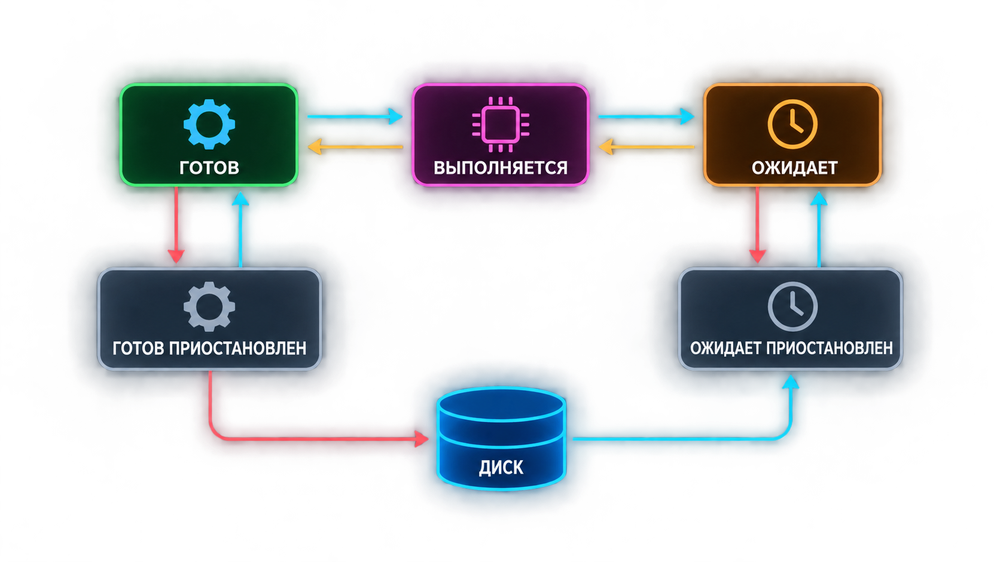

*Рисунок 17. Расширенная модель состояний с приостановкой*

Переход из готовности в выполнение выполняет диспетчер. Из выполнения в готовность поток переводится при вытеснении, окончании кванта или появлении более приоритетной задачи. Из выполнения в ожидание он переходит добровольно, запросив операцию, которую нельзя завершить немедленно. После события ожидающий поток становится готовым, но не обязательно запускается сразу.

Состояния важны для диагностики. Большая очередь готовых потоков указывает на конкуренцию за процессор. Много потоков в непрерываемом ожидании часто связано с вводом-выводом или драйвером. Спящий процесс не обязательно неисправен: событийная служба большую часть времени должна ждать. Оценивать состояние следует вместе с длительностью, причиной ожидания и нагрузкой системы.

## 3.1.6. Создание процесса, замена образа и завершение

Процесс возникает в четырёх типичных ситуациях: при инициализации системы, по запросу уже работающего процесса, по действию пользователя или при допуске пакетного задания \[1; 5\]. Во всех случаях ядро должно создать запись процесса, подготовить адресное пространство, связать ресурсы и сформировать первый поток. Различается источник запроса и набор наследуемых объектов.

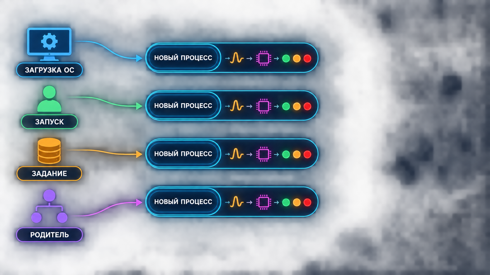

*Рисунок 10. Основные причины создания нового процесса*

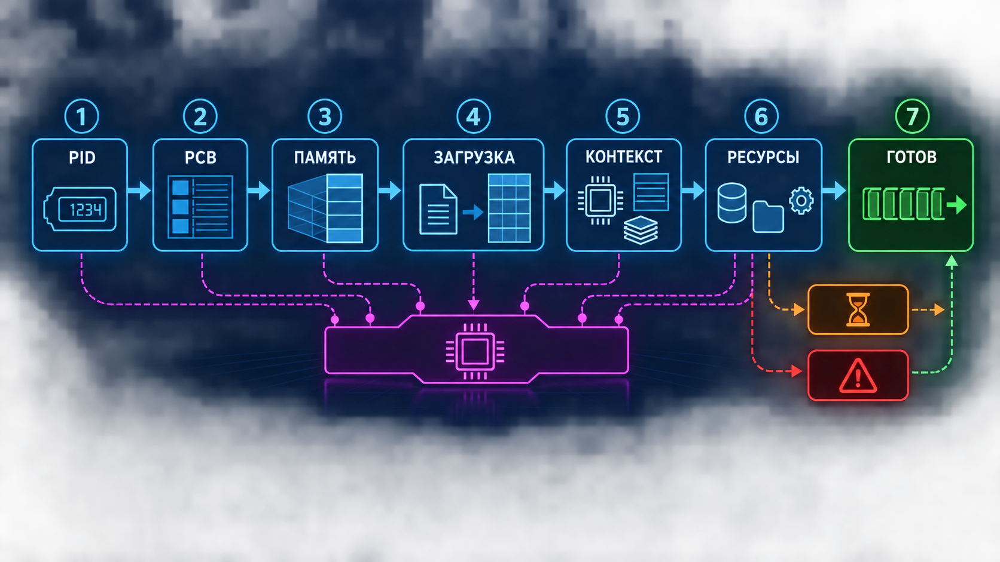

*Рисунок 11. Этапы подготовки процесса к выполнению*

В UNIX-подобной модели fork создаёт дочерний процесс, логически копирующий состояние родителя. Благодаря copy-on-write физическое копирование всех страниц обычно откладывается. Затем execve заменяет пользовательский образ процесса, сохраняя его идентичность как объекта ядра. В Windows CreateProcess объединяет создание объекта процесса и запуск нового образа. Эти модели различаются интерфейсом, но решают одну задачу: сформировать контекст, который можно безопасно поместить в очередь готовых.

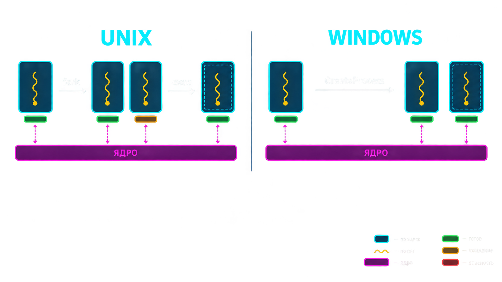

*Рисунок 12. Создание процесса в UNIX-подобных системах и Windows*

Завершение бывает нормальным, вызванным обработанной ошибкой, аварийным либо инициированным другим субъектом. После завершения ядро освобождает память и большинство ресурсов, но некоторое время может хранить идентификатор и код завершения. В UNIX завершившийся потомок остаётся зомби до вызова wait родителем. Осиротевший процесс, напротив, продолжает выполнение и передаётся системному процессу-посреднику для последующего сбора статуса.

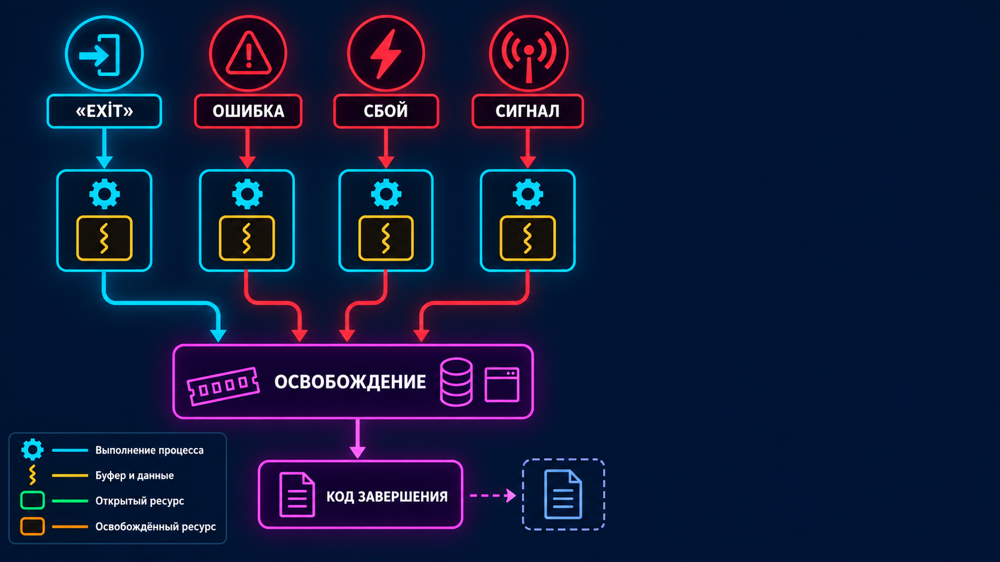

*Рисунок 14. Варианты завершения процесса и освобождение ресурсов*

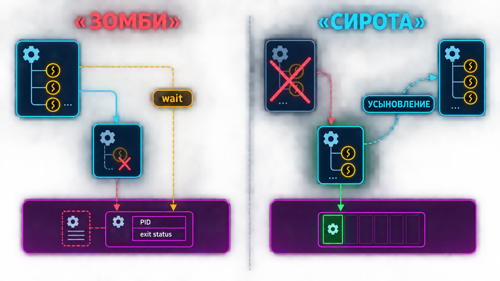

*Рисунок 15. Зомби и осиротевшие процессы*

| **Операция** | **Меняется**                                   | **Обычно сохраняется**                                                               | **Риск ошибки**                               |
|--------------|------------------------------------------------|--------------------------------------------------------------------------------------|-----------------------------------------------|
| fork         | Создаётся новый объект процесса                | Содержимое памяти логически совпадает; часть дескрипторов указывает на те же объекты | Неучтённое наследование файлов и каналов      |
| exec         | Код, данные, стек и точки входа                | PID и разрешённые к наследованию дескрипторы                                         | Секретный дескриптор переживает замену образа |
| exit         | Выполнение прекращается, ресурсы освобождаются | Статус завершения до wait                                                            | Накопление зомби                              |
| wait         | Родитель получает статус потомка               | Остальные процессы продолжают работу                                                 | Блокировка при неверной организации ожидания  |

*Таблица 3. Семантика основных операций жизненного цикла*

Создание процесса в других ОС может объединять выбор программы, формирование адресного пространства и запуск первого потока в одну операцию. Независимо от интерфейса ядро должно назначить идентификаторы, контекст безопасности, ресурсы и начальное состояние, затем поместить поток в очередь готовых. Ошибка на промежуточном этапе требует полного отката частично созданных объектов.

При завершении освобождаются адресное пространство и ресурсы, но краткая запись о результате может сохраняться до получения статуса родителем. В Unix такой завершённый, но не собранный процесс называют зомби. Осиротевший работающий процесс передаётся системному родителю. Эти состояния не являются вредоносными сами по себе, но массовое накопление зомби указывает на ошибку управления жизненным циклом.

| **Ключевой вывод.** Процесс объединяет выполняемый код, память, ресурсы и полномочия. Его корректное понимание требует различать потоковый контекст, общие объекты процесса и переходы жизненного цикла. |
|----------------------------------------------------------------------------------------------------------------------------------------------------------------------------------------------------------|

## 3.1.7. Этапы создания процесса и иерархия

Создание процесса начинается не с выполнения первой инструкции, а с подготовки управляемого объекта ядра. ОС назначает идентификатор, формирует PCB и потоковый контекст, создаёт или подключает адресное пространство, инициализирует таблицы ресурсов и атрибуты безопасности. Затем первый поток получает начальное состояние и попадает в очередь готовых. До этого момента процесс не может конкурировать за процессор.

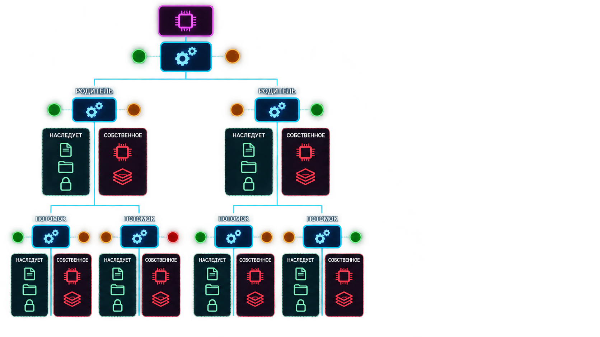

*Рисунок 13. Иерархия процессов и наследование атрибутов*

Практически создание включает четыре группы действий: регистрацию процесса в системных структурах, выделение памяти и объектов ядра, наследование или явную настройку окружения, а также подготовку первого потока. Если любой шаг завершается ошибкой, ядро должно отменить уже выполненные действия и освободить частично выделенные ресурсы.

Процессы образуют отношения происхождения. Родитель может создать потомка, передать ему часть окружения и позднее получить код завершения. Однако иерархия происхождения не равна иерархии полномочий: потомок не обязан иметь больше прав, а безопасная архитектура обычно сокращает наследуемые возможности. Поведение потомка после завершения родителя зависит от модели ОС и механизмов надзора.

## 3.1.8. Очереди дескрипторов и операции управления

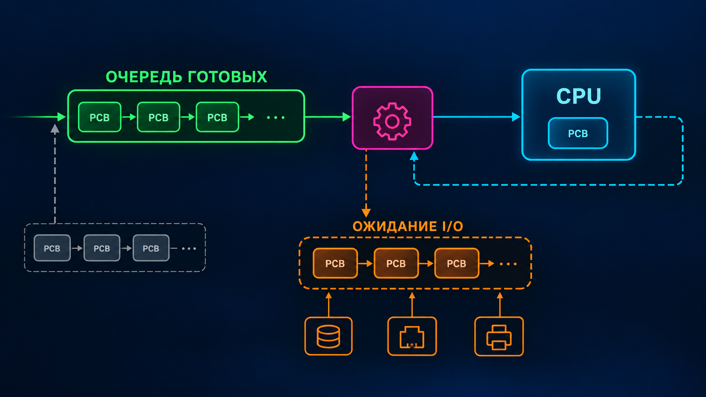

*Рисунок 18. Очереди дескрипторов процессов и потоков*

Планировщик работает не с абстрактными названиями программ, а с дескрипторами готовых потоков. Ядро объединяет их в очереди и другие структуры поиска. Отдельные очереди могут соответствовать процессорам, классам планирования, уровням приоритета и причинам ожидания. Для ввода-вывода и синхронизации обычно нужны разные списки ожидания, потому что каждую группу пробуждает своё событие.

Изменение состояния реализуется перемещением дескриптора между управляющими структурами. Диспетчер извлекает готовый поток из очереди, блокирующая операция связывает его с очередью ожидания, а обработчик события возвращает поток в готовое состояние. Такая организация позволяет быстро добавлять, удалять и переупорядочивать элементы без перемещения самого кода процесса.

| **Операция ОС**      | **Изменение состояния**       | **Что происходит с дескриптором**                            |
|----------------------|-------------------------------|--------------------------------------------------------------|
| Допуск               | создание → готовность         | Первый поток включается в очередь готовых                    |
| Диспетчеризация      | готовность → выполнение       | Выбранный поток удаляется из очереди и получает CPU          |
| Вытеснение           | выполнение → готовность       | Контекст сохраняется, поток возвращается в очередь           |
| Блокирование         | выполнение → ожидание         | Поток связывается с очередью конкретного события             |
| Пробуждение          | ожидание → готовность         | Обработчик события снова делает поток доступным планировщику |
| Завершение           | выполнение → завершение       | Ресурсы освобождаются, статус сохраняется для родителя       |
| Изменение приоритета | состояние может не измениться | Меняется положение в очереди или класс обслуживания          |

## 3.1.9. Приостановленные состояния и регулирование нагрузки

Базовой трёхсостояний модели достаточно для объяснения конкуренции за CPU, но она не показывает процессы, временно исключённые из оперативного планирования. В расширенной модели используются состояния «приостановлен-готов» и «приостановлен-ожидает». Такой процесс сохраняется как объект ОС, но его выполнение невозможно до явного возобновления или возвращения необходимых страниц и ресурсов.

Приостановка применяется при управлении памятью, диагностике, административной остановке и регулировании перегрузки. Следует различать блокирование и приостановку: блокированный поток ожидает событие, а приостановленный исключён из набора допускаемых к выполнению решением ОС или администратора. Возможна их комбинация, когда событие уже произошло, но процесс остаётся приостановленным.

Количество активных процессов ограничивают не числом записей в таблице как таковым, а доступной памятью, лимитами объектов ядра, политиками контейнеров и допустимой нагрузкой. В системах реального времени размеры пулов структур часто задают заранее, чтобы исключить непредсказуемое выделение памяти. В универсальных ОС структуры обычно создаются динамически, но также подчиняются лимитам.

## 3.1.10. Аппаратная поддержка контекста

Архитектура процессора предоставляет регистры режима, указатели таблиц памяти, механизмы прерываний и защищённого перехода в ядро. На x86 структуры TSS появились в процессорах защищённого режима, начиная с 80286, и исторически поддерживали аппаратное переключение задач. Современные ОС обычно сохраняют большую часть контекста программно, поскольку это даёт ядру контроль над объёмом сохраняемых данных и политикой переключения.

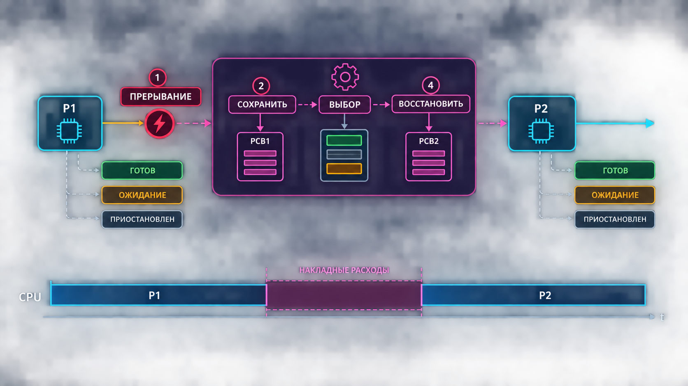

*Рисунок 19. Последовательность переключения контекста*

Аппаратная поддержка не отменяет PCB. Процессор сохраняет или загружает только архитектурное состояние, тогда как ядро управляет очередями, адресными пространствами, дескрипторами, полномочиями и статистикой. Поэтому переключение контекста является совместной работой аппаратуры и программных структур ОС.

# 3.2. Потоки и совместное использование

Поток делает параллельное выполнение внутри одного процесса дешёвым, но превращает общую память в общий риск: производительность растёт только вместе с дисциплиной синхронизации и ясным владением данными.

## 3.2.1. Поток как единица выполнения

Поток — последовательность выполнения с собственным счётчиком команд, регистрами и стеком. Потоки одного процесса разделяют код, глобальные данные, кучу, большинство дескрипторов и учётный контекст. Они могут выполнять разные функции одной программы параллельно и обращаться к одним структурам данных без отдельного механизма передачи сообщений.

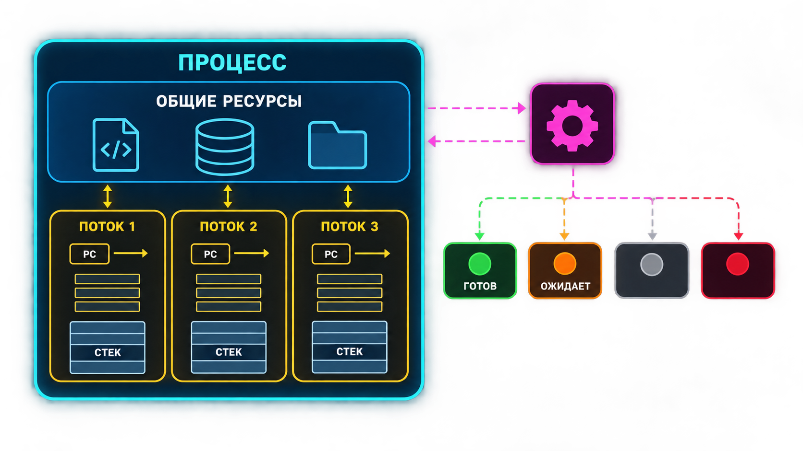

*Рисунок 20. Поток как единица выполнения внутри процесса*

Минимальное состояние потока меньше состояния процесса, поэтому создание и переключение потоков обычно дешевле. Однако слово «дешевле» не означает «бесплатно»: нужны стек, структура ядра, участие планировщика и кэш процессора. Слишком большое число потоков увеличивает память, переключения и конкуренцию за блокировки.

В современных универсальных ОС именно поток обычно является планируемой сущностью. Процесс с десятью готовыми потоками может одновременно выполняться на десяти ядрах, если это допускают данные и синхронизация. Однопоточный процесс одновременно использует лишь одно ядро, даже если внутри него есть много асинхронных операций.

## 3.2.2. Зачем применяют многопоточность

Первая причина — отзывчивость. Интерфейсный поток продолжает обрабатывать события, пока рабочий поток выполняет вычисление или ожидает ресурс. Вторая — перекрытие ожидания: когда один поток заблокирован на вводе-выводе, другой может использовать процессор. Третья — параллелизм на многоядерной системе.

Многопоточность естественна для серверов, конвейеров обработки, мультимедиа и фоновых задач. Но архитектура должна учитывать характер нагрузки. Для коротких задач выгоден ограниченный пул потоков, а создание отдельного потока на каждый запрос может привести к истощению памяти и эффекту «толпы» при пробуждении.

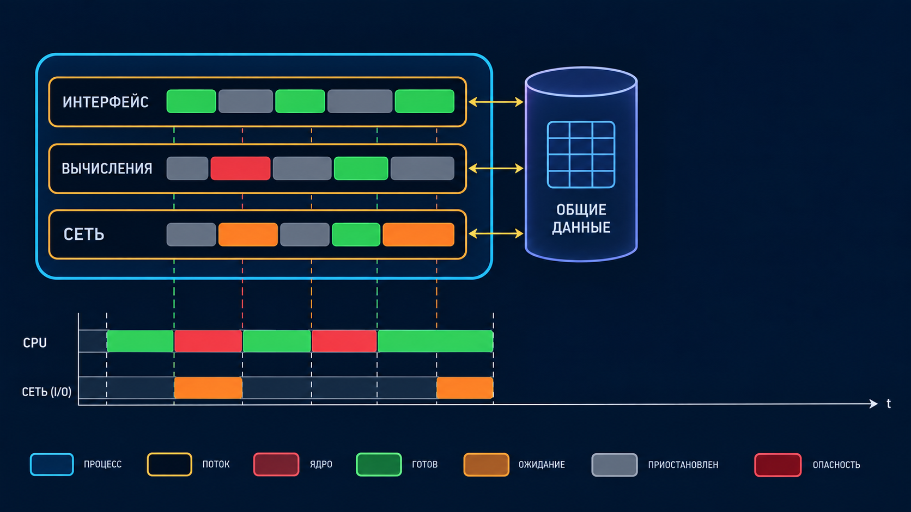

*Рисунок 21. Перекрытие вычислений и ожидания с помощью потоков*

Асинхронная модель и потоки решают разные задачи. Асинхронный ввод-вывод уменьшает число блокирующих потоков, но не устраняет необходимость параллельных вычислений. Практические системы часто сочетают цикл событий, пул рабочих потоков и отдельные процессы для компонентов с иной границей доверия.

## 3.2.3. Пользовательские и ядерные потоки

Таненбаум предлагает рассматривать место хранения таблицы потоков и субъект планирования как главные признаки реализации \[1\]. Если ядро не видит отдельные пользовательские потоки, переключение между ними дешёво, но блокирующий системный вызов способен остановить весь процесс. Если каждый поток известен ядру, блокирование одного не мешает планировать другой поток того же процесса, однако операции управления требуют перехода в ядро.

*Таблица 4. Модели реализации потоков
| **Модель**           | **Отображение**                                     | **Преимущества**                                             | **Ограничения**                                                           |
|----------------------|-----------------------------------------------------|--------------------------------------------------------------|---------------------------------------------------------------------------|
| Многие к одному M:1  | Много пользовательских потоков на один ядерный      | Быстрое локальное переключение, собственная политика runtime | Нет параллелизма на нескольких ядрах; блокирующий вызов блокирует процесс |
| Один к одному 1:1    | Каждый пользовательский поток имеет ядерный         | Параллелизм, вытеснение и независимое ожидание               | Выше стоимость создания и переключения; действуют системные лимиты        |
| Многие ко многим M:N | Много пользовательских потоков на несколько ядерных | Гибкое сочетание параллелизма и дешёвых задач                | Сложнее runtime, сигналы, отладка и согласование блокировок               |

Современные среды выполнения нередко используют понятие задачи, coroutine или fiber поверх ядерных потоков. Эти сущности не следует автоматически приравнивать к потоку ОС. Планировщик языка или библиотеки распределяет задачи между ограниченным числом ядерных потоков, а планировщик ОС видит именно последние.

Потоки пользовательского уровня могут управляться библиотекой без обращения к ядру при каждом переключении. Это быстро и позволяет реализовать специальную политику, но ядро не видит отдельные сущности. Если один такой поток выполняет блокирующий системный вызов, может остановиться весь связанный с ним ядерный поток.

При модели один-к-одному каждый пользовательский поток соответствует планируемому потоку ядра. Блокировка одного не останавливает остальных, а ядро распределяет их по процессорам. Цена — системные ресурсы и более дорогие операции жизненного цикла. Именно эта модель типична для современных Linux и Windows.

Гибридные модели отображают множество пользовательских потоков на несколько ядерных. Они сочетают управляемость среды выполнения с настоящим параллелизмом, но усложняют обработку сигналов, блокировок, отладки и планирования. Важно всегда уточнять, что именно обозначает слово «поток» в конкретной среде.

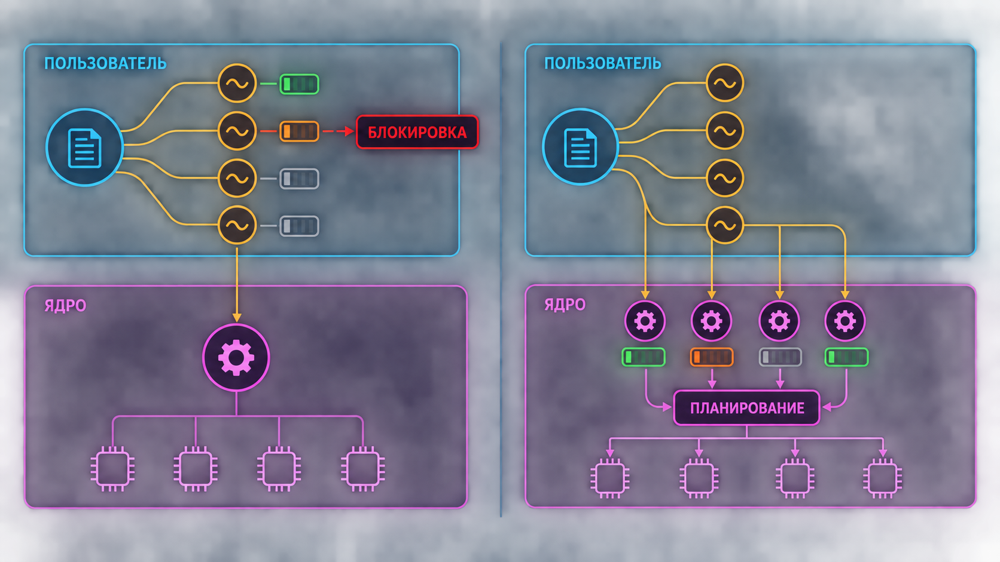

*Рисунок 22. Пользовательские и ядерные потоки*

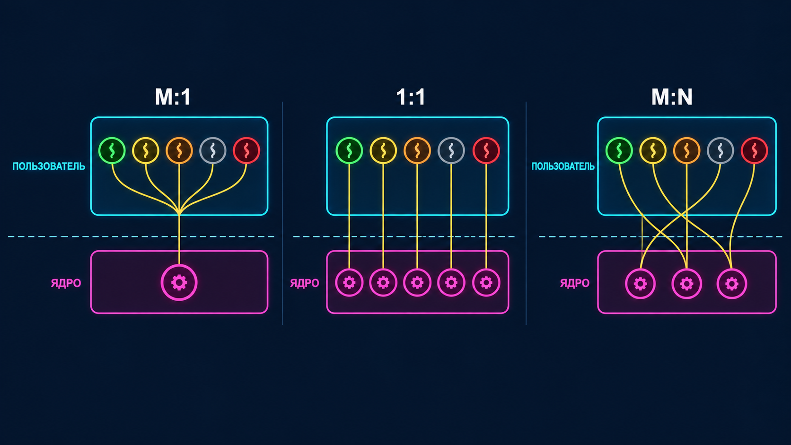

*Рисунок 23. Модели отображения потоков M:1, 1:1 и M:N*

## 3.2.4. Общая память и гонки

Обычная операция исходного языка может состоять из нескольких машинных действий. Если два потока одновременно читают и изменяют одну переменную без согласования, результат зависит от чередования инструкций. Такое состояние гонки проявляется редко, зависит от нагрузки и может исчезать при отладке.

Разделение памяти означает, что ошибка указателя, переполнение буфера или освобождение объекта одним потоком затрагивает соседние потоки. Аппаратная защита страниц не разделяет потоки одного процесса. Поэтому компоненты с разным уровнем доверия нельзя изолировать только потоками: им нужен отдельный процесс или более сильная среда изоляции.

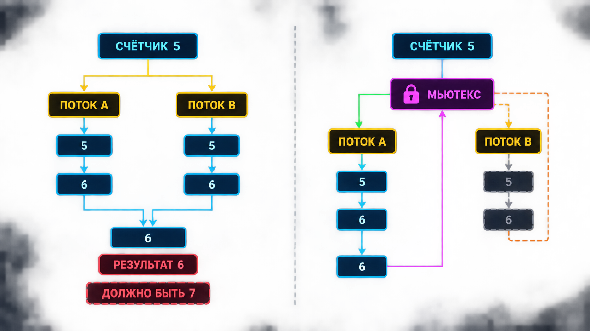

*Рисунок 24. Гонка данных и потерянное обновление*

Безопасное совместное использование требует явных правил владения: какие данные неизменяемы, кто их изменяет, какой примитив защищает инвариант, когда объект уничтожается. Синхронизация будет подробно рассмотрена в следующей лекции, но уже здесь важно понять: общая память ускоряет обмен ценой необходимости доказать корректность всех допустимых чередований.

## 3.2.5. Потоки, процессы и границы доверия

Процессы обеспечивают отдельные адресные пространства и позволяют назначить разные учётные записи, политики и ограничения. Отказ рабочего процесса можно локализовать и обработать управляющим процессом. Недостаток — необходимость IPC, сериализации данных и управления распределённым состоянием.

Потоки упрощают доступ к общим данным и уменьшают накладные расходы, но разделяют область отказа. Если один поток испортил кучу или вызвал аварийное завершение, прекращается весь процесс. Разделение на процессы оправдано для парсеров недоверенных форматов, сетевых фронтендов, модулей расширения и других компонентов, где последствия дефекта важнее стоимости обмена.

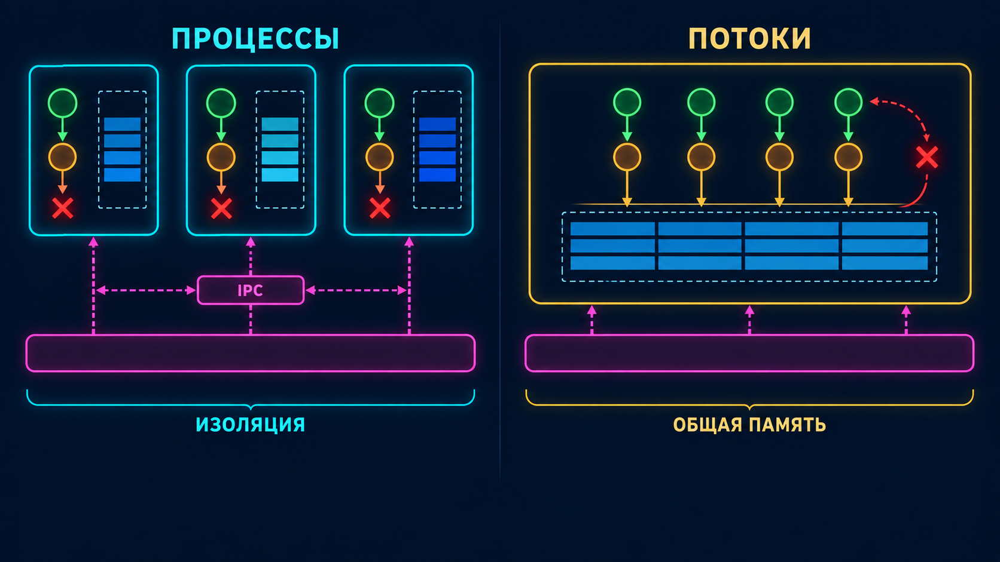

*Рисунок 25. Выбор между процессами и потоками*

Выбор не должен быть догмой. Полезен комбинированный подход: небольшое число процессов задаёт границы доверия и восстановления, а внутри каждого процесса ограниченный пул потоков обеспечивает параллелизм. Проектировщик документирует, какие данные пересекают IPC, какие полномочия имеет каждая сторона и как система восстанавливается после сбоя.

## 3.2.6. Наблюдение и диагностика потоков

Средства наблюдения должны показывать дерево процессов, число потоков, состояния, потребление процессора и памяти, причины ожидания и переключения контекста. В Linux применяются ps, top или htop, каталог /proc, а для углублённого анализа — perf, strace и средства трассировки. Интерпретация важнее отдельного числа.

Если процесс потребляет одно ядро на 100 %, это может быть нормой для вычислительного однопоточного кода. Если сотни потоков почти не выполняют полезной работы, возможны чрезмерная конкуренция, частые пробуждения или блокировка на общем ресурсе. Высокая скорость добровольных переключений обычно связана с ожиданиями, а недобровольных — с вытеснением.

Диагностика многопоточного сбоя должна фиксировать стеки всех потоков, а не только аварийного. Один поток может держать блокировку, второй — ожидать её, третий — завершать объект. Дамп, временная шкала и события планировщика помогают восстановить причинную последовательность.

| **Ключевой вывод.** Потоки эффективны там, где действительно нужны общая память и параллелизм. Для разделения полномочий, локализации отказа и обработки недоверенного кода надёжнее процессная граница. |
|----------------------------------------------------------------------------------------------------------------------------------------------------------------------------------------------------------|

# 3.3. Планирование процессора

Планировщик не ускоряет процессор: он распределяет ограниченное время между готовыми потоками и выбирает компромисс между откликом, пропускной способностью, справедливостью и сроками.

## 3.3.1. Планировщик и диспетчер

В изложении Сильбершатца выполнение процесса удобно представлять как чередование CPU burst и ожидания ввода-вывода \[2\]. CPU-bound нагрузка использует длинные интервалы вычислений, а I/O-bound нагрузка часто блокируется после коротких вычислительных участков. Планировщик должен быстро возвращать I/O-bound поток к процессору, чтобы тот сформировал следующий запрос устройству, но при этом не лишать вычислительные задачи устойчивой доли CPU.

Планирование бывает невытесняющим и вытесняющим. В первом случае поток сохраняет CPU до блокирования или завершения. Во втором ядро может остановить его по таймеру или при появлении более приоритетной работы. Вытеснение улучшает отклик и управляемость задержек, но увеличивает число переключений и требует корректной синхронизации внутри ядра.

| **Уровень решения** | **Что выбирается**                                | **Типичная частота**                                        |
|---------------------|---------------------------------------------------|-------------------------------------------------------------|
| Долгосрочный        | Какие задания допустить в систему                 | Редко; влияет на степень многопрограммности                 |
| Среднесрочный       | Какие процессы временно приостановить или вернуть | При дефиците памяти и регулировании нагрузки                |
| Краткосрочный       | Какой готовый поток получит CPU                   | Очень часто: после события, прерывания или окончания кванта |
| Диспетчер           | Не выбирает политику; реализует принятое решение  | При каждом фактическом переключении                         |

*Таблица 5. Уровни планирования и роль диспетчера*

Планировщик выбирает следующий готовый поток, а диспетчер фактически передаёт ему процессор: сохраняет прежний контекст, активирует адресное пространство и восстанавливает регистры. Решение принимается при блокировке текущего потока, его завершении, истечении кванта, появлении более приоритетной задачи или изменении доступности процессора.

Вытесняющая ОС может приостановить поток без его согласия. Таймер гарантирует, что вычислительная задача не удержит процессор навсегда. Невытесняющая схема передаёт управление только при добровольной блокировке или завершении, проще по реализации, но непригодна для надёжной многозадачности общего назначения.

Само переключение не создаёт полезной работы. Оно включает сохранение регистров, смену таблиц страниц, воздействие на кэши и предсказатели. Слишком короткий квант улучшает видимую отзывчивость, но повышает накладные расходы; слишком длинный приближает Round Robin к FCFS и ухудшает интерактивность.

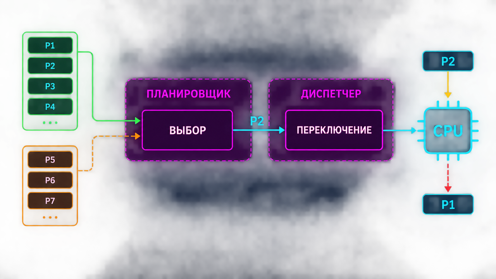

*Рисунок 26. Различие функций планировщика и диспетчера*

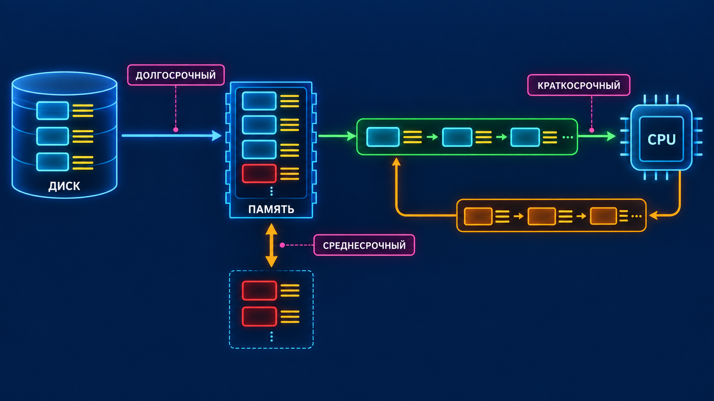

*Рисунок 27. Долгосрочное, среднесрочное и краткосрочное планирование*

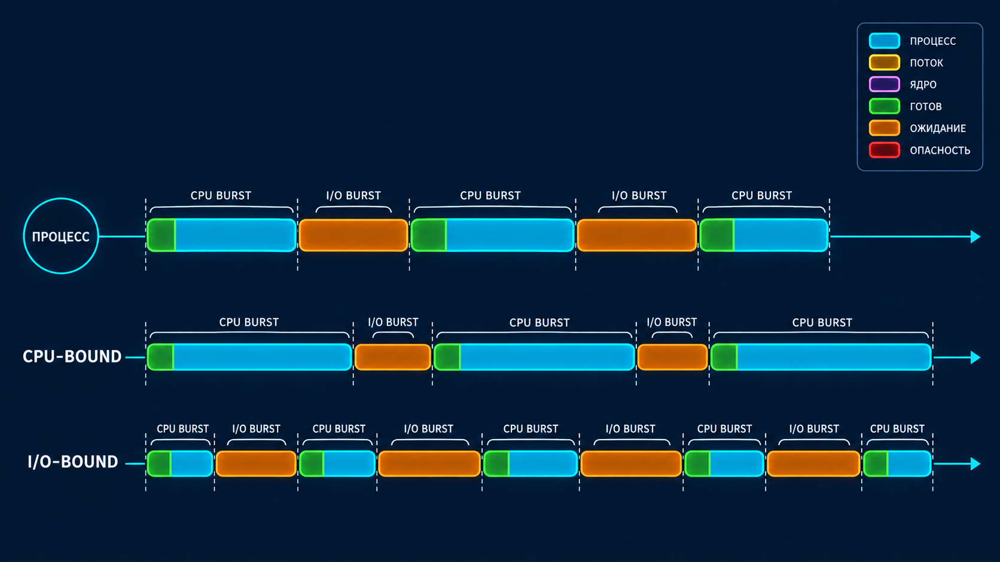

*Рисунок 28. Чередование интервалов CPU burst и I/O burst*

## 3.3.2. Критерии качества

Для количественного сравнения сначала фиксируют моменты прибытия, первого запуска и завершения, а также суммарную потребность в CPU. После этого рассчитывают время оборота, ожидания и отклика. Формулы вводятся после определения величин, чтобы не смешивать пользовательское ожидание с фактическим временем вычисления.

Время оборота: Tоб = Tзав − Tприб.

Время ожидания: Tож = Tоб − TCPU.

Время отклика: Tоткл = Tперв − Tприб.

Среднее значение не описывает худшие задержки. Для интерактивных и серверных систем дополнительно рассматривают максимумы и квантили, а для реального времени — долю и тяжесть пропущенных сроков. Поэтому алгоритм нельзя назвать лучшим без указания класса нагрузки и выбранного критерия.

Загрузка процессора показывает долю времени полезной занятости, пропускная способность — число завершённых работ, время оборота — интервал от поступления до завершения, время ожидания — пребывание в очереди готовых, время отклика — задержку до первого результата. Эти показатели не взаимозаменяемы.

Для пакетной обработки важны пропускная способность и среднее время оборота. Для интерактивной системы — быстрый и устойчивый отклик. Для многопользовательской среды — справедливость и защита от монополизации. Для реального времени — соблюдение сроков, даже если среднее значение выглядит хуже.

Оптимизация среднего может скрыть неприемлемые выбросы. Если большинство запросов обслуживается быстро, а некоторые ждут минуты, среднее может оставаться хорошим. Поэтому оценивают распределение задержек, квантили, максимальное ожидание и наличие голодания.

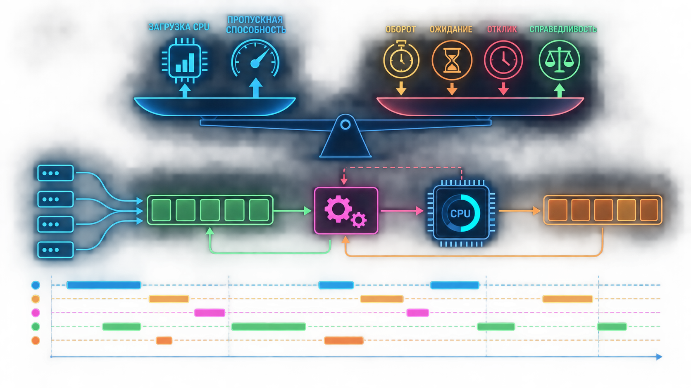

*Рисунок 29. Критерии качества планирования*

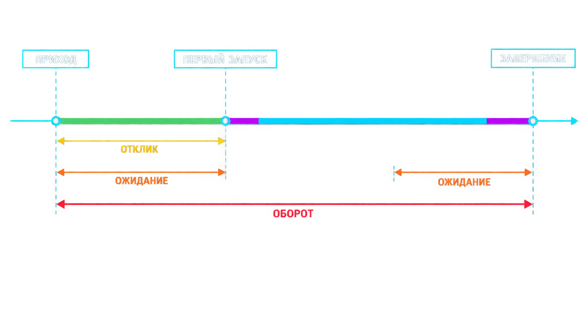

*Рисунок 30. Временные интервалы для расчёта показателей планирования*

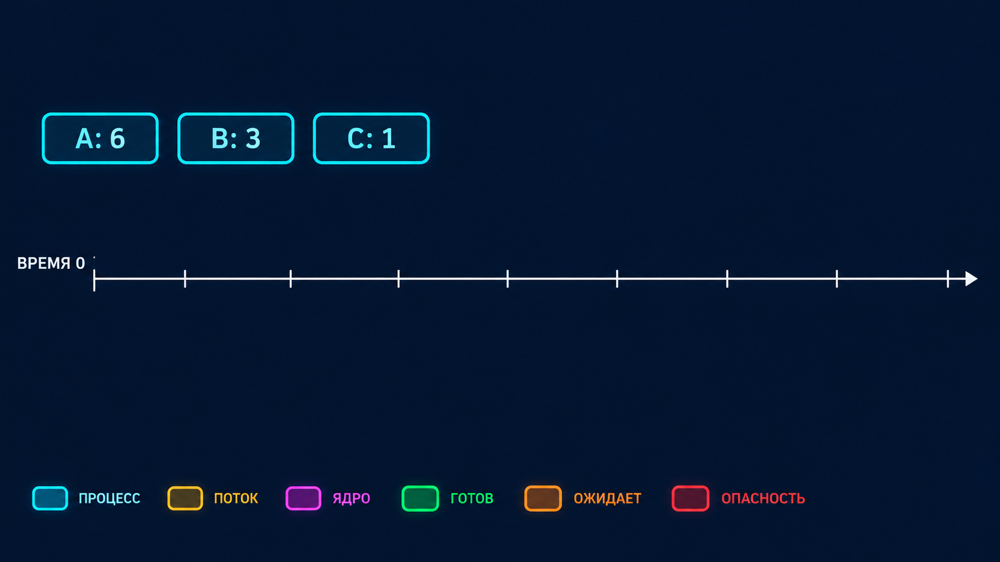

*Рисунок 31. Исходные данные сквозного примера*

## 3.3.3. FCFS, SJF и SRTF

FCFS обслуживает работы в порядке поступления. Он прост и предсказуем, но длинная вычислительная задача заставляет короткие ждать — возникает эффект конвоя. В системе с чередованием CPU- и I/O-нагрузки это снижает использование устройств и ухудшает отклик.

SJF выбирает работу с наименьшей ожидаемой длительностью и теоретически минимизирует среднее ожидание при известных временах. На практике будущий CPU burst неизвестен, поэтому его оценивают по истории. Длинные задачи могут голодать, если постоянно приходят короткие.

SRTF — вытесняющий вариант кратчайшей оставшейся работы. Новый короткий поток может вытеснить текущий. Алгоритм улучшает средние показатели, но требует оценок, создаёт переключения и не обеспечивает естественной справедливости. Эти алгоритмы важны прежде всего как модели для понимания компромиссов.

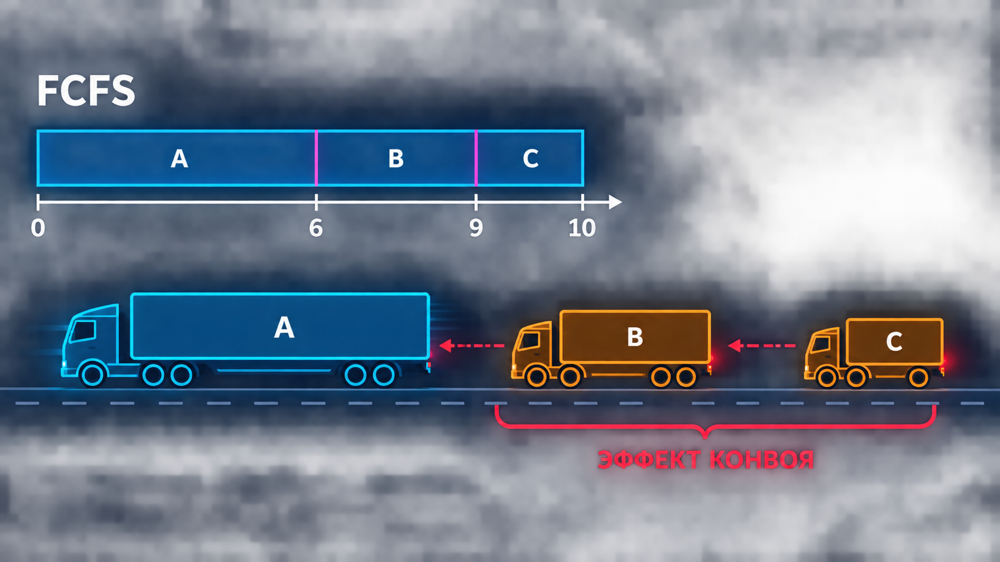

*Рисунок 32. FCFS и эффект конвоя*

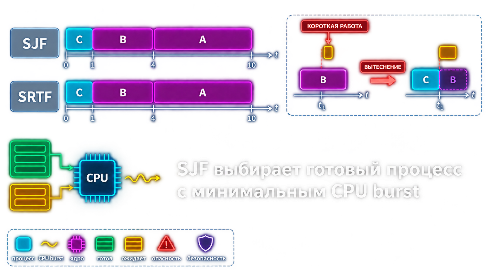

*Рисунок 33. Сравнение SJF и SRTF*

## 3.3.4. Round Robin и квант

Квант должен быть значительно больше стоимости переключения, иначе заметная доля процессорного времени уйдёт на администрирование. Одновременно слишком большой квант ухудшает отклик и приближает Round Robin к FCFS. Поэтому значение выбирают по измерениям конкретной системы, длительности типичных CPU burst и требованиям к задержке, а не по универсальному числу из учебника.

| **Процесс** | **Прибытие, мс** | **CPU burst, мс** | **Приоритет** |
|-------------|------------------|-------------------|---------------|
| A           | 0                | 8                 | 2             |
| B           | 1                | 4                 | 1             |
| C           | 2                | 2                 | 3             |

*Таблица 6. Исходные данные для сквозного примера планирования*

При FCFS порядок A–B–C даёт времена ожидания 0, 7 и 10 мс. При SJF, если все задания доступны одновременно, порядок C–B–A уменьшает среднее ожидание. При Round Robin с квантом 2 мс чередование начинается A–B–C–A–B–A–A: процесс C быстро завершится, но возрастёт число переключений. Пример показывает, почему одна метрика улучшается ценой другой.

Round Robin организует готовые потоки в циклическую очередь и выдаёт каждому ограниченный квант. Если поток блокируется раньше, процессор получает следующий. Если квант истекает, поток возвращается в хвост очереди. При равных условиях это создаёт понятную долю процессорного времени.

Размер кванта выбирается относительно длительности интерактивных всплесков и стоимости переключения. Большинство интерактивных задач быстро блокируется и получает хороший отклик. Вычислительные задачи используют квант полностью. Однако большое число готовых потоков увеличивает время до следующего обслуживания каждого.

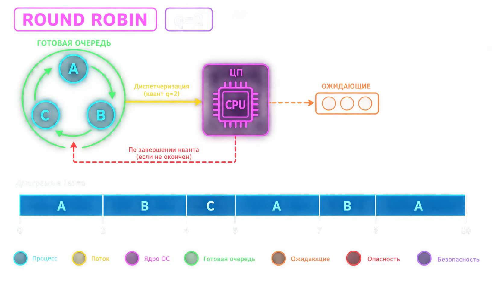

*Рисунок 34. Round Robin и циклическая очередь готовых*

Round Robin не учитывает важность и сроки. Он также не гарантирует равную полезную производительность: потоки различаются рабочим набором, кэш-поведением и числом процессоров. Поэтому практические планировщики используют веса, классы и динамическую оценку поведения.

## 3.3.5. Приоритеты и многоуровневые очереди

Статический приоритет прост, но способен вызвать голодание. Aging постепенно повышает приоритет долго ожидающей работы. Инверсия приоритетов имеет другую природу: высокоприоритетный поток ждёт ресурс, удерживаемый низкоприоритетным, а среднеприоритетные потоки мешают владельцу ресурса выполниться. Протокол наследования приоритета временно повышает приоритет владельца блокировки, чтобы тот быстрее освободил ресурс.

Приоритетное планирование выбирает наиболее важный готовый поток. Приоритет может задаваться администратором, классом службы или вычисляться динамически. Низкоприоритетная задача способна голодать, поэтому применяют старение — постепенное повышение приоритета при длительном ожидании.

Многоуровневая очередь разделяет задачи на классы, например системные, интерактивные и пакетные. Между очередями действует отдельная политика, внутри каждой — собственный алгоритм. Многоуровневая очередь с обратной связью перемещает поток в зависимости от поведения: коротко работающие и часто блокирующиеся задачи получают быстрый отклик, длительно вычисляющие переходят ниже.

Приоритет может стать источником инверсии: высокоприоритетный поток ждёт блокировку, удерживаемую низкоприоритетным, а средние потоки не дают владельцу завершиться. Механизм наследования приоритета временно повышает владельца ресурса. Это связывает планирование с синхронизацией и показывает, почему отдельные подсистемы ОС нельзя анализировать изолированно.

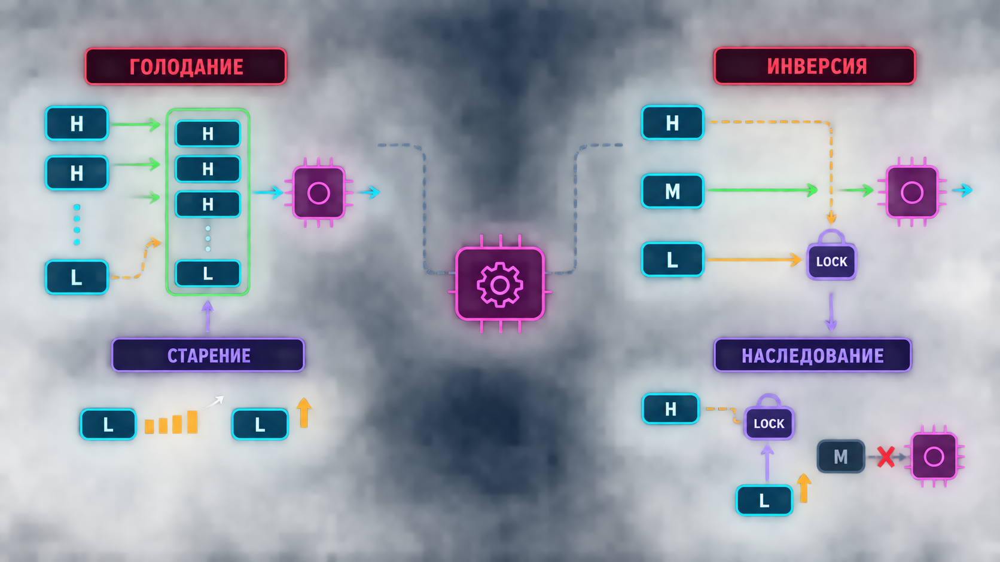

*Рисунок 35. Голодание, старение и инверсия приоритетов*

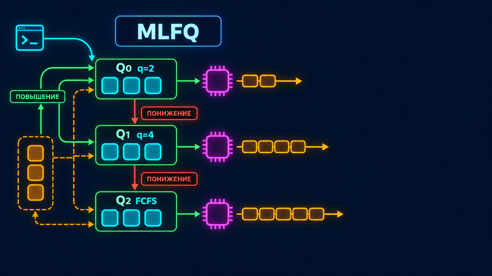

*Рисунок 36. Многоуровневая очередь с обратной связью MLFQ*

## 3.3.6. Современное справедливое планирование

Современные универсальные ОС сочетают несколько классов планирования и учитывают приоритет, вес задачи, допустимость вытеснения, аффинность и архитектуру процессоров. Linux долго использовал CFS как основу обычного класса, а в современных ядрах развивает подход EEVDF с виртуальным временем и виртуальными сроками. Для учебной модели важнее общий принцип: планировщик приближает фактическое распределение CPU к заданной политике справедливости, одновременно ограничивая задержку готовых задач.

В Windows планируется поток, а не процесс. Базовый приоритет потока формируется из класса приоритета процесса и относительного приоритета потока; динамические повышения помогают быстро обслуживать некоторые события и интерактивную работу. Конкретные числовые правила относятся к реализации и могут изменяться, поэтому в лекции они используются как пример, а не как универсальная модель.

Современный планировщик общего назначения стремится распределять время пропорционально весам и поддерживать хорошую интерактивность. Вместо буквального обхода очереди он может учитывать виртуальное время выполнения: поток, получивший меньшую долю, становится более предпочтительным. Структуры данных позволяют быстро находить кандидата.

Планировщик различает задачи, но не знает бизнес-смысла каждой инструкции. Вес и nice выражают относительную долю только среди конкурентов. Повышение приоритета одной службы уменьшает ресурсы остальных и не устраняет перегрузку. Для управляемости приоритеты сочетают с лимитами, квотами и контролем поступления задач.

Наблюдать следует не только общую загрузку, но и задержку запуска готового потока, число миграций, долю ожидания и распределение CPU по группам. Высокая загрузка может быть нормальной, если сроки соблюдаются; низкая — проблемной, если поток ждёт блокировку или устройство.

## 3.3.7. Многоядерность, аффинность и балансировка

На многоядерной системе планировщик решает две задачи: какой поток запустить и на каком процессоре. Миграция выравнивает нагрузку, но может потерять тёплый кэш и нарушить локальность памяти NUMA. Аффинность ограничивает допустимые процессоры или сохраняет предпочтение к прежнему ядру.

Балансировка должна учитывать не только число потоков, но и их веса, рабочие наборы, аппаратные потоки и домены памяти. Два готовых потока могут создавать разную нагрузку. Закрепление всех важных процессов за одним ядром создаёт искусственное узкое место, а чрезмерные миграции увеличивают задержки.

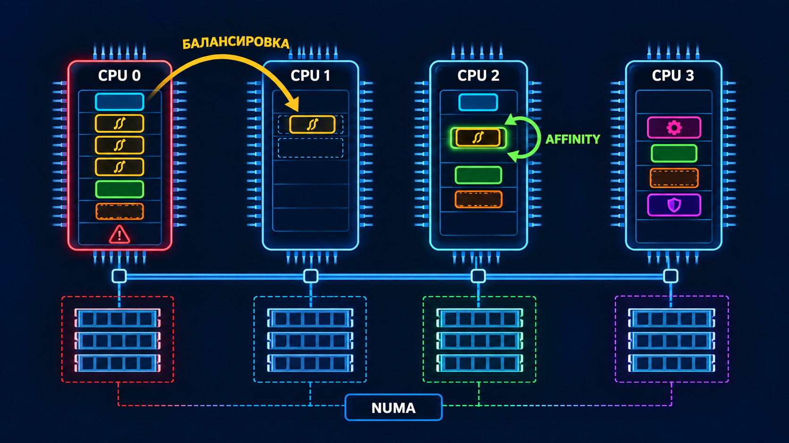

*Рисунок 37. Многоядерное планирование, affinity и NUMA*

Для изолированных или временно критичных задач иногда выделяют ядра и ограничивают фоновые прерывания. Но это уменьшает общий пул ресурсов и требует целостной настройки. Локальная оптимизация одного сервиса может ухудшить обслуживание всей системы.

## 3.3.8. Планирование реального времени

В системе реального времени корректность включает время получения результата. Жёсткое реальное время не допускает пропуска срока, мягкое допускает редкие нарушения с ухудшением качества. Для анализа задачи описывают периодом, временем выполнения и дедлайном.

Rate Monotonic назначает более высокий фиксированный приоритет задаче с меньшим периодом. Earliest Deadline First динамически выбирает ближайший срок и способен эффективнее использовать процессор при идеальных предпосылках. Оба подхода требуют оценки наихудшего времени выполнения и анализа допустимости нагрузки.

Высокий приоритет не создаёт гарантии сам по себе. Страница может вызвать задержку, драйвер — удерживать процессор, а блокировка — создать инверсию. Система реального времени требует контролировать всю цепочку: прерывания, память, синхронизацию, устройства и перегрузку.

| **Ключевой вывод.** Планирование — многокритериальная политика. Выбор алгоритма определяется видом нагрузки, допустимыми задержками, справедливостью и возможностью доказать соблюдение сроков. |
|-------------------------------------------------------------------------------------------------------------------------------------------------------------------------------------------------|

# 3.4. Контекст безопасности процесса

Ядро принимает решение не только по имени программы, а по фактическому контексту процесса: идентификаторам, группам, возможностям, меткам, пространствам имён, открытым объектам и ограничениям.

## 3.4.1. Идентичность и полномочия

Процесс связан с идентификаторами пользователя и групп. Unix-подобные системы различают реальные, эффективные и сохранённые идентификаторы, чтобы описывать происхождение и текущие полномочия. Проверки доступа обычно используют эффективный контекст. Дополнительные группы расширяют набор разрешений.

Модель capabilities разделяет полномочия суперпользователя на отдельные возможности: например, изменение сетевой конфигурации или переключение учётных данных. Службе можно выдать только нужную способность, но каждая capability остаётся сильным правом и должна быть обоснована. Полный набор практически эквивалентен широким административным полномочиям.

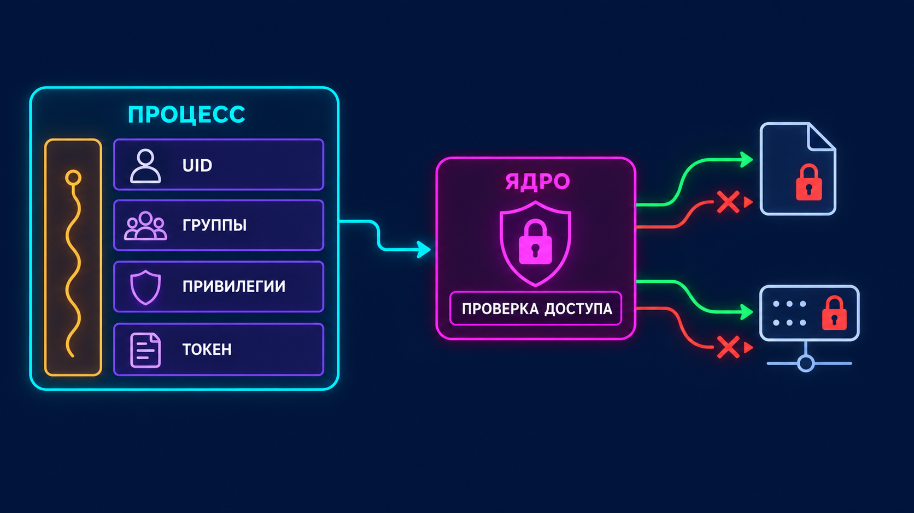

*Рисунок 38. Процесс как контекст безопасности*

Обязательное управление доступом добавляет метки и правила, которые действуют независимо от дискреционных прав владельца. Процесс с корректным UID может получить отказ из-за политики домена или уровня. Итоговое разрешение является пересечением применимых механизмов, а не выбором одного из них.

## 3.4.2. Наследование при создании и exec

Наследование следует анализировать пообъектно. Дочерний процесс может получить окружение, рабочий каталог, открытые дескрипторы, маску сигналов и атрибуты планирования, но не обязан наследовать каждое право. Безопасный запуск строится на явном списке передаваемых ресурсов: ненужные дескрипторы закрываются, секреты не помещаются в общедоступное окружение, а привилегии сокращаются до обработки недоверенных данных.

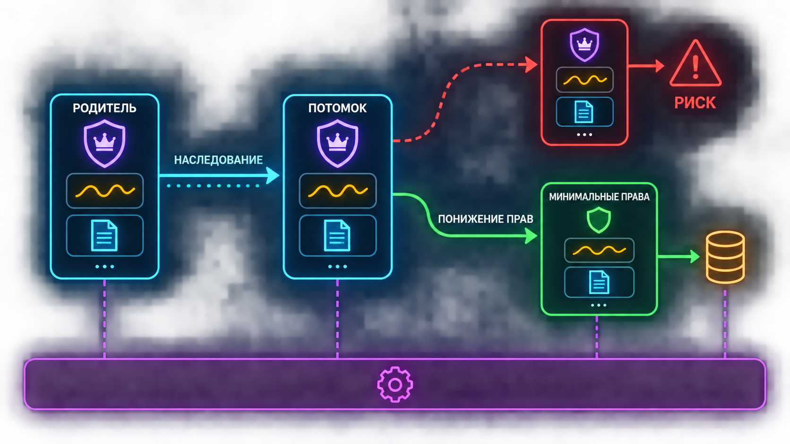

*Рисунок 39. Наследование полномочий и безопасное понижение прав*

Потомок обычно наследует учётный контекст, окружение, текущий каталог, маску, ограничения и открытые дескрипторы. Это удобно, но создаёт каналы непреднамеренной передачи полномочий. Безопасный родитель перед запуском менее доверенной программы формирует минимальное окружение и закрывает лишние дескрипторы.

Exec заменяет программу, но не обязательно очищает весь процессный контекст. PID, часть идентификаторов, лимиты и разрешённые дескрипторы сохраняются. Специальные атрибуты исполняемого файла могут изменить эффективные полномочия. Поэтому загрузка нового образа — критичная точка, где ядро пересчитывает контекст и применяет защитные правила.

Опасно полагаться на имя запускаемого файла или переменные окружения без фиксации объекта. Поиск через PATH, подмена рабочей директории и наследование настроек динамического загрузчика меняют фактический код. Привилегированная служба использует абсолютные пути, доверенное окружение и устойчивые ссылки.

## 3.4.3. Изоляция процессов

Основой служит виртуальная память: процесс не может произвольно читать и записывать чужие страницы. Ядро проверяет доступ к файлам, сокетам и IPC по контексту. Дополнительные пространства имён предоставляют разным группам процессов разные представления PID, сети, точек монтирования и других глобальных ресурсов.

Группы управления ресурсами ограничивают и учитывают CPU, память и ввод-вывод. Они защищают доступность: даже непривилегированная или ошибочная задача не должна истощить систему. Фильтрация системных вызовов уменьшает доступный интерфейс ядра, а обязательная политика ограничивает допустимые объекты и переходы.

Ни один механизм не равен полной виртуальной машине. Процессы всё ещё разделяют ядро, аппаратные кэши, время и часть глобальных подсистем. Побочные каналы, ошибки ядра и слишком широкие общие ресурсы могут нарушить ожидания. Граница должна соответствовать модели угроз.

## 3.4.4. Понижение привилегий

Системной службе иногда нужны повышенные права только на старте: открыть защищённый порт, прочитать ключ или настроить устройство. После инициализации она должна перейти к отдельной учётной записи, сократить группы и capabilities, установить ограничения и оставить только необходимые дескрипторы.

Понижение должно быть необратимым для рабочей части. Недостаточно изменить видимый идентификатор, сохранив способ вернуть полномочия через сохранённый UID, доступный сокет, наследуемую capability или управляющий интерфейс. Проверка проводится по фактическим возможностям после перехода.

Надёжная архитектура выделяет небольшую привилегированную часть и непривилегированных работников. Привилегированный процесс принимает узкие структурированные запросы и заново авторизует каждую операцию. Он не должен превращаться в универсальный прокси, выполняющий произвольные команды от менее доверенной стороны.

## 3.4.5. Сигналы, отладка и межпроцессные интерфейсы

Сигнал способен изменить управление процессом, завершить его или вызвать обработчик. Ядро проверяет право отправителя и особенности защищённых процессов. Отладочный интерфейс ещё сильнее: он может читать и изменять память и регистры. Поэтому ptrace и аналоги ограничиваются владельцем, отношением процессов и системной политикой.

IPC создаёт явный канал через границу процесса. Право подключиться к сокету или открыть очередь не означает право выполнить любую операцию. Получатель обязан аутентифицировать сторону, проверить структуру сообщения, авторизовать команду и ограничить размер. Дескрипторы, переданные через IPC, переносят доступ к объекту и требуют отдельного контроля.

Служебные интерфейсы часто опаснее основного протокола, потому что рассчитаны на администратора и хуже тестируются. Локальный сокет, диагностический порт или сигнал управления должны иметь минимальные права, журналирование и защиту от повторов и перегрузки.

## 3.4.6. Наблюдаемость и расследование

Базовая инвентаризация включает PID, PPID, владельца, команду, хэш исполняемого файла, время запуска, дескрипторы, сетевые соединения, пространства имён и ограничения. Дерево процессов показывает происхождение: необычный потомок офисного приложения и ожидаемый работник системной службы имеют разный смысл.

Журналирование создания и завершения процессов, изменения идентификаторов, исполнения программ и отказов доступа позволяет восстановить последовательность. Однако командная строка и окружение могут содержать секреты, поэтому сбор должен учитывать минимизацию и сроки хранения. События связывают по времени, идентификаторам и устойчивым данным объекта.

Злоумышленник может менять имя процесса или удалять файл после запуска. Поэтому доверять одному полю нельзя. Анализ сочетает происхождение, открытые объекты, сетевую активность, подпись или хэш, контекст политики и поведение. Аномалия — повод для проверки, а не автоматическое доказательство атаки.

| **Ключевой вывод.** Контекст безопасности состоит из нескольких взаимосвязанных атрибутов и наследуемых ресурсов. Наименьшие привилегии достигаются только проверкой фактических возможностей процесса и контролем переходов жизненного цикла. |
|------------------------------------------------------------------------------------------------------------------------------------------------------------------------------------------------------------------------------------------------|

# Прикладной разбор: безопасный жизненный цикл сетевой службы

## Постановка задачи

Служба должна принимать соединения на защищённом порту, читать конфигурацию и ключ, затем обрабатывать множество недоверенных запросов. Если весь код постоянно работает с широкими правами в одном многопоточном процессе, ошибка парсера получает доступ ко всем секретам и системным объектам службы.

Требования включают быстрый отклик, ограничение ущерба, контролируемое обновление и возможность перезапустить обработчик без потери управляющего процесса. Следовательно, архитектуру оценивают одновременно по производительности, границам доверия и восстановлению.

## Разделение ролей

Небольшой мастер выполняет привилегированную инициализацию, открывает только необходимые объекты, затем создаёт работников с пониженными правами. Работники получают ограниченный канал IPC и не видят закрытые ключи или административные интерфейсы. Для разных классов данных можно создать отдельные пулы процессов.

Внутри работника используется ограниченный пул потоков. Потоки разделяют кэш и состояние соединений, но не пересекают процессную границу. Число потоков связано с ядрами и характером ожидания, а очередь имеет предел. При перегрузке служба применяет обратное давление, а не создаёт неограниченные потоки.

## Планирование и доступность

Работникам задаются обычные веса и ресурсные квоты. Повышать их в класс реального времени без анализа нельзя: перегруженная служба способна вытеснить аудит, журналирование и восстановление. Отдельные лимиты памяти и числа процессов предотвращают истощение системы.

Монитор наблюдает длину очереди, задержку отклика, CPU, память и число перезапусков. Если работник аварийно завершился, мастер закрывает связанные каналы, сохраняет событие и создаёт новый экземпляр с чистым контекстом. Повторяющиеся сбои переводят службу в ограниченный режим, чтобы избежать бесконечного цикла перезапуска.

## Проверка фактической изоляции

После запуска проверяют владельца и группы каждого процесса, набор capabilities, пространства имён, фильтр системных вызовов, доступные файлы, дескрипторы и сокеты. Затем выполняют отрицательные тесты: работник не должен читать ключ, менять конфигурацию, подключаться к административному сокету или создавать неразрешённое соединение.

Отдельно проверяют наследование при exec и обновлении: лишние дескрипторы закрыты, окружение очищено, путь к программе фиксирован. Результаты связывают с базовой линией. Только такая проверка подтверждает, что архитектурная схема реализована фактически, а не только нарисована.

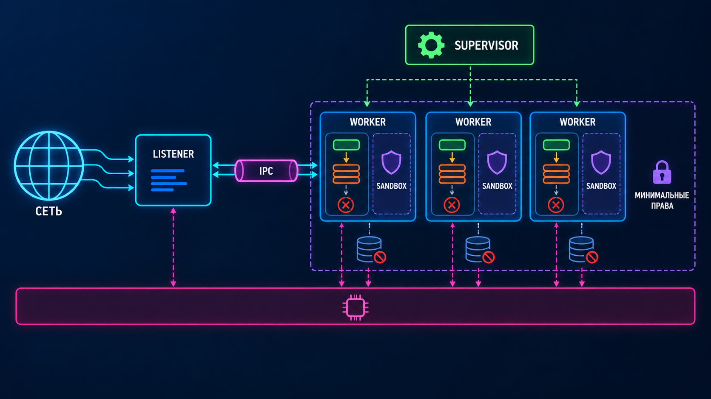

*Рисунок 40. Архитектура изолированной сетевой службы*

| **Ключевой вывод.** Безопасная служба сочетает процессные границы для доверия и восстановления, потоки для управляемого параллелизма, квоты для доступности и проверяемое понижение полномочий. |
|-------------------------------------------------------------------------------------------------------------------------------------------------------------------------------------------------|

# Сравнение процессов и потоков

| **Критерий**              | **Отдельные процессы**           | **Потоки одного процесса**     |
|---------------------------|----------------------------------|--------------------------------|
| **Адресное пространство** | Раздельное по умолчанию          | Общее                          |
| **Регистры и стек**       | У каждого потока процесса свои   | У каждого потока свои          |
| **Обмен данными**         | IPC, отображения, сокеты, каналы | Прямой доступ к общей памяти   |
| **Стоимость создания**    | Обычно выше                      | Обычно ниже                    |
| **Локализация сбоя**      | Сбой чаще ограничен процессом    | Сбой затрагивает весь процесс  |
| **Разные полномочия**     | Назначаются естественно          | Обычно общий контекст процесса |
| **Лучшее применение**     | Границы доверия и восстановления | Тесно связанный параллелизм    |

# Сравнение алгоритмов планирования

| **Алгоритм**     | **Сильная сторона**                | **Основное ограничение**                  | **Типичная задача**                         |
|------------------|------------------------------------|-------------------------------------------|---------------------------------------------|
| **FCFS**         | Простота и порядок поступления     | Эффект конвоя                             | Пакетная модель без требований к отклику    |
| **SJF / SRTF**   | Хорошее среднее ожидание           | Нужна оценка длительности, риск голодания | Теоретический анализ и предсказуемые работы |
| **Round Robin**  | Отзывчивость и понятное разделение | Зависимость от кванта                     | Интерактивная многозадачность               |
| **Приоритетный** | Учёт важности                      | Голодание и инверсия                      | Системы с классами обслуживания             |
| **MLFQ**         | Адаптация к поведению              | Сложная настройка                         | Смешанная интерактивная нагрузка            |
| **EDF / RM**     | Работа со сроками                  | Требуется анализ допустимости             | Системы реального времени                   |

# Итоги лекции

- Процесс является контейнером ресурсов и контекста безопасности, а поток — единицей выполнения внутри контейнера.
- PCB и потоковый контекст позволяют ядру приостанавливать и продолжать вычисление.
- Состояния готовности и ожидания различаются наличием события, а не наличием программы или памяти.
- Потоки быстрее обмениваются через общую память, но разделяют область отказа и требуют синхронизации.
- Процессная граница лучше подходит для разных полномочий, недоверенного кода и управляемого восстановления.
- Планировщик оптимизирует конфликтующие критерии и не может компенсировать неограниченный поток работ.
- FCFS, SJF, Round Robin и приоритетные схемы демонстрируют разные компромиссы отклика, ожидания и справедливости.
- Многоядерное планирование учитывает баланс, кэш, NUMA и аффинность, а реальное время требует анализа всей цепочки задержек.
- Контекст безопасности включает идентификаторы, capabilities, метки, пространства имён, лимиты и наследуемые объекты.
- Безопасная служба сочетает понижение привилегий, процессные границы, ограниченный пул потоков, квоты и наблюдаемость.
- Очереди дескрипторов связывают состояния с работой планировщика: переход процесса означает контролируемое перемещение его потока между структурами готовности, ожидания и завершения.
- Приостановка отличается от ожидания события и используется для управления памятью, диагностикой и общей нагрузкой системы.

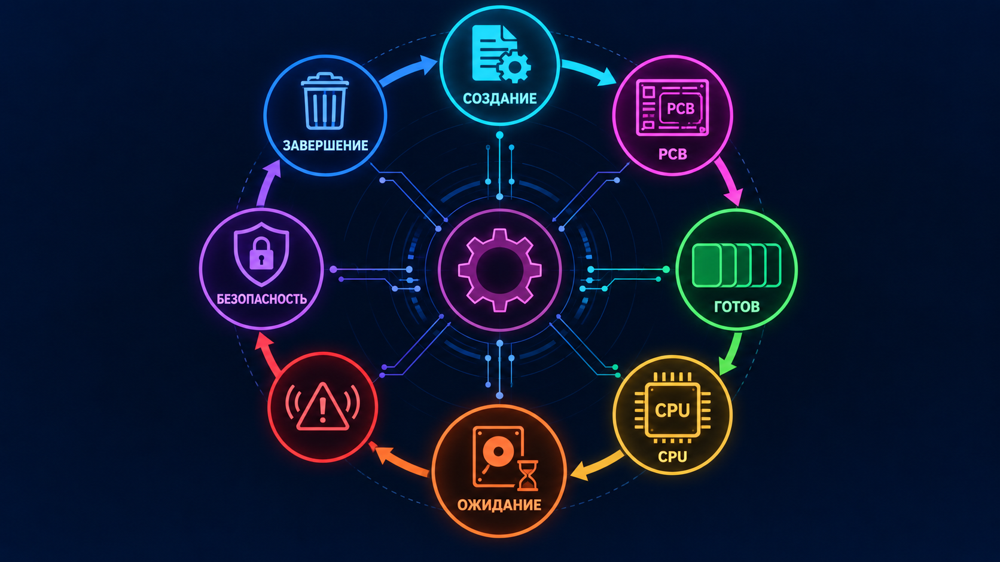

*Рисунок 41. Итоговая модель управления процессом*

# Вопросы для самоконтроля

1.  Чем программа отличается от процесса и почему один файл может соответствовать многим процессам?
2.  Какие сведения логически входят в PCB и какие данные относятся к отдельному потоку?
3.  Какие ресурсы процесса наследуются при создании потомка?
4.  Как копирование при записи ускоряет создание процесса?
5.  Чем состояния «готов» и «ожидает» различаются с точки зрения доступности процессора?
6.  Почему завершённый процесс может временно оставаться зомби?
7.  Какие ресурсы разделяют потоки одного процесса?
8.  Почему потоковая граница не изолирует компонент, обрабатывающий недоверенные данные?
9.  Когда пул потоков предпочтительнее потока на каждый запрос?
10. Чем пользовательские потоки отличаются от ядерных?
11. Что входит в стоимость переключения контекста?
12. Чем время отклика отличается от времени оборота?
13. Почему FCFS создаёт эффект конвоя?
14. Как размер кванта влияет на Round Robin?
15. Почему приоритетное планирование может вызвать голодание?
16. Что такое инверсия приоритетов и как работает наследование приоритета?
17. Почему повышение приоритета не устраняет перегрузку?
18. Какие компромиссы создаёт миграция потока между ядрами?
19. Чем жёсткое реальное время отличается от мягкого?
20. Какие атрибуты образуют контекст безопасности процесса?
21. Какие полномочия и объекты могут непреднамеренно пережить exec?
22. Почему понижение UID недостаточно без проверки capabilities и дескрипторов?
23. Какие риски создают сигналы, ptrace и IPC?
24. Какие данные нужны для расследования необычного процесса?

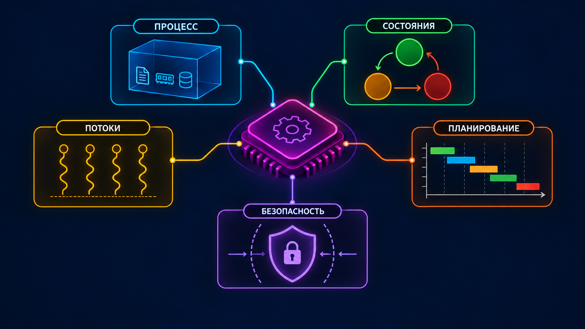

*Рисунок 42. Карта вопросов для самоконтроля*

# Задания для работы в аудитории

## Задание 1. Восстановите жизненный цикл

Для сценария «оболочка запускает программу, программа читает файл и завершается» укажите:
- какие объекты и атрибуты наследуются при создании;
- что меняется при exec;
- какие состояния проходит основной поток;
- в какой момент возникает ожидание и какое событие его завершает;
- какие ресурсы освобождаются при exit;
- кто получает статус завершения.

## Задание 2. Рассчитайте расписание
| **Исходные данные.** Три процесса поступают одновременно: A — 8 мс CPU, B — 3 мс, C — 5 мс. Постройте диаграммы FCFS, SJF и Round Robin с квантом 2 мс. Для каждого вычислите время ожидания и оборота, затем объясните, какой критерий улучшился и какой ухудшился. |
|----------------------------------------------------------------------------------------------------------------------------------------------------------------------------------------------------------------------------------------------------------------------|

## Задание 3. Выберите границу

- Парсер недоверенного архивного формата и основной интерфейс приложения.
- Четыре вычислительных этапа, совместно читающие неизменяемый массив.
- Модуль расширения стороннего производителя и служба с секретным ключом.
- Сетевой сервер с тысячами соединений и тяжёлыми криптографическими задачами.

Для каждого случая выберите процессы, потоки или комбинированную модель и обоснуйте выбор по обмену, отказу, полномочиям и восстановлению.

# Самостоятельная работа

Выбрать один реальный системный сервис Linux. Построить дерево его процессов и потоков, указать владельцев, состояния, открытые сетевые интерфейсы и значимые ограничения. Описать модель создания, способ параллелизма, предполагаемый алгоритм обслуживания запросов и границу восстановления. Отдельно предложить минимальный набор полномочий и три отрицательных теста изоляции. Объём — 3–4 страницы.

# Глоссарий

| **Термин**                 | **Определение**                                                                                      |
|----------------------------|------------------------------------------------------------------------------------------------------|
| **CPU burst**              | Интервал непрерывного выполнения потока на процессоре между ожиданиями или вытеснениями.             |
| **PCB**                    | Логическая совокупность структур ядра, описывающих процесс, его состояние, ресурсы и атрибуты.       |
| **PID / PPID**             | Идентификатор процесса и идентификатор его родительского процесса.                                   |
| **Аффинность**             | Ограничение или предпочтение выполнения потока на определённых процессорах.                          |
| **Время оборота**          | Интервал от поступления задачи до её полного завершения.                                             |
| **Время отклика**          | Интервал от поступления запроса до первого наблюдаемого ответа.                                      |
| **Вытеснение**             | Принудительное прекращение текущего использования процессора с переводом потока в готовое состояние. |
| **Голодание**              | Неограниченно долгое ожидание ресурса при продолжающемся обслуживании других задач.                  |
| **Диспетчер**              | Механизм, передающий процессор выбранному планировщиком потоку.                                      |
| **Зомби**                  | Завершённый процесс, статус которого ещё не получен родителем.                                       |
| **Квант**                  | Максимальный непрерывный интервал процессорного времени в квантовом алгоритме.                       |
| **Контекст**               | Регистры, стеки, адресное пространство и служебные сведения, необходимые для продолжения выполнения. |
| **Копирование при записи** | Совместное использование страниц до первой записи, после которой создаётся частная копия.            |
| **Планировщик**            | Компонент ОС, выбирающий следующий готовый поток и процессор для его выполнения.                     |
| **Поток**                  | Планируемая последовательность выполнения с собственными регистрами и стеком внутри процесса.        |
| **Процесс**                | Контейнер выполнения, ресурсов и контекста безопасности, управляемый операционной системой.          |
| **Старение**               | Постепенное повышение приоритета долго ожидающей задачи для предотвращения голодания.                |

# Рекомендуемая литература

1. Таненбаум Э., Бос Х. Современные операционные системы. Разделы о процессах, потоках и планировании.
2. Silberschatz A., Galvin P. B., Gagne G. Operating System Concepts. Chapters Process Concept, Threads and Concurrency, CPU Scheduling.
3. Stallings W. Operating Systems Internals and Design Principles. Parts Process Description and Control; Threads, SMP, and Microkernels; Uniprocessor Scheduling.
4.  Arpaci-Dusseau R. H., Arpaci-Dusseau A. C. Operating Systems Three Easy Pieces. Virtualization and Concurrency sections. https://pages.cs.wisc.edu/~remzi/OSTEP/
5.  Microsoft Learn. Processes and Threads; Scheduling; Multitasking; Inheritance. https://learn.microsoft.com/windows/win32/procthread/
6.  Linux kernel documentation. Scheduler. https://docs.kernel.org/scheduler/
7.  Linux man-pages. fork(2), execve(2), wait(2), sched(7). https://man7.org/linux/man-pages/
8.  Востокин С. В. Операционные системы: учебное пособие. — Самара: Самарский университет, 2018.
9.  Таненбаум Э., Бос Х. Современные операционные системы. — 4-е изд. — Санкт-Петербург: Питер, 2015.
10.  Староверова Н. А. Операционные системы: учебное пособие (электронное издание).
11.  Операционные системы: конспект лекций факультета ВМК МГУ имени М. В. Ломоносова. — 2024.
12.  Linux man-pages: fork(2), clone(2), execve(2), wait(2), sched(7), capabilities(7), proc(5), namespaces(7), cgroups(7).
13.  Документация ядра Linux: scheduler, process management, cgroups и namespaces — для используемой версии ядра.
14.  Astra Linux Special Edition. Руководства по администрированию, управлению пользователями, процессами и средствам защиты — для используемой версии ОС.

