# Лекция 4. Синхронизация процессов и межпроцессное взаимодействие

| **Логика лекции. ОБЩЕЕ СОСТОЯНИЕ → ГОНКА → СИНХРОНИЗАЦИЯ → ВЗАИМОБЛОКИРОВКА → IPC → БЕЗОПАСНЫЙ ПРОТОКОЛ** |
|-----------------------------------------------------------------------------------------------------------|

*Подробный текст лекции для преподавателя и обучающихся*

**Специальность 10.05.01 «Компьютерная безопасность»**

2 академических часа · 2026

На рисунке 1 представлена схема «Синхронизация процессов и межпроцессное взаимодействие».

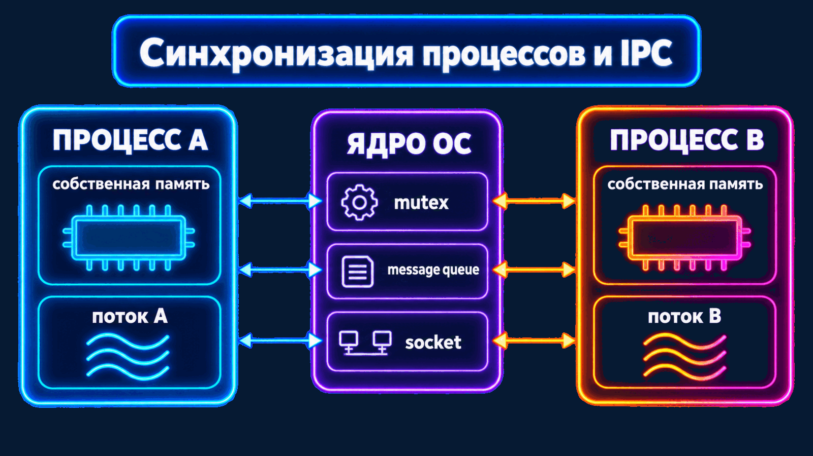

*Рисунок 1 — Синхронизация процессов и межпроцессное взаимодействие.*

# Паспорт лекции

| **Параметр**          | **Содержание**                                                                                                                              |
|-----------------------|---------------------------------------------------------------------------------------------------------------------------------------------|
| **Тема**              | Синхронизация и межпроцессное взаимодействие                                                                                                |
| **Место в курсе**     | Четвёртая лекция; развивает темы процессов и потоков и подготавливает анализ системных служб, памяти и файловых систем                      |
| **Продолжительность** | 2 академических часа (90 минут)                                                                                                             |
| **Основной вопрос**   | Как сохранить инварианты при конкуренции и превратить IPC в управляемую границу доверия?                                                    |
| **Результат**         | Обучающийся объясняет гонки и взаимоблокировки, выбирает примитив синхронизации, сравнивает IPC и проектирует безопасный локальный протокол |

# Цель и планируемые результаты

Цель лекции — освоить причины гонок и взаимоблокировок, свойства примитивов синхронизации и безопасный выбор средств межпроцессного взаимодействия.

- различать конкурентность, параллелизм, гонку и критическую секцию;

- формулировать логический инвариант и определять область его защиты;

- объяснять атомарность, видимость и порядок памяти;

- выбирать мьютекс, семафор, условную переменную, RW-lock или атомарную операцию по смыслу задачи;

- выявлять четыре условия взаимоблокировки и строить граф ожидания;

- различать deadlock, livelock, голодание и инверсию приоритетов;

- сравнивать каналы, очереди, разделяемую память, сокеты, сигналы и передачу дескрипторов;

- проектировать IPC-протокол с аутентификацией стороны, авторизацией команды, лимитами и семантикой отказа.

# План лекции

1.  4.1. Гонки и критические секции.

2.  4.2. Примитивы синхронизации.

3.  4.3. Взаимоблокировки и нарушения живучести.

4.  4.4. Механизмы IPC и их риски.

5.  Прикладной разбор локального IPC для службы резервного копирования.

На рисунке 2 представлена схема «Логика лекции».

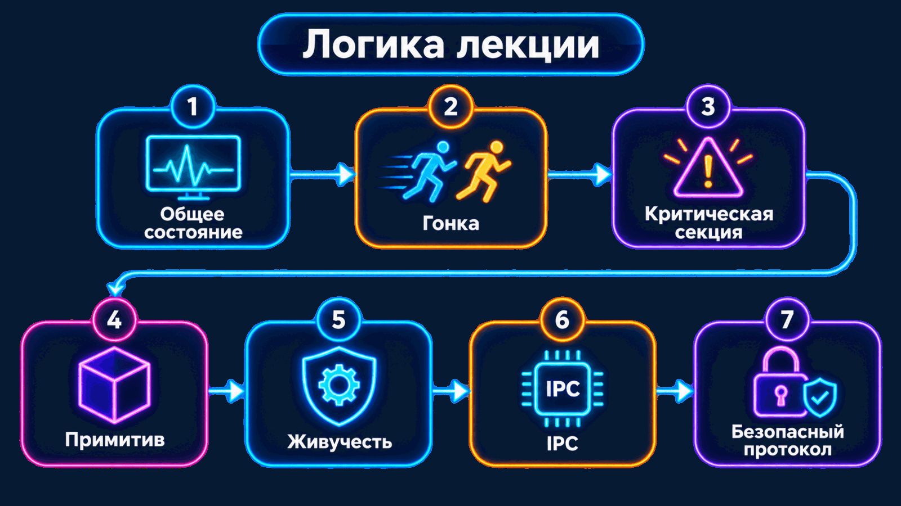

*Рисунок 2 — Логика лекции.*

# Рекомендуемое распределение времени

| **Этап**             | **Содержание**                                 | **Время** |
|----------------------|------------------------------------------------|-----------|
| **Вход в тему**      | Потерянное обновление и общий инвариант        | 8 мин     |
| **Гонки**            | Чередования, критические секции, TOCTOU        | 18 мин    |
| **Примитивы**        | Мьютекс, семафор, условие, атомики и выбор     | 22 мин    |
| **Взаимоблокировки** | Условия, граф, предотвращение и восстановление | 18 мин    |
| **IPC**              | Механизмы, границы сообщений, права и ресурсы  | 17 мин    |
| **Закрепление**      | Unix-сокет службы резервирования и тесты       | 7 мин     |

| **Проблемный вопрос. Если каждый поток выполняет корректный код, почему совместный результат всё равно может быть неверным — и почему правильно расставленные мьютексы способны полностью остановить систему?** |
|-----------------------------------------------------------------------------------------------------------------------------------------------------------------------------------------------------------------|

На рисунке 3 представлена схема «Гонка и взаимоблокировка как две ошибки протокола взаимодействия».

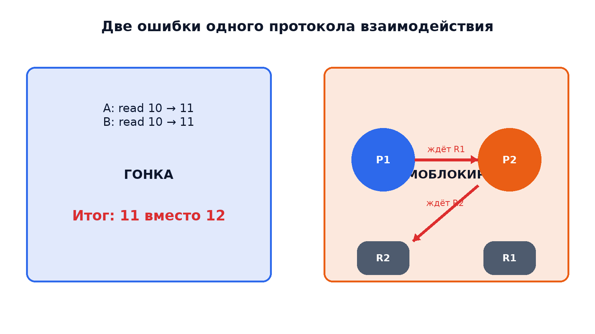

*Рисунок 3 — Гонка и взаимоблокировка как две ошибки протокола взаимодействия.*

# Карта понятий лекции

| **Вопрос**                     | **Понятие**                      | **Что проверяем**                           |
|--------------------------------|----------------------------------|---------------------------------------------|
| **Что разделяется?**           | Общее состояние                  | Владение, срок жизни и инвариант            |
| **Где возникает ошибка?**      | Гонка и TOCTOU                   | Неупорядоченные конфликтующие действия      |
| **Как упорядочить?**           | Примитив синхронизации           | Семантика, видимость и живучесть            |
| **Почему нет прогресса?**      | Deadlock / livelock / starvation | Граф ожидания и условия продолжения         |
| **Как процессы обмениваются?** | IPC                              | Границы, копирование, права и отказ         |
| **Как доказать безопасность?** | Контракт и тест                  | Авторизация, лимиты, аудит и восстановление |

# Минимальная модель корректного обмена

| **Этап**          | **Требование**                                         | **Ошибка при нарушении**              |
|-------------------|--------------------------------------------------------|---------------------------------------|
| **1. Публикация** | Данные полностью сформированы до объявления готовности | Чтение частичной структуры            |
| **2. Сигнал**     | Пробуждение связано с явным предикатом                 | Потерянное или ложное событие         |
| **3. Получение**  | Предикат повторно проверен под защитой                 | Использование уже забранного ресурса  |
| **4. Проверка**   | Формат, сторона и операция валидированы                | Обход политики или повреждение        |
| **5. Завершение** | Определены результат, повтор и очистка                 | Дубликат, утечка или неопределённость |

# 4.1. Гонки и критические секции

Параллельное выполнение безопасно только тогда, когда результат не зависит от случайного чередования операций. Для этого необходимо определить общий инвариант, границы критической секции и правила владения изменяемым состоянием.

На рисунке 4 представлена схема «Общее состояние и инвариант».

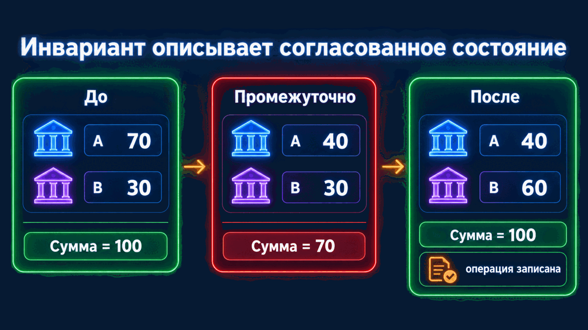

*Рисунок 4 — Общее состояние и инвариант.*

## 4.1.1. Конкурентность и параллелизм

Конкурентность означает, что несколько работ находятся в процессе выполнения и их шаги могут чередоваться. Параллелизм означает фактическое одновременное выполнение на нескольких ядрах или устройствах. Гонка возможна в обоих случаях: даже на одном ядре поток может быть вытеснен между чтением и записью общего значения. Поэтому корректность нельзя обосновывать фразой «операции почти не пересекаются». Нужно учитывать все допустимые точки переключения.

Источник недетерминизма — не только планировщик. Ввод-вывод, прерывания, сигналы, асинхронные обработчики, действия другого процесса и аппаратное выполнение также меняют порядок событий. Один и тот же тест может тысячи раз завершаться успешно, а затем нарушить инвариант при другом тайминге. Добавление журналирования или отладчика меняет задержки и иногда маскирует дефект.

Для анализа удобно строить частичный порядок событий. Некоторые действия обязаны следовать друг за другом внутри одного потока, а между потоками порядок возникает только через явно заданную синхронизацию. Если два конфликтующих доступа не упорядочены, результат потенциально зависит от чередования. Такой взгляд отделяет доказательство корректности от конкретной скорости машины.

На рисунке 5 представлена схема «Конкурентность и параллелизм».

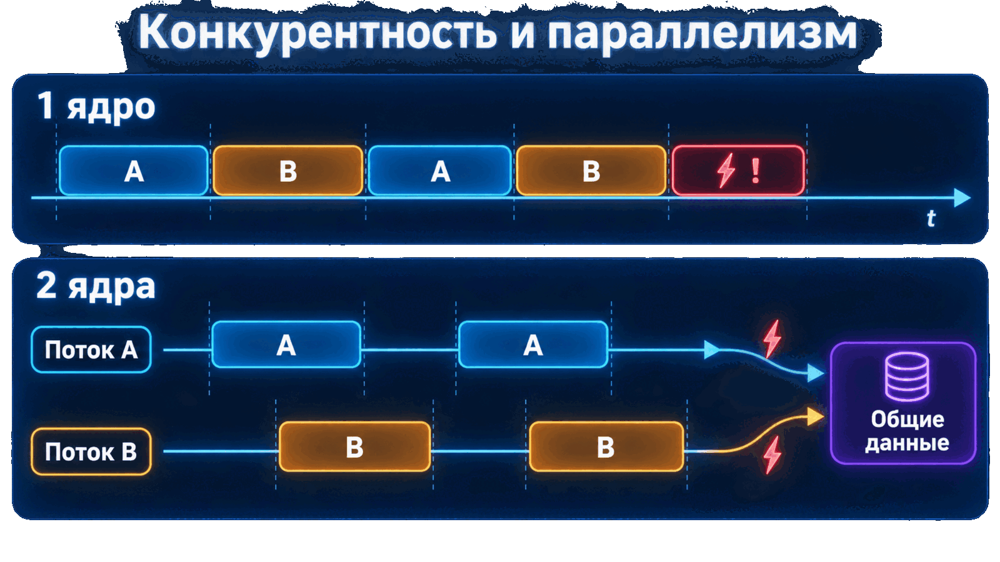

*Рисунок 5 — Конкурентность и параллелизм.*

## 4.1.2. Потерянное обновление

Выражение count = count + 1 выглядит единой операцией языка, но обычно включает чтение значения, вычисление и запись результата. Потоки A и B могут прочитать одинаковое значение 10, каждый вычислить 11 и оба записать 11. Одно увеличение потеряно, хотя оба потока завершились без системной ошибки. Защита должна охватывать всю последовательность чтение–изменение–запись.

Гонки проявляются не только числовыми ошибками. Возможны повреждение связного списка, двойное освобождение памяти, использование объекта после удаления, повторная отправка команды, нарушение счётчика ссылок или раскрытие данных между запросами. Особенно опасны редкие гонки в привилегированной службе: они могут превратить логическую ошибку в обход проверки или повышение полномочий.

Простейший способ воспроизведения — многократно запускать много участников на общем счётчике и сравнивать фактический итог с ожидаемым. Однако отсутствие ошибки не доказывает корректность. Полезны инструменты обнаружения гонок, стресс-тесты, искусственные задержки и анализ модели, но окончательное обоснование требует ясного правила синхронизации.

На рисунке 6 представлена схема «Потерянное обновление общего счётчика».

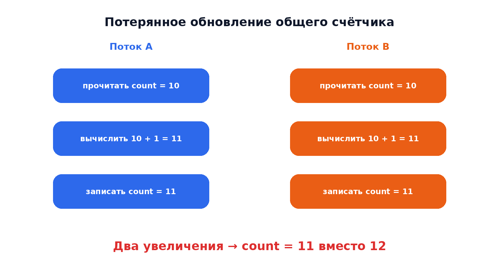

*Рисунок 6 — Потерянное обновление общего счётчика.*

На рисунке 7 представлена схема «Гонка данных и race condition».

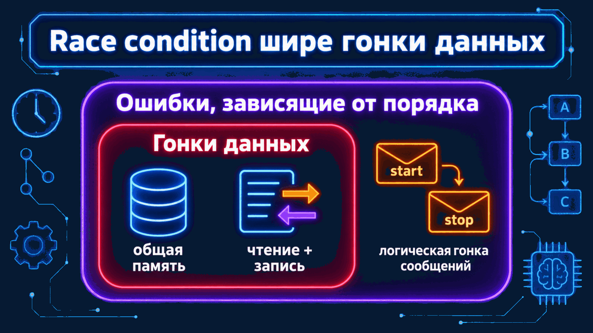

*Рисунок 7 — Гонка данных и race condition.*

## 4.1.3. Отношение happens-before и корректность наблюдений

Для рассуждения о конкурентной программе недостаточно сравнивать физическое время операций. Важен логический порядок: действие A *happens-before* действия B, если программа и механизмы синхронизации гарантируют, что последствия A должны быть наблюдаемы в B. Такой порядок возникает внутри одного потока, при успешной передаче управления через мьютекс, семафор, условную переменную, создание и завершение потока, а также через операции с явно заданной моделью памяти.

Если два конфликтующих обращения к одной области памяти не упорядочены отношением happens-before и хотя бы одно из них является записью, возникает гонка данных. Это более точный критерий, чем фраза «потоки выполняются одновременно»: операции могут происходить в разные моменты физического времени, но оставаться логически неупорядоченными.

Отношение happens-before также объясняет видимость. Освобождение мьютекса публикует изменения защищённого состояния, а последующий успешный захват того же мьютекса другим потоком делает эти изменения доступными наблюдателю. Поэтому мьютекс — не только запрет одновременного входа, но и граница публикации состояния.

На рисунке 8 представлена схема «Отношение happens-before».

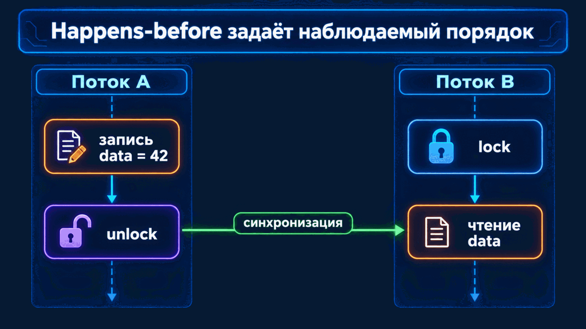

*Рисунок 8 — Отношение happens-before.*

## 4.1.4. Критическая секция и инвариант

Критическая секция — участок, в котором поток обращается к общему состоянию так, что одновременное выполнение другими участниками может нарушить инвариант. Инвариант — условие, которое должно оставаться истинным в наблюдаемом состоянии системы. Например, при переводе между счетами сумма двух остатков и запись операции должны изменяться согласованно.

Защищать следует не отдельную переменную, а логически связанную операцию. Два разных поля могут входить в один инвариант, а одна переменная может использоваться в нескольких независимых сценариях. Если блокировать каждую запись отдельно, внешний наблюдатель увидит промежуточное состояние. Если держать блокировку на всём длительном запросе, параллелизм и доступность ухудшатся.

Правило владения должно отвечать на вопросы: какой примитив защищает данные, кто его захватывает, в каком порядке, когда состояние считается согласованным и кому разрешено читать без блокировки. Эти сведения фиксируют рядом с интерфейсом объекта. Комментарий «потокобезопасно» без указания инварианта и протокола недостаточен.

На рисунке 9 представлена схема «Критическая секция».

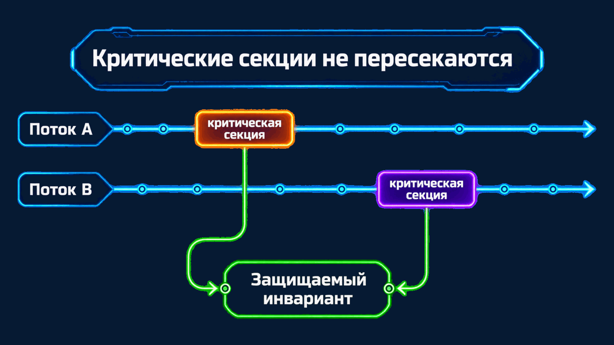

*Рисунок 9 — Критическая секция.*

## 4.1.5. Требования к решению критической секции

Взаимное исключение требует, чтобы в критической секции одновременно находился не более чем один участник, если операция несовместима с параллельным выполнением. Прогресс означает, что свободный ресурс не блокируется без причины и решение о следующем владельце принимают реально заинтересованные участники. Ограниченное ожидание исключает бесконечное откладывание одного потока.

Безопасность описывает то, что никогда не должно произойти: два владельца одного невзаимозаменяемого ресурса, отрицательный счётчик или чтение частично обновлённой структуры. Живучесть описывает то, что в подходящих условиях должно когда-нибудь произойти: запрос завершится, ожидающий получит шанс, система выйдет из переходного состояния.

Справедливость не всегда является строгой гарантией примитива. Некоторые реализации допускают, что новый поток перехватит освобождённый мьютекс раньше давно ожидающего. Это может быть эффективно, но требует оценки максимальной задержки. Для реального времени или критических очередей нужны более сильные свойства и анализ приоритетов.

На рисунке 10 представлена схема «Безопасность и живучесть».

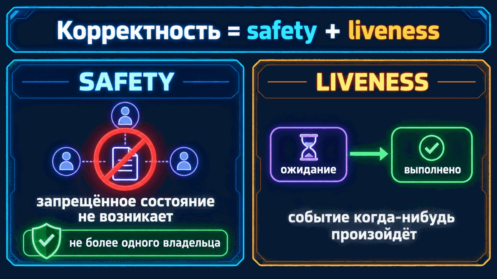

*Рисунок 10 — Безопасность и живучесть.*

## 4.1.6. Гранулярность и область блокировки

Крупная блокировка проста для доказательства: один мьютекс защищает весь объект или подсистему. Цена — сериализация независимых операций и рост задержки. Мелкие блокировки повышают параллелизм, но увеличивают число состояний, порядок захвата и риск взаимоблокировки. Оптимальная гранулярность определяется не количеством строк, а связями инвариантов.

Под блокировкой не следует выполнять непредсказуемо долгие операции: сетевой запрос, медленный диск, пользовательский обратный вызов или запуск внешнего кода. Такой вызов способен зависнуть, повторно войти в подсистему или захватить другие ресурсы в неизвестном порядке. Обычно под мьютексом фиксируют состояние и формируют локальную копию задачи, затем освобождают его и выполняют длительную работу.

Сокращение области блокировки нельзя выполнять механически. Если данные считываются под мьютексом, а затем используются после освобождения, нужно гарантировать срок жизни объекта и неизменность необходимых полей. Часто применяют копирование, счётчики ссылок, неизменяемые снимки или передачу владения.

На рисунке 11 представлена схема «Гранулярность блокировки».

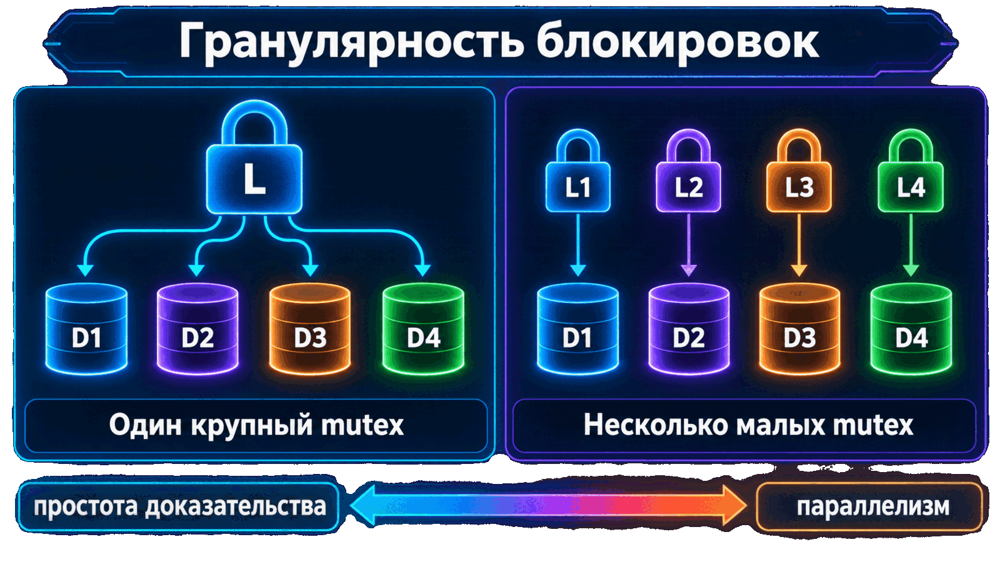

*Рисунок 11 — Гранулярность блокировки.*

## 4.1.7. TOCTOU как гонка безопасности

TOCTOU — разрыв между проверкой условия и использованием ресурса. Программа сначала проверяет путь, владельца или права, затем позднее открывает объект. Между действиями другой участник может заменить ссылку, каталог или символическую ссылку. В результате используется не тот объект, который прошёл проверку.

Надёжный подход связывает проверку и действие с одним устойчивым объектом. Вместо повторного обращения по строковому имени открывают дескриптор безопасным способом, проверяют свойства уже открытого объекта и выполняют операцию через него. Для файлов учитывают относительные операции от доверенного каталога, запрет неожиданных ссылок и корректные флаги создания.

TOCTOU показывает, что одной авторизации недостаточно, если идентичность объекта может измениться. Политика должна применяться в точке использования, а ссылка на проверенный объект — оставаться однозначной. Этот принцип повторяется в IPC: проверка соединения не должна автоматически разрешать любую последующую команду.

| **Ключевой вывод. Объект синхронизации выбирают по логическому инварианту. Корректность должна сохраняться при любом допустимом чередовании, а проверка безопасности — быть связана с фактически используемым объектом.** |
|---------------------------------------------------------------------------------------------------------------------------------------------------------------------------------------------------------------------------|

На рисунке 12 представлена схема «TOCTOU как гонка безопасности».

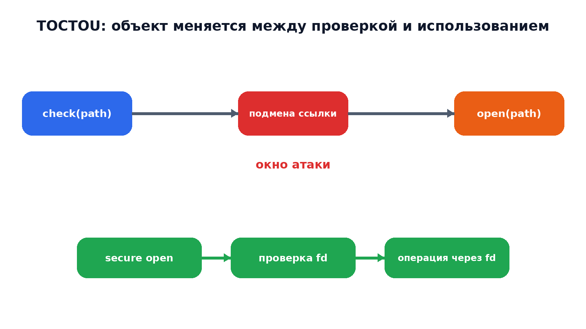

*Рисунок 12 — TOCTOU как гонка безопасности.*

# 4.2. Примитивы синхронизации

Мьютекс, семафор, условная переменная, атомарная операция и спин-блокировка имеют разную семантику. Правильный выбор начинается с вопроса: нужно владение, счётчик ресурса, ожидание предиката или короткая неделимая операция?

На рисунке 13 представлена схема «Выбор примитива синхронизации».

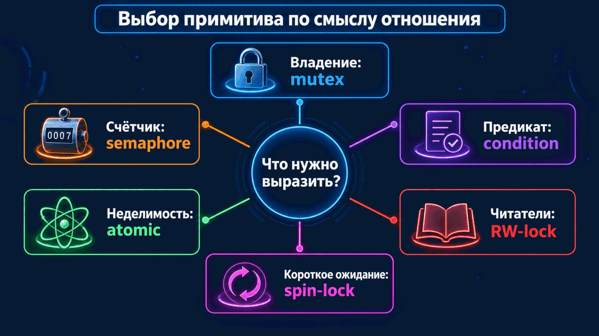

*Рисунок 13 — Выбор примитива синхронизации.*

## 4.2.1. Атомарность, видимость и порядок памяти

Атомарность означает, что операция наблюдается как неделимая относительно других участников. Она не гарантирует, что несколько атомарных операций вместе образуют транзакцию. Например, отдельные атомарные чтение и запись не делают атомарным условие «если значение равно X, заменить на Y»; нужна операция сравнения с обменом или блокировка.

Видимость отвечает на вопрос, когда запись одного ядра становится наблюдаемой другим. Компилятор и процессор могут менять порядок независимых операций, использовать регистры и буферы записи. Примитив синхронизации задаёт отношение happens-before: действия до освобождения становятся видимыми потоку после успешного захвата того же механизма.

Ключевое слово, запрещающее часть оптимизаций, не всегда создаёт межпотоковую синхронизацию. Для общего состояния следует использовать модель памяти языка и проверенные атомарные типы. Чем слабее выбранный порядок памяти, тем труднее доказательство; в прикладном коде разумно начинать с более сильной и понятной семантики.

На рисунке 14 представлена схема «Атомарность, видимость и порядок памяти».

*Рисунок 14 — Атомарность, видимость и порядок памяти.*

## 4.2.2. Мьютекс

Мьютекс имеет владельца: поток, который успешно захватил его, обязан освободить. Он выражает эксклюзивное владение критической секцией и обычно блокирует ожидающего без активного расходования процессора. Попытка повторного захвата нерекурсивного мьютекса тем же потоком приводит к самоблокировке.

Правильное использование связывает мьютекс с данными, а не с отдельной функцией. Все пути чтения и записи, участвующие в инварианте, обязаны соблюдать один протокол. Ошибки возникают при раннем возврате, исключении, отмене потока и забытом освобождении, поэтому предпочтительны конструкции автоматического управления временем жизни блокировки.

Рекурсивный мьютекс разрешает одному потоку захватить объект несколько раз, но часто скрывает неясную архитектуру и повторный вход. Он не решает взаимоблокировку между разными мьютексами. Перед применением следует понять, почему повторный вход допустим и каким образом сохраняется инвариант на каждом уровне.

На рисунке 15 представлена схема «Мьютекс».

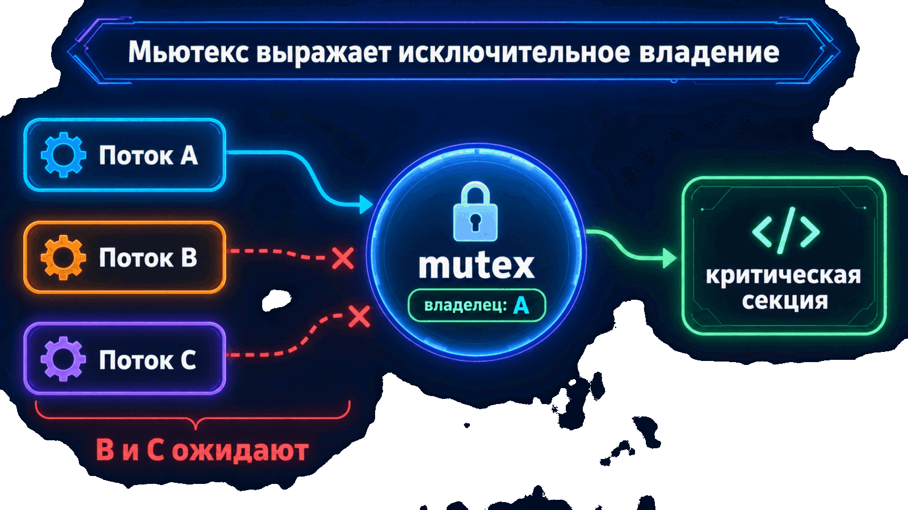

*Рисунок 15 — Мьютекс.*

## 4.2.3. Семафор

Счётный семафор хранит число доступных единиц ресурса. Операция ожидания уменьшает счётчик или блокирует поток при нуле, операция освобождения увеличивает его и пробуждает ожидающего. Семафор подходит для пула соединений, ограниченного числа рабочих мест или свободных слотов очереди.

Бинарный семафор внешне похож на мьютекс, но не обязательно имеет владельца: один поток может ожидать, другой — сигнализировать. Это полезно для событий, но делает труднее обнаружение ошибочного освобождения. Если требуется именно защита инварианта владельцем, мьютекс выражает намерение яснее.

Начальное значение и баланс операций являются частью протокола. Лишний post создаёт несуществующий ресурс, пропущенный — блокирует систему. Семафор не хранит данные сообщения и не объясняет, какое событие произошло; при сложных состояниях лучше использовать очередь сообщений или условную переменную с явным предикатом.

На рисунке 16 представлена схема «Семафор».

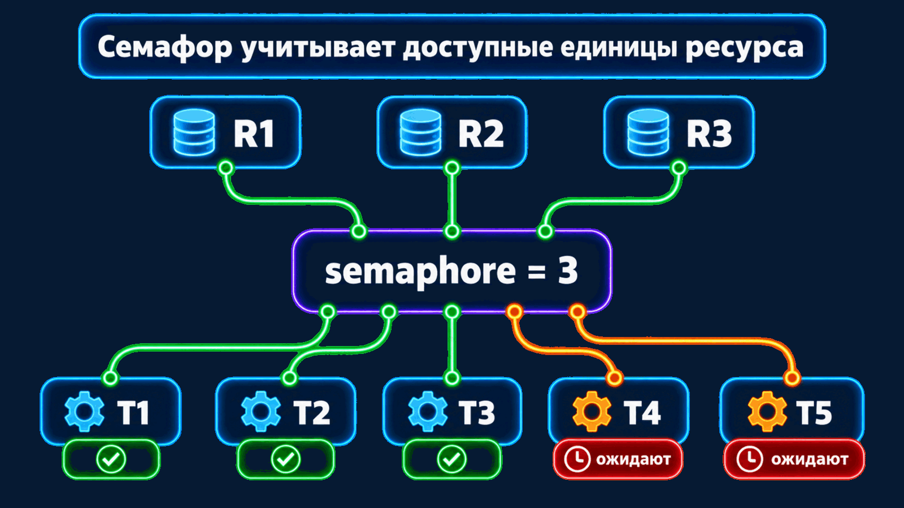

*Рисунок 16 — Семафор.*

## 4.2.4. Условная переменная

Условная переменная позволяет потоку ждать истинности предиката, защищённого мьютексом. Операция wait атомарно освобождает мьютекс и переводит поток в ожидание; после пробуждения поток снова захватывает мьютекс и только затем возвращается. Это устраняет окно между проверкой условия и засыпанием.

Ожидание всегда оформляют циклом while, а не единственным if. Пробуждение может быть ложным, несколько потоков могут конкурировать за одно изменение, а состояние — снова стать ложным до получения мьютекса. Сигнал означает «состояние могло измениться», но не передаёт право продолжать без проверки.

Сигнал обычно отправляют после изменения данных в рамках согласованного протокола. Нужно решить, пробуждать одного или всех. Массовое пробуждение создаёт эффект толпы: многие потоки просыпаются, но только один получает ресурс. Однако при разных предикатах или изменении глобального состояния broadcast может быть необходим.

На рисунке 17 представлена схема «Условная переменная».

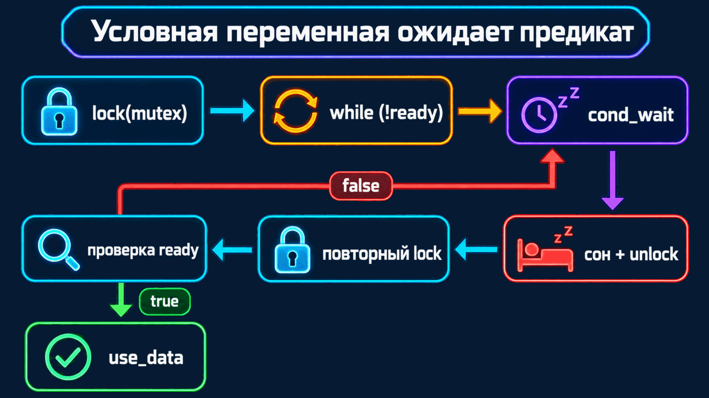

*Рисунок 17 — Условная переменная.*

## 4.2.5. Монитор как дисциплина организации общего состояния

Монитор объединяет данные, операции над ними и неявное или явное взаимное исключение. Внешний код не изменяет внутреннее состояние напрямую, а вызывает методы, которые сохраняют инвариант. Условные переменные внутри монитора позволяют временно освободить взаимное исключение, пока требуемый предикат ложен.

Ключевой шаблон ожидания: захватить мьютекс, проверить предикат в цикле `while`, выполнить `wait`, а после пробуждения снова проверить предикат. Цикл необходим из-за ложных пробуждений и потому, что другой поток может забрать ресурс раньше пробуждённого. Сигнал не передаёт ресурс и не заменяет предикат; он лишь сообщает, что состояние могло измениться.

На рисунке 18 представлена схема «Монитор».

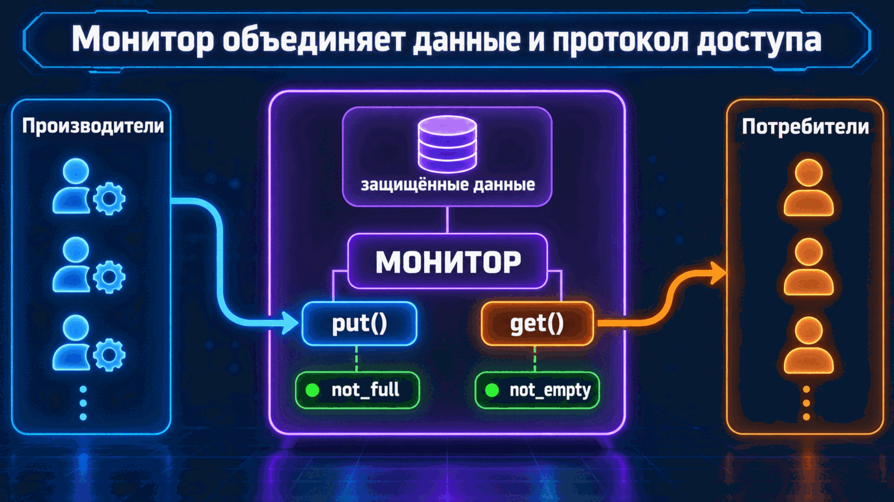

*Рисунок 18 — Монитор.*

## 4.2.6. Блокировка чтения–записи

RW-lock допускает несколько одновременных читателей или одного писателя. Он полезен, когда чтения действительно преобладают, критические секции достаточно длинны, а данные можно безопасно читать параллельно. При коротких участках накладные расходы и сложная политика справедливости могут сделать обычный мьютекс быстрее.

Следует учитывать голодание: при постоянном потоке читателей писатель может долго не получить доступ, а при приоритете писателя новые читатели задерживаются. Повышение блокировки из режима чтения в запись особенно опасно: два читателя могут одновременно ожидать эксклюзивный режим, не освобождая чтение.

Неизменяемые структуры, копирование при записи и версионированные снимки иногда лучше общей RW-блокировки. Они переносят стоимость в момент обновления и упрощают чтение. Выбор зависит от частоты изменений, размера данных, требований к согласованности и памяти.

На рисунке 19 представлена схема «RW-lock и неизменяемые снимки».

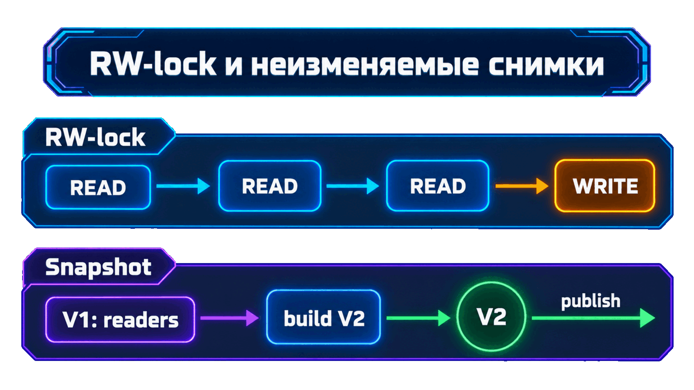

*Рисунок 19 — RW-lock и неизменяемые снимки.*

## 4.2.7. Спин-блокировка и futex

Спин-блокировка активно проверяет состояние и не переводит поток в сон. Она оправдана только при очень коротком ожидании, когда владелец гарантированно выполняется на другом ядре и переключение было бы дороже. В однопроцессорной среде или под долгой операцией активное ожидание лишь отнимает процессор у владельца.

В ядре спин-блокировки применяют в контекстах, где засыпать нельзя, например при определённых обработчиках и коротких структурах данных. Код под такой блокировкой не должен выполнять блокирующие вызовы. В прикладном коде прямое активное ожидание редко является первым выбором.

Современные пользовательские мьютексы могут использовать быстрый путь в памяти и обращаться к ядру только при конкуренции. Механизм futex позволяет ожидать изменение слова в памяти, но не является готовым высокоуровневым протоколом. Его корректное использование требует учёта гонок между проверкой и ожиданием, ложных пробуждений и времени жизни адреса.

На рисунке 20 представлена схема «Spin-lock и futex».

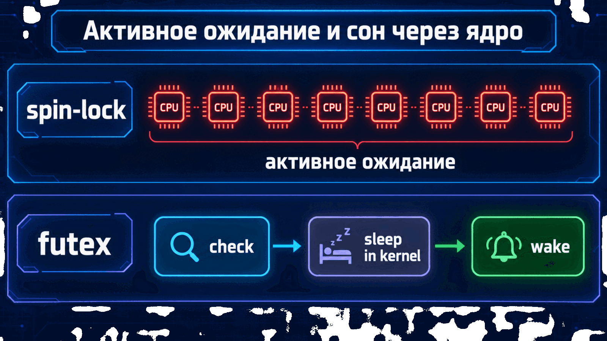

*Рисунок 20 — Spin-lock и futex.*

## 4.2.8. Выбор примитива и дисциплина блокировок

Если нужен единственный владелец инварианта — выбирают мьютекс. Если считают одинаковые ресурсы — семафор. Если ждут логическое условие над общими данными — условную переменную с мьютексом. Если операция короткая и поддерживается аппаратно — атомарный тип. Если читателей много и обновления редки — оценивают RW-lock или снимки.

Для каждой блокировки полезно задать имя, защищаемые данные, допустимый контекст, максимальное ожидаемое время удержания и место в глобальном порядке. Запрещают сетевые вызовы и внешний код под внутренней блокировкой, измеряют длительные удержания и документируют случаи try-lock или тайм-аута.

Высокоуровневые очереди, акторы и каналы уменьшают число явных блокировок, но не отменяют синхронизацию внутри реализации. Их преимущество — более ясное владение и ограниченные точки обмена. Критический код следует строить из проверенных библиотечных примитивов, а не из самодельных флагов и задержек.

| **Ключевой вывод. Примитив выбирают по семантике общего состояния. Механизм считается корректным только вместе с предикатом, правилом владения, обработкой ошибок и доказуемым порядком памяти.** |
|---------------------------------------------------------------------------------------------------------------------------------------------------------------------------------------------------|

На рисунке 21 представлена схема «Почему ожидание оформляют циклом while».

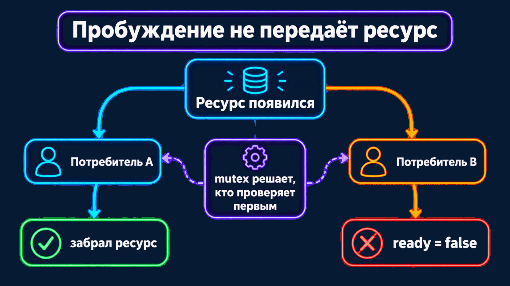

*Рисунок 21 — Почему ожидание оформляют циклом while.*

## 4.2.9. Классические задачи синхронизации

**Производитель–потребитель.** Производители помещают элементы в ограниченный буфер, потребители извлекают их. Мьютекс защищает структуру очереди; условие `not_full` останавливает производителя при заполнении, а `not_empty` — потребителя при пустом буфере. Смешение этих ролей — типичная ошибка: мьютекс отвечает за целостность, условия — за возможность продолжения.

Ограниченный буфер

**Читатели–писатели.** Несколько читателей могут работать одновременно, но писателю нужен исключительный доступ. Политика «приоритет читателей» увеличивает пропускную способность чтения, но может привести к голоданию писателя; приоритет писателей способен увеличить задержку читателей. Поэтому алгоритм должен явно фиксировать требуемую справедливость.

**Обедающие философы.** Задача показывает, что локально правильное правило «взять два ресурса» может создать глобальный цикл ожидания. Практический вывод — вводить глобальный порядок ресурсов, ограничивать число конкурентов либо использовать посредника, который выдаёт набор ресурсов атомарно.

Эти задачи полезны не как головоломки, а как компактные модели серверных пулов, очередей заданий, кэшей, транзакций и составных блокировок.

На рисунке 22 представлена схема «Задача производитель–потребитель».

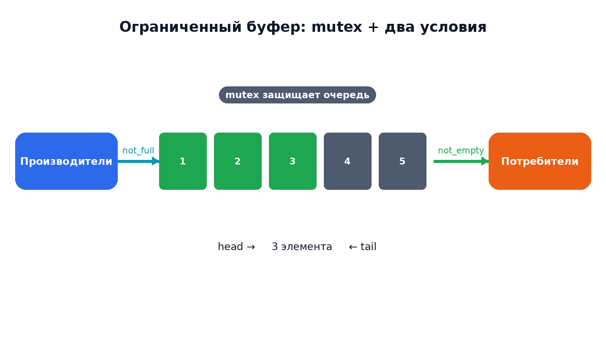

*Рисунок 22 — Задача производитель–потребитель.*

# 4.3. Взаимоблокировки и нарушения живучести

Взаимное исключение защищает данные, но создаёт ожидание. Если зависимости между ресурсами образуют цикл, корректные по отдельности блокировки способны остановить всю систему.

На рисунке 23 представлена схема «Обедающие философы и составные ресурсы».

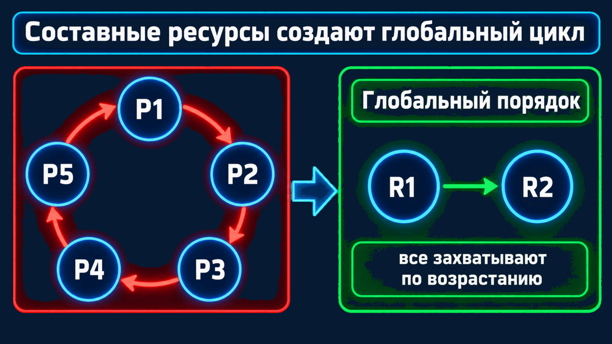

*Рисунок 23 — Обедающие философы и составные ресурсы.*

## 4.3.1. Четыре условия взаимоблокировки

Классическая взаимоблокировка возможна при одновременном выполнении четырёх условий Коффмана. Взаимное исключение означает, что ресурс не разделяется. Удержание и ожидание — участник сохраняет один ресурс, запрашивая другой. Отсутствие принудительного изъятия не позволяет ОС безопасно забрать ресурс. Циклическое ожидание замыкает цепочку владельцев.

Пример с двумя мьютексами: поток A удерживает L1 и ждёт L2, поток B удерживает L2 и ждёт L1. Оба работоспособны, но ни один не может сделать следующий шаг. В реальной системе цикл может включать десятки потоков, базы данных, файловые блокировки и ответы внешних служб.

Самоблокировка является частным случаем: поток повторно захватывает нерекурсивный мьютекс или ждёт событие, которое должен создать сам. Поэтому граф ожидания должен включать не только разные потоки, но и зависимости внутри одного пути выполнения.

Цикл ожидания ресурсов

На рисунке 24 представлена схема «Четыре условия взаимоблокировки».

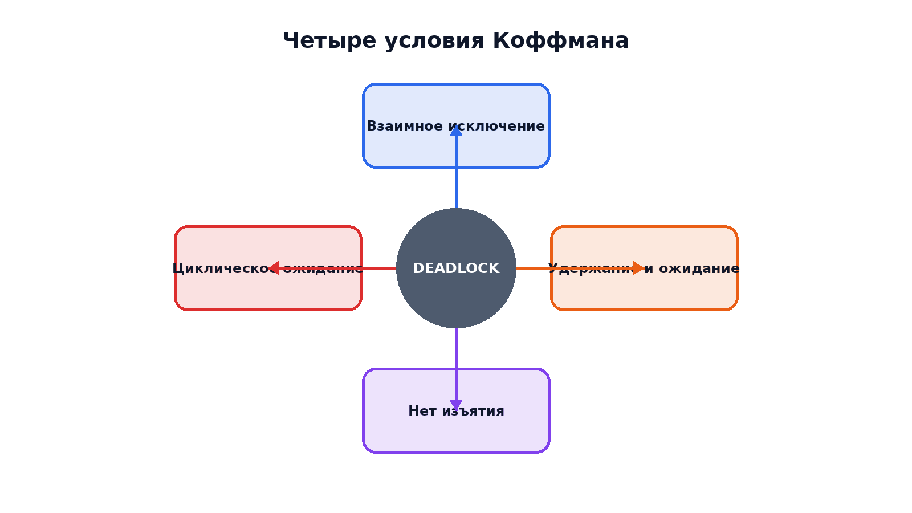

*Рисунок 24 — Четыре условия взаимоблокировки.*

## 4.3.2. Граф распределения ресурсов и wait-for graph

Граф распределения связывает процессы и ресурсы рёбрами запроса и назначения. Для ресурсов с одним экземпляром цикл указывает на взаимоблокировку. В wait-for graph ресурсы сворачиваются, а ребро A → B означает, что A ждёт ресурс, которым владеет B. Цикл делает причину зависания наглядной.

Практическая диагностика сопоставляет владельцев блокировок, стеки ожидающих потоков и временные метки. Дамп всех потоков показывает, где они остановились. Журнал захвата с идентификаторами помогает восстановить порядок, но сам может влиять на тайминг и должен быть ограничен.

Не всякое длительное ожидание является deadlock. Поток может ждать медленный диск, удалённый ответ или редкое событие без цикла. Диагноз требует отличить отсутствие прогресса от медленного прогресса и установить, способен ли кто-либо изменить условие ожидания.

На рисунке 25 представлена схема «Граф распределения ресурсов».

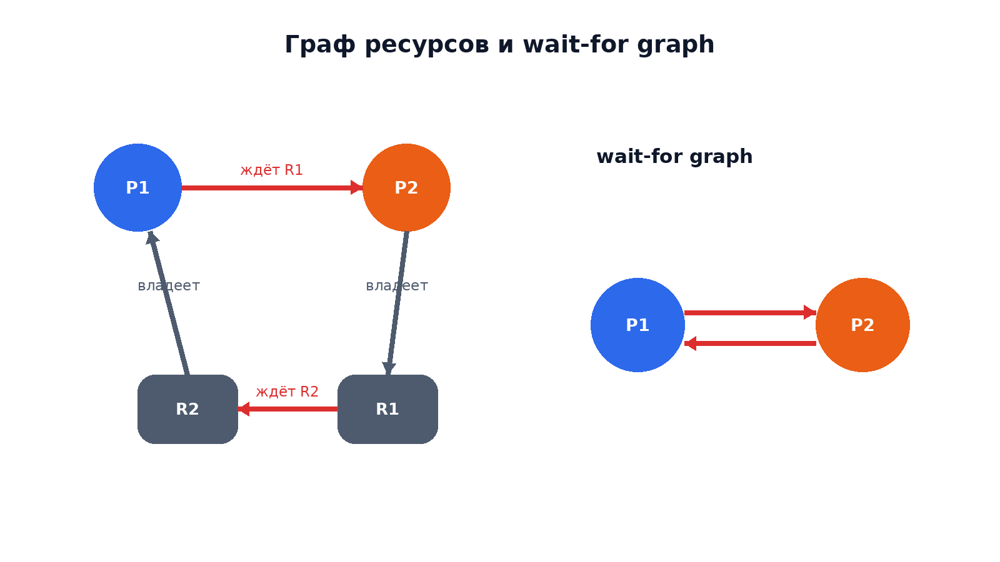

*Рисунок 25 — Граф распределения ресурсов.*

## 4.3.3. Предотвращение и глобальный порядок

Предотвращение нарушает хотя бы одно необходимое условие. Наиболее распространённый метод — глобальный порядок ресурсов: все пути захватывают L1 раньше L2. Тогда циклическое ожидание невозможно. Порядок должен быть полным, документированным и проверяемым в коде.

Другой подход — запросить все ресурсы до начала операции или освободить уже полученные при невозможности продолжить. Это уменьшает удержание при ожидании, но может снижать параллелизм, усложнять откат и вызывать голодание. Принудительное изъятие допустимо только для ресурсов, состояние которых можно безопасно сохранить и восстановить.

try-lock позволяет отказаться от ожидания и повторить попытку, но без стратегии задержки несколько участников могут синхронно мешать друг другу. Случайная пауза или приоритет одного участника снижает livelock, однако операция должна быть идемпотентной или иметь корректный откат.

На рисунке 26 представлена схема «Предотвращение взаимоблокировки».

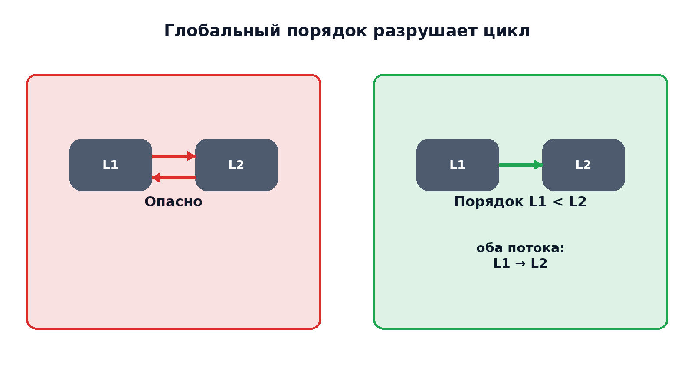

*Рисунок 26 — Предотвращение взаимоблокировки.*

## 4.3.4. Избежание и обнаружение

Избежание допускает потенциально опасные запросы только тогда, когда после выдачи система остаётся в безопасном состоянии. Алгоритм банкира требует заранее знать максимальные потребности, что редко удобно для универсальных приложений, но полезно как модель различия между безопасным и уже заблокированным состоянием.

Обнаружение разрешает ожидания, периодически строит граф и ищет цикл. Такой подход применяется, когда предотвращение слишком дорого, а восстановление возможно. Периодичность проверки балансирует стоимость анализа и время простоя.

Для распределённых систем обнаружение сложнее: состояние наблюдается не одновременно, сообщения задерживаются, участники могут отказать. Ложный вывод о взаимоблокировке или пропущенный цикл требует протоколов с поколениями, дедлайнами и согласованной моделью отказа.

На рисунке 27 представлена схема «Избежание, обнаружение и восстановление».

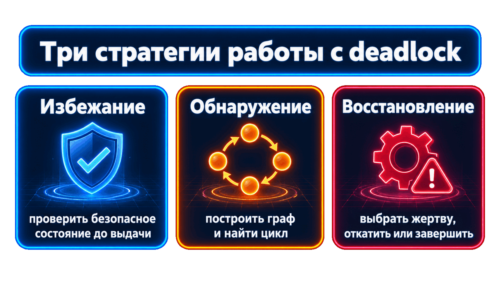

*Рисунок 27 — Избежание, обнаружение и восстановление.*

## 4.3.5. Восстановление и тайм-ауты

Восстановление может завершить один процесс, отменить транзакцию, откатить изменения или перезапустить компонент. Выбор жертвы учитывает стоимость выполненной работы, приоритет, удерживаемые ресурсы и риск повторения. Убийство потока внутри процесса часто небезопасно: он мог оставить общий инвариант нарушенным.

Тайм-аут ограничивает максимальное ожидание и создаёт наблюдаемое событие, но не исправляет архитектурный цикл. После тайм-аута нужно знать, была ли операция выполнена частично, можно ли повторять запрос и какие ресурсы освобождены. Без этого клиент создаст дубликат или продолжит с повреждённым состоянием.

Устойчивый дизайн сочетает порядок блокировок, ограниченное время внешних операций, транзакционность, идемпотентность и контролируемый перезапуск. Метрики длительности ожидания помогают обнаружить деградацию до полного зависания.

## 4.3.6. Голодание, livelock и инверсия приоритетов

Голодание возникает, когда поток остаётся готовым или ожидающим ресурса, но постоянно уступает другим. Причиной могут быть несправедливая блокировка, постоянный поток читателей или фиксированный низкий приоритет. Старение, очередность и квоты ограничивают максимальное ожидание.

Livelock означает активность без полезного прогресса: два участника вежливо освобождают ресурс и повторяют попытку синхронно. Метрики CPU будут показывать работу, но состояние задачи не меняется. Нужны асимметрия, случайная задержка или централизованное решение.

Инверсия приоритетов возникает, когда высокоприоритетный поток ждёт ресурс низкоприоритетного, которого вытесняют средние задачи. Наследование приоритета временно повышает владельца. Однако оно помогает только при известной цепочке блокировок и не заменяет ограничение времени критической секции.

| **Ключевой вывод. Взаимоблокировку предотвращают архитектурой зависимостей, а не надеждой на редкость. Тайм-аут полезен для наблюдаемости и ограничения ущерба, но требует определённой семантики отмены и восстановления.** |
|------------------------------------------------------------------------------------------------------------------------------------------------------------------------------------------------------------------------------|

На рисунке 28 представлена схема «Нарушения живучести».

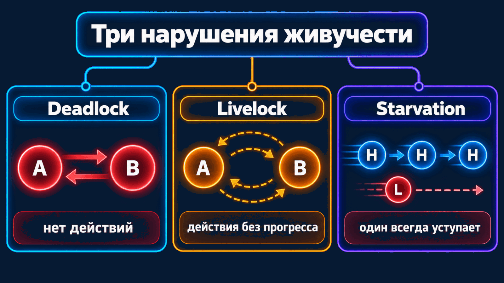

*Рисунок 28 — Нарушения живучести.*

На рисунке 29 представлена схема «Инверсия приоритетов и наследование приоритета».

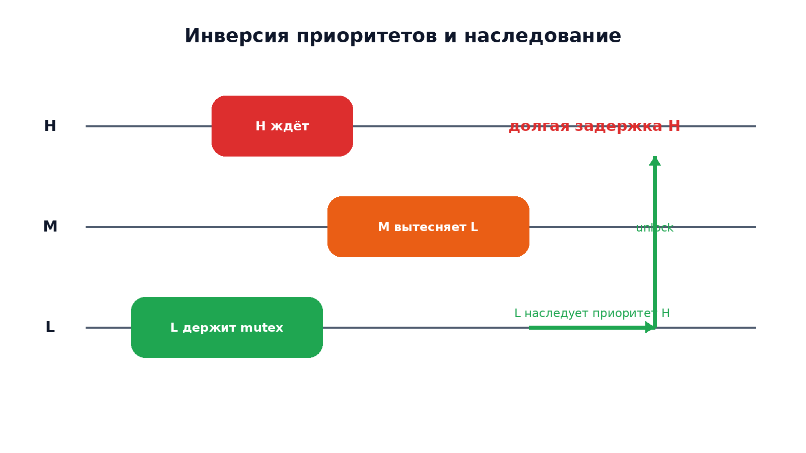

*Рисунок 29 — Инверсия приоритетов и наследование приоритета.*

# 4.4. Механизмы IPC и их риски

Межпроцессное взаимодействие пересекает границу изоляции. Поэтому любой IPC-интерфейс одновременно является каналом данных, точкой аутентификации, объектом авторизации и ресурсом, который можно исчерпать.

Карта механизмов IPC

На рисунке 30 представлена схема «Карта механизмов IPC».

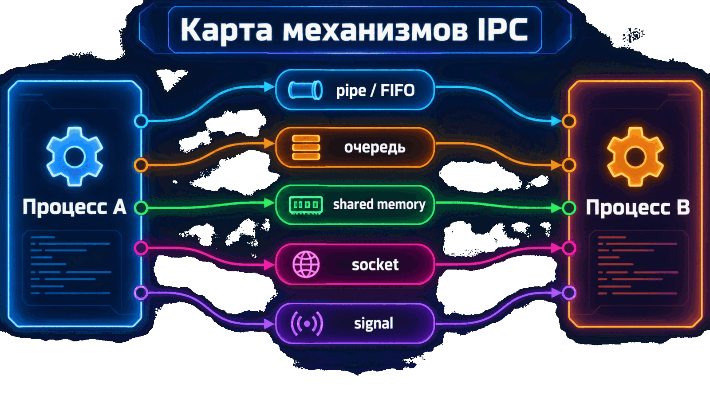

*Рисунок 30 — Карта механизмов IPC.*

## 4.4.1. Каналы и FIFO

Неименованный канал создаётся процессом и обычно связывает родственные процессы через наследуемые дескрипторы. Он передаёт поток байтов в одном направлении; границы отдельных записей не следует считать универсально сохранёнными. Закрытие концов канала является частью протокола и позволяет получателю увидеть конец данных.

Именованный канал представлен объектом файловой системы и позволяет связать несвязанные процессы. Права каталога и FIFO определяют, кто может открыть канал, но получатель всё равно проверяет формат. Предсказуемое имя в доступном для записи каталоге создаёт риск подмены объекта.

Канал имеет конечный буфер. Если читатель медленнее, писатель блокируется или получает ошибку в неблокирующем режиме. Это естественное обратное давление, но оно может вызвать взаимоблокировку, если писатель удерживает внутренний мьютекс, необходимый читателю для обработки.

На рисунке 31 представлена схема «Каналы и FIFO».

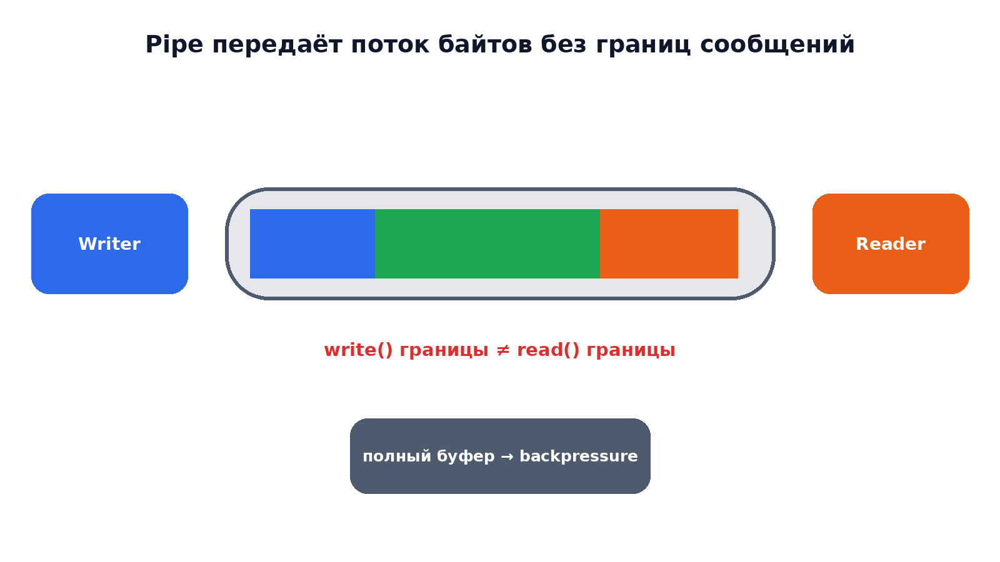

*Рисунок 31 — Каналы и FIFO.*

## 4.4.2. Очереди сообщений

Очередь сохраняет границы сообщений и отделяет скорость отправителя от получателя до заданного предела. Сообщение может иметь тип или приоритет. Это упрощает диспетчеризацию команд и позволяет нескольким работникам получать независимые задания.

Границы размера и числа сообщений обязательны. Неограниченная очередь превращает временную перегрузку в исчерпание памяти и увеличение задержки. Отправитель должен получать явный результат: принято, отклонено, отложено или истёк срок.

Сообщение является недоверенным объектом. Проверяются версия, тип, длина, обязательные поля, допустимое состояние и полномочия источника. Десериализация сложного формата не должна выполняться с лишними привилегиями.

На рисунке 32 представлена схема «Очереди сообщений».

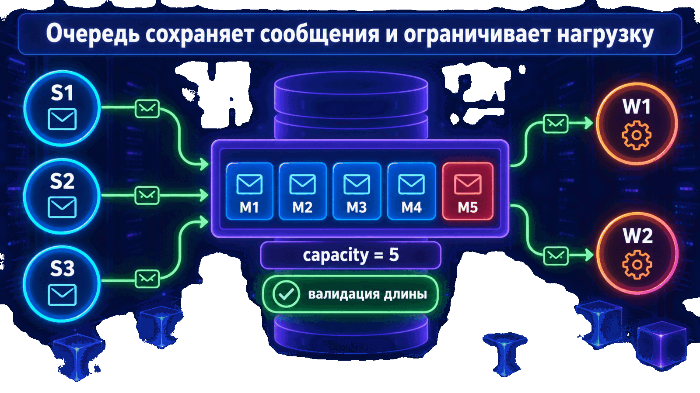

*Рисунок 32 — Очереди сообщений.*

## 4.4.3. Разделяемая память

Разделяемая память отображает одни физические страницы в несколько процессов и обеспечивает высокую скорость после настройки. Она особенно эффективна для больших массивов, кадров и кольцевых буферов, где копирование сообщений дорого.

Скорость достигается ценой отсутствия встроенных границ и транзакций. Участники могут увидеть частично записанную структуру, неверный индекс или устаревшую версию. Нужны атомарные поля, мьютексы или семафоры, протокол публикации данных, выравнивание и ясное владение слотами.

Формат области должен быть версионирован, а все смещения и размеры — проверены. Указатели процесса нельзя безусловно хранить в общей памяти, потому что отображение может иметь другой базовый адрес. Следует определить создание, права, очистку после сбоя и поведение при несовместимых версиях участников.

Разделяемая память и синхронизация

На рисунке 33 представлена схема «Разделяемая память».

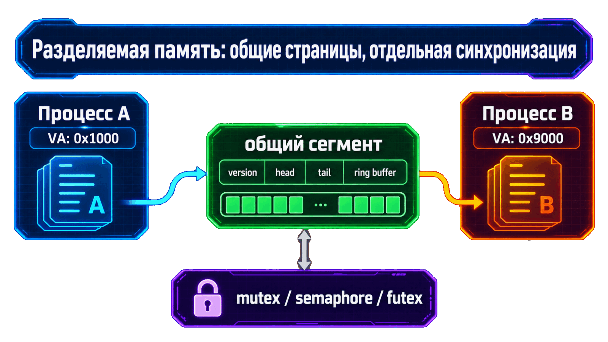

*Рисунок 33 — Разделяемая память.*

## 4.4.4. Локальные и сетевые сокеты

Сокеты предоставляют модель клиент–сервер и поддерживают потоковый или датаграммный обмен. Локальный Unix-сокет использует ядро того же узла, может иметь путь в файловой системе или абстрактное имя и в ряде систем позволяет получить учётные данные локального партнёра.

Потоковый сокет не сохраняет границы сообщений: один send может быть прочитан несколькими read, а несколько send — одним read. Протокол обязан самостоятельно задавать кадрирование: фиксированный заголовок, длину, тип, версию и ограничения. Неполное чтение и запись являются нормальными состояниями.

Локальность не означает доверие. Права на endpoint ограничивают подключение, но каждая команда дополнительно авторизуется. Сетевой сокет добавляет криптографическую защиту канала, управление сертификатами, повторные передачи и недоверенную сеть, однако принципы проверки формата и лимитов остаются теми же.

На рисунке 34 представлена схема «Сокеты и кадрирование сообщений».

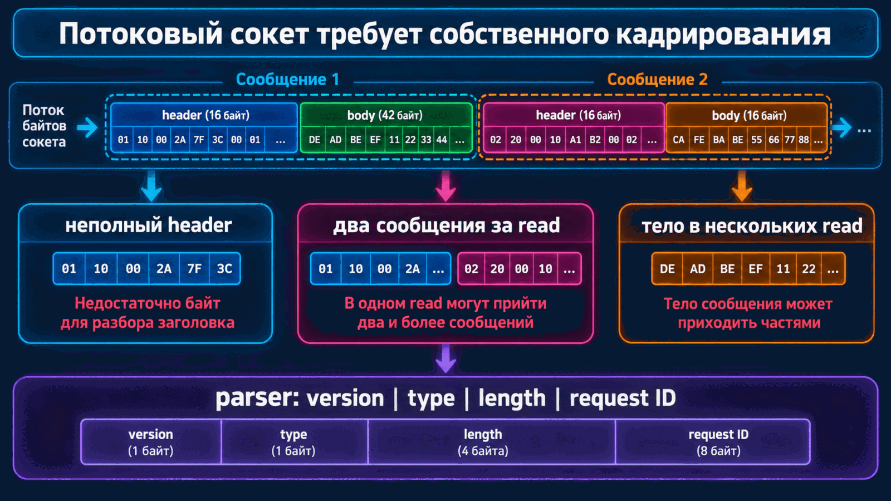

*Рисунок 34 — Сокеты и кадрирование сообщений.*

## 4.4.5. Сигналы и передача дескрипторов

Сигнал уведомляет процесс о событии, но несёт мало структурированных данных и может объединять повторные события. Обработчик выполняется асинхронно относительно обычного кода, поэтому ему доступен ограниченный набор безопасных операций. Часто обработчик лишь устанавливает атомарный флаг или пишет байт в специальный канал.

Локальный сокет может передать файловый дескриптор. Получатель получает доступ к уже открытому объекту, даже если не смог бы открыть его по имени. Это мощный способ делегирования полномочий: передаётся не строка, а ссылка на объект ядра с конкретным режимом.

Передачу дескрипторов необходимо авторизовать и ограничивать по типу объекта. Получатель проверяет метаданные, режим и ожидаемое назначение. Утечка дескриптора через наследование или IPC способна обойти файловые права и сетевые ограничения.

На рисунке 35 представлена схема «Сигналы и передача дескрипторов».

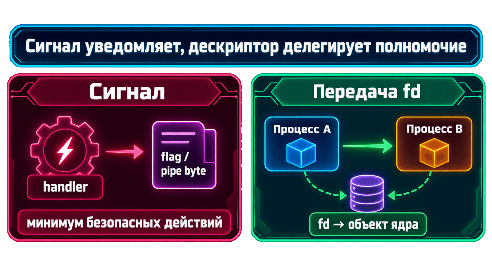

*Рисунок 35 — Сигналы и передача дескрипторов.*

## 4.4.6. IPC как граница доверия

Получатель аутентифицирует сторону, но не смешивает это с авторизацией команды. Один и тот же клиент может иметь право запросить статус, но не изменить конфигурацию. Решение учитывает фактические учётные данные процесса, роль, параметры запроса и состояние службы.

Протокол задаёт версию, тип, длину, идентификатор запроса, допустимую последовательность и код результата. Длины проверяют до выделения памяти, арифметику размеров — на переполнение, строки — на кодировку и завершение. Неизвестные типы отклоняют безопасно.

Ограничивают число соединений, очередь, размер сообщения, частоту и длительность работы. Длительные задачи выносят из блокировки приёмной очереди. Отказ клиента не должен удерживать ресурс, а ошибка сервера — оставлять неопределённый результат без идентификатора операции.

Безопасный IPC-протокол

На рисунке 36 представлена схема «IPC как граница доверия».

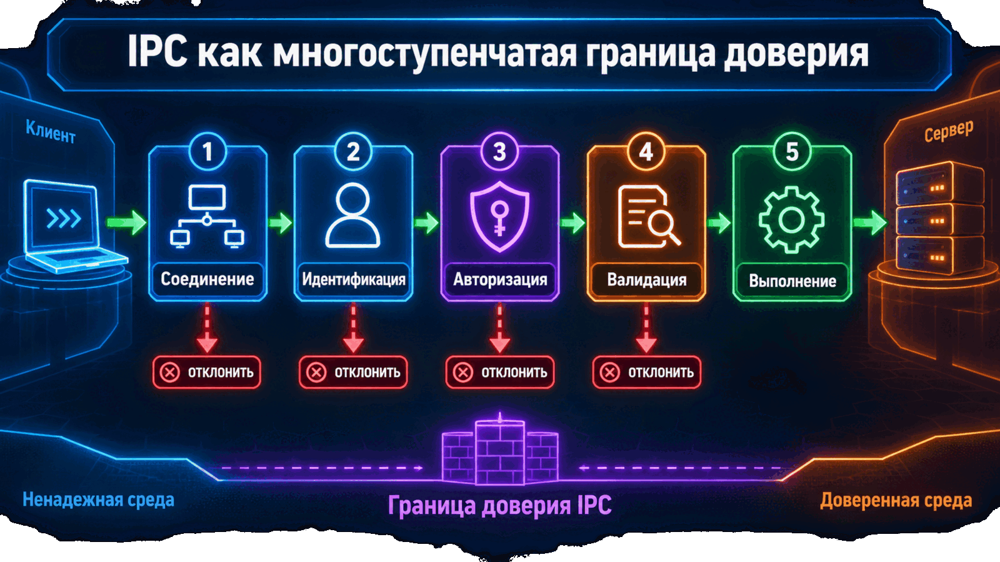

*Рисунок 36 — IPC как граница доверия.*

## 4.4.7. Прикладной разбор: демон резервного копирования

Демон принимает команды через локальный Unix-сокет. Endpoint расположен в каталоге, доступном только административной группе. После accept сервер получает сведения о локальном партнёре и сопоставляет их с политикой. Протокол включает версию, тип, длину, request ID и целевой идентификатор задания.

Команды «получить статус» и «запустить копирование» имеют разные права. Пути не принимаются как произвольные строки: клиент выбирает заранее зарегистрированный ресурс, а сервер разрешает его в собственной конфигурации. Сообщение ограничено по размеру, неизвестные поля отклоняются, повтор request ID возвращает прежний результат или явный статус.

Приёмный поток только валидирует и помещает задачу в ограниченную очередь. Работники выполняют длительную операцию без мьютекса очереди. Семафор ограничивает параллельные копирования, условная переменная сообщает о заданиях, а журнал связывает учётные данные клиента, request ID, решение и результат.

На рисунке 37 представлена схема «Архитектура демона резервного копирования».

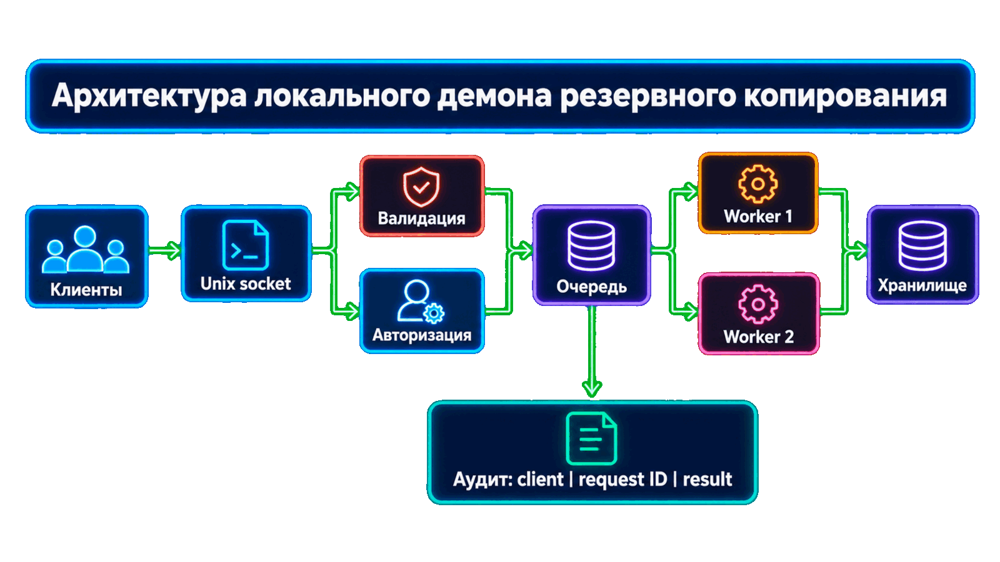

*Рисунок 37 — Архитектура демона резервного копирования.*

## 4.4.8. Проверка протокола и отказов

Положительные тесты подтверждают разрешённые команды и корректные ответы. Отрицательные проверяют неподходящего пользователя, неизвестный тип, завышенную длину, обрезанное сообщение, неверную последовательность и попытку доступа к незарегистрированному ресурсу.

Нагрузочные тесты в изолированном полигоне проверяют предел соединений, заполнение очереди и обратное давление. Клиент аварийно отключается на разных этапах, сервер перезапускается во время задания, а повторный request ID не создаёт неконтролируемый дубликат.

Диагностические тесты проверяют достаточность аудита без записи секретов. В журнале присутствуют время, идентичность, тип команды, request ID, решение и итог, но отсутствуют ключи и лишнее содержимое данных. Восстановительный сценарий подтверждает согласованность очереди и временных файлов после перезапуска.

| **Ключевой вывод. IPC — это интерфейс безопасности. Его корректность определяется не только передачей байтов, но и идентичностью стороны, авторизацией каждой операции, ограничением ресурсов, семантикой отказа и проверяемым аудитом.** |
|-------------------------------------------------------------------------------------------------------------------------------------------------------------------------------------------------------------------------------------------|

На рисунке 38 представлена схема «Диагностика конкурентных ошибок».

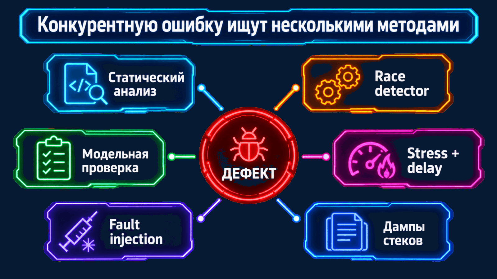

*Рисунок 38 — Диагностика конкурентных ошибок.*

# 4.5. Диагностика и тестирование конкурентных программ

Конкурентную ошибку трудно воспроизвести, потому что журналирование, отладчик и нагрузка изменяют расписание. Поэтому проверка строится в несколько слоёв. Статический анализ ищет нарушения дисциплины блокировок и сомнительные пути исполнения. Динамические детекторы гонок наблюдают реальные обращения к памяти и отношения синхронизации. Стресс-тесты увеличивают число участников и повторов; контролируемое внесение задержек расширяет множество исследованных чередований. Модельная проверка исследует абстрактное пространство состояний небольшого протокола.

Практический журнал события должен содержать идентификатор процесса и потока, идентификатор операции или запроса, монотонную отметку времени, ресурс и результат. Секреты и содержимое пользовательских сообщений в журнал не помещают. Для взаимоблокировки полезны дампы стеков всех потоков и сведения о владельцах блокировок; для IPC — корреляционный идентификатор запроса и однозначная фиксация повторов.

Исследование реальных ошибок конкурентности показало, что значительная часть дефектов не сводится к простой паре незащищённых доступов: встречаются нарушения порядка, атомарности и сложные комбинации нескольких переменных. Поэтому одного автоматического детектора гонок недостаточно; необходимы явные инварианты и тесты протокола отказа.

**Минимальный набор проверок:** повторить операцию после тайм-аута; оборвать соединение в середине сообщения; завершить владельца общего ресурса; создать заполненную очередь; подменить идентификатор и длину сообщения; изменить порядок двух независимых событий; проверить очистку после частичного выполнения.

# Сравнение примитивов синхронизации

| **Примитив**            | **Смысл**                            | **Блокирует поток**     | **Типичный риск**                        |
|-------------------------|--------------------------------------|-------------------------|------------------------------------------|
| **Мьютекс**             | Эксклюзивное владение инвариантом    | Да при конкуренции      | Забытое освобождение и порядок захвата   |
| **Семафор**             | Счётчик единиц ресурса или событие   | Да при нулевом счётчике | Дисбаланс wait/post                      |
| **Условная переменная** | Ожидание предиката под мьютексом     | Да                      | if вместо while и потеря протокола       |
| **RW-lock**             | Много читателей или один писатель    | Да                      | Голодание и опасное повышение режима     |
| **Атомарная операция**  | Неделимое изменение одного состояния | Обычно нет              | Ошибочная модель памяти и ABA            |
| **Спин-блокировка**     | Активное ожидание короткого владения | Нет, расходует CPU      | Долгое ожидание и блокирующий код внутри |

На рисунке 39 представлена схема «Политики читателей и писателей».

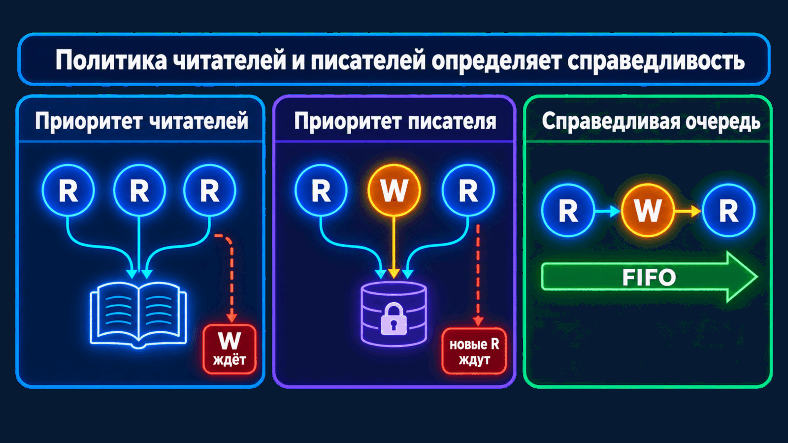

*Рисунок 39 — Политики читателей и писателей.*

# Сравнение механизмов IPC

| **Механизм**           | **Граница данных**     | **Синхронизация**                | **Ключевой риск**                           |
|------------------------|------------------------|----------------------------------|---------------------------------------------|
| **Канал / FIFO**       | Поток байтов           | Буфер и блокировка чтения/записи | Неверное кадрирование и зависание           |
| **Очередь сообщений**  | Сообщения              | Встроенная очередь               | Переполнение и недоверенная десериализация  |
| **Разделяемая память** | Нет встроенной границы | Нужна отдельно                   | Частичное состояние и повреждение структуры |
| **Unix-сокет**         | Поток или датаграммы   | Буферы сокета                    | Слабая авторизация локальной команды        |
| **Сетевой сокет**      | Поток или датаграммы   | Протокол и тайм-ауты             | Недоверенная сеть и управление ключами      |
| **Сигнал**             | Код события            | Асинхронная доставка             | Небезопасный обработчик и потеря повторов   |

# Итоги лекции

- Гонка возникает из-за неупорядоченных конфликтующих действий, а не из-за наличия нескольких ядер как таковых.

- Границы критической секции определяются логическим инвариантом и сроком жизни данных.

- Атомарность одного действия не делает атомарным сложный протокол; видимость задаётся моделью памяти и синхронизацией.

- Мьютекс, семафор и условная переменная выражают разные отношения: владение, счётчик ресурса и ожидание предиката.

- Взаимоблокировка требует цикла зависимостей; практическая защита строится на порядке ресурсов и ограничении внешних операций.

- Тайм-аут ограничивает ожидание, но требует определённого результата, отката и правила повторной отправки.

- IPC пересекает границу процесса и поэтому требует проверки стороны, команды, формата, состояния и ресурсов.

- Безопасный протокол включает кадрирование, request ID, лимиты, обратное давление, аудит и проверяемое восстановление.

На рисунке 40 представлена схема «Контрольный алгоритм выбора».

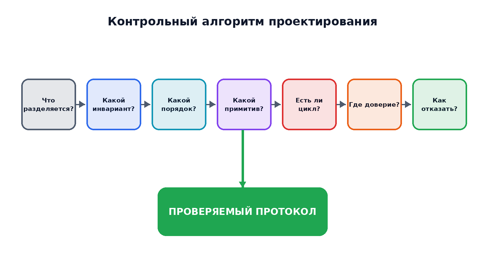

*Рисунок 40 — Контрольный алгоритм выбора.*

# Вопросы для самоконтроля

1.  Чем конкурентность отличается от параллелизма и почему гонка возможна на одном ядре?

2.  Почему операция инкремента может быть неатомарной?

3.  Что такое логический инвариант и как он определяет границы критической секции?

4.  Какие требования предъявляют к корректному решению критической секции?

5.  Чем безопасность отличается от живучести?

6.  Почему слишком крупная и слишком мелкая блокировки одинаково опасны?

7.  Как возникает TOCTOU и почему устойчивый дескриптор уменьшает риск?

8.  Чем атомарность отличается от видимости и порядка памяти?

9.  Чем мьютекс отличается от бинарного семафора?

10. Для каких задач используется счётный семафор?

11. Почему условие после пробуждения проверяют в цикле?

12. Когда блокировка чтения–записи может быть хуже обычного мьютекса?

13. Почему спин-блокировка допустима только для короткого ожидания?

14. Назовите четыре условия возникновения взаимоблокировки.

15. Как глобальный порядок ресурсов предотвращает цикл ожидания?

16. Чем предотвращение взаимоблокировки отличается от избегания и обнаружения?

17. Почему тайм-аут не является исправлением взаимоблокировки?

18. Чем deadlock отличается от livelock и голодания?

19. Какие механизмы уменьшают инверсию приоритетов?

20. Какие границы сохраняют каналы, очереди сообщений и потоковые сокеты?

21. Почему разделяемая память требует отдельного протокола синхронизации?

22. Какие полномочия может передавать файловый дескриптор?

23. Почему локальный IPC всё равно считается границей доверия?

24. Какие поля нужны в минимальном бинарном протоколе IPC?

25. Какие отрицательные и аварийные тесты нужны для локального Unix-сокета?

# Задания для работы в аудитории

## Задание 1. Найдите гонку

| **Сценарий. Два потока получают задание из общей очереди. Каждый проверяет, что очередь не пуста, берёт первый элемент и удаляет его. Между проверкой и удалением поток может быть вытеснен. Постройте опасное чередование и предложите два варианта исправления.** |
|---------------------------------------------------------------------------------------------------------------------------------------------------------------------------------------------------------------------------------------------------------------------|

## Задание 2. Постройте граф ожидания

Поток A удерживает L1 и ждёт L2; B удерживает L2 и ждёт L3; C удерживает L3 и ждёт L1. Постройте wait-for graph, назовите четыре условия Коффмана и предложите глобальный порядок ресурсов.

## Задание 3. Спроектируйте IPC

- определите участников и права на endpoint локального Unix-сокета;

- задайте заголовок сообщения: версия, тип, длина, request ID;

- разделите аутентификацию партнёра и авторизацию команды;

- установите предел размера, числа соединений и длины очереди;

- опишите реакцию на обрыв клиента и перезапуск сервера;

- составьте три отрицательных и два аварийных теста.

# Самостоятельная работа

Разработать протокол локального IPC для службы резервного копирования объёмом 3–4 страницы: определить участников, формат сообщений, проверку локального отправителя, авторизацию команд, ограничения размеров и очередей, семантику request ID, обработку тайм-аута и сбоя клиента. Добавить схему потоков, глобальный порядок блокировок и не менее шести контрольных тестов. Работу выполнять только как проектирование или в собственной изолированной лабораторной среде.

# Глоссарий

| **Термин**              | **Определение**                                                                        |
|-------------------------|----------------------------------------------------------------------------------------|
| **Атомарность**         | Свойство операции наблюдаться как неделимая относительно других участников.            |
| **Взаимоблокировка**    | Состояние циклического ожидания, при котором участники не могут продолжить выполнение. |
| **Гонка**               | Зависимость результата от непредсказуемого взаимного порядка операций.                 |
| **Голодание**           | Неограниченное откладывание участника при сохранении прогресса других.                 |
| **Инвариант**           | Условие согласованности, которое должно сохраняться в наблюдаемом состоянии.           |
| **IPC**                 | Набор механизмов межпроцессной передачи данных, событий и объектов.                    |
| **Критическая секция**  | Участок работы с общим состоянием, требующий согласованного выполнения.                |
| **Livelock**            | Активность участников без продвижения к полезному результату.                          |
| **Мьютекс**             | Примитив эксклюзивного владения критической секцией.                                   |
| **Обратное давление**   | Ограничение отправителя при заполнении ресурса получателя или очереди.                 |
| **Семафор**             | Счётный примитив для учёта доступных единиц ресурса или передачи события.              |
| **Условная переменная** | Примитив ожидания изменения предиката под защитой мьютекса.                            |
| **TOCTOU**              | Гонка между проверкой свойства объекта и последующим использованием объекта.           |
| **Wait-for graph**      | Граф ожидания, где ребро показывает зависимость одного участника от другого.           |

# Методические рекомендации преподавателю

- Начните с ручного построения опасного чередования для count = count + 1; не переходите к примитивам до формулировки инварианта.

- Каждый примитив связывайте с вопросом смысла: владение, счётчик, предикат, атомарное изменение или короткое активное ожидание.

- При условной переменной обязательно покажите атомарное освобождение мьютекса и повторную проверку while.

- Для взаимоблокировки используйте один граф из трёх участников и затем разрушьте цикл глобальным порядком.

- Разделяйте надёжность канала, аутентификацию стороны и авторизацию отдельной команды.

- При обсуждении разделяемой памяти подчёркивайте версионирование структуры, смещения вместо указателей и отдельную синхронизацию.

- Все нагрузочные и аварийные проверки выполнять только на собственных учебных VM или в изолированном полигоне.

# Рекомендуемая литература

1.  Таненбаум Э., Бос Х. Современные операционные системы. 4-е изд. СПб.: Питер, 2015. Главы о процессах, потоках, IPC и взаимоблокировках.
2.  Silberschatz A., Galvin P. B., Gagne G. Operating System Concepts. 10th ed. Wiley, 2018. Chapters 6–8.
3.  Stallings W. Operating Systems: Internals and Design Principles. 9th ed. Pearson, 2018.
4.  Arpaci-Dusseau R. H., Arpaci-Dusseau A. C. Operating Systems: Three Easy Pieces. Раздел Concurrency: главы Locks, Condition Variables, Semaphores, Concurrency Bugs. URL: https://pages.cs.wisc.edu/~remzi/OSTEP/
5.  Lamport L. Time, Clocks, and the Ordering of Events in a Distributed System // Communications of the ACM. 1978. Vol. 21, No. 7. P. 558–565. DOI: 10.1145/359545.359563.
6.  Coffman E. G., Elphick M. J., Shoshani A. System Deadlocks // ACM Computing Surveys. 1971. Vol. 3, No. 2. P. 67–78. DOI: 10.1145/356586.356588.
7.  Lu S., Park S., Seo E., Zhou Y. Learning from Mistakes: A Comprehensive Study on Real World Concurrency Bug Characteristics // ASPLOS XIII. 2008. P. 329–339. DOI: 10.1145/1346281.1346323.
8.  The Open Group Base Specifications Issue 8. POSIX Threads and Interprocess Communication. URL: https://pubs.opengroup.org/onlinepubs/9799919799/
9.  Kerrisk M. Linux man-pages: pipe(7), fifo(7), sem_overview(7), shm_overview(7), mq_overview(7), unix(7), futex(2). URL: https://man7.org/linux/man-pages/
