# Лекция 5. Управление памятью и противодействие эксплуатации

**Специальность:** 10.05.01 «Компьютерная безопасность»  
**Дисциплина:** «Операционные системы»

Управление памятью связывает сразу несколько уровней вычислительной системы. Программа оперирует переменными, массивами, функциями и указателями. Процессор формирует виртуальные адреса, устройство управления памятью переводит их в физические, а ядро операционной системы создаёт отображения, проверяет права и реагирует на исключения. Поэтому память процесса нельзя представлять как непрерывный физический массив байтов. Точнее говорить о системе отображений, в которой числовой адрес имеет смысл только в контексте конкретного процесса.

Защита памяти встроена в сам механизм перевода адресов. Перед чтением, записью или исполнением процессор проверяет, существует ли отображение и разрешена ли операция. Такое устройство одновременно решает задачи изоляции, совместного использования памяти, экономии физических кадров и противодействия эксплуатации программных ошибок.

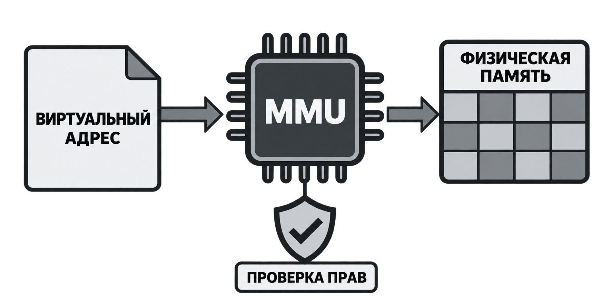

*Рисунок 1 — Перевод виртуального адреса и проверка прав доступа.*

После изучения темы студент должен различать объект программы, виртуальный адрес, физический адрес, страницу и кадр; объяснять назначение MMU, таблиц страниц и TLB; отделять промах TLB от page fault; понимать demand paging, copy-on-write, рабочий набор, swap и отображение файлов; сопоставлять ошибки памяти с механизмами NX, W xor X, ASLR, PIE, stack canary, RELRO, FORTIFY и sandbox.


*Рисунок 2 — Основная логика изучения темы: от адреса до защиты процесса.*

## Адресное пространство и перевод адресов

Рассмотрим одно обращение к памяти. Программа формирует виртуальный адрес инструкции или данных. MMU сначала ищет готовый перевод в TLB — небольшом быстром кэше трансляций. Если запись найдена, MMU немедленно получает номер физического кадра и одновременно проверяет права. Если записи в TLB нет, процессор выполняет обход таблиц страниц. Когда таблица содержит допустимое отображение, перевод добавляется в TLB и обращение повторяется. Если завершить операцию по текущему состоянию таблиц нельзя, возникает page fault, и управление получает ядро.

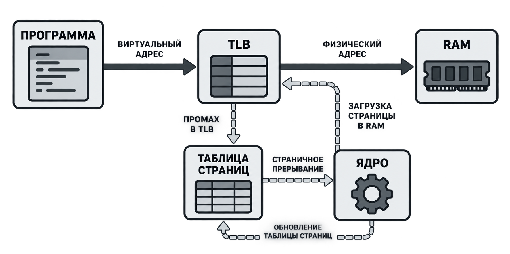

*Рисунок 3 — Путь обращения от программы к физической памяти.*

Важно различать три объекта. На уровне языка программирования существуют переменная, массив или функция. После загрузки программы им соответствуют виртуальные адреса внутри адресного пространства процесса. Физический адрес относится уже к конкретному кадру оперативной памяти. Между этими уровнями нет постоянного взаимно-однозначного соответствия. Одинаковый виртуальный адрес в разных процессах обычно переводится в разные кадры. В то же время одна физическая страница неизменяемого кода библиотеки может отображаться сразу в несколько процессов.

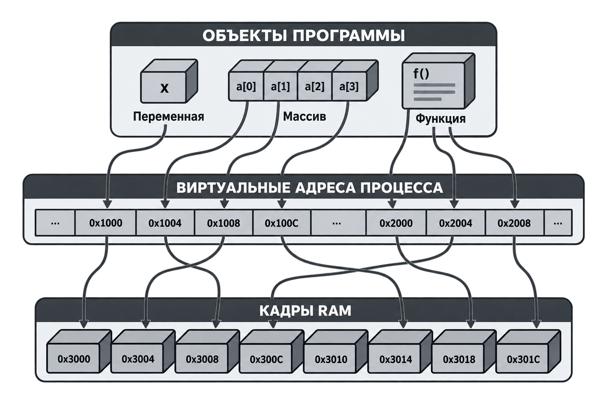

*Рисунок 4 — Объекты программы, виртуальные адреса и физические кадры.*

Виртуальное адресное пространство состоит из областей с разным назначением и правами. Код программы обычно доступен для чтения и исполнения, изменяемые данные — для чтения и записи. Куча используется динамическим распределителем, стек хранит кадры вызовов, локальные переменные и адреса возврата. Области `mmap` содержат отображённые файлы, библиотеки и анонимную память. Между областями находятся свободные диапазоны. Обращение в такой диапазон не имеет допустимого отображения и не может быть обслужено как обычный доступ к памяти.

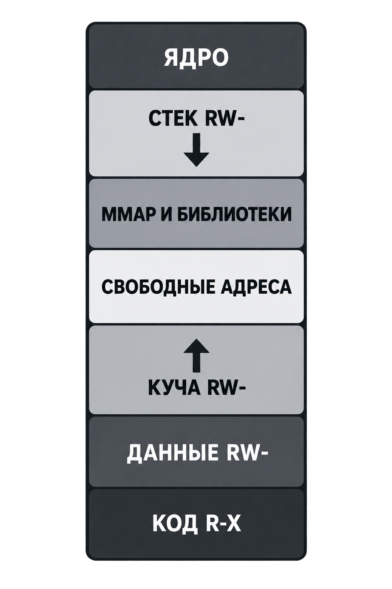

*Рисунок 5 — Упрощённая карта виртуального адресного пространства процесса.*

Исторически системы начинали с непрерывного размещения процессов. Такая модель проста, но по мере запуска и завершения программ между занятыми участками появляются свободные промежутки, которые трудно использовать для крупных запросов. Это явление называют внешней фрагментацией. Сегментация приблизила структуру памяти к логике программы: код, данные и стек можно было размещать отдельно. Однако сегменты переменного размера также усложняли распределение. Страничная организация решила проблему иначе: виртуальная и физическая память делятся на блоки одинакового размера. Страницы одного процесса можно разместить в любых свободных физических кадрах.

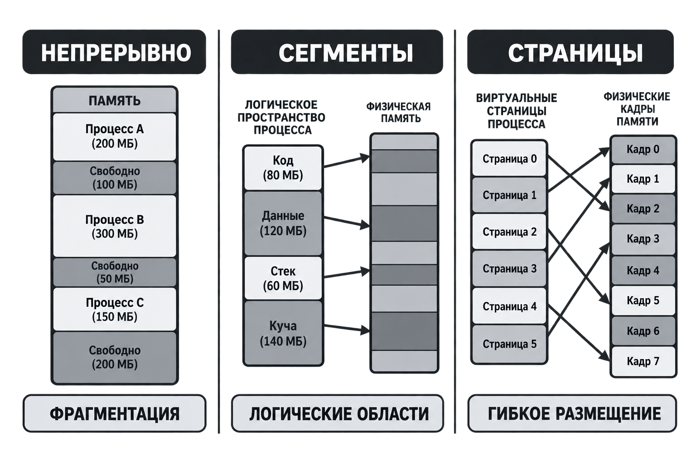

*Рисунок 6 — Непрерывное размещение, сегментация и страничная организация.*

При страничной организации виртуальный адрес делится на номер виртуальной страницы, или VPN, и смещение внутри страницы. Запись таблицы страниц связывает VPN с номером физического кадра PFN. MMU заменяет VPN на PFN, но не изменяет смещение. Благодаря этому все байты виртуальной страницы сохраняют взаимное расположение после трансляции. Для страницы размером 4 КиБ требуется 12 бит смещения, поскольку 4 КиБ равны 2¹² байтам.

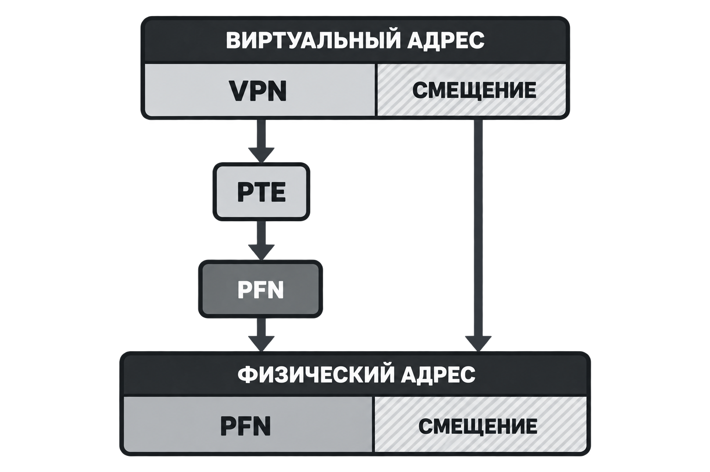

*Рисунок 7 — Формирование физического адреса из номера кадра и смещения.*

Рассмотрим учебный числовой пример со страницей размером 1 КиБ. Один килобайт равен `0x400` байтам. Виртуальный адрес `0x2D3A` содержит 11 полных страниц и смещение `0x13A`, поэтому VPN равен 11. Если запись таблицы страниц указывает, что виртуальная страница 11 размещена в физическом кадре 27, физический адрес вычисляется как `27 × 0x400 + 0x13A = 0x6D3A`. Для реального размера страницы 4 КиБ меняется количество бит и множитель, но принцип остаётся тем же.

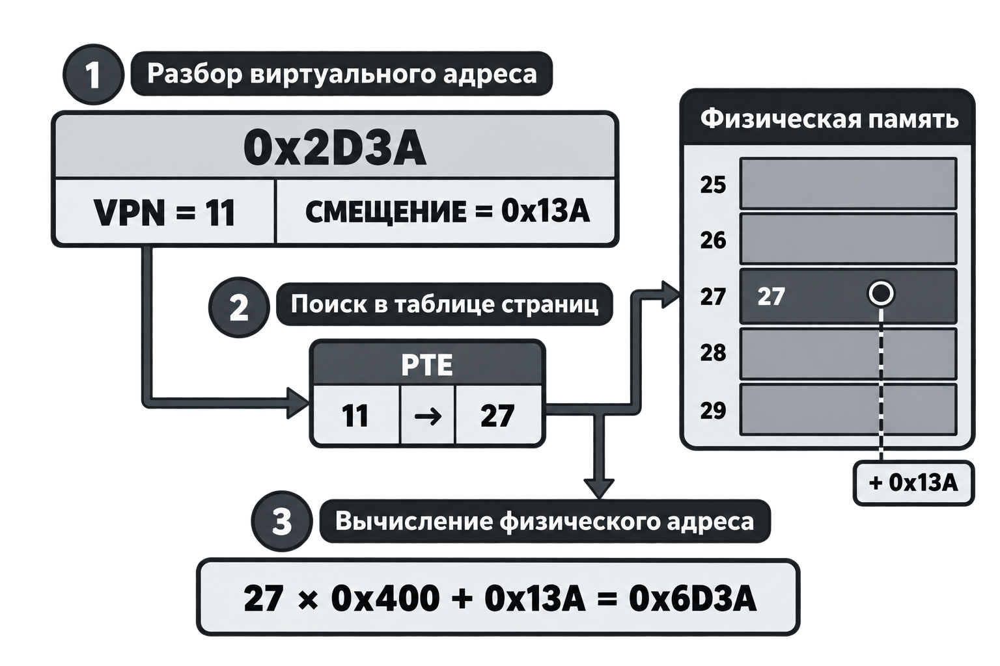

*Рисунок 8 — Пошаговый перевод виртуального адреса `0x2D3A`.*

Запись таблицы страниц PTE хранит не только PFN. Бит `present` показывает, существует ли действующее отображение. Признаки `R/W` и `U/S` определяют возможность записи и режим доступа. Бит NX запрещает исполнение кода со страницы. Признаки `accessed` и `dirty` сообщают, обращался ли процессор к странице и изменялось ли её содержимое. Точный формат PTE зависит от архитектуры, однако сочетание номера кадра и атрибутов всегда делает таблицу страниц одновременно механизмом адресации, учёта и защиты.

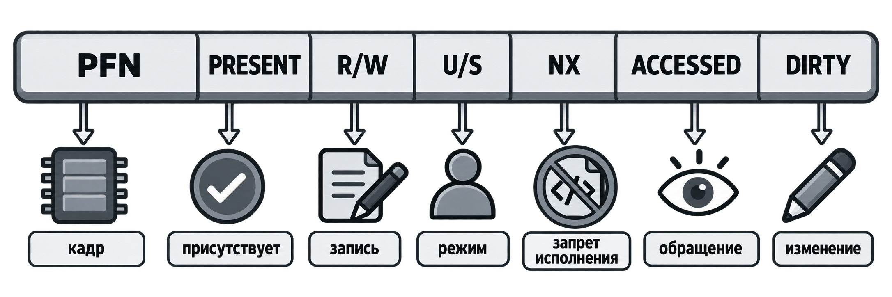

*Рисунок 9 — Основные поля записи таблицы страниц.*

Плоская таблица страниц непрактична для большого виртуального пространства. При 48-битном виртуальном адресе и странице 4 КиБ номер страницы содержит 36 бит, а значит, потребовалось бы 2³⁶ записей. Если одна PTE занимает 8 байт, объём таблицы достиг бы 512 ГиБ на процесс. Многоуровневая таблица работает как дерево: верхние уровни описывают крупные диапазоны, а нижние создаются только для реально используемых участков. Разреженное адресное пространство больше не требует гигантского непрерывного массива записей.

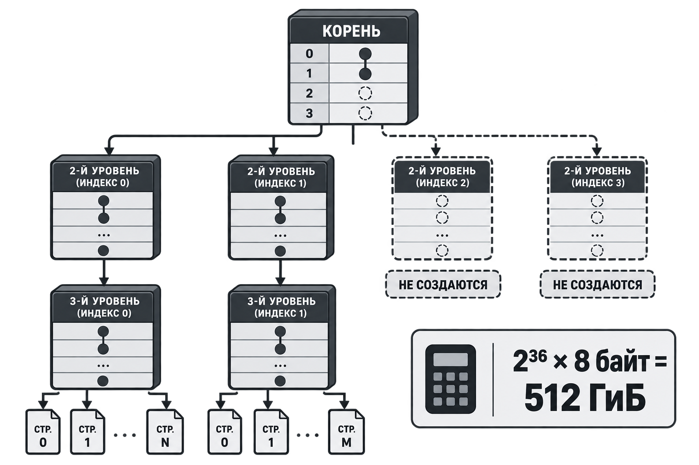

*Рисунок 10 — Создание нижних уровней таблицы только для используемых диапазонов.*

Обход многоуровневой таблицы требует нескольких обращений к памяти, поэтому процессор использует TLB. Этот кэш хранит недавно использованные пары VPN–PFN вместе с правами. Программы обладают временной и пространственной локальностью, поэтому часто снова обращаются к тем же страницам или соседним адресам. При попадании в TLB полный обход таблицы не нужен. Идентификаторы ASID или PCID позволяют помечать записи принадлежностью к адресному пространству и уменьшают число сбросов TLB при переключении процессов.

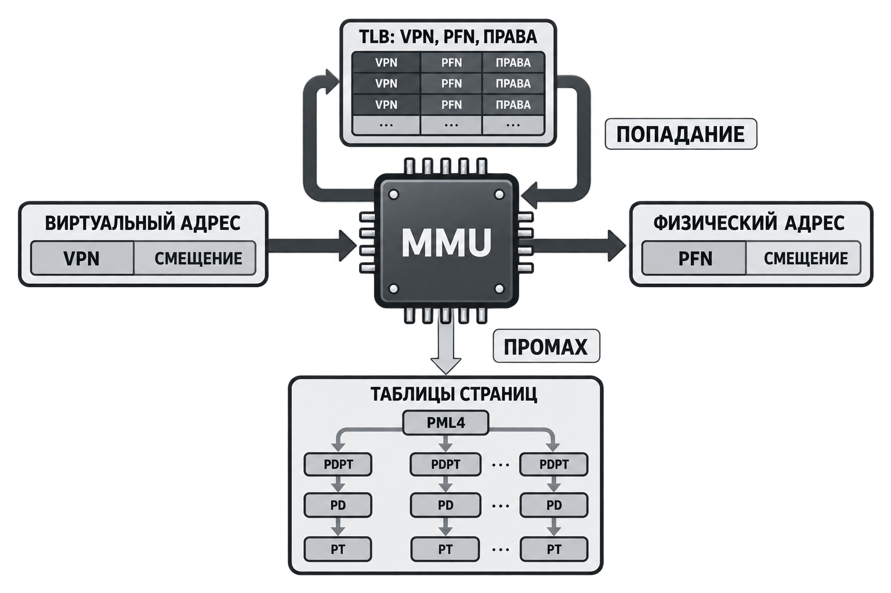

*Рисунок 11 — Быстрый перевод через TLB и более длинный обход таблиц страниц.*

Промах TLB не следует смешивать с page fault. TLB miss означает только отсутствие готового перевода в кэше. Процессор может найти действующую PTE, заполнить TLB и продолжить работу без вмешательства ядра. Page fault возникает, когда текущая PTE не позволяет завершить обращение: страница пока не находится в RAM, операция нарушает права или требуется создать приватную копию при copy-on-write.

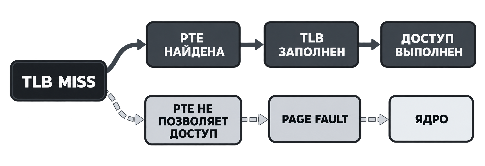

*Рисунок 12 — Различие между промахом TLB и страничным исключением.*

## Page fault и ленивое выделение памяти

Page fault часто переводят как «страничная ошибка», но слово «ошибка» может вводить в заблуждение. Это управляемое аппаратное исключение, с помощью которого ядро реализует ленивую загрузку, copy-on-write и другие механизмы. Процессор фиксирует виртуальный адрес, тип операции и причину остановки. Ядро находит соответствующую область виртуальной памяти VMA, проверяет права и определяет, можно ли устранить причину. Если обращение допустимо, ядро получает кадр, загружает данные или создаёт копию, затем обновляет PTE и TLB. Инструкция повторяется. Если адрес не принадлежит допустимой области или операция запрещена, процесс получает сигнал и обычно завершается.

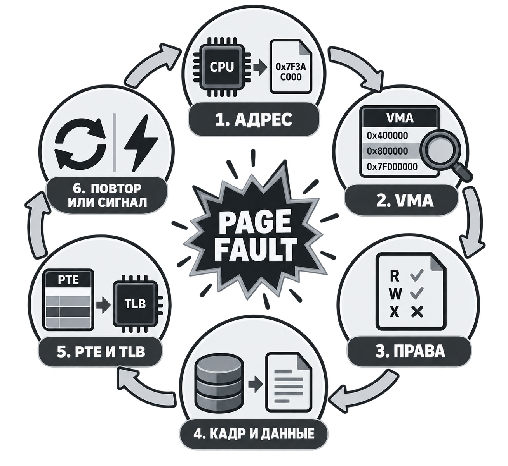

*Рисунок 13 — Основные этапы обработки page fault.*

Demand paging основан на наблюдении, что программа редко использует сразу весь код и все данные. Загрузчик создаёт виртуальные отображения исполняемого файла и библиотек, но не обязан немедленно читать каждую страницу. Физический кадр выделяется при первом реальном обращении. Неиспользованный код не занимает оперативную память, а запуск программы ускоряется. Цена экономии — дополнительная задержка первого обращения, особенно если данные приходится читать с накопителя.

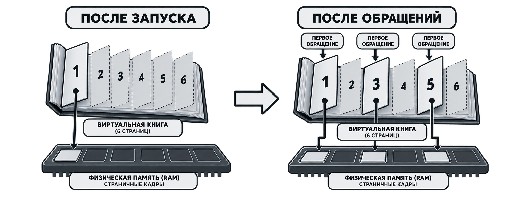

*Рисунок 14 — Подкрепление виртуальных страниц физическими кадрами по мере обращений.*

Copy-on-write уменьшает стоимость `fork`. Сразу после создания потомка родитель и потомок используют общие физические страницы. Потенциально изменяемые области временно отображаются только для чтения и получают признак CoW. Обычное чтение не создаёт копии. Первая запись вызывает page fault, после которого ядро выделяет новый кадр, копирует только изменяемую страницу и меняет PTE записывающего процесса. Если потомок вскоре выполняет `exec`, большая часть памяти родителя вообще не копируется.

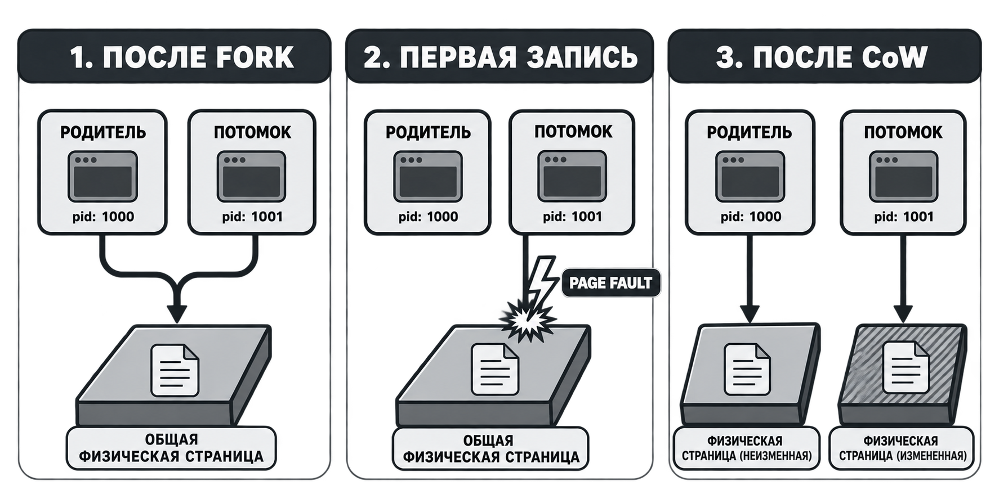

*Рисунок 15 — Разделение общей страницы после первой записи.*

Системы различают minor и major page fault по способу обслуживания, а не по тяжести программной ошибки. Minor fault не требует чтения нужной страницы с блочного устройства. Ядро может, например, подключить страницу, которая уже находится в page cache, или создать нулевую анонимную страницу. Major fault требует ввода-вывода и обычно имеет большую задержку. Оба события могут быть нормальной частью работы приложения.

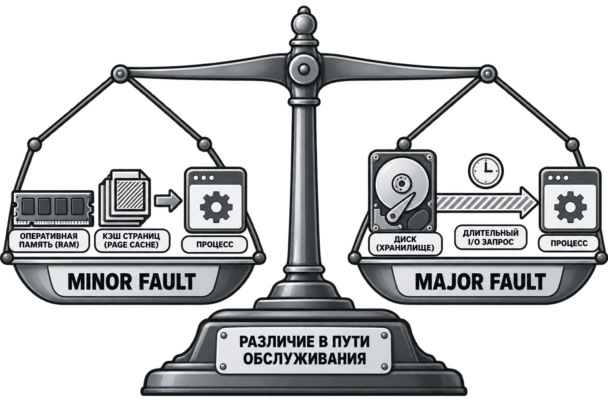

*Рисунок 16 — Различие minor и major fault по пути получения страницы.*

## Нехватка физической памяти и производительность

Когда свободных физических кадров становится мало, возникает давление памяти. Этот профессиональный термин означает, что ядру приходится активнее искать страницы, которые можно освободить. Чистую file-backed страницу можно удалить и при необходимости снова прочитать из файла. Изменённую страницу перед освобождением нужно записать. Анонимная страница не имеет исходного файла, поэтому для её вытеснения требуется swap или другой механизм сохранения. Давление памяти начинается раньше полного исчерпания RAM и проявляется ростом задержек, page fault и дискового ввода-вывода.

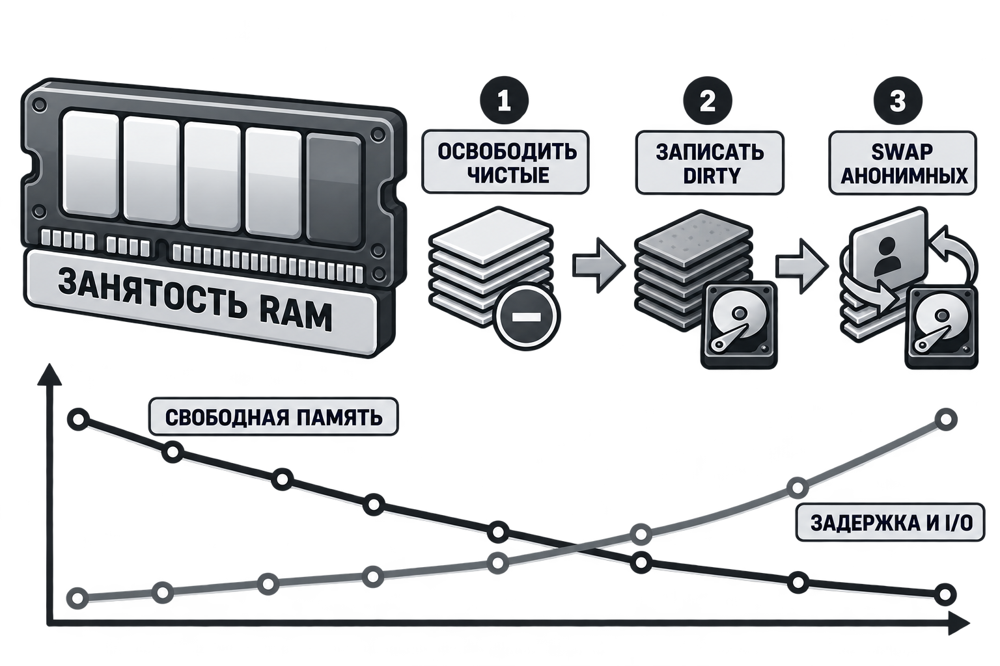

*Рисунок 17 — Действия ядра при уменьшении количества свободных кадров.*

Идеальный алгоритм замещения вытеснял бы страницу, которая дольше всего не понадобится, однако будущее неизвестно. Точное поддержание LRU также слишком дорого для каждого обращения. Алгоритм Clock использует аппаратный бит обращения. Страницы рассматриваются по кругу. Если `A=1`, страница получает второй шанс: ядро сбрасывает бит и продолжает поиск. Страница с `A=0` становится кандидатом на вытеснение. В реальных ОС политика сложнее и учитывает тип страницы, её состояние и стоимость восстановления.


*Рисунок 18 — Выбор страницы для вытеснения методом Clock.*

Эффективность иерархии памяти опирается на локальность. Временная локальность означает высокую вероятность повторного обращения к недавно использованным данным. Пространственная локальность означает вероятность обращения к соседним адресам. Последовательный обход массива хорошо использует пространственную локальность, а многократное выполнение небольшого цикла — временную. Случайные обращения к большому массиву уменьшают эффективность кэшей и TLB, хотя число инструкций программы может оставаться тем же.

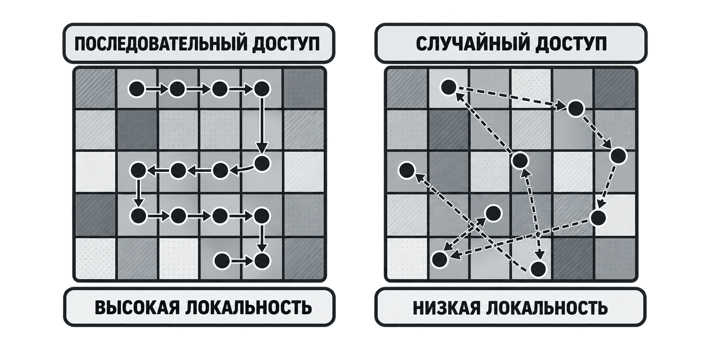

*Рисунок 19 — Последовательный и случайный доступ к памяти.*

Рабочий набор `W(t, Δ)` — это множество страниц, к которым процесс обращался в недавнем временном окне Δ. Он меняется вместе с фазами программы. Пока суммарные рабочие наборы активных процессов помещаются в RAM, страничные исключения редки. Если нужные страницы постоянно вытесняют друг друга, система тратит всё больше времени на подкачку и всё меньше — на полезные вычисления. Такое состояние называют thrashing. Его признаки — высокая активность swap, рост major fault и задержек при невысокой полезной загрузке процессора.

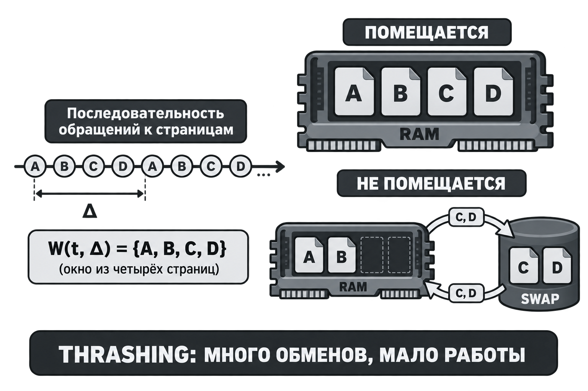

*Рисунок 20 — Связь размера рабочего набора с thrashing.*

Page cache и swap решают разные задачи. File-backed страницы обычно можно повторно получить из файла, а page cache позволяет совместно использовать уже прочитанные данные. Swap хранит вытесненные анонимные страницы. С точки зрения безопасности важно учитывать весь жизненный цикл данных: секрет, находившийся в RAM, может получить вторичную копию в swap, core dump или образе гибернации. Поэтому политика защиты включает шифрование накопителя, ограничение дампов, контролируемую гибернацию и минимизацию времени хранения ключей в памяти.

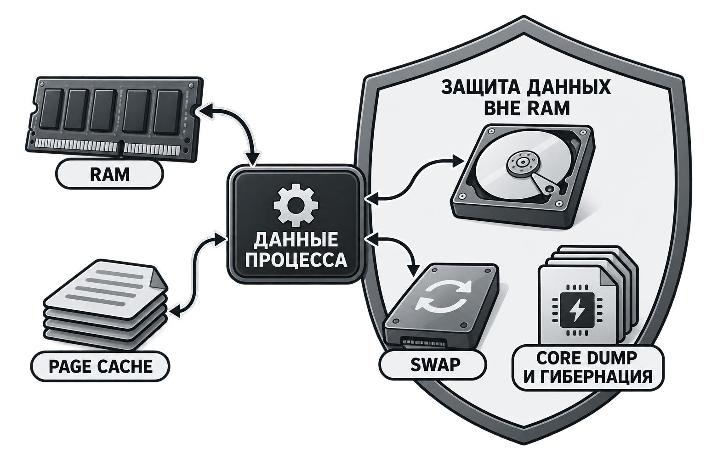

*Рисунок 21 — Возможные места хранения данных процесса вне оперативной памяти.*

Резерв виртуального диапазона и обещание физической памяти — разные операции. Успешный `malloc` обычно означает, что распределитель предоставил диапазон виртуальных адресов и обновил метаданные. Все страницы могут получить кадры только при фактическом касании. Overcommit позволяет системе принять больше потенциальных обязательств, чем доступно RAM и swap, поскольку программы часто не используют весь заявленный объём одновременно. Если предположение не оправдывается, ядро освобождает память, ограничивает группу cgroup или запускает OOM-механизм. В cgroup v2 параметр `memory.high` задаёт порог давления, а `memory.max` — жёсткий предел.

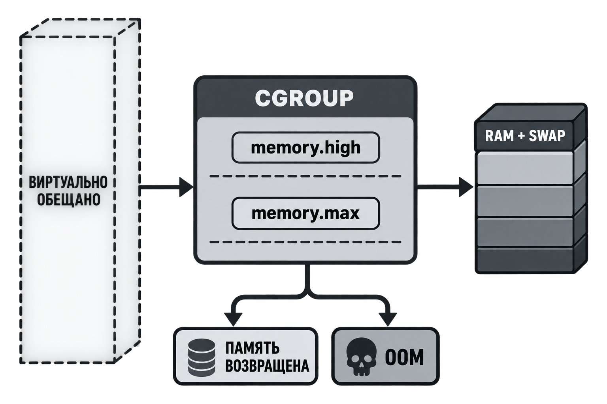

*Рисунок 22 — Соотношение виртуальных обязательств, физических ресурсов и лимитов cgroup.*

## Отображения файлов и совместная память

Системный вызов `mmap` связывает диапазон виртуальных адресов с файлом, устройством или анонимным объектом. Такое отображение участвует в demand paging и проверке прав наравне с другими областями. В режиме `MAP_PRIVATE` изменения становятся приватными: первая запись создаёт отдельную страницу и не изменяет исходный файл. В режиме `MAP_SHARED` несколько процессов видят общий объект, а изменения могут быть записаны в файл. Общая видимость байтов не задаёт порядок доступа, поэтому структурам в общей памяти необходимы mutex, семафоры, атомарные операции или другой протокол синхронизации.

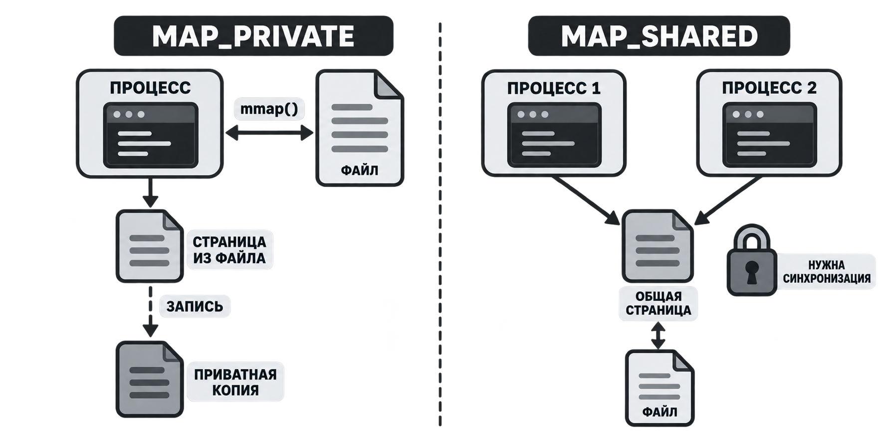

*Рисунок 23 — Приватное и совместное отображение файла.*

Операции над виртуальной памятью изменяют карту процесса. `mmap` создаёт область, `mprotect` меняет её права, `madvise` сообщает ядру предполагаемый характер обращений, `mincore` позволяет исследовать резидентность страниц, а `munmap` удаляет отображение. Эти вызовы работают не с абстрактным «объёмом памяти», а с конкретными диапазонами адресов, границами страниц и наборами разрешений.

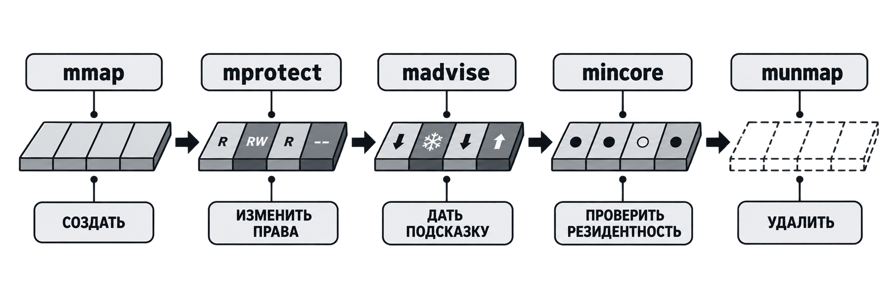

*Рисунок 24 — Основные системные вызовы для работы с отображениями памяти.*

Большие страницы увеличивают объём памяти, охватываемый одной записью TLB, и уменьшают количество PTE. Это полезно для крупных рабочих наборов, но повышает внутреннюю фрагментацию и делает права доступа более грубыми. В NUMA-системе физическая память распределена между узлами. Процессор быстрее обращается к локальной памяти, чем к памяти другого узла, поэтому размещение потоков и страниц влияет на производительность сервера. Эти механизмы расширяют базовую страничную модель, но не отменяют её принципов.

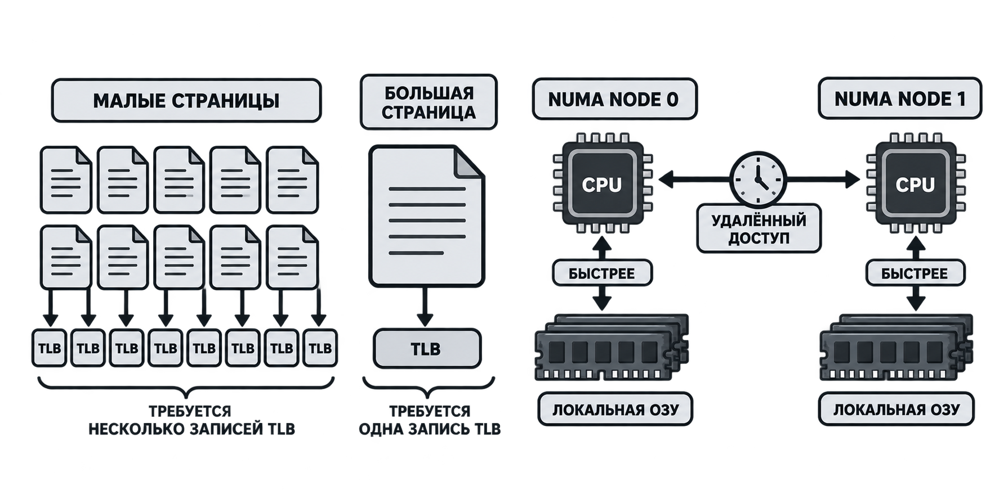

*Рисунок 25 — Влияние размера страниц на TLB и локальности памяти в NUMA.*

## Ошибки памяти и эшелоны защиты

Аппаратная защита страниц не исправляет ошибку в исходном коде, но влияет на то, сможет ли нарушитель превратить её в управляемую атаку. Для анализа полезно переводить дефект в примитив, то есть в доступную атакующему возможность. Чтение за границами может раскрыть секрет или адрес модуля. Запись за границами может изменить данные или управляющую структуру. Повреждение указателя способно передать управление по выбранному адресу. Use-after-free позволяет работать с объектом после завершения его жизненного цикла. Особенно опасно сочетание утечки адреса и контролируемой записи.


*Рисунок 26 — Возможности, возникающие из ошибок работы с памятью.*

Ни один механизм не закрывает все этапы атаки. Безопасная система использует несколько независимых эшелонов. Проверки в коде и безопасные интерфейсы снижают вероятность дефекта. Canary и FORTIFY обнаруживают часть повреждений. NX и W xor X ограничивают исполнение данных. ASLR и PIE затрудняют предсказание адресов. Sandbox и минимальные полномочия уменьшают последствия уже достигнутого выполнения кода. Такая модель исходит из того, что любой отдельный эшелон может оказаться недостаточным.

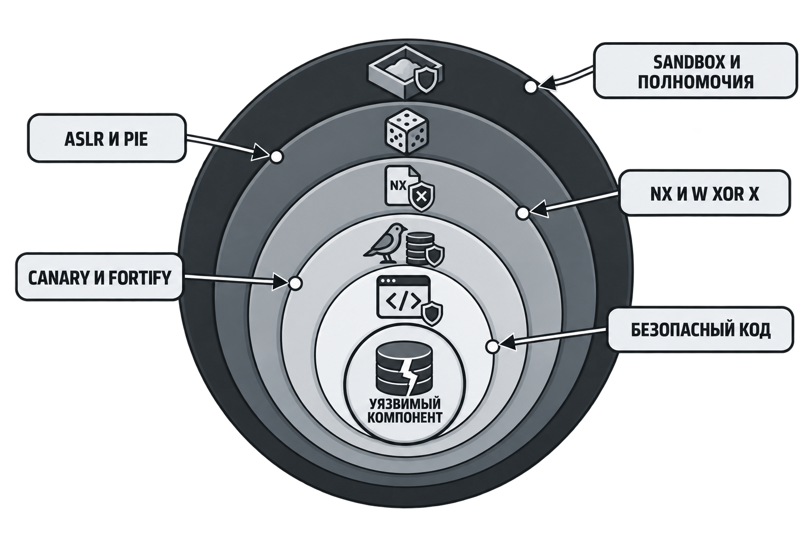

*Рисунок 27 — Независимые уровни противодействия эксплуатации.*

Бит NX запрещает выполнять инструкции со страниц, предназначенных для данных. Он затрудняет запуск внедрённого машинного кода, но не устраняет атаки повторного использования существующих инструкций. Принцип W xor X формулирует более общий инвариант: страница не должна одновременно быть записываемой и исполняемой. JIT-компилятор сначала создаёт код в режиме RW, затем проверяет его и переключает страницу в RX. Постоянное отображение RWX создаёт удобное место для внедрения кода и должно рассматриваться как опасное исключение.

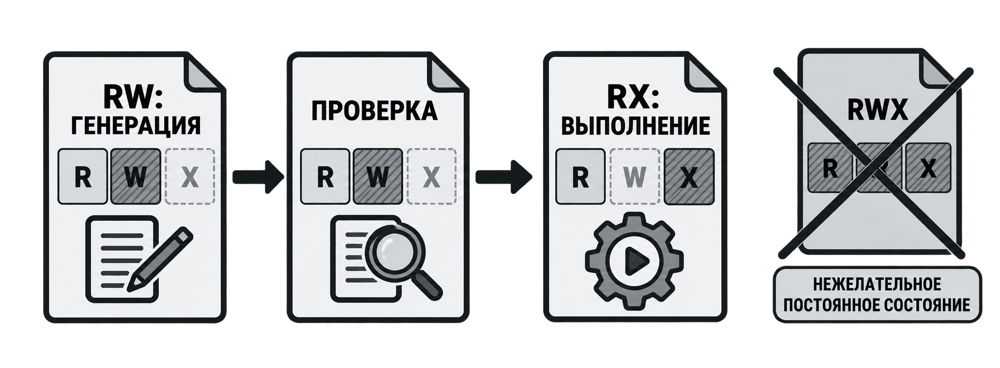

*Рисунок 28 — Безопасное переключение страницы из режима записи в режим исполнения.*

ASLR меняет расположение стека, кучи, библиотек и областей `mmap` между запусками. Чтобы перемещать основной исполняемый файл, его обычно собирают как PIE. Защита зависит от энтропии размещения и отсутствия утечек. Если программа раскрыла указатель внутри известного модуля, атакующий может вычесть постоянное смещение и вычислить базовый адрес. Поэтому вывод указателей в журналы, избыточные сообщения об ошибках и чтение за границей входят в модель угроз.

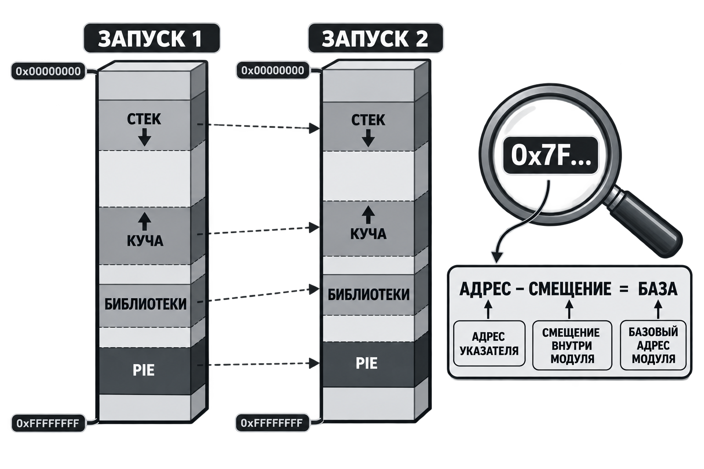

*Рисунок 29 — Рандомизация размещения и вычисление базы модуля по утёкшему адресу.*

Stack canary размещает контрольное значение между локальными данными и критическими элементами кадра стека. Перед возвратом функция проверяет значение и завершает программу при обнаружении повреждения. RELRO переводит часть структур динамического связывания в режим только для чтения после загрузки. FORTIFY добавляет проверки для операций, где компилятор и библиотека могут определить размер объекта. Области действия механизмов различаются: canary не защищает все виды записи, RELRO относится к структурам загрузчика, а FORTIFY зависит от оптимизации и доступной информации о размере.

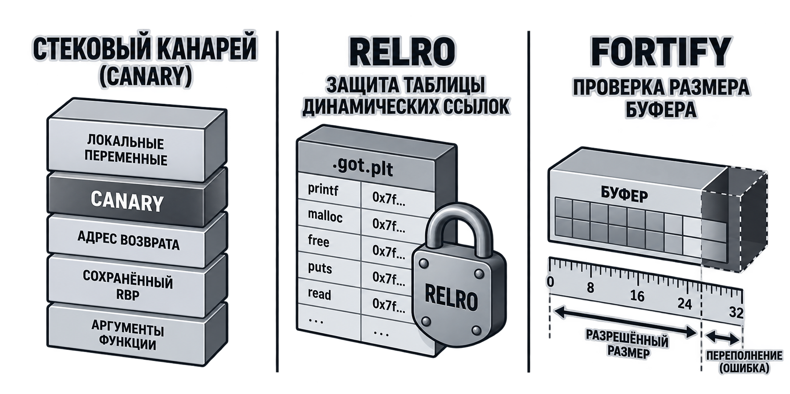

*Рисунок 30 — Назначение canary, RELRO и FORTIFY.*

Даже успешное выполнение чужого кода не обязательно должно давать полный контроль над системой. Отдельная учётная запись, закрытие лишних файловых дескрипторов, namespaces, seccomp, cgroup и политика доступа уменьшают доступные файлы, устройства, системные вызовы и ресурсы. Песочница строится от необходимых возможностей приложения: разрешается только то, без чего функция программы не может быть выполнена. Этот эшелон не заменяет устранение уязвимости, но ограничивает радиус компрометации.

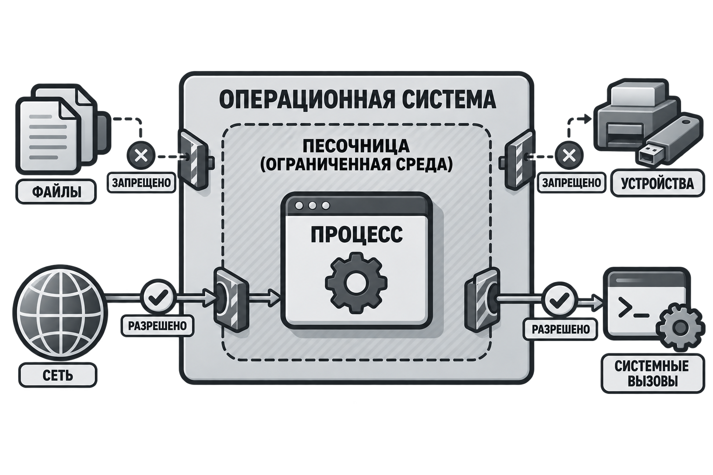

*Рисунок 31 — Ограничение ресурсов и операций процесса в песочнице.*

Управление памятью продолжается весь жизненный цикл процесса. Загрузчик создаёт области с минимальными правами. ASLR выбирает базы модулей, demand paging подгружает только востребованные страницы, а CoW экономит копирование после `fork`. Служба открывает необходимые ресурсы, снижает привилегии и переходит к ограниченному набору системных вызовов. cgroup контролирует потребление памяти, а мониторинг фиксирует faults, swap, давление памяти и OOM. Защита получается не одной настройкой, а согласованной последовательностью решений.


*Рисунок 32 — Механизмы защиты на разных этапах жизни процесса.*

## Наблюдение на учебном стенде и выводы

Исследовать механизмы следует на собственной программе в изолированной виртуальной машине. Файл `/proc/PID/maps` и команда `pmap` показывают области виртуального адресного пространства и их права. `readelf -hW`, `readelf -lW` и `readelf -dW` позволяют проверить свойства ELF: тип PIE, сегменты загрузки, `GNU_STACK`, `GNU_RELRO` и параметры динамического связывания. Команды `/usr/bin/time -v` и `vmstat` помогают наблюдать резидентную память, minor и major faults, swap и системную активность. Для учебной демонстрации не требуется отключать ASLR, NX или другие системные ограничения.

```bash
# Карта памяти собственного процесса
./demo &
pid=$!
cat /proc/$pid/maps
pmap -x $pid

# Свойства ELF
readelf -hW ./demo
readelf -lW ./demo
readelf -dW ./demo

# Наблюдение за памятью
/usr/bin/time -v ./demo
vmstat 1
```

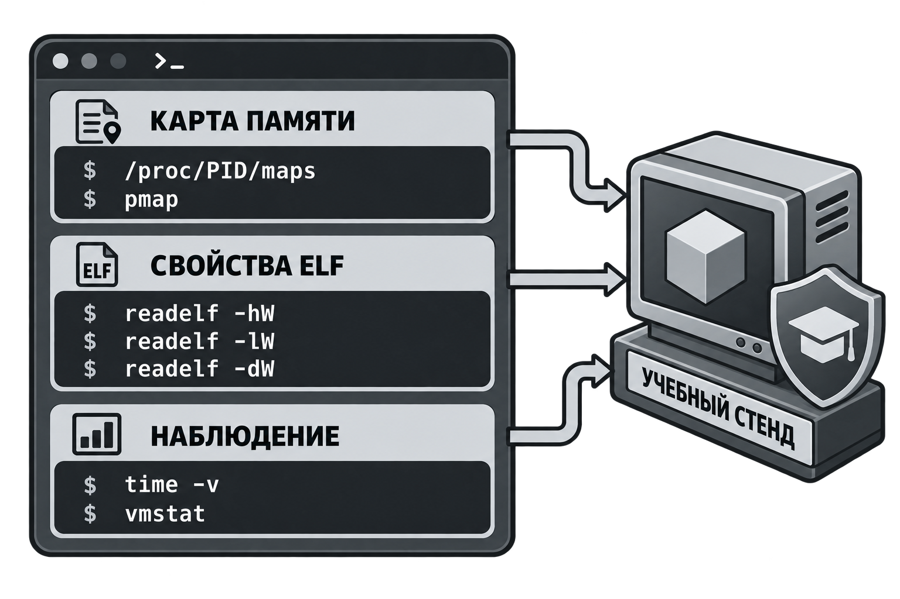

*Рисунок 33 — Инструменты исследования памяти на учебной виртуальной машине.*

Главный итог темы состоит в том, что виртуальный адрес не является физическим местом хранения. Перевод выполняется через таблицы страниц и ускоряется TLB, а PTE одновременно задаёт кадр и права. Page fault может быть штатной частью demand paging и copy-on-write. Производительность зависит от локальности и способности рабочих наборов помещаться в RAM. Защита памяти требует нескольких независимых эшелонов: корректного кода, аппаратных прав страниц, рандомизации, контроля целостности, минимальных полномочий и наблюдения.


*Рисунок 34 — Связь адресации, перевода, page fault, рабочего набора и защиты.*

## Вопросы для самоконтроля

1. Почему один виртуальный адрес может соответствовать разным физическим кадрам в разных процессах?
2. Что изменяется, а что сохраняется при переводе VPN в PFN?
3. Какие признаки PTE непосредственно связаны с безопасностью?
4. Почему плоская таблица страниц непрактична для 48-битного пространства?
5. Чем TLB miss отличается от page fault?
6. Почему demand paging ускоряет запуск, но увеличивает время первого обращения?
7. Как copy-on-write уменьшает стоимость `fork`?
8. Почему major fault не обязательно означает ошибку программы?
9. Как рабочий набор связан с thrashing?
10. Почему swap и core dump входят в модель конфиденциальности?
11. Чем `MAP_PRIVATE` отличается от `MAP_SHARED`?
12. Почему успешный `malloc` не гарантирует наличие всей физической памяти?
13. Что ограничивают `memory.high` и `memory.max`?
14. Почему ASLR зависит от PIE и отсутствия утечек адресов?
15. Какие ограничения имеют canary, RELRO и FORTIFY?
16. Почему sandbox считается последним эшелоном, а не исправлением уязвимости?

## Источники

1. Таненбаум Э., Бос Х. *Современные операционные системы*. 4-е изд. СПб.: Питер, 2015.
2. Arpaci-Dusseau R. H., Arpaci-Dusseau A. C. *Operating Systems: Three Easy Pieces*. Virtual Memory chapters. <https://pages.cs.wisc.edu/~remzi/OSTEP/>
3. Linux Kernel Documentation. *Memory Management*. <https://docs.kernel.org/admin-guide/mm/>
4. Linux man-pages: `mmap(2)`, `mprotect(2)`, `madvise(2)`, `mincore(2)`, `proc_pid_maps(5)`. <https://man7.org/linux/man-pages/>
5. Denning P. J. The Working Set Model for Program Behavior. *Communications of the ACM*, 1968.
6. GCC Documentation. *Instrumentation Options*. <https://gcc.gnu.org/onlinedocs/gcc/Instrumentation-Options.html>
7. GNU C Library Manual. *Source Fortification*. <https://sourceware.org/glibc/manual/latest/html_node/Source-Fortification.html>


