# Лекция 6. Файловые системы и хранение данных

**Дисциплина:** Операционные системы  
**Специальность:** 10.05.01 «Компьютерная безопасность»  
**Уровень:** университет, специалитет  
**Курс:** 3  
**Продолжительность:** 2 академических часа, 90 минут

## Цель и логика лекции

Цель лекции — объяснить, как операционная система связывает имя файла с его содержимым на накопителе, поддерживает согласованность структуры хранения и защищает данные от утраты, изменения и раскрытия. Рассматриваются FHS, монтирование и LVM, FAT, NTFS и ext4, индексные дескрипторы inode, виртуальная файловая система VFS, метаданные, журналирование, резервирование, шифрование и остаточные данные.

На рисунке 1 показаны три составляющие файловой организации и их связь с накопителем.

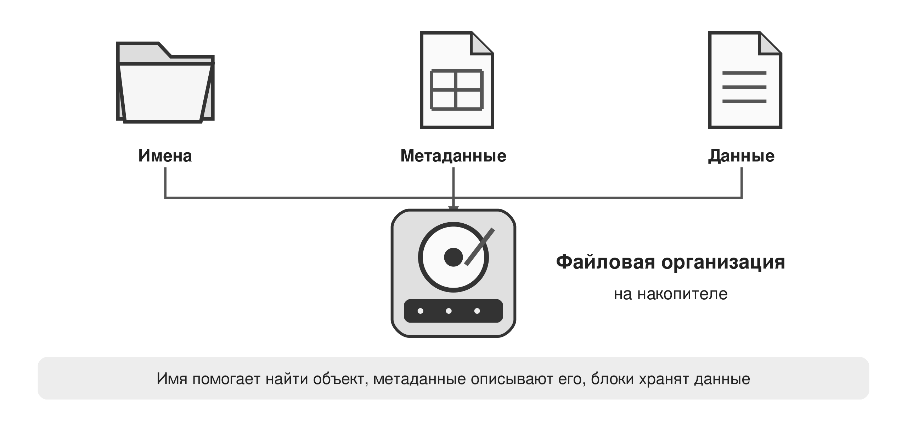

<p align="center"><em>Рисунок 1 — Файловая организация: имена, метаданные и данные</em></p>

После изучения темы студент должен различать файл, имя, каталог, файловый дескриптор и блок хранения; объяснять роль inode и VFS; сравнивать способы организации FAT, NTFS и ext4; отделять восстановление согласованности файловой системы от восстановления пользовательских данных; понимать ограничения RAID, снимков, резервных копий и шифрования; объяснять, почему удаление файла не означает гарантированного уничтожения информации.

Дополнительно студент должен объяснять назначение каталогов FHS, читать тип и атрибуты файла в выводе Linux-утилит, различать разметку, форматирование и монтирование, описывать модель PV–VG–LV и порядок изменения размера ext4.

Лекция продолжает тему управления памятью. Мы уже знаем, что виртуальный адрес не указывает непосредственно на физическое место хранения. Аналогично путь к файлу не сообщает, в каких секторах накопителя находятся его данные. Между именем и физическим носителем работает несколько уровней преобразования. В следующей теме будут подробнее рассмотрены устройства, драйверы и ввод-вывод; здесь основное внимание уделяется файловой организации и свойствам сохранённых данных.

На рисунке 2 сопоставлены уровни обращения к памяти и к данным файла.

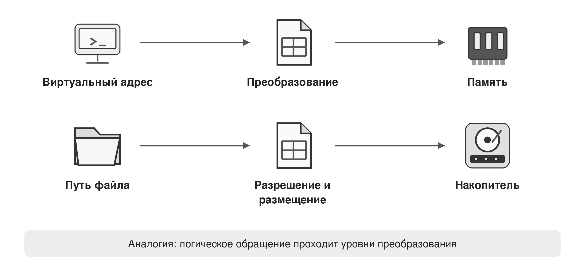

<p align="center"><em>Рисунок 2 — Аналогия преобразования адреса памяти и обращения к файлу</em></p>

Распределение времени служит ориентиром для занятия, а не ограничением объёма текста для самостоятельного чтения. Перед таблицей 1 зафиксируем последовательность: модель файла, структуры хранения, конкретные файловые системы, поведение при сбое и средства защиты.

Таблица 1 — Последовательность изучения темы на 90 минут

| Смысловой блок | Время |
|---|---:|
| От имени файла к накопителю, VFS, inode и FHS | 18 мин |
| Размещение данных, метаданные и ссылки | 12 мин |
| FAT, NTFS, ext4, монтирование и LVM | 25 мин |
| Запись, журналирование и восстановление после сбоя | 12 мин |
| Резервирование и резервные копии | 10 мин |
| Шифрование, остаточные данные и обобщение | 13 мин |
| **Итого** | **90 мин** |

## Оглавление

- [От имени файла к объекту хранения](#от-имени-файла-к-объекту-хранения)
- [Иерархия каталогов Linux и стандарт FHS](#иерархия-каталогов-linux-и-стандарт-fhs)
- [Размещение данных и значение метаданных](#размещение-данных-и-значение-метаданных)
- [Как устроены FAT, NTFS и ext4](#как-устроены-fat-ntfs-и-ext4)
- [Блочные устройства, монтирование и логические тома LVM](#блочные-устройства-монтирование-и-логические-тома-lvm)
- [Что происходит при записи и аварийном завершении](#что-происходит-при-записи-и-аварийном-завершении)
- [Резервирование и восстановление данных](#резервирование-и-восстановление-данных)
- [Шифрование и границы защиты хранилища](#шифрование-и-границы-защиты-хранилища)
- [Удаление и остаточные данные](#удаление-и-остаточные-данные)
- [Основные выводы](#основные-выводы)
- [Вопросы для самоконтроля](#вопросы-для-самоконтроля)
- [Основные понятия и сокращения](#основные-понятия-и-сокращения)
- [Источники](#источники)

## От имени файла к объекту хранения

Для приложения обычный файл выглядит как последовательность байтов. Программа может открыть его, прочитать диапазон, изменить содержимое и закрыть. Однако накопитель не хранит понятия «отчёт», «каталог пользователя» или «владелец». На нижнем уровне он предоставляет адресуемые области хранения. Файловая система создаёт над ними структуру: определяет, какие блоки свободны, каким объектам принадлежат занятые блоки, как называются эти объекты и какие операции над ними допустимы.

Следует различать физическое устройство, раздел, логический том и файловую систему. Устройство — накопитель или представляемый системе виртуальный диск. Раздел описывает диапазон на устройстве. Логический том может объединять или перераспределять пространство устройств и разделов. Файловая система организует объекты внутри предоставленного ей пространства. Наличие раздела ещё не означает наличия файловой системы, а файловая система может размещаться не только на отдельном физическом разделе, но и на логическом томе либо внутри файла-образа.

На рисунке 3 показаны возможные уровни размещения файловой системы; логический том не является обязательной ступенью.

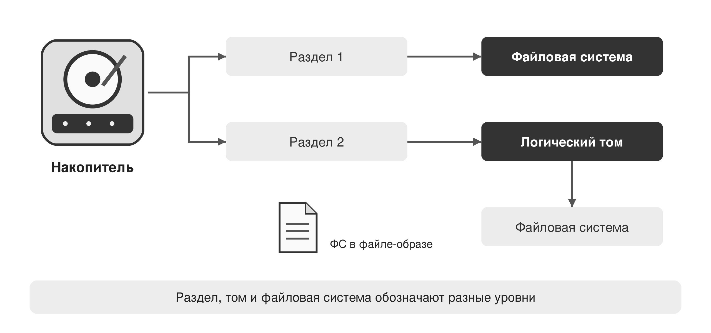

<p align="center"><em>Рисунок 3 — Устройство, раздел, логический том и файловая система</em></p>

В Linux файловая система включается в дерево каталогов через монтирование. Если том подключён к `/srv/data`, обращение к `/srv/data/report.txt` проходит через эту точку в подключённую файловую систему. До монтирования тот же каталог мог содержать другие файлы: они не уничтожаются, но временно скрываются подключённым деревом. Это показывает, что видимый путь зависит от состояния пространства имён и таблицы монтирования. В контейнерах и разных mount namespaces одинаковые пути могут вести к разным объектам.

На рисунке 4 сопоставлено видимое содержимое точки монтирования до и после подключения тома.

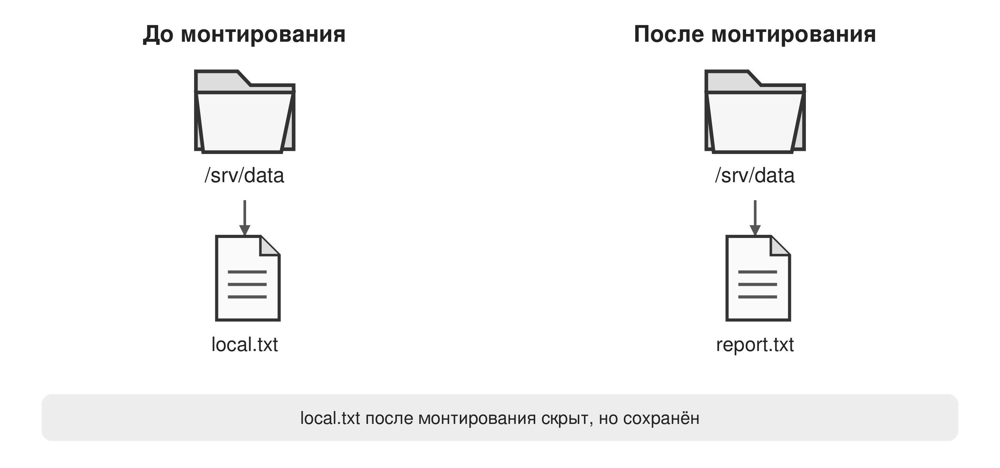

<p align="center"><em>Рисунок 4 — Пространство имён до и после монтирования</em></p>

Общий интерфейс Linux к файловым системам обеспечивает VFS — Virtual Filesystem. Это слой ядра, через который операции `open`, `read`, `write` и другие связываются с реализацией конкретной файловой системы. VFS позволяет программе пользоваться общими системными вызовами при работе с ext4, сетевой файловой системой или специальным виртуальным объектом. Унификация интерфейса не делает их свойства одинаковыми: поддержка прав, синхронизации, ссылок и других возможностей зависит от реализации [1].

На рисунке 5 показано, как VFS связывает общие операции с разными реализациями.

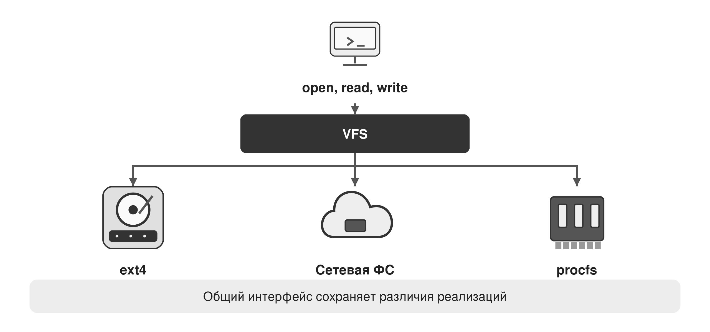

<p align="center"><em>Рисунок 5 — Общий интерфейс VFS и различные реализации файловых систем</em></p>

Для понимания пути к данным полезно различать четыре объекта. Superblock представляет файловую систему и её состояние. Inode описывает конкретный объект: тип, размер, владельца, права и связь с данными. Dentry связывает имя в каталоге с объектом при разрешении пути. Открытый файловый объект хранит состояние конкретного открытия, например текущую позицию и режим доступа. Файловый дескриптор процесса — небольшое целое число, через которое программа ссылается на этот открытый объект. Поэтому inode и дескриптор решают разные задачи: первый относится к файлу, второй — к доступу процесса.

Рассмотрим открытие `/home/student/report.txt`. Ядро разрешает компоненты пути, учитывает точки монтирования, ищет записи каталогов и проверяет допустимость доступа. После успешного открытия процесс получает дескриптор, например 3. Последующий `read(3, ...)` использует состояние открытого объекта. Он не обязан каждый раз заново искать все компоненты первоначального пути. Два независимых открытия одного файла могут иметь разные текущие позиции. При наследовании дескрипторов через `fork` процессы могут разделять одну открытую файловую запись и её позицию.

Inode в традиционной Unix-модели не хранит имя файла как единственный собственный атрибут. Имя находится в записи каталога, которая связывает его с номером inode. Это позволяет иметь несколько имён одного объекта. Номер inode имеет смысл внутри соответствующей файловой системы; считать его глобальным идентификатором для всех дисков нельзя. После освобождения номер может быть использован повторно, поэтому сам по себе он не доказывает неизменность объекта во времени.

На рисунке 6 разделены имя объекта, его inode и состояния двух независимых открытий; обозначения fd и позиции относятся к каждому открытию.

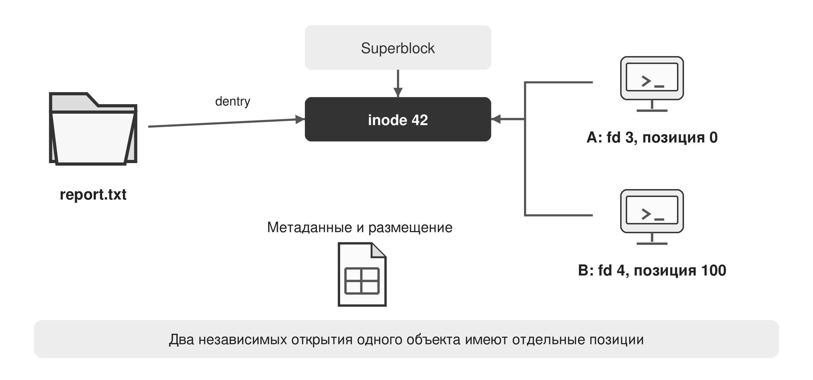

<p align="center"><em>Рисунок 6 — Имя, inode и независимые открытия файла</em></p>

Универсальность файлового интерфейса проявляется и в специальных объектах. Каталог организует имена, символьная ссылка хранит путь, канал передаёт поток, файл устройства связывает приложение с драйвером. Объекты `/proc` могут показывать состояние ядра и процессов без обычного постоянного содержимого на диске. Следовательно, правило «это файл, значит его байты лежат на накопителе» неверно. Сначала нужно определить тип объекта и файловую систему, которая его представляет.

Для распознавания объекта в Linux используют первый символ длинного вывода `ls`: `-` — обычный файл, `d` — каталог, `l` — символьная ссылка, `b` — блочное устройство, `c` — символьное устройство, `p` — именованный канал FIFO, `s` — Unix-сокет [12]. Расширение имени не определяет этот тип: исполняемый файл и текстовый документ могут оба быть обычными файлами. Цвет вывода зависит от настроек терминала и не является надёжным критерием.

Блочное устройство предоставляет адресуемые блоки, а символьное — интерфейс, свойства которого определяются драйвером. FIFO и Unix-сокет служат для обмена между процессами; это не обычные документы. Записи каталога изменяются через операции создания, удаления и переименования. Каталог нельзя редактировать текстовым редактором как список строк: файловая система поддерживает собственный формат его записей.

Для безопасности это означает, что проверять следует объект и контекст доступа. Строка пути удобна человеку, но между проверкой имени и последующим открытием состояние каталога может измениться. Возникает риск TOCTOU: программа проверила один объект, а использовала другой. Работа с уже открытым дескриптором и осторожное разрешение путей помогают уменьшить этот риск. Подробные модели разграничения доступа будут изучаться отдельно; сейчас важно понять, где находятся имя, объект и состояние открытия.

На рисунке 7 показан риск TOCTOU при повторном обращении по изменяемому имени.

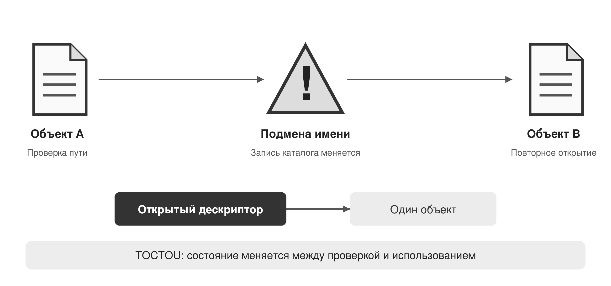

<p align="center"><em>Рисунок 7 — Подмена объекта между проверкой пути и открытием</em></p>

## Иерархия каталогов Linux и стандарт FHS

Механизм монтирования объясняет, как разные файловые системы объединяются в одно дерево. Следующий вопрос — почему определённые данные размещают именно в `/etc`, `/var` или `/home`. Согласованное назначение каталогов задаёт Filesystem Hierarchy Standard (FHS), стандарт иерархии файловой системы [14]. Он помогает администратору находить конфигурацию, программные компоненты и данные независимо от конкретного приложения. FHS описывает назначение путей, но не требует, чтобы каждый каталог находился на отдельном разделе.

При планировании хранения полезно различать постоянные программные компоненты и изменяемое состояние. Исполняемый файл службы обновляется при установке пакета, конфигурация меняется администратором, а журнал растёт во время работы. Разделение этих объектов позволяет выбирать разные правила резервного копирования, ограничения доступа и объёмы хранения. Основные назначения представлены в таблице 2.

Таблица 2 — Основные каталоги Linux

| Каталог | Назначение |
|---|---|
| `/` | Корень видимого дерева |
| `/boot` | Компоненты загрузки |
| `/etc` | Конфигурация данного хоста |
| `/bin`, `/sbin`, `/lib` | Основные команды, системные утилиты и библиотеки |
| `/usr` | Установленные программные компоненты |
| `/usr/local` | Локально установленные компоненты |
| `/opt` | Дополнительные программные пакеты |
| `/var` | Изменяемые данные |
| `/var/log` | Журналы |
| `/var/lib` | Постоянное состояние приложений |
| `/var/cache` | Кэши |
| `/var/spool` | Очереди обработки |
| `/home`, `/root` | Домашние каталоги пользователей и root |
| `/srv` | Данные предоставляемых служб |
| `/tmp`, `/var/tmp` | Временные данные |
| `/run` | Состояние текущего сеанса работы системы |
| `/dev` | Объекты устройств |
| `/proc`, `/sys` | Представление процессов, ядра и устройств |
| `/media`, `/mnt` | Точки подключения носителей и временного монтирования |

Название `/root` нельзя смешивать с корнем `/`: первое обозначает домашний каталог пользователя root. Например, абсолютный путь `/root/report.txt` начинается в корне дерева, затем проходит в домашний каталог администратора. Отдельное размещение этого каталога позволяет сохранять его доступность, если `/home` находится на недоступном пользовательском томе.

Внутри `/usr` обычно различают `/usr/bin`, `/usr/sbin`, `/usr/lib` и `/usr/share`. Последний содержит, например, документацию и другие данные, не зависящие от архитектуры процессора. В системах с объединением `/usr` некоторые традиционные каталоги верхнего уровня являются символьными ссылками на соответствующие каталоги внутри `/usr`. Поэтому назначение пути следует отличать от его фактического размещения: команда `ls -ld /bin /sbin /lib` показывает, являются ли эти объекты каталогами или ссылками на конкретной машине.

Обращение к `/tmp` не даёт гарантии сохранения файла после перезагрузки: очистка зависит от политики системы. `/var/tmp` предназначен для временных данных, сохраняемых между перезагрузками, однако и там может действовать очистка по возрасту. Для постоянного результата приложения следует выбирать постоянное хранилище. `/run` предназначен для текущего состояния служб, например PID-файлов и сокетов; во многих системах он размещён в tmpfs и создаётся заново при загрузке. Старый путь `/var/run` часто является ссылкой на `/run`.

Не всякий объект дерева представляет байты на диске. Чтение `/proc` и `/sys` обращается к интерфейсам ядра. tmpfs хранит данные в виртуальной памяти и может использовать подкачку; поэтому размещение в tmpfs само по себе не гарантирует, что чувствительные данные никогда не попадут на накопитель. Сетевые файловые системы обращаются к удалённому серверу. FUSE позволяет реализовать часть файловой системы в пользовательском пространстве, но не отменяет проверку прав и правил монтирования [1].

В Astra Linux могут встречаться `/parsec` и `/parsecfs`, связанные с подсистемой безопасности PARSEC [12]. Их наличие и поведение зависят от редакции и конфигурации. Такие объекты не следует трактовать как обычные каталоги пользовательских документов; сведения о мандатной защите нужно проверять по документации установленной системы.

На рисунке 8 показано: назначение каталогов в едином дереве linux.

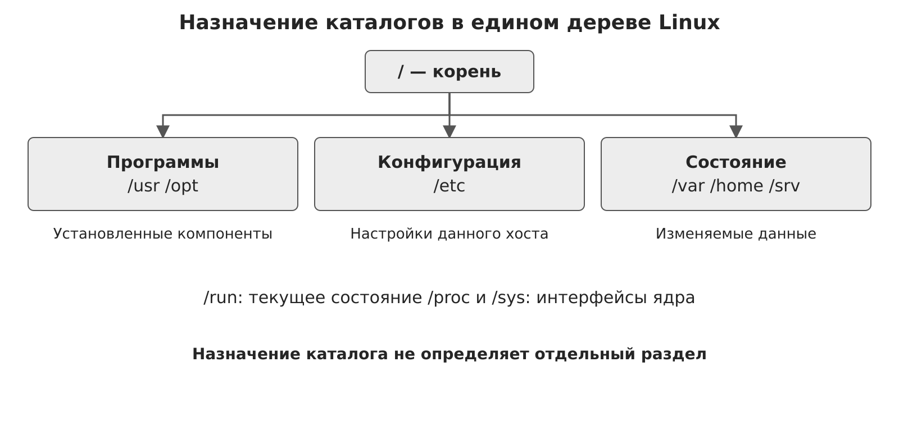

<p align="center"><em>Рисунок 8 — Назначение каталогов в едином дереве Linux</em></p>

Иерархия помогает принимать решения о защите. Условная служба может хранить конфигурацию в `/etc`, рабочую базу в `/var/lib`, журнал в `/var/log`, а предоставляемые пользователям файлы — в `/srv`. Копия только исполняемых файлов не восстановит её рабочее состояние. Отдельный том для журналов позволяет ограничить влияние их роста на корневую файловую систему, но требует собственного контроля свободных блоков и inode.

## Размещение данных и значение метаданных

После нахождения объекта файловая система должна определить, где находится нужный диапазон его содержимого. Логическое смещение измеряется в байтах от начала файла. Файловая система преобразует его в номер своего блока, затем нижележащий стек хранения — в обращения к устройству. Блок файловой системы, кластер и сектор устройства не являются взаимозаменяемыми понятиями. Сектор относится к интерфейсу накопителя, блок — к структуре файловой системы, а кластер обычно обозначает единицу выделения в FAT и NTFS.

На рисунке 9 разделены логическое смещение, единицы файловой системы и адресуемые области устройства.

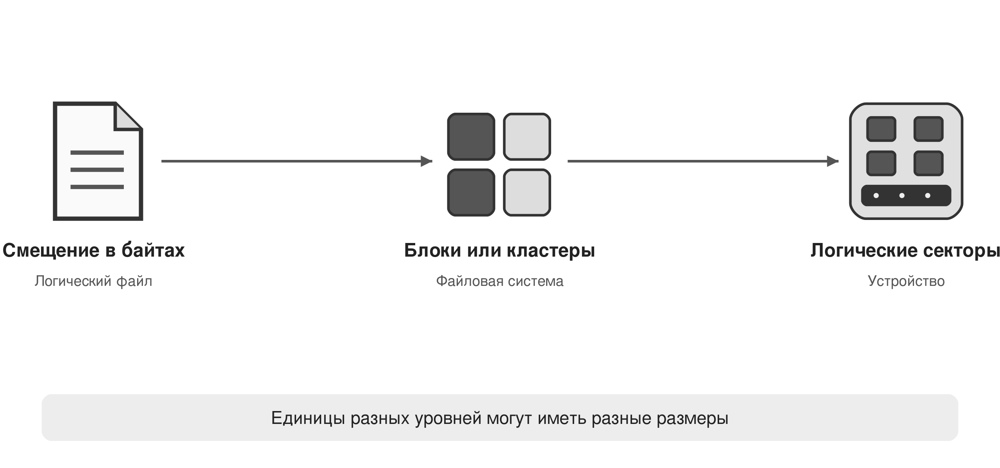

<p align="center"><em>Рисунок 9 — Преобразование смещения файла в обращение к устройству</em></p>

Предположим, что единица выделения равна 4096 байтам, а файлу требуется 6000 байт. При обычном выделении целых единиц понадобятся две, то есть 8192 байта. Неиспользованные 2192 байта в последней единице образуют внутреннюю фрагментацию. Это учебная модель: сжатие, разреженность и хранение небольших данных внутри метаданных могут изменить фактический расход. Если свободное место распределено по многим несмежным участкам, крупный файл может получить разрозненные области. Такое размещение называют фрагментированным.

На HDD расположение влияет на перемещения головок и задержки. SSD не имеет механического поиска, но это не устраняет стоимость метаданных, дополнительных операций и обслуживания внутренней памяти устройства. Поэтому утверждение «на SSD структура размещения не имеет значения» слишком сильное. При этом привычные меры, рассчитанные на механический диск, нельзя автоматически переносить на SSD: лишняя запись имеет собственную стоимость.

На рисунке 10 разобран расход места для файла из 6000 байт и сопоставлено смежное и разрозненное размещение одного набора блоков.

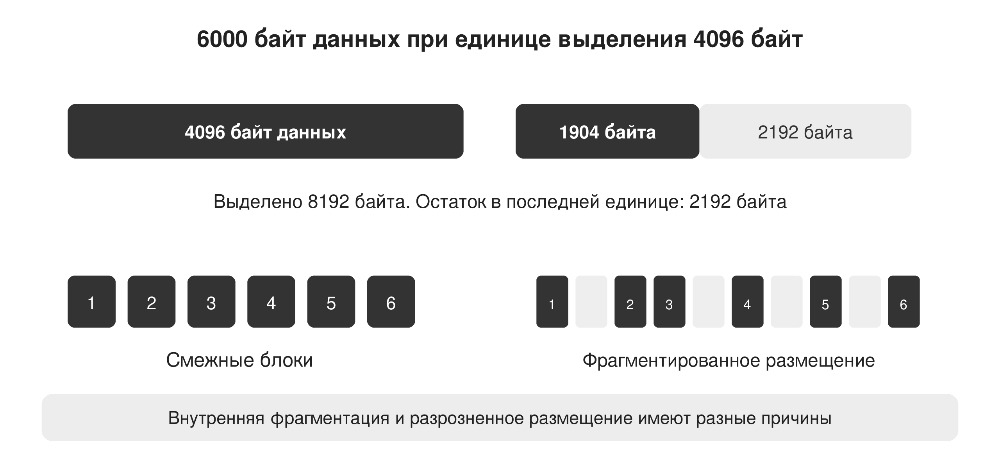

<p align="center"><em>Рисунок 10 — Выделение места и фрагментированное размещение</em></p>

Связать диапазоны файла с блоками можно разными способами. В цепочке каждый элемент сообщает, где находится следующий. Индексная структура хранит указатели или записи размещения. Extent описывает сразу непрерывный диапазон: его логическое начало, физическое начало и длину. Если файл занимает 100 соседних блоков, один extent может описать этот диапазон компактнее, чем 100 отдельных указателей. Если запись рассеяна по множеству участков, число extent-записей увеличивается.

Размер файла и занятое место также различаются для sparse file — разреженного файла. Некоторые логические диапазоны не имеют выделенных блоков; чтение таких «дыр» возвращает нули. Например, образ виртуального диска может иметь логический размер 20 ГиБ, занимая существенно меньше физического пространства. Это не обещание, что будущие записи поместятся: при заполнении дыр потребуются реальные блоки. Копирование средством, которое не сохраняет разреженность, способно резко увеличить расход хранилища.

На рисунке 11 показаны описание диапазона из 100 блоков и логическая дыра разреженного файла; ряд условных блоков иллюстрирует диапазон, а не задаёт его фактическое количество.

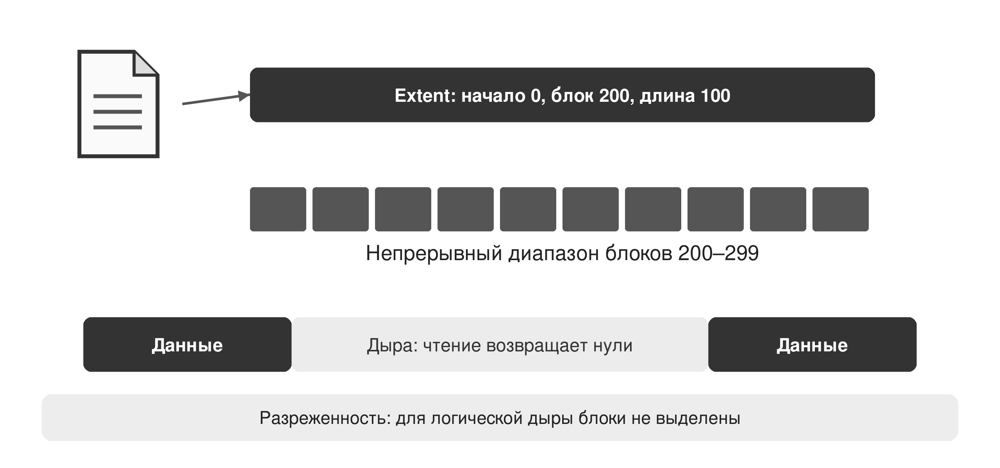

<p align="center"><em>Рисунок 11 — Extent и логическая дыра разреженного файла</em></p>

Содержимое файла составляет только часть информации. Метаданные описывают тип объекта, размер, размещение, владельца, права, временные отметки и дополнительные свойства. В таблице 3 сопоставлены основные группы метаданных и их значение для безопасности.

Таблица 3 — Метаданные и их значение

| Группа | Примеры | Значение для безопасности |
|---|---|---|
| Идентификация и структура | inode, запись MFT, имена, ссылки | Позволяют установить, какой объект исследуется |
| Размещение | Цепочка кластеров, extent, карта свободного места | Связывают логический файл с областями носителя |
| Доступ | Владелец, права, ACL, метки | Участвуют в принятии решения о допустимости операции |
| Время | Изменение данных, изменение состояния, доступ | Помогают строить хронологию, но требуют проверки контекста |
| Дополнительные свойства | Расширенные атрибуты, потоки, флаги | Могут влиять на интерпретацию и защиту объекта |

В Linux `mtime` отражает изменение содержимого, а `ctime` — изменение состояния inode, например прав или владельца. `ctime` не следует переводить как время создания. Доступность отдельной отметки рождения файла зависит от файловой системы и интерфейса. `atime` может обновляться не при каждом чтении из-за режимов монтирования и оптимизаций. Поэтому временная отметка является наблюдением определённого механизма, а не безусловным доказательством человеческого действия.

На рисунке 12 собраны свойства объекта и различия временных отметок.

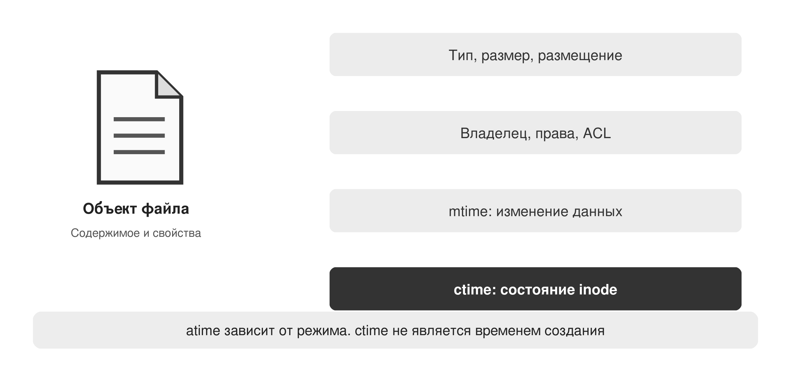

<p align="center"><em>Рисунок 12 — Метаданные файла и смысл временных отметок</em></p>

Разобранный пример чтения метаданных связывает модель inode с наблюдаемым выводом. Предположим, что существующий файл имеет имя `/home/student/report.txt`. Команды просмотра не создают и не изменяют его содержимое:

```bash
ls -li /home/student/report.txt
stat /home/student/report.txt
```

Условная строка `ls -li` может выглядеть так:

```text
424373 -rw-r--r-- 2 student student 6000 окт 9 08:00 /home/student/report.txt
```

Число `424373` — номер inode, `-` означает обычный файл, следующие девять символов описывают права владельца, группы и остальных. Число `2` обозначает количество жёстких ссылок, затем указаны владелец, группа, логический размер в байтах и время изменения содержимого. Имя в конце получено из записи каталога; оно не хранится в inode как единственное имя. Значения примерные и не являются выводом студенческого стенда.

`stat` позволяет отдельно увидеть inode, количество ссылок, временные отметки и выделенные блоки. Поле `Blocks` в типичном выводе GNU `stat` учитывает единицы по 512 байт, а не автоматически блоки ext4 по 4096 байт. Поле `IO Block` характеризует предпочтительный размер ввода-вывода. Поэтому умножать все числа, называемые «блоками», на один и тот же размер нельзя. Если время рождения показано как `-`, соответствующая комбинация файловой системы, ядра и утилиты не предоставила его; заменять его значением `ctime` неверно.

Жёсткая ссылка — ещё одно имя того же объекта внутри файловой системы. Если `a.txt` и `b.txt` являются жёсткими ссылками, изменение содержимого через одно имя видно через другое. Удаление одного имени не удаляет оставшуюся ссылку. Символьная ссылка содержит путь к другому объекту, может пересекать границы файловых систем и становится «висячей», если цель отсутствует. Эти различия важны для проверки архивов, резервного копирования и обработки каталогов, доступных другим пользователям.

Относительный путь внутри символьной ссылки разрешается относительно каталога, в котором находится сама ссылка. Например, ссылка `/home/student/current` с содержимым `reports/report.txt` ведёт к `/home/student/reports/report.txt`, независимо от текущего каталога процесса. Команда `readlink /home/student/current` показывает записанную строку, а `stat -L` запрашивает сведения о целевом объекте. Обычный `stat` для ссылки показывает метаданные самой ссылки.

Для поиска других имён существующего файла в выбранном дереве можно использовать `find /home/student -xdev -samefile /home/student/report.txt`. Такая проверка не ищет все символьные ссылки на цель. Ключ `-lname` сравнивает записанный в ссылке текст с шаблоном, поэтому абсолютный путь и относительный путь к одному объекту могут дать разные результаты. Поиск ограничен выбранным деревом и доступными пользователю каталогами; отсутствие совпадений не доказывает, что других имён нигде нет.

Каталог тоже имеет права. Для Linux возможность читать его записи и возможность проходить через него являются разными действиями. Удаление имени обычно определяется правами на содержащий каталог, а не только правами записи самого файла. Точная проверка также учитывает sticky bit, ACL, специальные атрибуты и дополнительные политики. Файл, запрещённый для изменения по содержимому, не обязательно защищён от удаления его имени из доступного каталога.

На рисунке 13 сопоставлены два имени одного inode и ссылка, хранящая путь к целевому объекту.

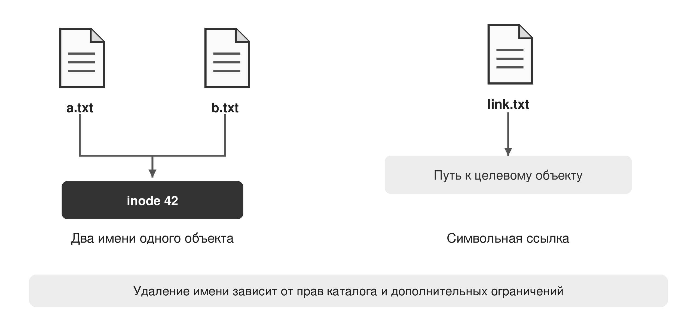

<p align="center"><em>Рисунок 13 — Жёсткие и символьные ссылки</em></p>

Метаданные могут раскрывать сведения даже без доступа к содержимому: названия проектов, пользователей, размеры документов и время активности. Для расследования нужно сохранить их вместе с данными. Обычное копирование, экспорт на другую файловую систему или упаковка в неподходящий архив способны потерять ACL, расширенные атрибуты, ссылки либо временные отметки. Отсюда следует важный принцип: способ переноса выбирают с учётом свойств, которые требуется сохранить.

## Как устроены FAT, NTFS и ext4

Теперь общую модель можно применить к конкретным файловым системам. Сравнивать их следует по способу размещения, структуре метаданных, поведению при сбое и поддерживаемым защитным свойствам. Скорость и пределы размеров зависят от конфигурации и реализации, поэтому одной строки «эта система лучше» недостаточно.

FAT использует таблицу размещения файлов — File Allocation Table. Каталожная запись содержит сведения о файле и номер начального кластера. Запись FAT для занятого кластера указывает следующий кластер цепочки либо признак конца. Для чтения большого диапазона система должна определить соответствующие участки этой цепочки; реализации могут ускорять работу кэшированием. Названия FAT12, FAT16 и FAT32 связаны с форматом записей таблицы и адресацией кластеров, а не с разрядностью процессора компьютера.

Например, файл может занимать кластеры 7, 12 и 13. Каталожная запись указывает 7, таблица связывает 7 с 12, 12 с 13, а 13 отмечает конец. Повреждение связи способно сделать часть файла недоступной или привести к ошибочному пересечению цепочек. Программа проверки ищет нарушения соответствия между каталогами, цепочками и картой использования пространства. Она восстанавливает структурную согласованность настолько, насколько позволяют сохранившиеся сведения, но не способна автоматически угадать первоначальный смысл утраченных байтов.

На рисунке 14 показан ещё один пример FAT: первый кластер 5, далее 9 и 12, затем EOF; принцип соответствует рассмотренной выше цепочке 7, 12 и 13.

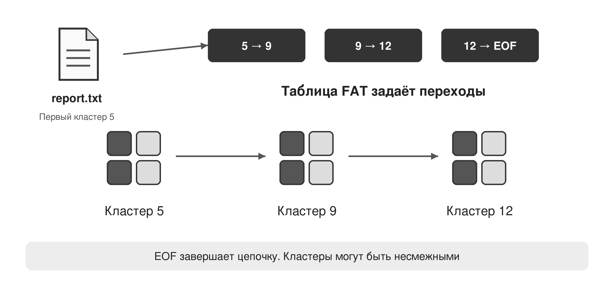

<p align="center"><em>Рисунок 14 — Цепочка кластеров и переходы в таблице FAT</em></p>

FAT32 широко применяется там, где важна совместимость, но не хранит полноценные индивидуальные владельцы и ACL уровня NTFS. В Linux для FAT-подобного тома права могут представляться через параметры монтирования, однако это не создаёт в формате те же индивидуальные дескрипторы безопасности. Размер отдельного файла FAT32 ограничен 4 ГиБ минус 1 байт. Размер тома — отдельный предел; ограничения конкретного средства форматирования также не следует путать с пределами формата. exFAT предназначена, в частности, для больших файлов и съёмных носителей, но её возможности нужно рассматривать отдельно от FAT32 [3].

На рисунке 15 сопоставлены FAT32 и exFAT при обмене данными; изображения накопителя условны и не связывают формат с определённым типом носителя.

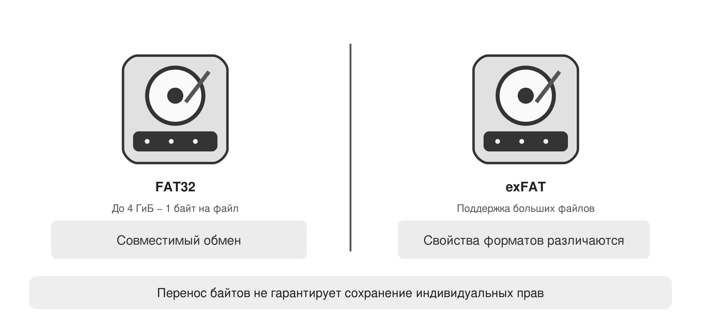

<p align="center"><em>Рисунок 15 — FAT32 и exFAT: предел файла и сохранение свойств</em></p>

NTFS организует сведения через Master File Table — MFT. Файлы и каталоги представлены записями, состоящими из атрибутов. К атрибутам относятся имена, стандартные сведения, дескрипторы безопасности и данные. Небольшое значение атрибута может храниться непосредственно в записи; более крупное размещается вне её, а запись описывает размещение. Такая организация объясняет, почему не каждый небольшой файл обязательно требует отдельного полного кластера для содержимого.

На рисунке 16 сопоставлены данные внутри записи MFT и описание размещения во внешних блоках.

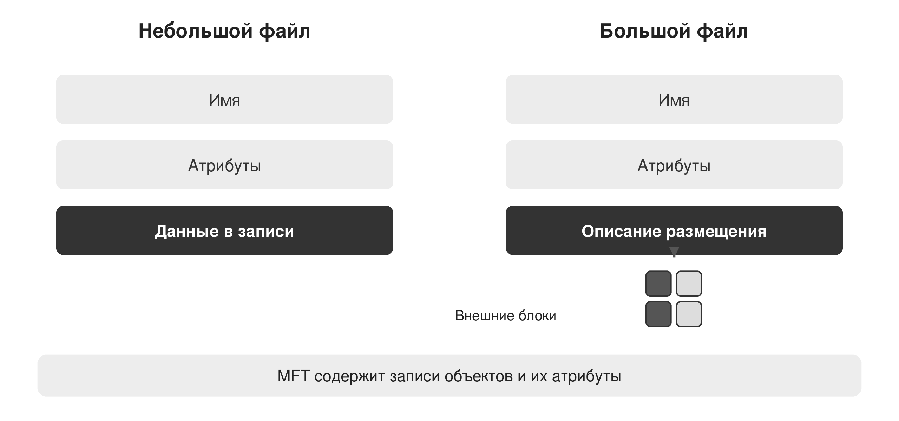

<p align="center"><em>Рисунок 16 — Резидентные данные и внешнее размещение в NTFS</em></p>

NTFS поддерживает ACL, ссылки, разреженные файлы и другие возможности, необходимые системному хранилищу Windows. Атрибут данных может иметь имя, поэтому один файл способен содержать дополнительные потоки данных — alternate data streams. Обычный размер или просмотр основного содержимого не всегда отражает все потоки. Для защитника это повод учитывать возможности формата при инвентаризации и переносе файлов, а не предполагать, что всё содержимое представлено единственной последовательностью, видимой привычной утилите.

У NTFS есть журналирование метаданных и отдельный журнал изменений USN. Первый используется для поддержки согласованности структуры при сбое; второй регистрирует сведения об изменениях объектов и применяется, например, для отслеживания изменений. Ни один из них не следует автоматически считать полной историей содержимого или готовым доказательством личности нарушителя. Возможности безопасности и хранения NTFS описаны в документации Microsoft [4].

На рисунке 17 выделены основной поток, ADS и дескриптор безопасности; значок замка обозначает управление доступом, а не обязательное шифрование файла.

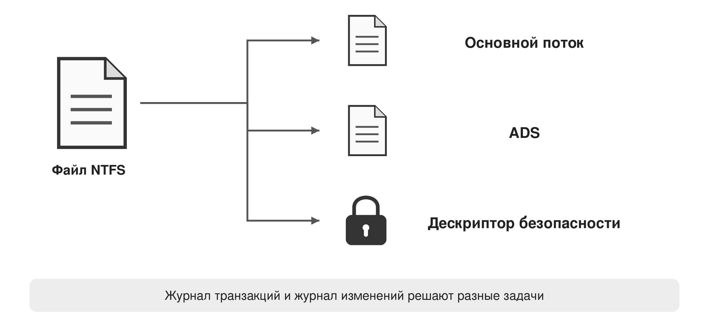

<p align="center"><em>Рисунок 17 — Потоки данных и сведения о безопасности NTFS</em></p>

Ext4 — распространённая Linux-файловая система с inode, группами блоков, extent-размещением и журналированием. Superblock содержит общие сведения о файловой системе. Структуры групп описывают локальные области, bitmap отмечает использование блоков и inode, таблица inode хранит метаданные объектов. Каталог связывает имя с номером inode. Совместное размещение связанных структур и данных помогает организовывать доступ и выделение пространства [2].

На рисунке 18 показана связь inode одной группы с данными другой; расположение и размеры служебных областей условны.

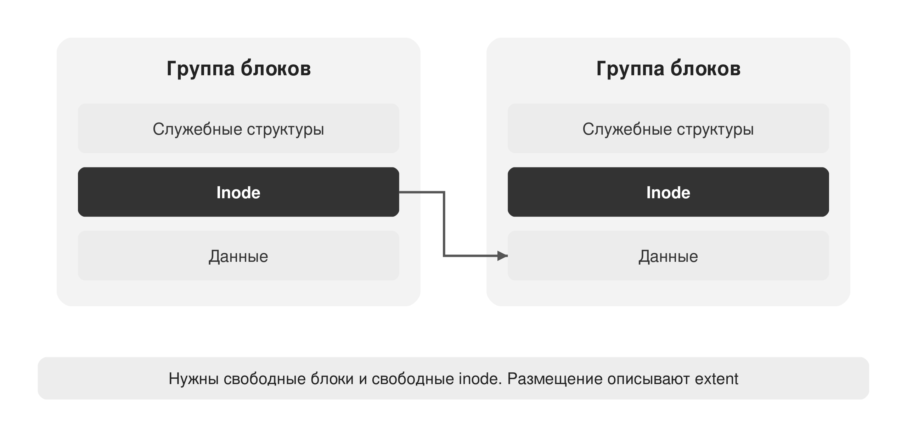

<p align="center"><em>Рисунок 18 — Группы блоков ext4 и размещение данных через extent</em></p>

Ext4 может откладывать окончательное выделение блоков до записи накопленных данных — delayed allocation. Это позволяет лучше оценить размер записи и выбрать размещение. Но отложенное выделение означает, что успешная запись в кэш ещё не подтверждает наличие сохранённой копии на носителе; ошибка нехватки места может проявиться позже. Кроме свободных блоков важны свободные inode. Множество мелких файлов способно исчерпать inode при наличии свободного объёма, поэтому диагностика только через количество гигабайт неполна.

Для ext4 важно отделять современное extent-размещение от классической схемы прямых и косвенных указателей. В традиционной схеме двенадцать указателей непосредственно адресуют блоки данных, а последующие используют блоки указателей одного, двух и трёх уровней. При размере блока 4096 байт прямые указатели охватывают 48 КиБ. Это объясняет принцип индексной адресации, но не является универсальной схемой размещения каждого файла ext4: при включённой функции extents область `i_block` содержит дерево extent [2, 19].

На рисунке 19 показано: свободное пространство и независимый ресурс inode.

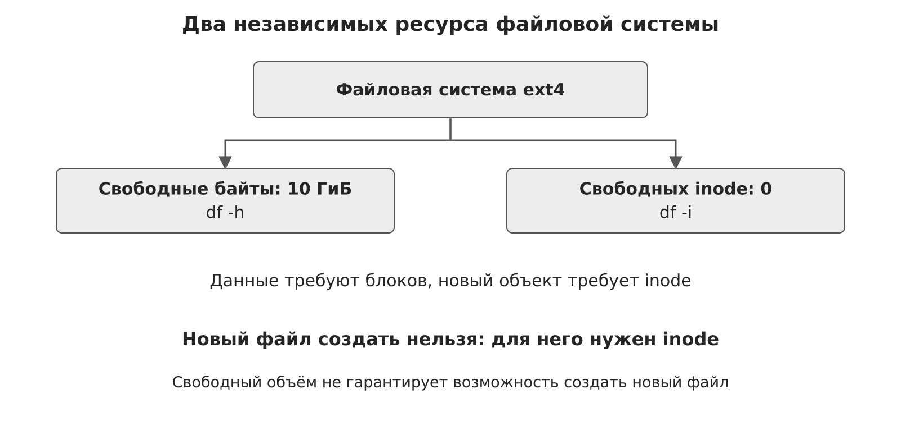

<p align="center"><em>Рисунок 19 — Свободное пространство и независимый ресурс inode</em></p>

Недостаток inode следует диагностировать отдельно от недостатка свободных байтов:

```bash
df -h /home/student
df -i /home/student
```

Обе команды анализируют файловую систему, содержащую указанный путь. Первая показывает использование объёма, вторая — индексных дескрипторов. Например, хранилище может иметь 10 ГиБ свободного пространства и ноль свободных inode. Новому пустому файлу всё равно нужен собственный inode, поэтому создание не удастся. Причиной бывает множество небольших объектов в кэше, очереди или журнале. Удалять их следует средствами приложения с учётом назначения, а не произвольной очисткой системных каталогов.

При создании ext4 параметры `mke2fs` задают, в частности, размер блока (`-b`), число байт пространства на один inode (`-i`) или запрашиваемое количество inode (`-N`) [15]. Меньшее отношение байт к inode создаёт больше дескрипторов, но увеличивает расход на метаданные. Это выбор модели нагрузки: миллион небольших документов и несколько крупных образов требуют разных пропорций. В пределах существующего размера ext4 количество inode нельзя произвольно увеличить отдельной настройкой; при расширении файловой системы новые группы могут добавить inode. Поэтому утверждение, что число inode неизменно при любом расширении тома, было бы слишком сильным.

Наличие ext4 в системе не означает автоматически включённое шифрование или обязательную проверку содержимого криптографическими хешами. Защитные возможности зависят от поддерживаемых функций, конфигурации и политик ОС. В Astra Linux следует проверять фактический тип тома, версию и редакцию системы, а также дополнительные механизмы безопасности. Не следует выводить наличие мандатного контроля только из имени файловой системы.

На рисунке 20 показан переход от данных в кэше к выбору блоков и записи на носитель.

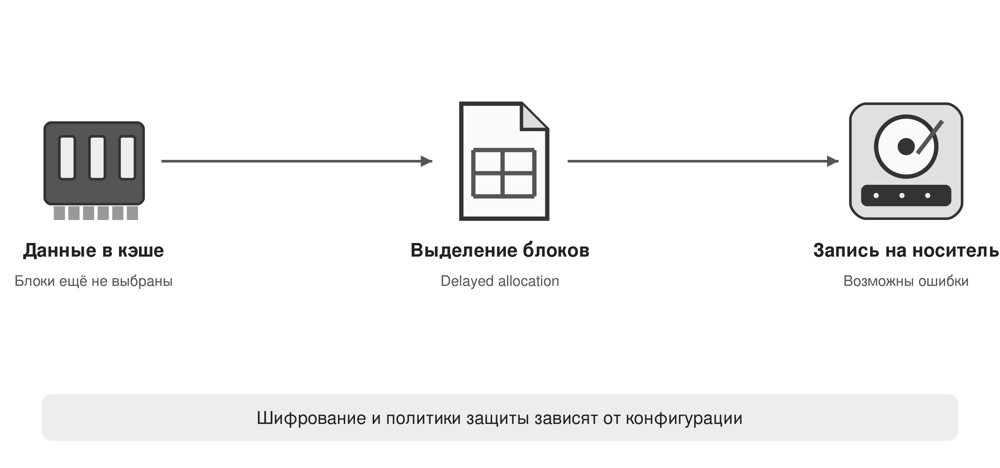

<p align="center"><em>Рисунок 20 — Отложенное выделение блоков и последующая запись</em></p>

Основные различия сведены в таблицу 4. Это учебное сравнение свойств форматов, а не таблица максимальных размеров для всех реализаций.

Таблица 4 — Сравнение FAT32, NTFS и ext4

| Свойство | FAT32 | NTFS | ext4 |
|---|---|---|---|
| Основная модель | Каталожная запись и цепочка кластеров FAT | Записи MFT и атрибуты | Каталоги, inode и extent |
| Индивидуальные права в формате | Нет полноценной модели владельцев и ACL | Дескрипторы безопасности и ACL | Владелец, Unix-права, поддержка ACL и атрибутов |
| Журналирование | Обычный формат FAT32 не имеет журнала транзакций | Журналирование метаданных | JBD2; поведение данных зависит от режима |
| Дополнительные особенности | Широкая совместимость, предел файла 4 ГиБ − 1 байт | Потоки данных, sparse, сжатие и другие функции | Sparse, delayed allocation, набор расширяемых функций |
| Типичный контекст | Совместимый съёмный носитель | Системные и рабочие тома Windows | Системные и рабочие тома Linux |
| Основной вывод для защиты | Совместимость не даёт индивидуального контроля доступа | Нужны анализ ACL, потоков и журналов | Нужны анализ прав, атрибутов, режима записи и политик ОС |

При переносе с NTFS или ext4 на FAT32 данные могут сохраниться, а права и дополнительные свойства — нет. При обратном копировании исходные ограничения сами по себе не восстанавливаются. Следовательно, совместимость чтения не равна сохранению модели безопасности. Для межсистемного обмена требуется осознанно выбрать формат, архивирование и дополнительные средства защиты.

На рисунке 21 обобщены способы представления размещения в трёх файловых системах.

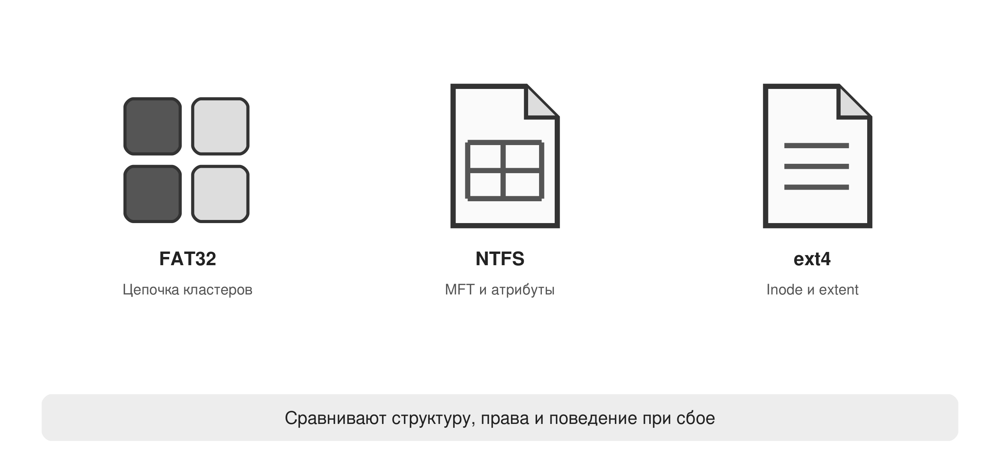

<p align="center"><em>Рисунок 21 — Основные структуры FAT32, NTFS и ext4</em></p>

## Блочные устройства, монтирование и логические тома LVM

Рассмотренная структура ext4 располагается на блочном устройстве. Между ним и физическим накопителем могут работать управление томами, программный RAID и шифрование. Эти механизмы дополняют файловую систему, но решают другие задачи: файловая система организует файлы, а нижележащие уровни предоставляют ей адресуемое пространство [13, 16].

### Идентификация устройства и разметка

Путь `/dev/sda` обычно представляет целый диск соответствующего семейства устройств, а `/dev/sda1` — его первый раздел. Для NVMe примером служат `/dev/nvme0n1` и `/dev/nvme0n1p1`: пространство имён контроллера и раздел в нём. Нельзя определять HDD или SSD только по префиксу `sd`: SATA SSD тоже может получить такое имя. Порядок обнаружения устройств способен измениться, поэтому устойчивый идентификатор следует отличать от имени текущего подключения.

Таблица разделов описывает диапазоны диска. MBR использует традиционную схему с ограниченным числом основных записей и, при необходимости, расширенным разделом для логических разделов. GPT хранит более гибкую таблицу с идентификаторами и резервными структурами. Создание раздела не форматирует его: запись о диапазоне и структуры файловой системы — разные объекты. Аналогично установка признака типа раздела не превращает существующие данные в ext4.

В разобранном примере сначала выясняют, что система действительно видит, а затем сопоставляют устройство с файловой системой:

```bash
lsblk -f
findmnt -T /home/student
```

`lsblk -f` показывает обнаруженные блочные устройства, типы файловых систем, метки и UUID. `findmnt -T` показывает монтирование, через которое доступен указанный путь. Если `/home` не имеет отдельного тома, этот путь может обслуживать корневая файловая система. Не следует считать каждый каталог самостоятельным разделом.

Для подготовки нового хранилища администратор сначала определяет устройство, затем создаёт нужный диапазон или том, формирует файловую систему и подключает её. Утилиты `fdisk` и `parted` работают с разметкой, `mkfs.ext4` создаёт структуры ext4, а `mount` подключает уже существующую файловую систему. Форматирование меняет служебные структуры и не является операцией подключения старых данных. GParted предоставляет графический интерфейс к ряду этих действий, но не устраняет различия между ними.

### Постоянное монтирование и параметры доступа

Разовое монтирование изменяет состояние текущей системы. Конфигурация `/etc/fstab` описывает файловые системы для последующих подключений, в том числе при загрузке. Её строка имеет шесть полей: источник, точка монтирования, тип, параметры, признак для `dump` и порядок проверки `fsck` [17]. Условный пример имеет вид:

```fstab
UUID=11111111-2222-3333-4444-555555555555 /srv/data ext4 defaults 0 2
```

Здесь UUID — пример, а не идентификатор стенда. Для обычного дополнительного ext4-тома значение последнего поля `2` задаёт проверку после корневой системы; `0` отключает такую проверку. UUID файловой системы и PARTUUID записи раздела обозначают разные сущности. При побитовом клонировании идентификаторы могут совпасть, поэтому одного UUID недостаточно для доказательства уникальности физического носителя.

Параметры монтирования участвуют в защите [18]. `ro` ограничивает запись через смонтированную файловую систему, `nodev` отключает интерпретацию файлов устройств, `nosuid` ограничивает действие set-user-ID/set-group-ID и связанных привилегий, `noexec` запрещает непосредственное выполнение файлов. Однако `noexec` не мешает разрешённому интерпретатору прочитать скрипт как данные. Эти ограничения работают совместно с правами и политиками, а не заменяют их.

Для ext4 режим `ro` сам по себе не гарантирует отсутствия записей на носитель: при монтировании может воспроизводиться журнал. В исследовании доказательств используют подходящую блокировку записи и копию. Опция `noload` запрещает загрузку журнала, но может показать несогласованное состояние после сбоя; это осознанный выбор условий исследования, а не универсальное исправление.

Размонтирование завершает использование подключения. Оно может не выполниться, если процесс держит открытый файл или текущий каталог внутри тома. Обычная проверка и исправление ext4 средствами `e2fsck` выполняются на размонтированной файловой системе; проверка изменяемого работающего тома не даёт надёжной картины. Каталог `lost+found` может использоваться для присоединения найденных при восстановлении объектов, связь которых с каталогами утрачена. Это не корзина и не готовая резервная копия.

### Физические тома, группа и логические тома

Logical Volume Manager (LVM) позволяет распределять пространство устройств между логическими томами. Основные понятия — Physical Volume (PV), физический том; Volume Group (VG), группа томов; Logical Volume (LV), логический том. PV представляет подготовленное для LVM блочное устройство, которым может быть раздел или целый диск. VG объединяет ресурсы PV. LV получает часть пространства группы и предоставляется как блочное устройство, на котором можно разместить файловую систему [16].

Предположим, что два PV предоставляют группе по 20 ГиБ полезного пространства. Администратор выделяет 12 ГиБ для `lv_home` и 8 ГиБ для `lv_logs`. Остаётся 20 ГиБ свободного пространства группы, которое можно позднее назначить любому из этих томов или новому LV. Это учебный расчёт без служебных расходов и округления. Свободное место VG ещё не доступно приложению: сначала его должен получить LV, затем должна расшириться файловая система.

PV делится на physical extents (PE), а LV — на logical extents (LE). LVM хранит их отображение. Эти extent не следует смешивать с extent внутри ext4: LVM описывает размещение диапазонов логического устройства, а ext4 — размещение диапазонов файла внутри этого устройства. Например, один участок LV может быть на первом PV, другой — на втором, при этом ext4 работает с единым диапазоном адресов LV.

У линейного LV диапазоны последовательно сопоставляются с физическими областями. Чередование распределяет записи между устройствами, а режимы RAID добавляют предусмотренную избыточность. Само объединение PV в VG не создаёт зеркало. Если линейный LV использует области двух дисков, потеря одного может сделать его файловую систему непригодной; последствия для других LV зависят от их размещения. Неверно автоматически считать любой LVM отказоустойчивым или утверждать, что при потере одного PV обязательно исчезает каждый LV всей группы.

Просмотр конфигурации выполняют утилитами пакета `lvm2`:

```bash
sudo pvs
sudo vgs
sudo lvs -o lv_name,vg_name,lv_size,segtype,devices
```

Первая показывает PV, вторая — группы и доступный ресурс, третья — LV с типом сегмента и устройствами размещения. Эти примеры требуют установленного пакета и соответствующих прав. Их назначение — объяснить наблюдаемые уровни хранения; наличие LVM на стенде из них не следует.

На рисунке 22 показано: физические тома, группа и логические тома lvm.

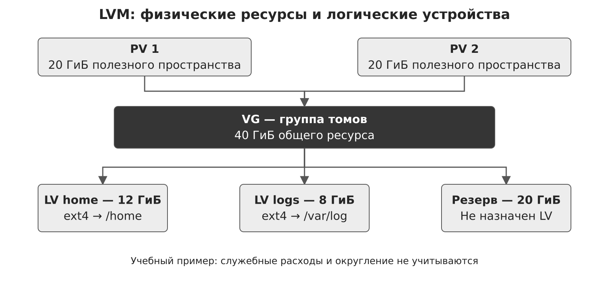

<p align="center"><em>Рисунок 22 — Физические тома, группа и логические тома LVM</em></p>

### Изменение размера и перенос данных

Рост блочного устройства и рост файловой системы выполняют последовательно [20]. В LVM сначала увеличивают LV, используя свободные extents VG, а затем расширяют файловую систему. Ext4 при поддержке ядра допускает увеличение в смонтированном состоянии. Утилита `resize2fs` меняет размер ext2/ext3/ext4, но не размер раздела или LV. Некоторые команды LVM умеют согласовать обе операции, однако результат каждого уровня всё равно следует проверить.

Уменьшение требует обратного порядка: сначала сокращают файловую систему, затем предоставленное ей пространство. Для ext4 уменьшение выполняют в размонтированном состоянии с необходимой проверкой. Если сначала отрезать конец LV или раздела, там могут оказаться данные либо метаданные, и файловая система будет повреждена. Поэтому расширение и уменьшение не являются симметричными действиями, а допустимость работы без остановки зависит от операции и типа файловой системы.

На рисунке 23 показано: порядок увеличения и уменьшения ext4 и тома.

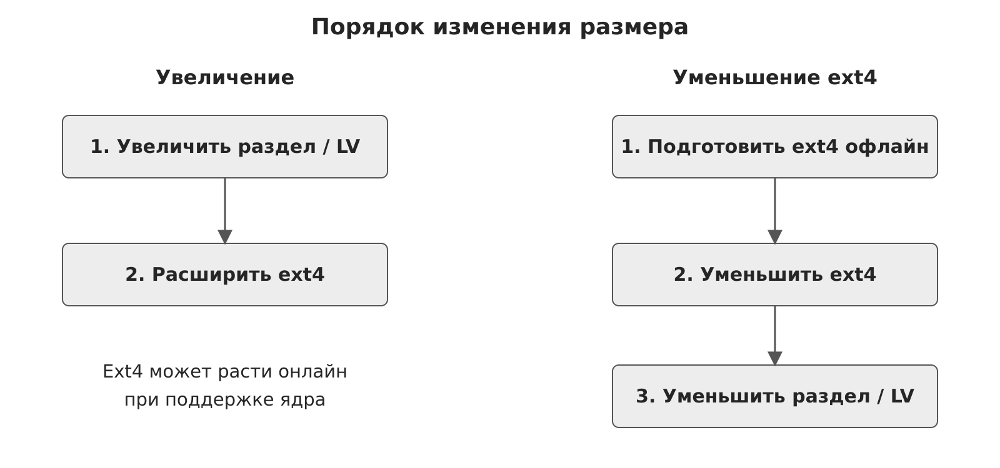

<p align="center"><em>Рисунок 23 — Порядок увеличения и уменьшения ext4 и тома</em></p>

При переносе, например, `/var/log` на новый том недостаточно подключить его поверх непустого каталога. Монтирование скроет прежние файлы, но они продолжат занимать место в старой файловой системе. Полный перенос требует подготовки целевого тома, согласованной копии с сохранением нужных метаданных, остановки или согласования записывающих служб и проверки нового подключения. Только после проверки определяют судьбу прежней копии. Файлы, которые служба держит открытыми, могут продолжать получать записи на старом томе.

Снимок LVM фиксирует состояние блочного устройства. В классическом варианте copy-on-write при изменении блока сохраняется его прежняя версия в области снимка. Недостаточный объём этой области может сделать снимок непригодным. Снимок без согласования с приложением отражает состояние диска, которое может потребовать восстановления базы данных; согласованность файловой системы и согласованность транзакций приложения различаются. Независимую резервную копию такого снимка обсуждаем далее.

## Что происходит при записи и аварийном завершении

Изученная в предыдущей лекции связь памяти и файлов проявляется через page cache. Приложение может передать данные в пользовательский буфер библиотеки, библиотека — ядру, ядро — в кэш, а затем накопитель получит фактическую запись. На каждом уровне есть состояние «операция принята», которое не всегда означает «данные переживут отключение питания». По этой причине нужно различать логическую доступность нового содержимого другим процессам и его долговечность на носителе.

На рисунке 24 показаны уровни, на которых данные могут находиться до долговечного сохранения.

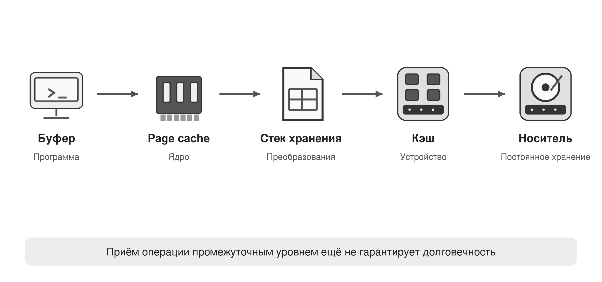

<p align="center"><em>Рисунок 24 — Промежуточные уровни файловой записи</em></p>

Создание файла изменяет несколько структур: появляется запись каталога, выделяется inode или запись MFT, резервируются блоки, записываются данные и обновляется размер. Если питание исчезнет между этими действиями, могут возникнуть несогласованности. Например, пространство отмечено занятым, но из каталога на него не ведёт ссылка, либо каталог указывает на объект с неполным состоянием. Средства проверки файловой системы анализируют эти связи; журналирование помогает не оставлять обновление метаданных в произвольной промежуточной форме.

На рисунке 25 показан условный сбой между обновлениями; конкретный порядок зависит от реализации.

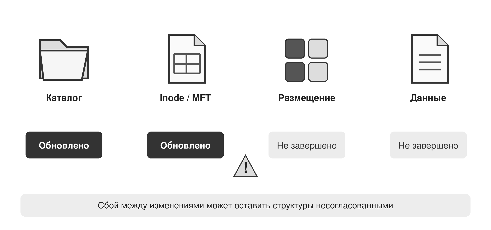

<p align="center"><em>Рисунок 25 — Несогласованность структур при незавершённом обновлении</em></p>

Журналирование использует запись транзакций. Изменения, необходимые для восстановления согласованности, сначала фиксируются в журнале; после подтверждения транзакции они могут быть перенесены в окончательные области. При восстановлении система определяет, какие транзакции завершены и какие изменения следует воспроизвести. Для ext4 эту работу выполняет JBD2. Защита распространяется на объекты, включённые в соответствующую транзакцию, и зависит от корректной работы нижнего стека хранения [5].

Журнал не является резервной копией: он не предназначен для длительного хранения всех старых вариантов документа. Если пользователь корректно удалил файл, такое удаление может быть полностью согласованной транзакцией. Если приложение записало неверные значения, журналирование способно сохранить именно эти неверные значения в структурно корректном виде. Поэтому следует разделять три понятия: согласованность файловой системы, корректность содержимого и возможность вернуть предыдущую версию.

На рисунке 26 показаны запись изменений, подтверждение транзакции и воспроизведение при восстановлении.

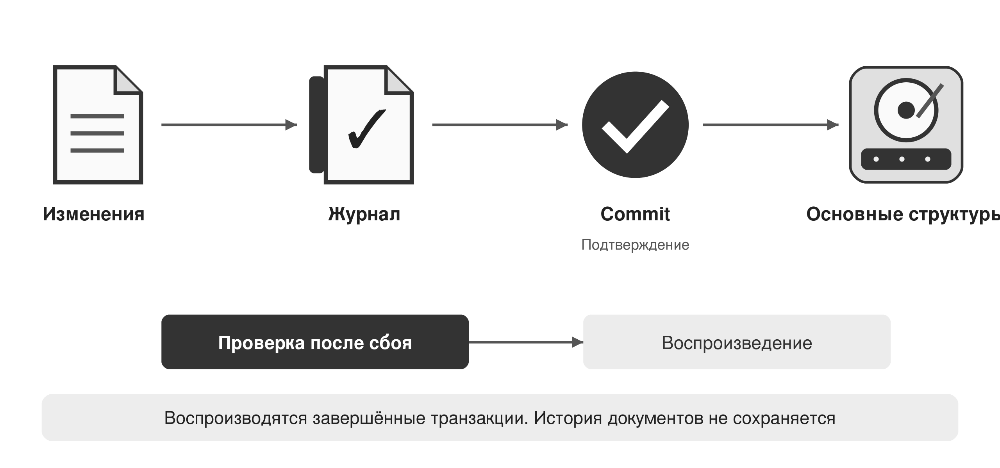

<p align="center"><em>Рисунок 26 — Фиксация транзакции и восстановление по журналу</em></p>

Для ext4 различают режимы `data=ordered`, `data=writeback` и `data=journal`. В обычной модели ordered журналируются метаданные, а связанные данные должны быть записаны перед фиксацией соответствующих метаданных. Writeback не даёт такого же порядка для данных. Journal включает в журнал и данные, увеличивая объём записи. Конкретный режим нужно проверять; наличие журнала не означает, что всё содержимое каждого файла проходит через него. Даже более строгий режим не превращает файловую систему в систему резервного копирования [6].

На рисунке 27 сопоставлены data=ordered, data=writeback и data=journal.

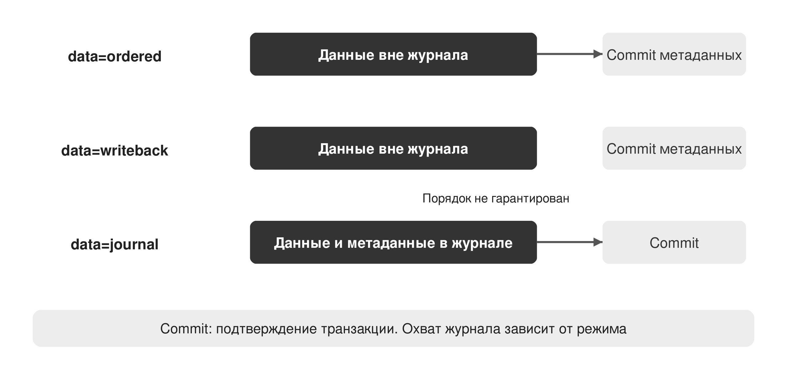

<p align="center"><em>Рисунок 27 — Охват и порядок записи в режимах журналирования ext4</em></p>

Приложение должно явно запрашивать нужные гарантии. `fflush` передаёт данные из буфера стандартной библиотеки дальше, но не эквивалентен подтверждённой записи на носитель. `fsync` синхронизирует данные файла и необходимые метаданные, а `fdatasync` ориентирован на данные и метаданные, нужные для их последующего чтения. Если изменилось имя или появилась запись каталога, долговечность этой записи требует отдельного внимания: синхронизация файла сама по себе не гарантирует сохранение записи в родительском каталоге [7].

Рассмотрим сохранение конфигурации службы. Запись прямо поверх существующего файла может оставить обрезанную или частично обновлённую конфигурацию при ошибке. Распространённая стратегия — создать временный файл в той же файловой системе, полностью записать и синхронизировать его, затем переименовать на целевое имя и синхронизировать содержащий каталог. Переименование даёт атомарную смену видимого имени при предусмотренных условиях, а синхронизация отвечает за долговечность. Это разные свойства. Обработку ошибок, права временного файла и особенности целевой системы необходимо учитывать в реальной реализации.

Атомарность также не означает, что прикладной набор из нескольких файлов обновился согласованно. Если документ и индекс изменяются отдельно, файловая система может восстановить оба как корректные объекты, но их версии окажутся несовместимыми. Базы данных используют собственные журналы и протоколы транзакций именно потому, что им требуется согласованность прикладных данных, а не только структуры каталогов.

На рисунке 28 показана последовательность сохранения временного файла, смены имени и синхронизации каталога.

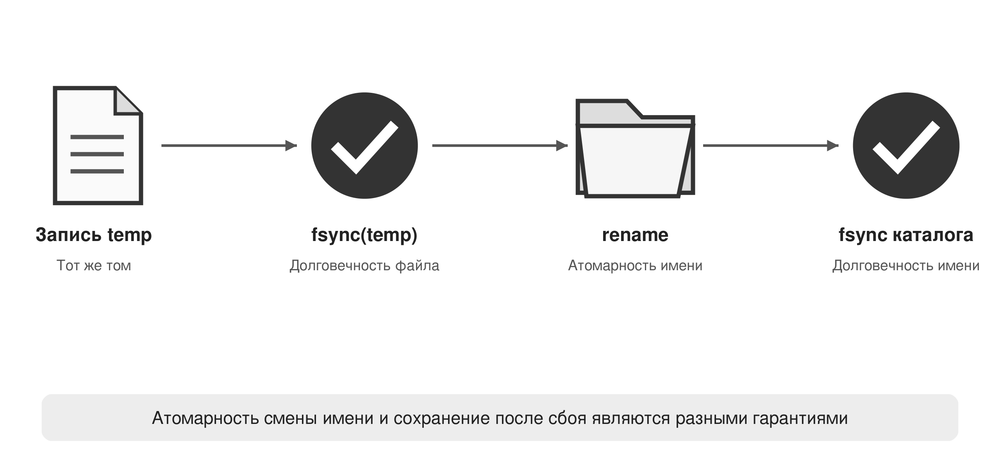

<p align="center"><em>Рисунок 28 — Сохранение файла: синхронизация и атомарная смена имени</em></p>

После сбоя проверку и исправление нужно отличать от извлечения доказательств. Исправляющая утилита меняет структуры и может удалить повреждённые записи или перераспределить связи. Если требуется расследование, сначала сохраняют исходное состояние и работают с копией по установленной процедуре. Даже «только чтение» на уровне предполагаемого действия требует проверки: некоторые варианты монтирования способны воспроизводить журнал. Для сохранения исходного носителя важны режим подключения и фактически выполняемые операции, а не только название команды.

На рисунке 29 разделены ремонт рабочей копии и сохранение исходного состояния для исследования.

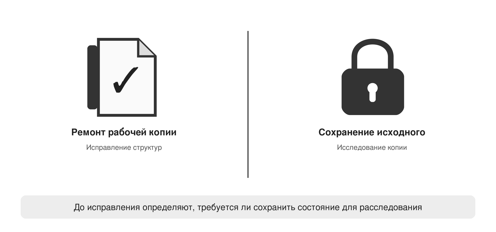

<p align="center"><em>Рисунок 29 — Исправление структур и сохранение исходного состояния</em></p>

## Резервирование и восстановление данных

Когда файловая система способна восстановить свою структуру, остаётся вопрос: переживут ли данные отказ устройства, ошибочное удаление или компрометацию? Здесь нужны разные средства. Резервирование устройств увеличивает доступность при определённых аппаратных отказах. Снимки сохраняют состояния. Резервные копии дают отдельные восстанавливаемые версии. Ни один механизм не следует оценивать только по числу копий без анализа их независимости.

RAID 0 распределяет данные по устройствам ради объёма и производительности, но не имеет избыточности. RAID 1 зеркалирует данные. RAID 5 и RAID 6 используют распределённую чётность; RAID 10 сочетает зеркалирование и распределение. Допустимые сочетания отказов зависят от организации массива. Например, в RAID 10 два отказа в одной зеркальной паре имеют другое значение, чем два отказа в разных парах. Восстановление после отказа также создаёт нагрузку и занимает время.

Зеркало повторяет логические изменения. Удалённый файл исчезает на обеих копиях; зашифрованный вредоносным процессом файл также может оказаться зашифрованным на всём массиве. Общий контроллер, питание, площадка и административный доступ образуют общие точки отказа. RAID уменьшает риск определённых отказов оборудования, но не обеспечивает независимую историю документов.

На рисунке 30 сопоставлены RAID 0, RAID 1 и зеркальные пары RAID 10.

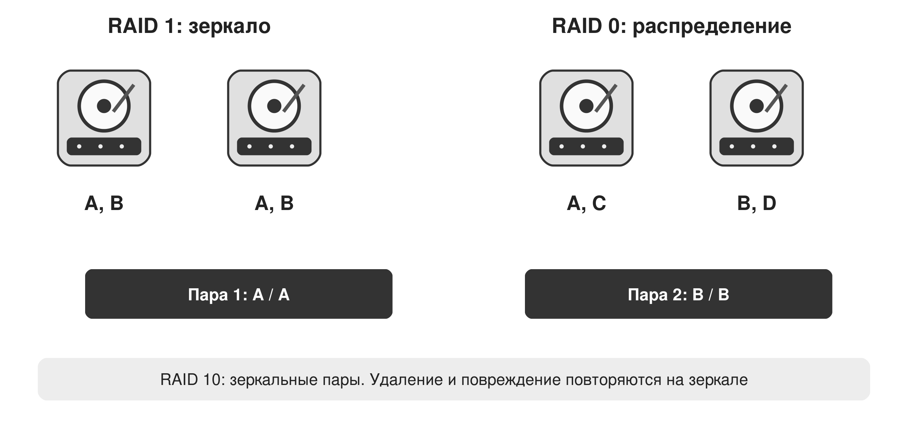

<p align="center"><em>Рисунок 30 — Распределение и зеркалирование данных в RAID</em></p>

Снимок фиксирует состояние через механизм хранения и часто использует copy-on-write. Он удобен для быстрого отката, но может зависеть от того же устройства и исходных блоков. Поэтому локальный snapshot не всегда переживает потерю хранилища. Кроме того, снимок работающей системы может быть согласован только на уровне аварийного состояния. Для базы данных или группы связанных файлов требуется координация с приложением, чтобы получить ожидаемую прикладную согласованность.

На рисунке 31 показана общая область отказа рабочих данных и локального снимка, а также отдельная копия.

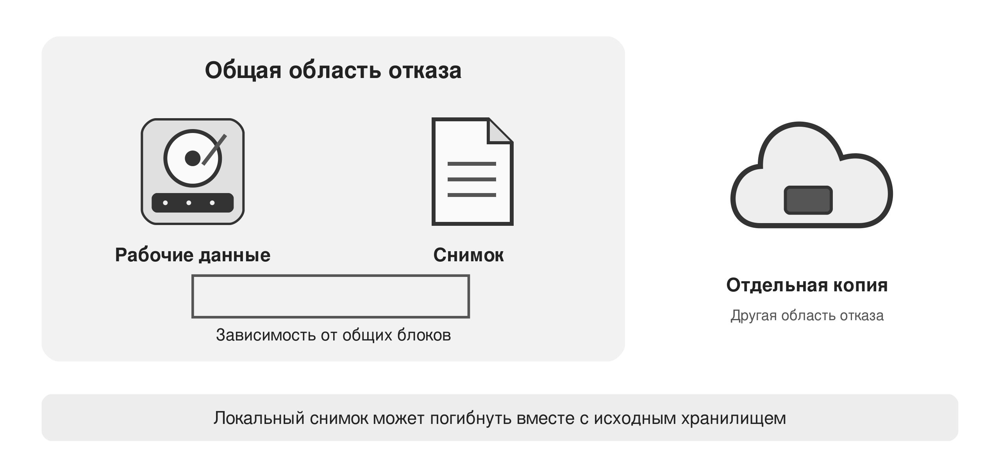

<p align="center"><em>Рисунок 31 — Зависимый снимок и отдельная резервная копия</em></p>

Резервное копирование следует оценивать через RPO и RTO. Recovery Point Objective описывает допустимую потерю по времени: насколько старым может оказаться восстановленное состояние. Recovery Time Objective задаёт целевой срок восстановления. Если копия создаётся раз в сутки, при неблагоприятном моменте сбоя можно потерять почти сутки изменений. Если восстановление занимает несколько дней, наличие копии не обеспечивает требуемой доступности службы.

Полная копия сохраняет выбранный набор целиком. Инкрементальная содержит изменения с последней соответствующей копии; для восстановления часто требуется цепочка. Дифференциальная обычно содержит изменения относительно последней полной копии. Точные определения зависят от продукта, поэтому проверять следует реальную процедуру восстановления. Разрыв цепочки или отсутствие каталога резервных копий могут сделать отдельные файлы бесполезными для восстановления.

На рисунке 32 обозначены события копирования, сбоя и восстановления и соответствующие им целевые параметры.

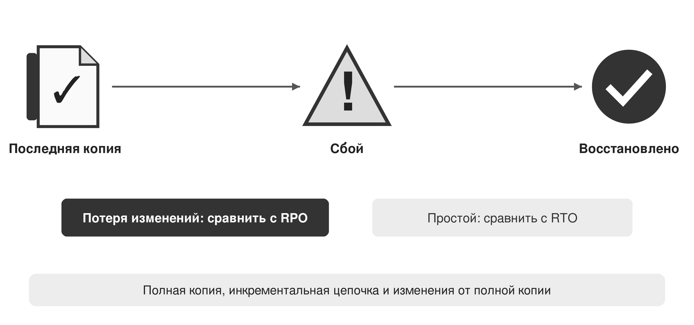

<p align="center"><em>Рисунок 32 — Потеря изменений и время восстановления: RPO и RTO</em></p>

В таблице 5 сравним средства по тому, от какого события они обычно помогают. Она показывает типичную роль, а не гарантии любого продукта.

Таблица 5 — Роли средств сохранения данных

| Средство | Основная роль | Существенное ограничение |
|---|---|---|
| Журнал файловой системы | Восстановление согласованности после сбоя | Не хранит полную историю пользовательских данных |
| RAID с избыточностью | Работа при определённых отказах дисков | Повторяет удаление и повреждение данных |
| Локальный снимок | Быстрый возврат к состоянию | Может погибнуть вместе с исходным хранилищем |
| Версионная резервная копия | Восстановление более ранних данных | Зависит от полноты, доступности и проверки восстановления |
| Отдельная защищённая копия | Снижение общего риска потери | Требует отдельной политики доступа, хранения и ключей |

Резервная копия должна включать то, что требуется для восстановления сервиса: содержимое, нужные метаданные, конфигурацию, зависимости и ключи либо предусмотренный доступ к ним. Утрата ключа зашифрованной копии может быть столь же критична, как утрата самой копии. В то же время хранение ключа рядом с архивом под теми же полномочиями уменьшает защиту от компрометации.

Результат задания копирования в журнале не доказывает, что сервис восстанавливается. Нужны чтение копии, проверка целостности и периодическое восстановление в отдельной среде. Контрольная сумма обнаруживает изменение относительно эталона, но если нарушитель способен заменить и данные, и эталон, одного хеша недостаточно. Доверие к эталону, независимость хранения и контроль полномочий входят в процедуру проверки.

На рисунке 33 показано, как пригодность архива подтверждается пробным восстановлением и проверкой работы сервиса.

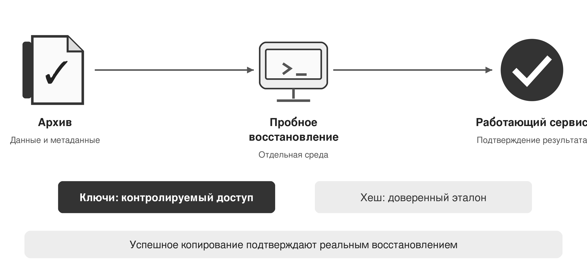

<p align="center"><em>Рисунок 33 — Проверка резервной копии восстановлением сервиса</em></p>

## Шифрование и границы защиты хранилища

Шифрование защищает конфиденциальность при определённом сценарии доступа к данным. Основной вопрос — у кого есть ключ и в каком состоянии находится система. Украденный выключенный накопитель, разблокированный компьютер и процесс с доступом к файлам представляют разные модели угроз. Одинаковая надпись «зашифровано» не означает одинаковый результат для всех трёх ситуаций.

Шифрование блочного устройства преобразует данные ниже файловой системы. Файловая система работает с расшифрованными блоками, а на физическом носителе хранится их зашифрованное представление. Такой подход может скрывать содержимое и большую часть структуры внутри защищаемого тома, но не обязательно сведения вне него: таблицу разделов, размер контейнера или отдельный незашифрованный загрузочный раздел. BitLocker и решения на основе dm-crypt относятся к этому уровню, хотя конкретные возможности и конфигурации различаются.

Шифрование на уровне файловой системы позволяет защищать отдельные файлы или деревья каталогов. Linux fscrypt поддерживает шифрование содержимого и имён в совместимых файловых системах, но не предназначен для сокрытия всех метаданных. Например, размеры и некоторые другие структурные сведения могут оставаться наблюдаемыми. Раздельные ключи удобны для разграничения защищаемых наборов, но создают дополнительные требования к управлению ключами [8].

Прикладное шифрование применяется самим приложением, например при создании зашифрованного архива или защищённого контейнера документа. Оно может сохранять защиту при переносе на другой носитель, но зависит от выбранного формата и порядка работы программы. Временные незашифрованные файлы, автосохранение и экспорт способны оставить копии вне защищённого объекта.

На рисунке 34 сопоставлены области защиты на разных уровнях.

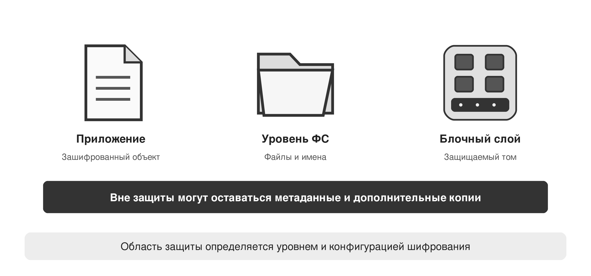

<p align="center"><em>Рисунок 34 — Прикладное, файловое и блочное шифрование</em></p>

Права доступа и шифрование дополняют друг друга. Права ограничивают операции, пока ОС исполняет политику; при чтении снятого незашифрованного диска через другую среду эти ограничения могут не остановить доступ к байтам. Шифрование, напротив, помогает при отсутствии ключа, но после разблокировки не заменяет разграничение доступа. Процесс с разрешением читать документ получает его открытый текст, даже если носитель зашифрован.

Конфиденциальность не равна целостности. Некоторые распространённые схемы шифрования хранения сами по себе не обеспечивают аутентификацию каждого изменения. Проверка подлинности и обнаружение несанкционированной модификации требуют соответствующих механизмов: аутентифицированного формата, подписей, доверенного эталона или дополнительных защит. Нельзя считать, что любое повреждение шифротекста обязательно будет распознано как злонамеренное изменение.

Жизненный цикл ключа включает создание, выдачу, использование, резервирование, замену и уничтожение. Пароль пользователя часто защищает доступ к ключу, а не служит непосредственно ключом для каждого блока. Возможность восстановить доступ должна быть предусмотрена заранее. Recovery key позволяет вернуть доступ при сбое основного механизма, но становится самостоятельным секретом. Его раскрытие может обойти ожидаемую защиту независимо от сложности обычного пароля.

С предыдущей темой связана проблема открытого текста в оперативной памяти. Данные могут находиться в page cache, буферах процесса, swap, дампах или образе гибернации. Защита только основного каталога не обязательно охватывает эти места. При компрометации работающей ОС действующие ключи и доступные расшифрованные данные могут стать доступны нарушителю. Возможности удаления ключей и очистки кэшей имеют ограничения; модель fscrypt прямо рассматривает такие границы [8].

На рисунке 35 сопоставлены выключенный том без ключа и разблокированная работающая система.

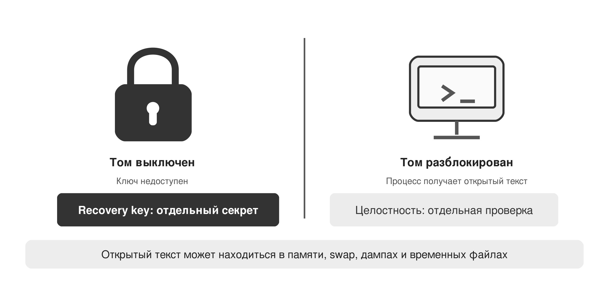

<p align="center"><em>Рисунок 35 — Состояние тома, доступ к открытому тексту и ключи</em></p>

Таким образом, проект защиты должен определить защищаемый набор, допустимые утечки метаданных, состояние системы, управление ключами и все создаваемые копии. Шифрование резервного архива не отменяет необходимости резервного копирования, а резервное копирование зашифрованных данных не отменяет необходимости сохранить доступ к ключу.

## Удаление и остаточные данные

Теперь можно объяснить, что происходит при удалении. В Unix-семантике `unlink` удаляет имя из каталога. Если остаются другие жёсткие ссылки, объект доступен через них. Если последняя ссылка удалена, но файл ещё открыт процессом, его содержимое остаётся доступным через открытый дескриптор до закрытия последней соответствующей ссылки на открытый объект. Поэтому удалённый журнал может продолжать занимать место, пока служба держит его открытым [9].

Освобождение блоков означает, что файловая система может использовать их снова. Оно не требует немедленно перезаписать каждый байт нулями. До повторного использования прежнее содержимое может сохраняться. Следы также могут находиться в slack space последней единицы выделения, журналах, старых версиях, снимках, временных файлах и резервных копиях. Смена имени, очистка корзины и быстрое форматирование не следует считать подтверждённым уничтожением всех копий.

На рисунке 36 показано сохранение объекта и его данных после удаления последнего имени, пока файл остаётся открытым; пунктирная связь от удалённого имени обозначает прежнее состояние.

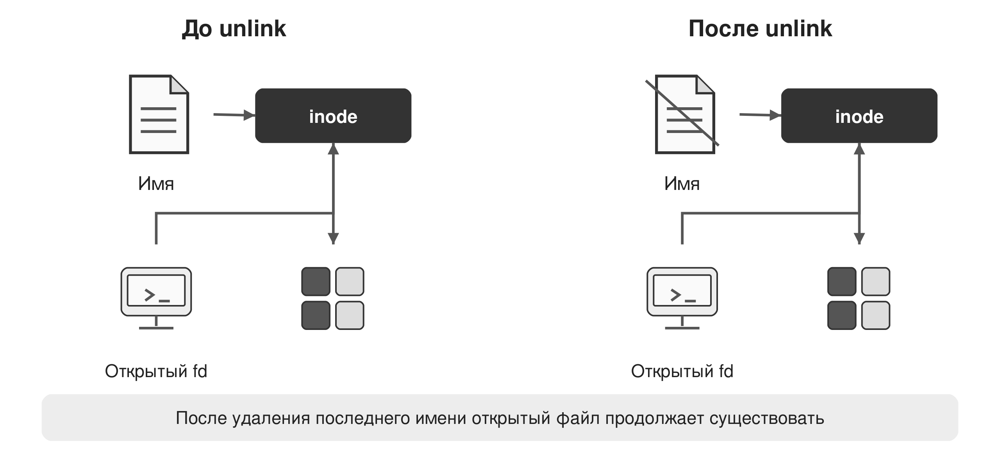

<p align="center"><em>Рисунок 36 — Удаление имени при сохранении открытого файла</em></p>

На SSD между логическими адресами и физической флеш-памятью работает контроллер. Он использует перенос записей, wear leveling и резервные области. Перезапись логического файла может затронуть другие физические страницы, а прежние временно останутся вне прямой видимости ОС. Поэтому многократная запись поверх имени файла не даёт универсальной гарантии очистки всей физической памяти SSD.

TRIM или discard уведомляет устройство, что определённые логические диапазоны больше не нужны. Это помогает управлять свободным пространством и может существенно затруднять обычное восстановление. Но уведомление об освобождении не тождественно проверенной процедуре sanitization. Фактическое стирание, время его выполнения и поведение контроллера зависят от устройства и интерфейса. Нельзя гарантировать восстановление удалённых данных, но нельзя и обещать гарантированное уничтожение только по факту вызова TRIM.

На рисунке 37 показано преобразование обращения к SSD и возможное сохранение прежней страницы.

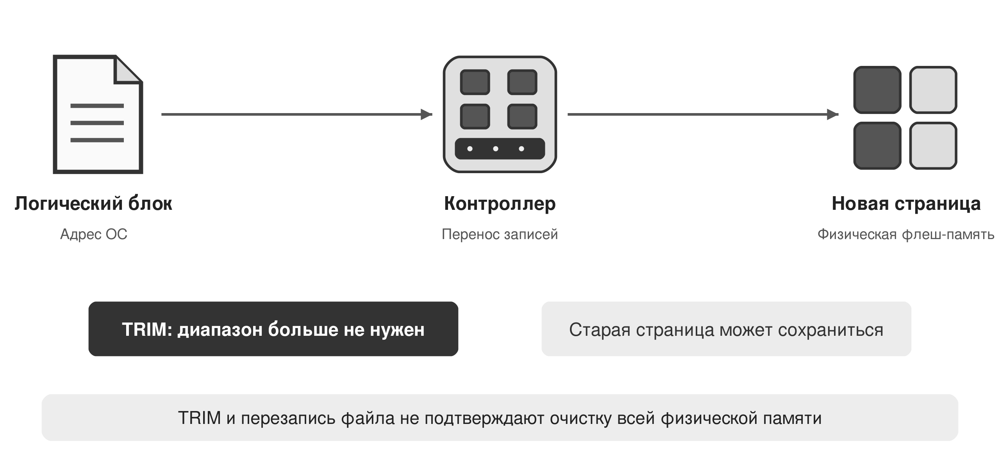

<p align="center"><em>Рисунок 37 — Логические блоки, контроллер SSD и физические страницы</em></p>

Для вывода носителя из эксплуатации выбирают процедуру очистки по модели угроз, типу устройства и допустимости дальнейшего использования. Руководство NIST SP 800-88 Rev. 2 рассматривает категории Clear, Purge и Destroy и необходимость подтверждения результата процедуры. Cryptographic erase опирается на уничтожение ключевого материала при выполнении необходимых условий: данные должны быть защищены надлежащим шифрованием, а доступные копии ключей и незашифрованные копии должны быть учтены [10].

Важно различать очистку носителя и удаление одного документа из всей информационной системы. Даже надёжно очищенный диск не удалит архив с сервера резервного копирования. Политика хранения должна описывать, где существуют копии, кто ими управляет и когда они удаляются. Для защитника это соединяет технические механизмы с управлением жизненным циклом информации.

На рисунке 38 показаны категории Clear, Purge и Destroy; значок ключа напоминает об условиях cryptographic erase и не означает, что любой метод Purge сводится к уничтожению ключа.

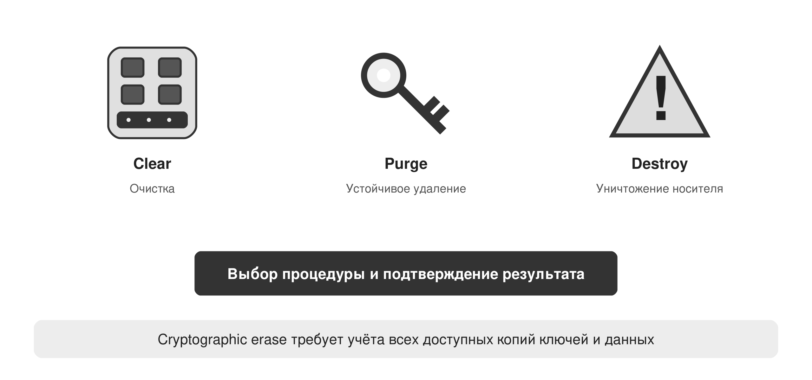

<p align="center"><em>Рисунок 38 — Категории очистки носителя и подтверждение результата</em></p>

Рассмотрим итоговый пример: отчёт сохранён на ext4, том зашифрован, хранение использует зеркало, а ночью создаётся резервная копия. Журнал ext4 помогает восстановить структуру после сбоя. Зеркало поддерживает доступность при предусмотренном отказе диска. Шифрование защищает данные выключенного тома при отсутствии ключа. Резервная копия позволяет вернуть предыдущую версию, если она существует и пригодна для восстановления. Удаление отчёта из рабочего каталога не уничтожает его архивную копию. Эти свойства независимы, и оценивать их нужно по отдельности.

На рисунке 39 сопоставлены роли журнала, зеркала, шифрования и резервной копии.

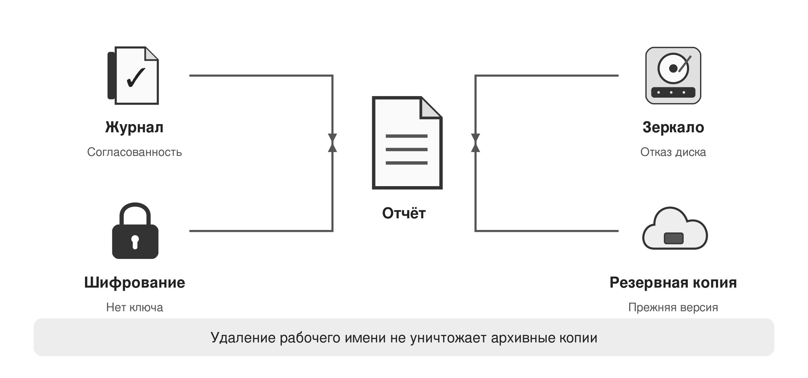

<p align="center"><em>Рисунок 39 — Разные механизмы защиты одного отчёта</em></p>

## Основные выводы

Файловая система связывает имена, объекты, метаданные и области хранения. Путь, inode, файловый дескриптор и физическое размещение описывают разные уровни. VFS объединяет интерфейс обращения к файловым системам, сохраняя различия их реализаций.

FAT, NTFS и ext4 используют разные структуры и обладают разными возможностями. При выборе формата важны совместимость, права, дополнительные атрибуты и поведение записи. Перенос байтов на другую файловую систему может не сохранить модель безопасности исходного объекта.

Журналирование уменьшает риск структурной несогласованности после сбоя, но не исправляет прикладную ошибку и не заменяет историю версий. Успешная запись в буфер, атомарная смена имени и долговечность после отключения питания — разные гарантии.

Доступность, восстановление, конфиденциальность и уничтожение данных требуют разных средств. RAID, снимки, резервные копии и шифрование должны дополнять друг друга в рамках определённой модели угроз. Удалённое имя не доказывает отсутствие содержимого на носителе и во всех копиях.

На рисунке 40 собраны уровни организации и отдельные гарантии хранения.

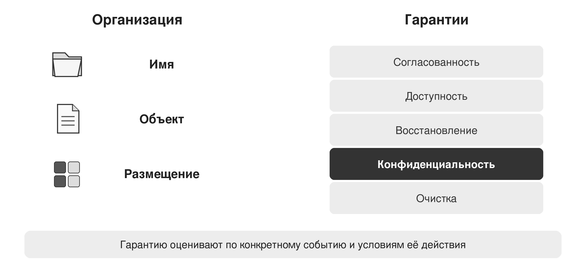

<p align="center"><em>Рисунок 40 — Уровни файловой организации и гарантии защиты данных</em></p>

## Вопросы для самоконтроля

1. Чем отличаются устройство, раздел, логический том и файловая система?
2. Почему путь к файлу не является адресом его данных на накопителе?
3. Какие задачи решает VFS и какие различия файловых систем он не устраняет?
4. Чем inode отличается от записи каталога и файлового дескриптора?
5. Как несколько имён могут ссылаться на один файл?
6. Чем жёсткая ссылка отличается от символьной?
7. Почему права самого файла не полностью определяют возможность удаления его имени?
8. Чем различаются размер файла и фактически занятое пространство?
9. Как extent описывает размещение и почему разреженный файл может занимать меньше своего размера?
10. Как FAT связывает кластеры файла и какое последствие имеет повреждение цепочки?
11. Почему индивидуальные права FAT32 нельзя считать эквивалентом ACL NTFS?
12. Какую роль играют MFT и атрибуты NTFS?
13. Чем журнал транзакций отличается от журнала изменений и резервной копии?
14. Почему отсутствие свободных inode может препятствовать созданию файла при наличии свободных блоков?
15. Какие состояния проходят данные между буфером программы и постоянным носителем?
16. Почему `fsync` файла не всегда достаточно для сохранения нового имени?
17. Чем атомарность отличается от долговечности?
18. Почему RAID и локальный снимок не заменяют независимую резервную копию?
19. Что выражают RPO и RTO?
20. Какие метаданные необходимо учитывать при резервном копировании?
21. От каких сценариев защищает шифрование выключенного тома и где заканчивается эта защита?
22. Почему шифрование не всегда обеспечивает контроль подлинности изменения?
23. Почему файл после `unlink` может оставаться открытым и занимать место?
24. Чем TRIM отличается от подтверждённой очистки носителя?
25. Какие условия необходимы для обоснованного применения cryptographic erase?

26. Как FHS разделяет конфигурацию, программные компоненты и изменяемое состояние?
27. Чем отличаются `/tmp`, `/var/tmp` и `/run`?
28. Что показывает первый символ строки `ls -l`?
29. Чем UUID файловой системы отличается от имени `/dev/sda1` и PARTUUID?
30. Какие уровни описывают PV, VG и LV?
31. Почему свободное место VG ещё не доступно файловой системе?
32. Чем различаются extent ext4 и extents LVM?
33. В каком порядке увеличивают и уменьшают файловую систему и нижележащий том?
34. Почему `ro` и `noexec` требуют точной интерпретации?
35. Почему монтирование нового тома поверх каталога не переносит старые данные?

## Основные понятия и сокращения

Основные термины сведены в таблицу 6. Определения относятся к учебной модели; детали интерфейсов зависят от ОС и реализации.

Таблица 6 — Понятия файловой организации и защиты хранения

| Понятие | Определение |
|---|---|
| Файловая система | Структуры и механизмы организации объектов и их данных в предоставленном пространстве хранения |
| Раздел | Описанный диапазон адресного пространства устройства |
| Логический том | Предоставляемый системе объём хранения, сформированный средствами управления томами |
| Монтирование | Подключение файловой системы к пространству имён ОС |
| FHS | Filesystem Hierarchy Standard, соглашения о назначении каталогов |
| UUID | Идентификатор объекта; UUID файловой системы отличается от PARTUUID раздела |
| LVM | Logical Volume Manager, управление логическими томами |
| PV / VG / LV | Физический том / группа томов / логический том |
| PE / LE | Физическая / логическая единица распределения пространства LVM |
| VFS | Virtual Filesystem, общий слой интерфейса файловых систем в ядре Linux |
| Superblock | Объект с общими сведениями о файловой системе и её состоянии |
| Inode | Индексный дескриптор объекта с метаданными и сведениями о данных |
| Dentry | Объект VFS, участвующий в связывании имени с объектом при разрешении пути |
| Файловый дескриптор | Числовая ссылка процесса на открытый файловый объект |
| Метаданные | Сведения о структуре, свойствах и размещении объекта |
| ACL | Access Control List, список управления доступом |
| Кластер | Единица выделения пространства в соответствующем формате файловой системы |
| Extent | Описание непрерывного диапазона размещения данных |
| Sparse file | Разреженный файл с логическими диапазонами без выделенных блоков |
| FAT | File Allocation Table, таблица связей кластеров семейства FAT |
| MFT | Master File Table, основная таблица записей объектов NTFS |
| ADS | Alternate Data Stream, дополнительный именованный поток данных NTFS |
| Page cache | Кэш файловых данных в памяти ядра |
| Writeback | Перенос изменённых кэшированных данных в нижележащее хранилище |
| Delayed allocation | Отложенное определение размещения блоков |
| Журналирование | Протокол фиксации изменений, используемый для восстановления согласованности |
| JBD2 | Подсистема журналирования, используемая ext4 |
| Атомарность | Неделимость наблюдаемой операции в рамках заданных гарантий |
| Долговечность | Сохранение подтверждённых изменений после предусмотренных сбоев |
| RAID | Организация нескольких устройств в массив с выбранными свойствами размещения и избыточности |
| Snapshot | Снимок состояния, создаваемый механизмом хранения |
| Backup | Резервная копия для восстановления данных |
| RPO | Целевой предел допустимой потери данных по времени |
| RTO | Целевой срок восстановления |
| fscrypt | Механизм Linux для шифрования на уровне поддерживающей файловой системы |
| Остаточные данные | Сохранившаяся информация после логического удаления или изменения |
| Slack space | Неиспользованная часть выделенной единицы хранения за логическим концом данных |
| TRIM / discard | Уведомление устройства об освобождении логических диапазонов |
| Sanitization | Процедура приведения остаточной информации к недоступности в рамках установленного уровня и модели угроз |
| Cryptographic erase | Очистка, основанная на уничтожении ключевого материала при выполнении необходимых условий |
| TOCTOU | Time Of Check To Time Of Use, расхождение состояния между проверкой объекта и его использованием |

## Источники

1. Linux Kernel Documentation. [Overview of the Linux Virtual File System](https://docs.kernel.org/filesystems/vfs.html). Общий интерфейс и объекты VFS.
2. Linux Kernel Documentation. [ext4 Data Structures and Algorithms](https://www.kernel.org/doc/html/latest/filesystems/ext4/). Структуры ext4, inode и размещение данных.
3. Microsoft Learn. [File System Functionality Comparison](https://learn.microsoft.com/en-us/windows/win32/fileio/filesystem-functionality-comparison) и [exFAT File System Specification](https://learn.microsoft.com/en-us/windows/win32/fileio/exfat-specification). Сравнение возможностей форматов и спецификация exFAT.
4. Microsoft Learn. [NTFS overview](https://learn.microsoft.com/en-us/windows-server/storage/file-server/ntfs-overview). Возможности хранения и безопасности NTFS.
5. Linux Kernel Documentation. [Journal (jbd2)](https://www.kernel.org/doc/html/latest/filesystems/ext4/journal.html). Транзакции журнала ext4.
6. Linux Kernel Documentation. [ext4 General Information](https://docs.kernel.org/admin-guide/ext4.html). Режимы и параметры ext4.
7. Linux man-pages. [fsync(2)](https://man7.org/linux/man-pages/man2/fsync.2.html). Гарантии синхронизации и значение записи каталога.
8. Linux Kernel Documentation. [Filesystem-level encryption (fscrypt)](https://docs.kernel.org/filesystems/fscrypt.html). Модель угроз и ограничения шифрования.
9. Linux man-pages. [unlink(2)](https://man7.org/linux/man-pages/man2/unlink.2.html). Удаление имени и время жизни открытого файла.
10. NIST. [SP 800-88 Rev. 2: Guidelines for Media Sanitization](https://csrc.nist.gov/pubs/sp/800/88/r2/final), 2025. Очистка носителей и проверка результата.
11. Arpaci-Dusseau R. H., Arpaci-Dusseau A. C. [Operating Systems: Three Easy Pieces](https://pages.cs.wisc.edu/~remzi/OSTEP/). Для дополнительного чтения: главы о файлах, каталогах, реализации файловых систем, RAID и crash consistency.

12. ALD Pro. [Модуль 6. Работа с файлами и каталогами, FHS](https://www.aldpro.ru/professional/ALSE_Module_06/FHS_files_and_directories.html). Дополнительный учебный материал по Astra Linux.
13. ALD Pro. [Модуль 19. Файловая система в Linux, работа с блочными устройствами и LVM](https://www.aldpro.ru/professional/ALSE_Module_19/file_system_LVM.html). Дополнительный учебный материал по управлению хранением.
14. The Linux Foundation. [Filesystem Hierarchy Standard 3.0](https://refspecs.linuxfoundation.org/FHS_3.0/fhs/index.html).
15. E2fsprogs. [mke2fs(8)](https://man7.org/linux/man-pages/man8/mke2fs.8.html). Параметры создания файловых систем ext.
16. LVM2. [lvm(8)](https://man7.org/linux/man-pages/man8/lvm.8.html). Модель и инструменты LVM.
17. Util-linux. [fstab(5)](https://man7.org/linux/man-pages/man5/fstab.5.html). Формат постоянной конфигурации монтирования.
18. Util-linux. [mount(8)](https://man7.org/linux/man-pages/man8/mount.8.html). Параметры подключения файловых систем.
19. Linux Kernel Documentation. [The Contents of inode.i_block](https://docs.kernel.org/filesystems/ext4/ifork.html). Косвенная адресация и extent-дерево.
20. E2fsprogs. [resize2fs(8)](https://man7.org/linux/man-pages/man8/resize2fs.8.html). Порядок и ограничения изменения размера.

Источники исходной лекции проверены 4 октября 2026 года; дополнительные источники [12–20] проверены 9 октября 2026 года. Документация по адресам latest описывает развивающиеся реализации; параметры конкретного стенда Astra Linux необходимо сверять с его версией.


## Сводные таблицы к дополнительным слайдам

В презентации отдельные положения изложены в таблицах. Ниже приведены те же сведения для работы с лекцией без слайдов. Все 40 рисунков лекции включены в презентацию; таблицы и текстовые примеры учитываются отдельно.

Таблица 7 — Типы файлов Linux

| Символ | Тип | Пример или назначение |
| --- | --- | --- |
| - | Обычный файл | Документ, программа, архив |
| d / l | Каталог / символьная ссылка | Записи имён / строка пути |
| b / c | Блочное / символьное устройство | Диск / интерфейс драйвера |
| p / s | FIFO / Unix-сокет | Межпроцессный обмен |

Таблица 8 — Основные каталоги и данные службы

| Каталоги | Назначение |
| --- | --- |
| /etc | Конфигурация данного хоста |
| /usr, /usr/local, /opt | Установленные программные компоненты |
| /var/lib, /var/log, /var/spool | Состояние приложений, журналы, очереди |
| /home, /root, /srv | Данные пользователей и предоставляемых служб |
| /dev, /proc, /sys | Устройства и интерфейсы ядра |

Таблица 9 — Временные данные и виртуальные объекты

| Путь | Свойство |
| --- | --- |
| /tmp | Сохранение после перезагрузки не гарантируется |
| /var/tmp | Данные сохраняются между перезагрузками, возможна очистка |
| /run | Текущее состояние служб, часто tmpfs |
| /proc, /sys | Интерфейсы процессов, ядра и устройств |
| /parsec, /parsecfs | Объекты PARSEC в соответствующей конфигурации Astra |

Таблица 10 — Устройства и средства управления

| Объект или команда | Смысл |
| --- | --- |
| /dev/sda и /dev/sda1 | Целый диск и первый раздел |
| /dev/nvme0n1p1 | Раздел пространства имён NVMe |
| lsblk -f | Устройства, типы ФС, метки и UUID |
| findmnt -T /home/student | Монтирование, обслуживающее указанный путь |
| fdisk / parted; mkfs.ext4; mount | Разметка; создание ext4; подключение ФС |

Таблица 11 — Поля записи fstab

| Поле | Значение в примере |
| --- | --- |
| UUID=… | Идентификатор файловой системы |
| /srv/data и ext4 | Точка подключения и тип ФС |
| defaults | Набор стандартных параметров |
| 0 и 2 | Не использовать dump; проверять после корневой ФС |

Таблица 12 — Параметры монтирования

| Параметр | Действие и ограничение |
| --- | --- |
| ro | Ограничивает запись через смонтированную ФС |
| nodev | Отключает интерпретацию файлов устройств |
| nosuid | Ограничивает действие специальных привилегий |
| noexec | Запрещает прямой запуск, но интерпретатор может читать скрипт |
| noload для ext4 | Пропускает журнал, возможна несогласованная картина |
