# Лекция 7. Ввод-вывод, устройства и драйверы

**Дисциплина:** Операционные системы

**Специальность:** 10.05.01 «Компьютерная безопасность»

**Уровень:** университет, специалитет, 3-й курс

**Продолжительность:** 2 академических часа, 90 минут

## Цель и логика лекции

Цель лекции — объяснить, как операционная система превращает запрос программы в действие устройства, согласует работу процессора и периферии и ограничивает риски, возникающие на границах между приложением, ядром и аппаратурой. Рассматриваются архитектура ввода-вывода, контроллеры, опрос и прерывания, прямой доступ к памяти, буферизация, кэширование, спулинг, драйверы, Plug and Play и съёмные устройства.

После изучения темы студент должен объяснять путь запроса к устройству и путь завершения операции; различать передачу данных и уведомление о готовности; сопоставлять буферизацию, кэширование и спулинг; понимать назначение IOMMU; объяснять, почему драйвер и данные устройства входят в модель угроз; различать обнаружение, разрешение использования и монтирование устройства; оценивать ограничения мер защиты съёмных носителей.

В предыдущей лекции файловая система связывала имена и метаданные с блоками хранения. Теперь внимание переносится на то, как эти блоки действительно читаются и записываются. Материал также опирается на системные вызовы, состояния процессов, синхронизацию и виртуальную память. Следующая лекция посвящена пользователям, группам и аутентификации: право пользователя обратиться к устройству будет рассматриваться как часть общей политики доступа.

## Оглавление

- [1. Место ввода-вывода в операционной системе](#1-место-ввода-вывода-в-операционной-системе)
- [2. Путь запроса и устройство интерфейсов](#2-путь-запроса-и-устройство-интерфейсов)
- [3. Опрос, прерывания и завершение операций](#3-опрос-прерывания-и-завершение-операций)
- [4. Прямой доступ к памяти и IOMMU](#4-прямой-доступ-к-памяти-и-iommu)
- [5. Буферизация, кэширование и спулинг](#5-буферизация-кэширование-и-спулинг)
- [6. Драйвер как компонент доверенной системы](#6-драйвер-как-компонент-доверенной-системы)
- [7. Plug and Play и жизненный цикл устройства](#7-plug-and-play-и-жизненный-цикл-устройства)
- [8. Съёмные носители и границы защиты](#8-съёмные-носители-и-границы-защиты)
- [9. Разбор работы устройства в учебной виртуальной машине](#9-разбор-работы-устройства-в-учебной-виртуальной-машине)
- [Основные выводы](#основные-выводы)
- [Вопросы для самоконтроля](#вопросы-для-самоконтроля)
- [Основные понятия и сокращения](#основные-понятия-и-сокращения)
- [Источники](#источники)

На рисунке 1 показано: общая модель пути запроса и отдельного возврата результата.

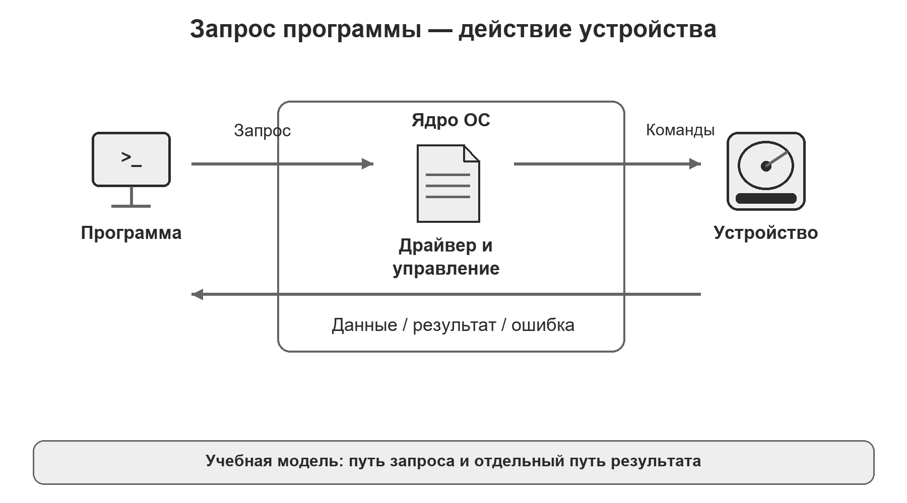

<p align="center"><em>Рисунок 1 — Запрос программы и возвращение результата</em></p>

## 1. Место ввода-вывода в операционной системе

Процессор выполняет вычисления над данными в памяти, но полезная работа компьютера требует обмена с внешней средой. Программа получает данные с клавиатуры, читает файл, принимает пакет, выводит изображение и передаёт документ принтеру. Подсистема ввода-вывода организует такой обмен и предоставляет программам управляемые интерфейсы к устройствам.

Трудность состоит не только в различии скоростей. Устройства используют разные команды, размеры порций, способы адресации и правила завершения. Накопитель принимает запрос к диапазону блоков, сетевой интерфейс работает с пакетами, а терминал передаёт последовательность символов. Одни устройства поддерживают много параллельных запросов, другие выполняют задания последовательно. Устройство может временно перестать отвечать, вернуть часть данных или исчезнуть во время операции. ОС должна выразить эти различия через понятные приложению результаты, не предоставляя ему произвольное управление аппаратурой.

Важно разделять **устройство**, **контроллер** и **драйвер**. Устройство выполняет физическую или логическую функцию: хранит данные, передаёт сигнал, считывает состояние. Контроллер предоставляет системе регистры управления, очереди команд и механизм обмена. Драйвер — программный компонент, который знает протокол контроллера и связывает его с подсистемами ОС. Один контроллер может обслуживать несколько подключённых устройств. В виртуальной машине часть этой цепочки реализуется программно, но для гостевой ОС она сохраняет те же логические роли.

ОС решает одновременно функциональную задачу и задачу защиты. Ей нужно завершить чтение, но также проверить право процесса, не смешать данные разных пользователей и не позволить устройству повредить чужую память. Поэтому подсистема ввода-вывода относится к доверенной вычислительной базе: ошибки в ней могут влиять на конфиденциальность, целостность и доступность всей системы.

Например, ограничение обычного пользователя в доступе к файлу полезно только при сохранении контроля над нижними уровнями. Если тот же пользователь получает произвольный доступ к сырому накопителю, он может обращаться к блокам в обход обычного разрешения имён и файловых прав. Аналогично изоляция адресных пространств процессов недостаточна, если устройство способно записывать данные за пределами выделенного ему буфера. Здесь становятся видны связи между файловой системой, памятью и аппаратурой.

На рисунке 2 показано: различие программного драйвера, контроллера и обслуживаемых устройств.

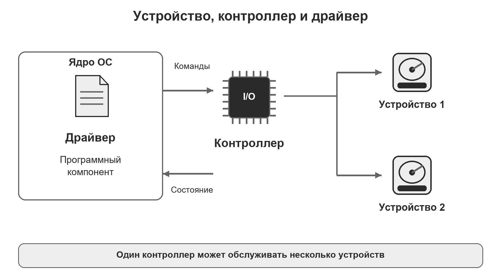

<p align="center"><em>Рисунок 2 — Устройство, контроллер и драйвер</em></p>

## 2. Путь запроса и устройство интерфейсов

### От программы к контроллеру

Рассмотрим чтение обычного файла. Прикладная программа вызывает библиотечную функцию или непосредственно системный вызов. Ядро получает файловый дескриптор, проверяет состояние открытого объекта и направляет запрос соответствующей реализации. В Linux общий файловый интерфейс обеспечивает VFS — Virtual Filesystem, виртуальная файловая система. Конкретная файловая система знает, какие блоки связаны с нужным диапазоном файла. Блочная подсистема и драйвер организуют запросы к накопителю.

Не каждое чтение доходит до аппаратуры. Если нужные данные уже находятся в кэше, ядро может передать их программе без нового обращения к устройству. Если данных нет, возникает реальная операция ввода-вывода: запрос оказывается в очереди, драйвер подготавливает команду, а контроллер выполняет её. После завершения ядро обновляет состояние запроса и сообщает приложению число прочитанных байтов либо ошибку.

Слой абстракции позволяет приложению работать с обычным файлом через один интерфейс при разных накопителях. Однако общий интерфейс не делает все объекты одинаковыми: терминал, канал, сетевой сокет и файл различаются возможностью позиционирования, поведением при отсутствии данных и правилами завершения. Системный вызов `read()` возвращает фактическое число полученных байтов; оно может быть меньше запрошенного. Нулевой результат при чтении обычного файла означает достижение конца файла. Эти свойства заданы интерфейсом и требуют интерпретации с учётом типа объекта. [Справка read(2)](https://man7.org/linux/man-pages/man2/read.2.html).

На рисунке 3 показано: ветвление чтения обычного файла при наличии и отсутствии данных в кэше.

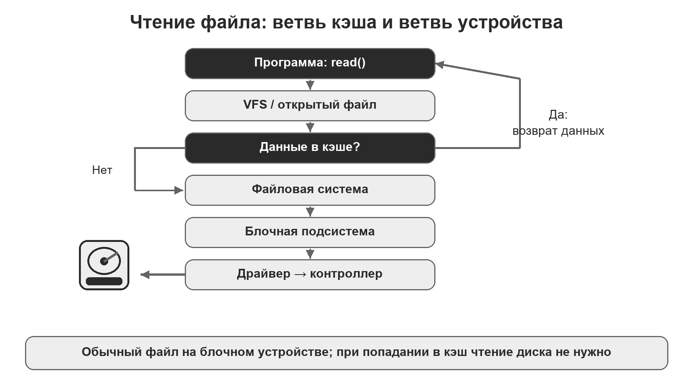

<p align="center"><em>Рисунок 3 — Путь чтения файла и ветвь кэша</em></p>

### Классы устройств

Основные различия классов приведены в таблице 1. Классификация описывает интерфейс ОС, а не обязательно внутреннее устройство аппаратуры.

Таблица 1 — Классы устройств и характер обращения

| Класс | Представление для ОС | Характер операций | Пример |
|---|---|---|---|
| Блочное устройство | Адресуемое пространство блоков | Чтение и запись диапазонов; организация очередей | Диск, виртуальный накопитель |
| Символьное устройство | Специальный интерфейс потока или команд | Чтение, запись, управляющие операции; позиционирование зависит от драйвера | Терминал, последовательный порт |
| Сетевое устройство | Интерфейс передачи пакетов | Очереди пакетов, протоколы, адресация | Ethernet-интерфейс, виртуальный сетевой адаптер |

В Linux специальные файлы устройств обычно доступны через `/dev`. Их тип, major- и minor-номера связывают обращение с зарегистрированным интерфейсом ядра. Такой файл не хранит содержимое накопителя как обычный файл: он представляет точку доступа к устройству. Удаление имени из `/dev` само по себе не отключает аппаратное устройство и не является полноценной политикой запрета.

Сетевой интерфейс, как правило, используется приложением через сокеты и сетевой стек, а не через обычное чтение файла `/dev`. Поэтому выражение «в Linux всё является файлом» полезно как указание на унификацию многих интерфейсов, но его нельзя понимать буквально. Объекты и допустимые операции различаются.

На рисунке 4 показано: сопоставление блочного, символьного и сетевого интерфейсов.

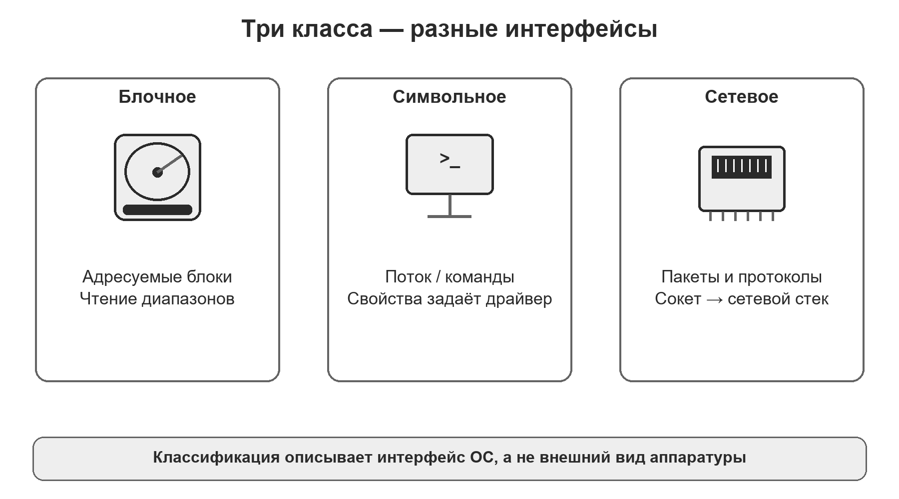

<p align="center"><em>Рисунок 4 — Классы устройств и их интерфейсы</em></p>

### Регистры, команды и ошибки

На нижнем уровне драйвер обращается к регистрам контроллера. В зависимости от архитектуры они доступны через отдельное пространство портов ввода-вывода или через MMIO — Memory-Mapped Input/Output, отображение регистров устройства в адресное пространство. Регистры могут сообщать состояние, принимать параметры команды и подтверждать события.

Обращение к регистру не всегда эквивалентно чтению обычной памяти. Чтение может сбрасывать флаг, а запись — запускать операцию. Порядок обращений важен: контроллер не должен увидеть команду до готовности её параметров. Поэтому драйвер использует предусмотренные архитектурой средства доступа и упорядочивания, а не произвольное чтение и запись указателей.

Ошибки тоже проходят через несколько уровней. Аппаратный тайм-аут, повреждённый блок или отключение устройства могут преобразоваться в ошибку запроса и затем системного вызова. Программа обязана различать успешное получение части данных, временную неготовность и окончательный отказ. Повтор операции допустим только тогда, когда понятны её последствия: повторная отправка задания может создать дубликат, даже если первая операция успела выполниться, а подтверждение было потеряно.

На рисунке 5 показано: условная последовательность подготовки параметров, запуска и чтения состояния.

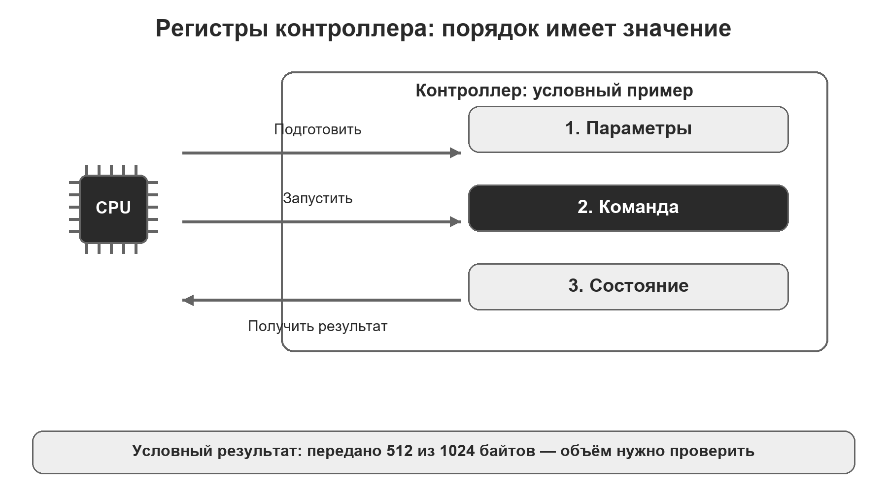

<p align="center"><em>Рисунок 5 — Регистры и последовательность управления</em></p>

## 3. Опрос, прерывания и завершение операций

### Программный опрос

После отправки команды процессору нужно узнать, когда можно продолжить работу. При **опросе** программный код периодически читает состояние устройства или очереди завершений. Если цикл постоянно проверяет готовность без полезной работы, это активное ожидание. Оно расходует процессорное время, но при очень коротком ожидании может обеспечить малую задержку.

Опрос не следует считать всегда неэффективным. Когда событий много, обработка серии готовых результатов может оказаться дешевле отдельных уведомлений. В сетевых и высокопроизводительных подсистемах применяются сочетания опроса и прерываний. Решение зависит от нагрузки, требований к задержке и стоимости обработки события.

### Прерывания

**Прерывание** позволяет аппаратуре уведомить процессор о событии. ОС сохраняет необходимый контекст и передаёт управление обработчику. Для устройства событием может быть завершение команды, появление данных или ошибка. В современных системах уведомление может передаваться сообщением через шину; отдельная физическая линия на каждое устройство не обязательна.

Обработчик должен установить источник события, подтвердить его и выполнить действия, необходимые для дальнейшей обработки. Длительная работа увеличивает задержки для других событий, поэтому её часто переносят в отложенный или потоковый контекст. Linux поддерживает различные способы обработки IRQ — Interrupt Request, запроса прерывания, включая потоковые обработчики; конкретный контекст определяет допустимость блокирующих операций. [Документация Linux по IRQ](https://docs.kernel.org/core-api/genericirq.html).

Прерывание не означает, что приложение немедленно продолжит работу. Сначала ядро завершает обработку запроса и, если процесс ожидал результат, переводит его в состояние готовности. Получение процессорного времени зависит от планировщика. Поэтому задержка наблюдается на нескольких участках: устройство, доставка события, обработка ядром и планирование процесса.

На рисунке 6 показано: сравнение опроса и обработки события с последующим планированием.

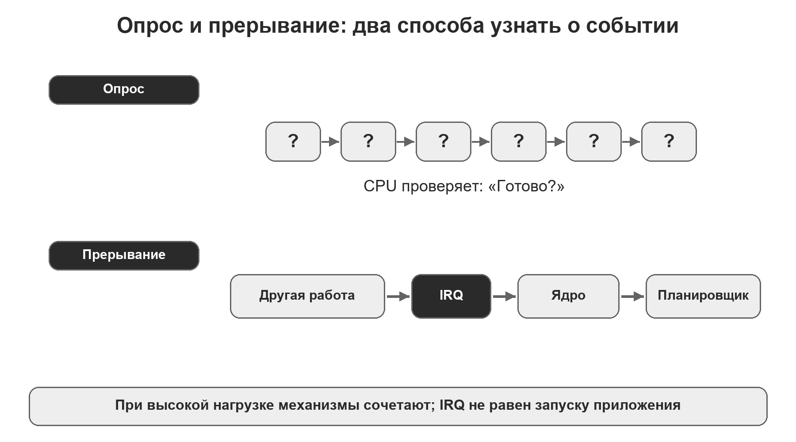

<p align="center"><em>Рисунок 6 — Опрос и прерывание</em></p>

### Блокирующий, неблокирующий и асинхронный ввод-вывод

При блокирующем обращении поток может ждать результат, а процессор в это время выполнять другой готовый поток. Блокировка процесса и активное ожидание процессора — разные механизмы. Первый связан с планированием, второй — с выполнением цикла проверок.

При неблокирующем обращении операция не должна ждать неготовые данные в ситуациях, предусмотренных интерфейсом. Вместо ожидания программа получает результат вроде `EAGAIN` и может заняться другой работой. Для обычных файлов этот флаг не превращает все дисковые операции в гарантированно неблокирующие. Проверка готовности через `poll` или `epoll` помогает работать с несколькими потоковыми источниками, но уведомление о готовности также не равно завершению произвольной операции хранения.

Асинхронный интерфейс разделяет отправку запроса и получение результата. Программа передаёт операцию, продолжает вычисления, а позже получает сообщение или запись о завершении. Буфер должен оставаться действительным до момента, установленного контрактом интерфейса. Если программа освобождает его слишком рано или использует не тот идентификатор завершения, возникает ошибка владения данными.

На рисунке 7 показано: три модели поведения потока до получения результата.

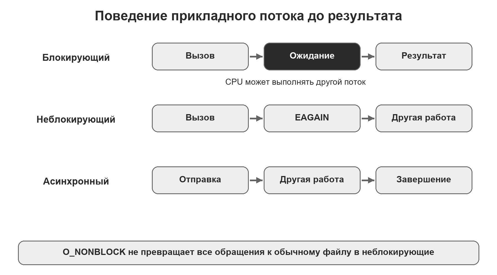

<p align="center"><em>Рисунок 7 — Поведение прикладного потока</em></p>

Разделение способов передачи данных и способов уведомления показано в таблице 2. Эти характеристики можно комбинировать.

Таблица 2 — Передача данных и уведомление о состоянии

| Вопрос | Возможный механизм | Что он определяет |
|---|---|---|
| Кто перемещает данные между устройством и памятью? | Процессор или DMA | Стоимость передачи и требования к памяти |
| Как узнают о готовности? | Опрос или прерывание | Способ получения события |
| Что делает прикладной поток до результата? | Ждёт, получает неготовность или продолжает после отправки | Модель интерфейса приложения |

Из этой таблицы следует, что DMA не является противоположностью прерывания: устройство может передать данные через DMA и затем сообщить о завершении прерыванием. Аналогично асинхронный интерфейс приложения не определяет единственный аппаратный способ передачи.

На рисунке 8 показано: пример сочетания DMA, прерывания и асинхронного завершения.

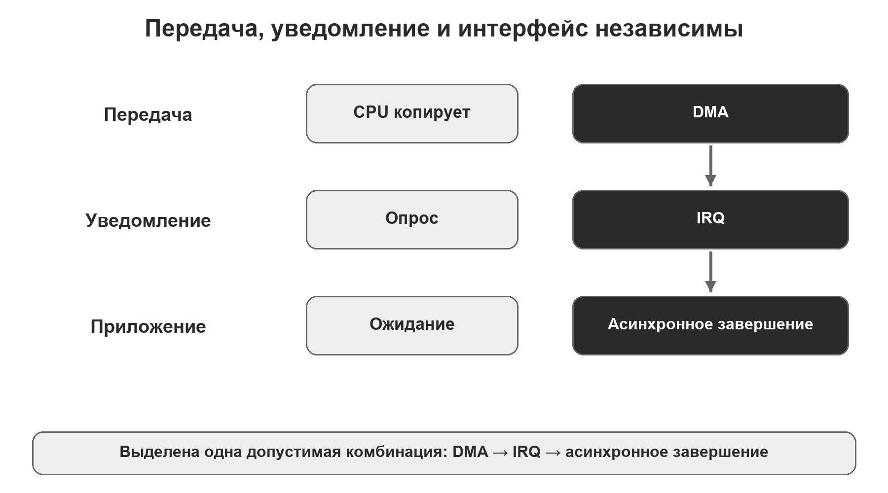

<p align="center"><em>Рисунок 8 — Передача, уведомление и интерфейс</em></p>

## 4. Прямой доступ к памяти и IOMMU

### Как организуется DMA

DMA — Direct Memory Access, прямой доступ к памяти — позволяет устройству или DMA-контроллеру перемещать данные между устройством и оперативной памятью без выполнения процессором инструкции копирования для каждого элемента. Процессор остаётся участником управления: выделяет ресурсы, подготавливает запрос, запускает обмен и обрабатывает результат. DMA уменьшает его работу по передаче большого объёма, но не устраняет управление операцией.

Рассмотрим приём данных сетевой картой. Драйвер готовит буферы и описания доступных областей, а устройство помещает принятые данные в разрешённые участки памяти. После обработки завершения сетевой стек получает данные и связывает их с соответствующим протоколом и получателем. Одна и та же область не должна одновременно считаться свободной и принадлежащей незавершённому запросу.

Адрес устройства для DMA нельзя в общем случае приравнять к виртуальному указателю процессора. Linux DMA API возвращает адрес, пригодный именно для обмена с устройством; отображение может учитывать IOMMU и ограничения доступной устройству памяти. Даже согласованная DMA-память не отменяет необходимость правильного порядка публикации полей дескриптора и барьеров памяти. [Руководство Linux DMA API](https://docs.kernel.org/core-api/dma-api-howto.html).

На рисунке 9 показано: разделение управления CPU и аппаратного перемещения массива данных.

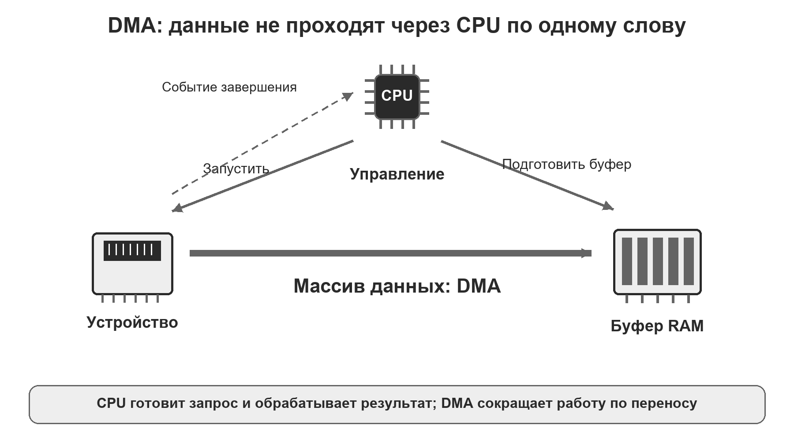

<p align="center"><em>Рисунок 9 — Аппаратная передача данных через DMA</em></p>

### Почему нужна защита памяти от устройства

MMU — Memory Management Unit, блок управления памятью процессора — проверяет и преобразует обращения CPU. DMA выполняется другим участником обмена и не является обычным чтением или записью пользовательского процесса. Следовательно, запрет доступа в таблицах страниц процесса сам по себе не описывает все возможности периферийного устройства.

IOMMU — Input/Output Memory Management Unit — предоставляет механизм преобразования и ограничения адресов при вводе-выводе. В защищённой конфигурации устройство должно получать доступ лишь к областям, необходимым для его текущих операций. Это позволяет ограничить последствия ошибочной команды и является частью изоляции при передаче устройств виртуальным машинам. Общая идея похожа на виртуальную память, но субъект обращения другой: устройство, а не поток приложения.

Работу ограничения удобно представить на примере двух областей памяти. Буфер сетевого приёма нужен устройству, а память процесса с секретом — нет. Правильное отображение допускает запись в первый диапазон и не предоставляет второй. Если драйвер по ошибке разрешит чрезмерный диапазон, само наличие IOMMU не исправит эту программную ошибку. Защита зависит от настройки и жизненного цикла отображений, а не только от аппаратной поддержки.

Содержимое разрешённого буфера всё равно может быть недоверенным. IOMMU ограничивает место записи, но не проверяет смысл пакета, корректность длины структуры для приложения или безопасность полученного файла. Поэтому аппаратная изоляция и проверка входных данных дополняют друг друга.

На рисунке 10 показано: различие обращений через MMU и IOMMU с ограничением допустимого диапазона.

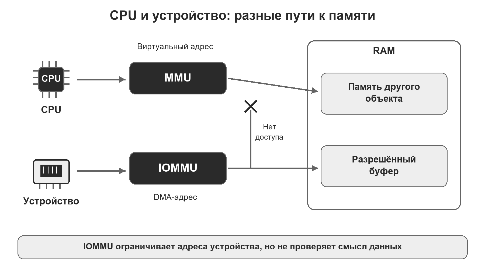

<p align="center"><em>Рисунок 10 — Различные пути CPU и устройства к памяти</em></p>

### Завершение и владение буфером

При использовании DMA важно определить, кто имеет право изменять буфер на каждом этапе. До отправки им управляет программа или драйвер; во время обмена устройство может читать или записывать его; после завершения данные становятся доступны для следующего потребителя. Между этапами могут требоваться операции согласования кэшей и памяти.

Ошибка освобождения буфера до завершения особенно опасна: распределитель может выдать ту же область другому объекту, а устройство продолжит записывать по старому адресу. Возникает повреждение памяти, которое внешне может выглядеть как случайный сбой несвязанной программы. Для устранения таких ошибок нужны точный учёт запросов, отмена обмена, ожидание завершения и освобождение ресурсов в правильном порядке.

Из DMA не следует отсутствие всех копирований. После аппаратной передачи данные могут копироваться между буфером ядра и приложением или обрабатываться другими подсистемами. Поэтому выражение «прямой доступ» относится к определённому участку пути, а не означает автоматическую передачу прямо в произвольную память пользовательской программы.

На рисунке 11 показано: правильный порядок владения буфером и последствия преждевременного освобождения.

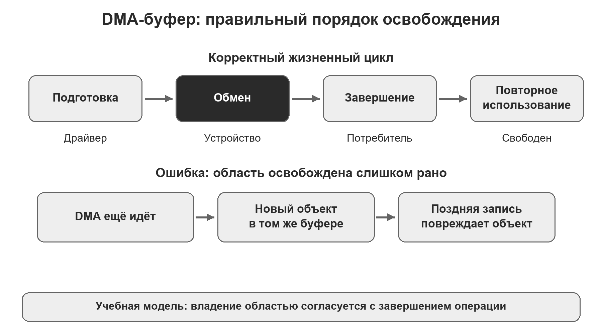

<p align="center"><em>Рисунок 11 — Жизненный цикл DMA-буфера</em></p>

## 5. Буферизация, кэширование и спулинг

### Буферизация как согласование потока

Буфер — временная область для данных на пути от производителя к потребителю. Он согласует разные скорости, размеры порций и моменты готовности. Например, устройство передаёт данные блоками, а программа обрабатывает их отдельными записями. Буфер позволяет накопить достаточную порцию и не обращаться к устройству для каждого символа.

При двойной буферизации одна область заполняется, пока другая обрабатывается. После завершения роли меняются. Такое перекрытие операций сокращает простой, но требует строгого учёта состояния: область нельзя одновременно перезаписывать и читать как неизменную порцию. Это непосредственное применение знаний о синхронизации из лекции о межпроцессном взаимодействии.

На рисунке 12 показано: смена ролей двух буферов после завершения соответствующих операций.

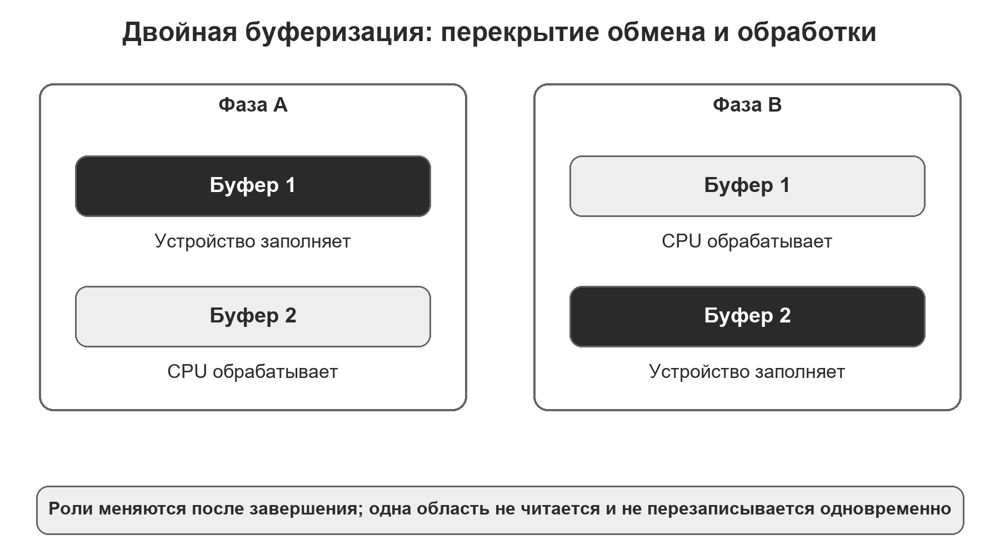

<p align="center"><em>Рисунок 12 — Двойная буферизация</em></p>

Конечная ёмкость буфера не решает проблему бесконечного превышения скорости производителя над скоростью потребителя. Она сглаживает временный всплеск, после чего необходимы ограничение поступления, ожидание, отказ либо потеря данных по правилам протокола. Если система принимает запросы без ограничения очереди, она может исчерпать память даже без ошибки в отдельных запросах.

Числовой пример показывает влияние ёмкости. Источник производит 100 МБ/с, потребитель обрабатывает 80 МБ/с. При постоянных скоростях очередь растёт на 20 МБ/с. Свободный буфер 200 МБ исчерпается примерно за 10 секунд: `200 / (100 − 80) = 10`. Увеличение буфера откладывает переполнение, но не меняет долгосрочный дисбаланс. Расчёт является идеализированной моделью без учёта служебных расходов и колебаний потока.

На рисунке 13 показано: числовой пример роста очереди до предела 200 МБ за 10 секунд.

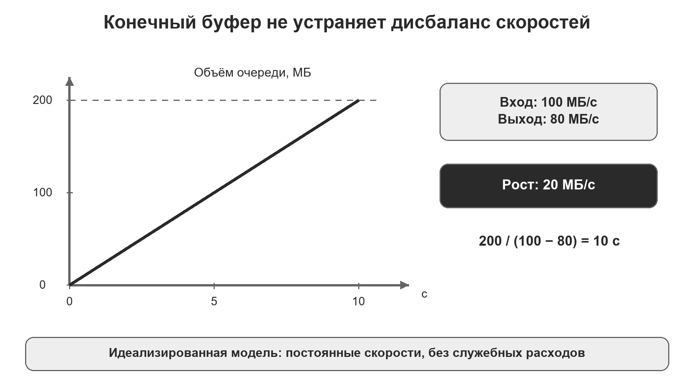

<p align="center"><em>Рисунок 13 — Рост очереди при дисбалансе скоростей</em></p>

### Кэширование как повторное использование

Кэш сохраняет данные для ускорения последующих обращений. При повторном чтении файла данные могут быть взяты из page cache — страничного кэша ядра. В таком случае устройство не выполняет новое чтение, хотя приложение получает те же байты. Буферизация и кэширование могут использовать одну область памяти, но смысл различается: первая организует передачу, второе использует повторяемость запросов.

При записи важно различать принятие данных в память и достижение требуемой устойчивости хранения. Успешный `write()` не гарантирует запись на накопитель. Для синхронизации применяется `fsync()`; при создании или изменении имени файла может потребоваться отдельная синхронизация каталога. Гарантии зависят также от корректности реализации файловой системы и оборудования. [Справка write(2)](https://man7.org/linux/man-pages/man2/write.2.html), [справка fsync(2)](https://man7.org/linux/man-pages/man2/fsync.2.html).

Эта связь объясняет знакомую ситуацию: программа закончила копирование, но устройство ещё занято. Системе могут оставаться отложенные записи. Неправильное извлечение носителя создаёт риск потери данных или нарушения структуры файловой системы. «Безопасное извлечение» полезно потому, что завершает использование и согласует записи в рамках возможностей системы, а не потому, что сам значок устройства исчез из интерфейса.

Кэширование связано и с конфиденциальностью. Удаление файла с носителя не доказывает исчезновение всех его копий из буферов приложения, page cache, очереди печати или резервной копии. Каждая область имеет собственный жизненный цикл и правила освобождения. Эти различия нужно учитывать при моделировании обработки чувствительных данных.

На рисунке 14 показано: различие принятия записи в кэш и требуемого завершения хранения.

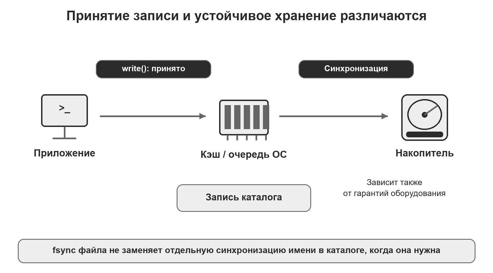

<p align="center"><em>Рисунок 14 — Принятие записи и устойчивое хранение</em></p>

### Спулинг как очередь самостоятельных заданий

Спулинг организует очередь законченных заданий для ресурса, который обслуживает их последовательно или по специальному расписанию. Типичный пример — печать. Приложение передаёт документ службе печати, а служба хранит задание и отправляет его принтеру, когда ресурс готов. Приложение не обязано удерживать открытым непосредственный обмен с принтером всё время печати.

Очередь печати становится отдельным объектом защиты. В ней может находиться полный документ; пользователь должен иметь доступ к своим заданиям, но не к содержимому чужих. Нужны ограничение размера очереди, корректное удаление завершённых заданий и различение подтверждения приёма в очередь и фактического завершения печати. Ошибка этих правил способна раскрыть данные или занять хранилище независимо от безопасности самого принтера.

В таблице 3 сведены цели трёх механизмов и характерные ошибки их интерпретации.

Таблица 3 — Буферизация, кэширование и спулинг

| Механизм | Основная цель | Пример | Ошибочный вывод |
|---|---|---|---|
| Буферизация | Согласовать поступление и обработку данных | Две области для чтения и обработки порций | «Большой буфер устранит любое превышение скорости» |
| Кэширование | Повторно использовать данные и сократить обращения | Страницы недавно прочитанного файла | «Успешный write означает устойчивую запись» |
| Спулинг | Принять и поставить самостоятельные задания в очередь | Очередь печати | «Приём документа службой означает завершение печати» |

На рисунке 15 показано: спулинг документов с различением приёма и завершения печати.

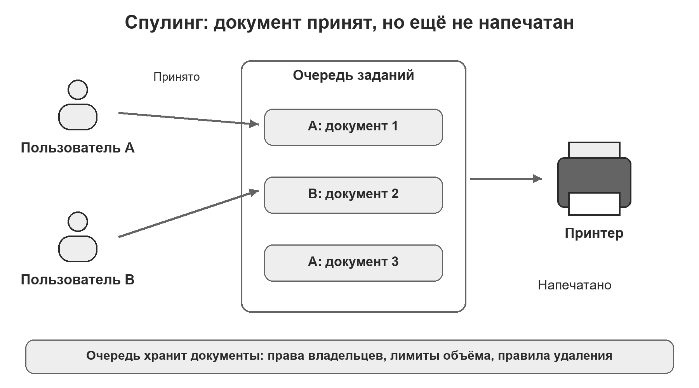

<p align="center"><em>Рисунок 15 — Очередь печати и владельцы заданий</em></p>

## 6. Драйвер как компонент доверенной системы

### Интерфейсы и полномочия

Драйвер переводит общие операции ОС в команды конкретному устройству. При этом он принимает данные с двух сторон: запросы программ и ответы аппаратуры. Обе стороны могут давать некорректные входные данные. Даже устройство, физически находящееся внутри корпуса, может работать со сбойной прошивкой или получать недоверенные данные через сеть.

Драйверы ядра работают с полномочиями, позволяющими управлять памятью и аппаратными ресурсами. Поэтому ошибка в таком драйвере может повлиять на всю ОС. Драйвер не обязательно представляет отдельный процесс: встроенный код или загруженный модуль выполняется как часть ядра. Наличие процесса с похожим названием не является универсальным способом найти драйвер.

Некоторые устройства могут обслуживаться с участием пользовательского пространства. Linux UIO — Userspace I/O — предоставляет один из механизмов разделения: минимальная часть остаётся в ядре, а значительная логика может выполняться в пользовательском процессе. Это не делает произвольный драйвер безопасным автоматически и не подходит одинаково всем устройствам. [Документация Linux UIO](https://docs.kernel.org/driver-api/uio-howto.html).

Специальные управляющие операции часто доступны через `ioctl()` — input/output control. Они передают команду и связанные данные конкретному интерфейсу. В Linux при проектировании ioctl требуется учитывать размеры и размещение полей, совместимость 32- и 64-битных программ и отсутствие утечки неинициализированных данных. [Документация Linux об ioctl](https://docs.kernel.org/driver-api/ioctl.html).

На рисунке 16 показано: проверка данных со стороны приложения и устройства.

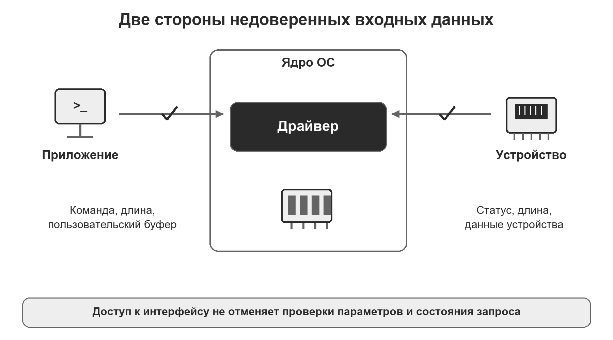

<p align="center"><em>Рисунок 16 — Границы доверия драйвера</em></p>

### Типовые ошибки и последствия

Рассмотрим упрощённую команду, содержащую длину и адрес пользовательского буфера. Проверка права на открытие устройства не заменяет проверку самой команды. Недопустимая длина, арифметическое переполнение или неверный режим могут привести к чтению за пределами области или записи в чужую память. Входной указатель нельзя считать доверенным указателем ядра только потому, что программа передала его в системный вызов.

Ещё один класс ошибок связан с временем. Процесс обращается к устройству, пока другой поток завершает его использование или устройство отключается. Если объект освобождён, но обработчик события ещё хранит ссылку, возникает use-after-free — использование памяти после освобождения. Нужны синхронизация, учёт ссылок и согласованный порядок остановки. Защита памяти и синхронизация здесь работают вместе.

Недоверенные ответы устройства также требуют проверки. Если контроллер сообщает длину полученных данных, драйвер должен сопоставить её с фактически выделенным буфером и правилами протокола. Нельзя позволять внешнему значению автоматически определять объём копирования. Аналогично сообщение об ошибке не должно приводить к бесконечному повтору запросов и исчерпанию ресурсов.

Эти примеры показывают, почему «устройство работает» и «устройство безопасно используется» — разные оценки. Функциональный тест проверяет ожидаемый сценарий. Для защищённой эксплуатации важны поведение при отказах, ограничение полномочий, обработка недоверенных входных данных и восстановление после ошибки.

На рисунке 17 показано: два класса ошибок: выход за область буфера и обращение к освобождённому объекту.

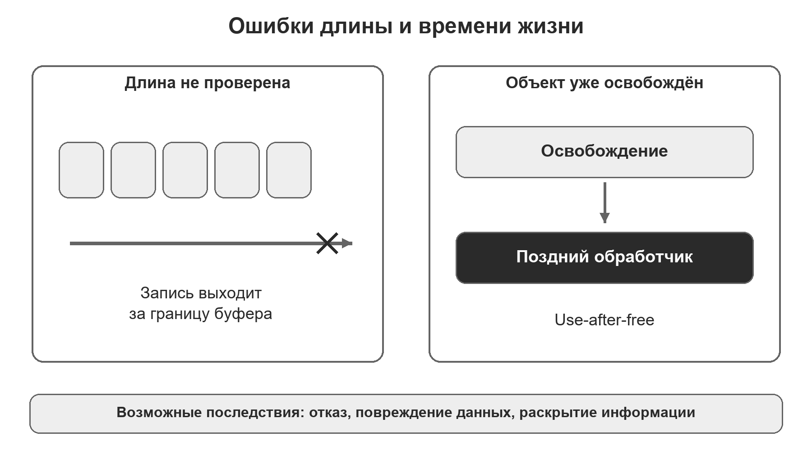

<p align="center"><em>Рисунок 17 — Ошибки длины и времени жизни</em></p>

### Доверенная загрузка и обновление

Уменьшение набора ненужных драйверов сокращает объём привилегированного кода, но не должно нарушать работу обязательного оборудования. Политика загрузки модулей должна учитывать источник пакета, совместимость с ядром и разрешённые ключи. Обновление драйвера связано с обновлением ОС; прошивка устройства имеет отдельный жизненный цикл и собственный источник доверия.

Linux поддерживает подпись модулей ядра. Возможность загрузки неподписанного модуля зависит от режима проверки; в принудительном режиме требуются допустимая подпись и известный ядру ключ. Подпись подтверждает связь с доверенным ключом и целостность подписанного содержимого, но не отсутствие ошибок в коде. Подписанный драйвер также может нуждаться в обновлении. [Документация о подписи модулей](https://docs.kernel.org/admin-guide/module-signing.html).

Доверенная загрузка, ограничения DMA, права на интерфейсы устройств и обновления решают разные задачи. Ни одна мера не заменяет остальные. Например, подпись драйвера не ограничивает неправильно настроенный DMA-доступ, а запрет исполнения файлов с флеш-накопителя не устраняет ошибку парсера файловой системы.

На рисунке 18 показано: различие проверки происхождения модуля, устранения ошибок и обновления прошивки.

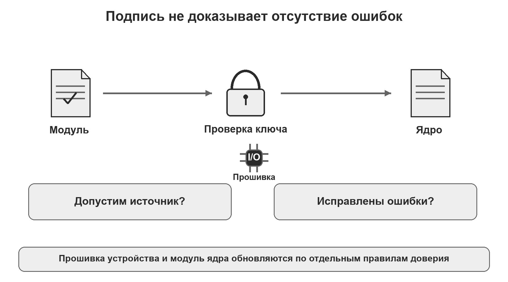

<p align="center"><em>Рисунок 18 — Подпись модуля и исправление ошибок</em></p>

## 7. Plug and Play и жизненный цикл устройства

### Обнаружение и привязка драйвера

Plug and Play означает автоматизированное обнаружение и конфигурирование устройства. Hotplug означает подключение или отключение во время работы системы. Эти свойства не тождественны: автоматически обнаруживаемое устройство может подключаться только при выключенном компьютере, а горячее подключение требует корректной поддержки аппаратурой и программными компонентами.

При обнаружении шина сообщает ядру об устройстве и его характеристиках. Далее система сопоставляет устройство с подходящими драйверами. В модели Linux проверка соответствия и вызов функции `probe()` участвуют в привязке драйвера к устройству. Совпадение идентификаторов ещё не гарантирует успешную инициализацию: `probe()` может завершиться отказом. [Документация Driver Binding](https://docs.kernel.org/driver-api/driver-model/binding.html).

На рисунке 19 показано: различие обнаружения при загрузке и горячего подключения с исходами probe().

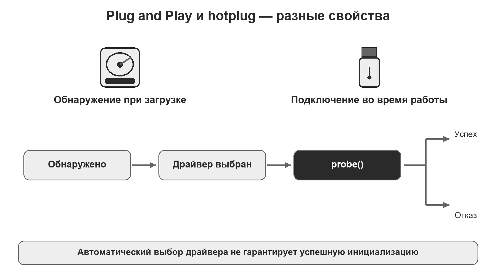

<p align="center"><em>Рисунок 19 — Обнаружение и привязка драйвера</em></p>

Информация об устройстве становится доступна через sysfs, обычно смонтированную в `/sys`. Ядро формирует события, на которые реагирует пользовательское пространство. В системах с udev правила могут устанавливать права, свойства и дополнительные ссылки для узлов устройств. Длительные действия не должны превращать обработку каждого события в неограниченную работу внутри правила. [Справка udev(7)](https://man7.org/linux/man-pages/man7/udev.7.html).

Дальше могут включаться другие службы, например механизм монтирования томов или графическая оболочка. Следовательно, появление устройства, привязка драйвера, создание точки доступа и монтирование файловой системы — отдельные события. Они могут завершаться успешно или отказывать независимо друг от друга.

На рисунке 20 показано: разделение функций ядра, udev и службы монтирования.

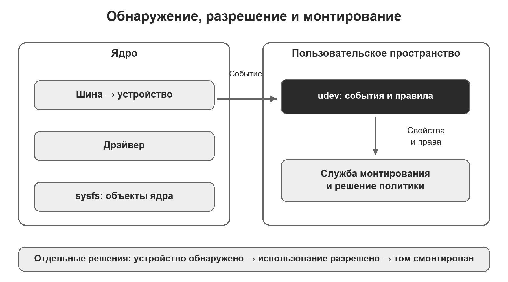

<p align="center"><em>Рисунок 20 — События ядра и обработка устройства</em></p>

### Автоматизация и доверие

Автоматическое обнаружение не является разрешением доверять устройству. Система может распознать USB-накопитель, но политика должна отдельно определить, допустим ли этот класс, каким пользователям доступен носитель и разрешено ли монтирование. Иначе удобство подключения превращается в расширение полномочий без проверки.

Идентификаторы производителя, продукта и серийный номер полезны для учёта. Однако это свойства, сообщаемые устройством, а не криптографическое доказательство его происхождения. Linux предоставляет механизмы разрешения USB-устройства и отдельных интерфейсов; документация отдельно предупреждает о возможности подделки дескрипторов и сведений устройства. [Документация USB authorization](https://docs.kernel.org/usb/authorization.html).

Особенно важны составные USB-устройства. Один корпус может содержать интерфейсы накопителя, клавиатуры и сетевого адаптера. Политика, которая контролирует только появление нового диска, не охватывает действия остальных интерфейсов. При этом запрет конкретного интерфейса может влиять на общую функциональность составного устройства, что требует проверки совместимости.

На рисунке 21 показано: отдельные решения политики для накопителя, клавиатуры и сетевого интерфейса.

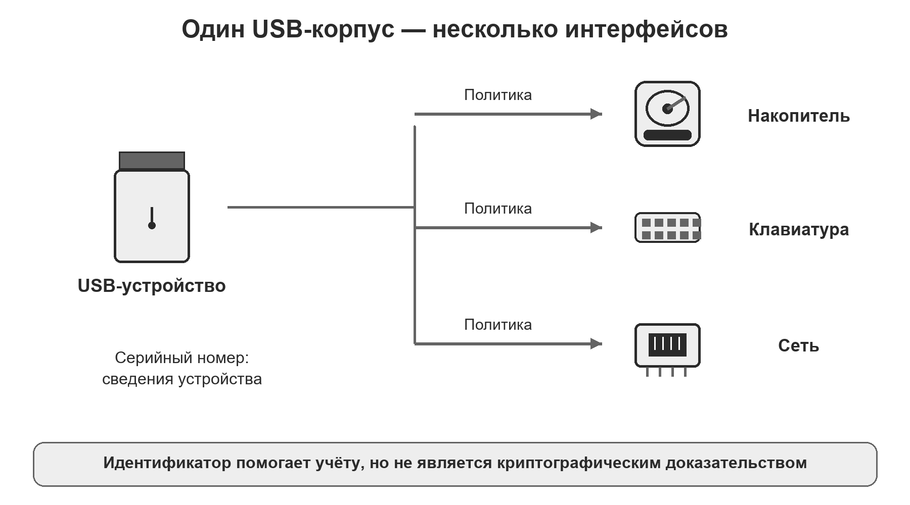

<p align="center"><em>Рисунок 21 — Интерфейсы составного USB-устройства</em></p>

### Отключение и освобождение ресурсов

Когда устройство отключается, ОС должна остановить новые запросы, завершить или отменить текущие, сообщить ожидающим процессам результат и освободить ресурсы. Код обработки отключения взаимодействует с обработчиками прерываний, DMA, очередями и открытыми дескрипторами. Возможность внезапного исчезновения должна учитываться до того, как оно произошло.

Для накопителя физическое отключение отличается от корректного завершения использования. Открытые файлы и незаписанные данные могут сохраняться после последнего видимого действия пользователя. Для сетевого адаптера отключение означает потерю пути передачи, для клавиатуры — исчезновение источника ввода. Общая инфраструктура устройств предоставляет события, но реакция зависит от класса и текущего состояния.

Нельзя устранять проблему отключения универсальным советом «выгрузить драйвер». Драйвер может обслуживать другие устройства, быть встроенным в ядро или участвовать в работе системного диска. Корректное освобождение требует знания фактических зависимостей.

## 8. Съёмные носители и границы защиты

### Риск возникает до открытия файла

Распространённое представление связывает угрозу флеш-накопителя только с запуском программы с него. Однако ОС обрабатывает данные уже при подключении: дескрипторы устройства, таблицу разделов и, при монтировании, структуры файловой системы. После появления файлов дополнительные программы могут читать метаданные, создавать миниатюры и индексировать содержимое. Каждый обработчик является самостоятельной поверхностью взаимодействия с недоверенными данными.

Поэтому правило «не запускать неизвестные файлы» необходимо, но недостаточно. Нужны ограничения классов устройств, контроля подключения, автоматического монтирования и программ, которые получают содержимое. Сеть тоже не обязательно требуется для реализации риска: ошибка в драйвере или обработчике файла может быть локальной.

Другой путь связан с новым интерфейсом. USB-клавиатура может генерировать ввод, а сетевой адаптер — создать дополнительный путь обмена. Фильтрация сетевых портов внутри существующего интерфейса не заменяет контроль появления нового устройства. Угроза определяется предоставляемой функцией, а не внешним видом корпуса.

На рисунке 22 показано: этапы обработки недоверенных данных до открытия файла пользователем.

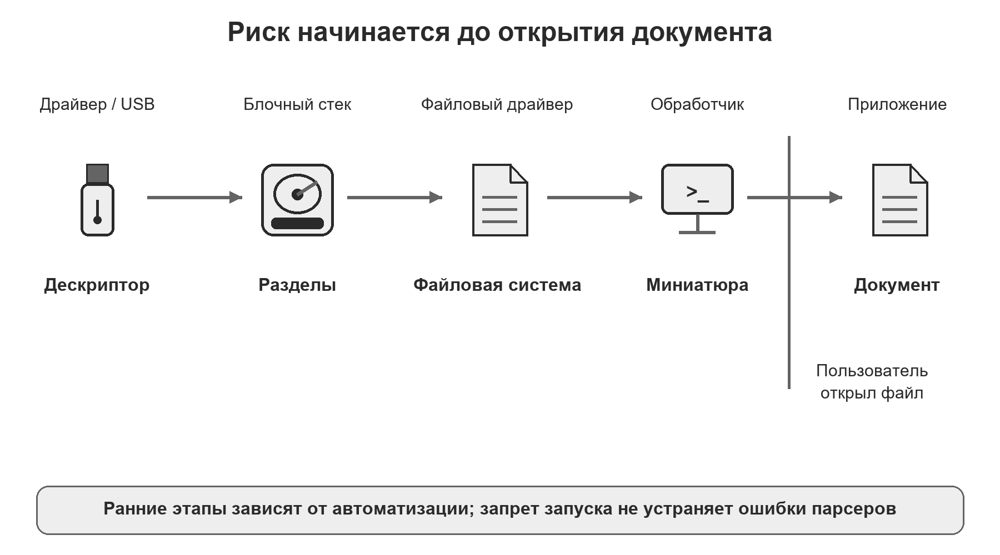

<p align="center"><em>Рисунок 22 — Обработка носителя до открытия документа</em></p>

### Параметры монтирования и их ограничения

Ограничения `ro`, `noexec`, `nosuid`, `nodev` применяются к доступу через соответствующее монтирование. `ro` запрещает обычную запись в таком режиме, `noexec` ограничивает прямое исполнение, `nosuid` исключает предоставление дополнительных полномочий через SUID/SGID и файловые capabilities, а `nodev` запрещает использование специальных файлов как устройств. Эти параметры описаны в [справке mount(8)](https://man7.org/linux/man-pages/man8/mount.8.html) и [mount(2)](https://man7.org/linux/man-pages/man2/mount.2.html).

Смысл ограничений и их пределы приведены в таблице 4. Проверять нужно фактические свойства монтирования, а не только предполагаемую строку конфигурации.

Таблица 4 — Ограничения доступа к смонтированному носителю

| Параметр | Что ограничивает | Чего сам по себе не обеспечивает |
|---|---|---|
| `ro` | Запись через данное монтирование | Аппаратной блокировки всех путей записи и безопасности чтения |
| `noexec` | Прямое исполнение файлов с данного монтирования | Запрета чтения скрипта интерпретатором или запуска скопированного файла |
| `nosuid` | Получение дополнительных полномочий при исполнении через соответствующие атрибуты | Проверки безопасного поведения обычной программы |
| `nodev` | Использование специальных файлов носителя как интерфейсов устройств | Запрета самого подключённого аппаратного устройства |

Из ограничений следует несколько практических выводов о механизмах. Читаемый скрипт можно передать интерпретатору, установленному на другой файловой системе, поэтому `noexec` не является универсальным запретом выполнения содержащейся в файле логики. Режим `ro` через одно монтирование не отменяет доступ через другой путь с более широкими полномочиями. И самое важное: параметры файловой системы не предотвращают обработку USB-дескрипторов и не заменяют проверку кода драйвера.

На рисунке 23 показано: область действия и ограничения ro, noexec, nosuid и nodev.

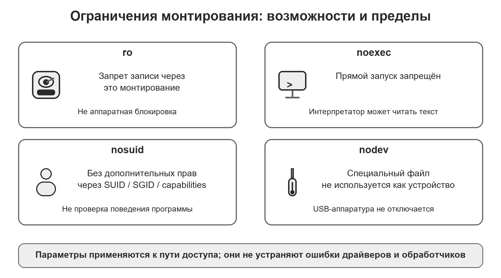

<p align="center"><em>Рисунок 23 — Пределы параметров монтирования</em></p>

### Обмен данными через выделенную точку

Рассмотрим организацию контролируемого импорта документов. Носитель учитывается, его использование разрешается на выделенной станции, автоматическое открытие файлов отключено. Данные проходят проверку формата и содержимого и только после этого передаются в рабочую среду. Для журнала важны время, устройство, пользователь и действие, но в него не следует без необходимости включать сами конфиденциальные документы.

Смысл выделенной точки состоит в уменьшении числа систем, непосредственно обрабатывающих недоверенное устройство, и в воспроизводимом процессе проверки. Она не даёт абсолютной гарантии: антивирус не распознаёт любую угрозу, допустимый формат может содержать сложные структуры, а сама станция требует обновления и ограничения полномочий. Решение оценивается по модели угроз, а не по наличию единственного «защитного» параметра.

При необходимости доказать сохранность исходного носителя программного монтирования только для чтения может быть недостаточно. В задачах расследования применяются более строгие процедуры и, когда требуется, аппаратная блокировка записи. Для обычного обмена данных достаточно иной глубины контроля, но эти режимы нельзя смешивать.

Шифрование носителя решает прежде всего задачу конфиденциальности при утрате и отсутствии ключа. После разблокирования ОС и приложения работают с открытым содержимым, поэтому вредоносный документ внутри зашифрованного тома не становится безопасным. Подобным образом физический контроль корпуса и загрузки защищает один путь доступа, а политика устройств — другой.

На рисунке 24 показано: контролируемый путь импорта, завершение использования и отдельная задача шифрования.

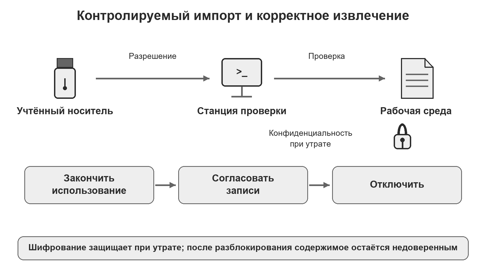

<p align="center"><em>Рисунок 24 — Контролируемый импорт и извлечение</em></p>

## 9. Разбор работы устройства в учебной виртуальной машине

### Как связаны гостевой драйвер и реальное оборудование

В стенде Astra Linux / Kali Linux используются виртуальные машины. Гостевая ОС видит набор устройств, предоставленный гипервизором. Это может быть эмуляция известного контроллера либо паравиртуальный интерфейс, в котором гость взаимодействует с гипервизором по согласованному протоколу. Физический накопитель хоста при этом не обязан совпадать с типом устройства, видимого в госте.

Рассмотрим чтение файла с виртуального диска Astra. Файловая система гостя определяет нужные блоки, гостевой драйвер направляет запрос виртуальному контроллеру, а гипервизор связывает его с хранилищем хоста. Хостовая ОС и её драйверы выполняют нижележащие операции. Затем результат возвращается в гостевую ОС. При наличии кэшей на разных уровнях часть цепочки может обслужить запрос без физического чтения.

Такая архитектура объясняет, почему производительность гостя зависит от фоновой нагрузки хоста, а имя гостевого драйвера не доказывает модель реального накопителя. Проброс физического устройства меняет цепочку и границы доступа; его нельзя считать простым эквивалентом обычного виртуального диска. Особенно важны ограничения памяти и доступности устройства другим участникам системы.

На рисунке 25 показано: путь операции через гостевую ОС, гипервизор и хранилище хоста.

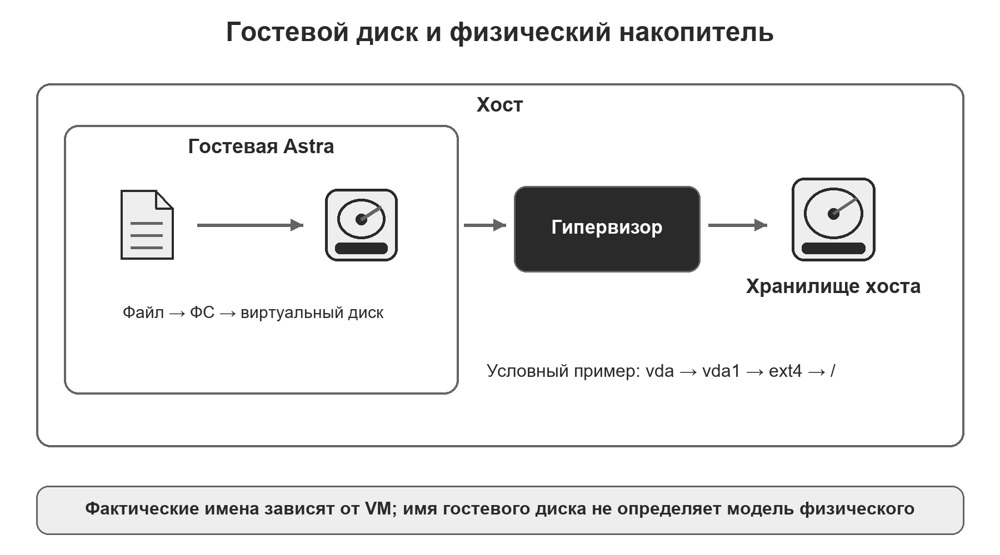

<p align="center"><em>Рисунок 25 — Гостевой и физический накопитель</em></p>

### Разобранный пример инвентаризации

Следующий фрагмент иллюстрирует чтение сведений в терминале Astra Linux. Команды не изменяют конфигурацию и не предполагают подключения нового носителя:

```bash
uname -r
lsblk -o NAME,TYPE,SIZE,FSTYPE,MOUNTPOINT
ls -l /dev/null
lsmod
```

`uname -r` показывает версию работающего ядра. `lsblk` связывает блочные устройства, разделы, типы файловых систем и точки монтирования; конкретные имена зависят от конфигурации VM. `ls -l /dev/null` иллюстрирует специальный символьный файл: в строке есть тип и номера устройства вместо обычного размера файла. `lsmod` перечисляет загруженные модули, но не все драйверы: встроенные в ядро реализации в этот список не обязаны попадать.

Предположим, в выводе `lsblk` устройство `vda` имеет тип `disk`, дочерний `vda1` — `part`, а на нём указаны ext4 и точка `/`. Это иллюстративный пример, а не обязательное имя диска стенда. Из него следует связь «диск → раздел → файловая система → корень дерева», но не модель физического накопителя хоста. Сам список не подтверждает применение IOMMU, доверенность прошивки или отсутствие ошибок драйвера.

Официальные описания этих средств: [lsblk(8)](https://man7.org/linux/man-pages/man8/lsblk.8.html), [lsmod(8)](https://man7.org/linux/man-pages/man8/lsmod.8.html). Точный состав вывода определяется версиями ОС и пакетов. В Astra Linux доступ к сведениям и устройствам дополнительно зависит от действующих механизмов защиты; отсутствие разрешения нельзя трактовать как доказательство отсутствия аппаратуры.

### Причинная цепочка отказа

Рассмотрим ситуацию: копирование на съёмный том показало завершение, после немедленного отключения часть данных отсутствует. Возможное объяснение состоит из нескольких этапов: приложение передало байты; они были приняты буферизованным интерфейсом; часть записей оставалась в очереди; устройство исчезло до окончания обмена. Нельзя заключить, что обязательно виноват только драйвер или файловая система, не изучив фактические результаты и ошибки синхронизации.

Если вместо физического отключения приложение получило отказ доступа при открытии устройства, причинная цепочка другая. Проверять нужно права на интерфейс, политику ОС и то, какой объект программа пыталась открыть. Изменение драйвера не является обоснованным исправлением ошибки полномочий. Такой разбор показывает общий принцип: наблюдаемый отказ нужно связывать с конкретным слоем системы.

Материал лекции даёт основу для понимания устройств и драйверов. Практическая работа № 7 по РПД имеет другую непосредственную тему — инвентаризацию сетевой поверхности с Kali Linux; её совпадающий номер не делает её практикой по съёмным носителям. Общая связь заключается в анализе цепочки «интерфейс → программный компонент → полномочия → наблюдаемый результат».

## Основные выводы

Подсистема ввода-вывода связывает общие запросы программ с особенностями аппаратуры. Уровни приложения, ядра, драйвера и контроллера разделяют ответственность и позволяют контролировать доступ. Общий интерфейс не устраняет различий между файлами, символьными, блочными и сетевыми объектами.

Опрос и прерывания определяют, как система узнаёт о событиях. DMA определяет способ перемещения данных, а блокирующий или асинхронный интерфейс — поведение приложения относительно завершения. Эти характеристики независимы и могут сочетаться. IOMMU ограничивает обращения устройства к памяти, но не проверяет смысл поступивших данных.

Буферизация согласует передачу, кэширование использует повторяемость обращений, спулинг организует очередь заданий. Каждый механизм вводит собственные состояния и требования к владению данными. Принятие записи или задания не равно достижению конечного результата.

Драйверы и службы обработки устройств получают недоверенные данные и работают с существенными полномочиями. Доверенный источник и подпись полезны для контроля загрузки, но не заменяют исправление ошибок, проверку запросов и ограничения ресурсов. Корректное отключение требует согласования очередей, обработчиков и незавершённых операций.

Plug and Play автоматизирует обнаружение, а не устанавливает доверие. Политика съёмных устройств должна учитывать класс и интерфейсы, права пользователей, монтирование, обработчики содержимого и физический доступ. Защита строится из нескольких мер с понятными границами действия.

На рисунке 26 показано: обобщение гарантий механизмов и сохраняющихся требований к данным и политике.

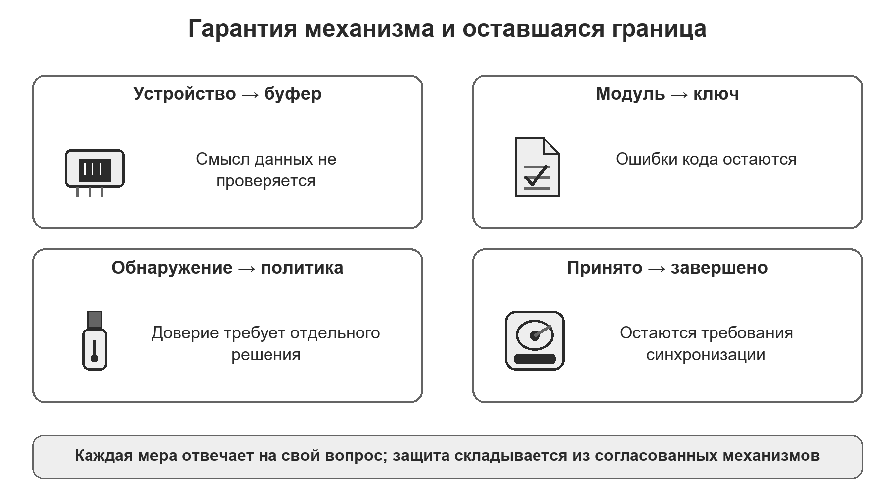

<p align="center"><em>Рисунок 26 — Гарантии и границы механизмов защиты</em></p>

## Вопросы для самоконтроля

1. Чем различаются устройство, контроллер и драйвер?
2. Какие уровни проходит чтение обычного файла при отсутствии данных в кэше?
3. Почему общий интерфейс `read()` не делает обычный файл и терминал одинаковыми?
4. Чем блочное устройство отличается от символьного и сетевого?
5. Почему обращение к MMIO-регистру нельзя всегда рассматривать как чтение обычной памяти?
6. Когда активный опрос может быть оправдан, а когда приводит к лишней работе CPU?
7. Почему прерывание от устройства не означает немедленного продолжения приложения?
8. Чем блокирующий ввод-вывод отличается от активного ожидания?
9. Как могут сочетаться DMA, прерывания и асинхронный интерфейс?
10. Почему устройству нельзя передать произвольный виртуальный указатель процесса как DMA-адрес?
11. Какие задачи выполняет IOMMU и какие угрозы остаются при её использовании?
12. Что происходит, если DMA-буфер освобождён до завершения обмена?
13. Чем отличаются цели буферизации, кэширования и спулинга?
14. Почему большой буфер не устраняет постоянное превышение скорости производителя над потребителем?
15. Что гарантирует успешный `write()` и зачем нужна синхронизация записи?
16. Почему очередь печати требует самостоятельной политики доступа?
17. Какие проверки нужны для управляющей команды драйверу?
18. Что подтверждает подпись модуля и чего она не подтверждает?
19. Чем отличаются Plug and Play и hotplug?
20. Почему обнаружение устройства, привязка драйвера и монтирование — разные события?
21. Почему USB-идентификаторы нельзя считать достаточным доказательством доверенности?
22. Что меняется в модели угроз при подключении составного USB-устройства?
23. Почему `noexec` не является полным запретом выполнения логики файла, а `nodev` не отключает аппаратное устройство?
24. Какие компоненты обрабатывают данные носителя ещё до открытия документа пользователем?
25. Почему по имени устройства в гостевой ОС нельзя установить физическую модель накопителя хоста?
26. Какие наблюдения позволяют отличить ошибку разрешения доступа от ошибки драйвера или устройства?

## Основные понятия и сокращения

В таблице 5 собраны основные термины и сокращения, использованные в лекции.

Таблица 5 — Термины лекции

| Термин | Значение |
|---|---|
| Ввод-вывод, I/O | Обмен данными с устройствами и внешней средой |
| Контроллер | Компонент, предоставляющий команды и состояние устройства |
| Драйвер | Программный компонент взаимодействия ОС с устройством |
| VFS | Virtual Filesystem, общий слой файловых интерфейсов Linux |
| MMIO | Memory-Mapped Input/Output, регистры устройства в адресном пространстве |
| IRQ | Interrupt Request, запрос прерывания |
| DMA | Direct Memory Access, аппаратная передача данных с доступом к памяти |
| MMU | Memory Management Unit, преобразование и контроль обращений CPU к памяти |
| IOMMU | Input/Output Memory Management Unit, преобразование и ограничение адресов ввода-вывода |
| Буферизация | Временное накопление данных для согласования передачи |
| Кэширование | Сохранение данных для ускорения повторных обращений |
| Спулинг | Очередь самостоятельных заданий к обслуживающему ресурсу |
| ioctl | Управляющие операции специального интерфейса ввода-вывода |
| Plug and Play | Автоматизированное обнаружение и конфигурирование устройств |
| Hotplug | Подключение и отключение устройств во время работы |
| udev | Обработка событий и правил устройств в пользовательском пространстве Linux |
| sysfs | Виртуальная файловая система представления объектов ядра, обычно `/sys` |
| USB | Universal Serial Bus, универсальная последовательная шина |
| UIO | Userspace I/O, механизм обслуживания некоторых устройств с участием пользовательского пространства |

## Источники

Рабочая программа и материалы курса:

- [РПД «Операционные системы», 10.05.01, раздел 3.1, лекция № 7](../../РПД%20и%20ФОС/RPD_Operatsionnye_sistemy_10.05.01.md).
- [Общий конспект курса, лекция 7](../OS-lecture-notes.md#лекция-7-ввод-вывод-устройства-и-драйверы).
- [Лекция 6. Файловые системы и хранение данных](../lecture_6_File_systems/Лекция_6_Файловые_системы_и_хранение_данных.md).

Первичная техническая документация:

- [Linux Kernel: Dynamic DMA mapping Guide](https://docs.kernel.org/core-api/dma-api-howto.html).
- [Linux Kernel: Linux generic IRQ handling](https://docs.kernel.org/core-api/genericirq.html).
- [Linux Kernel: ioctl based interfaces](https://docs.kernel.org/driver-api/ioctl.html).
- [Linux Kernel: The Userspace I/O HOWTO](https://docs.kernel.org/driver-api/uio-howto.html).
- [Linux Kernel: Kernel module signing facility](https://docs.kernel.org/admin-guide/module-signing.html).
- [Linux Kernel: Driver Binding](https://docs.kernel.org/driver-api/driver-model/binding.html).
- [Linux Kernel: USB device and interface authorization](https://docs.kernel.org/usb/authorization.html).
- [udev(7)](https://man7.org/linux/man-pages/man7/udev.7.html).
- [read(2)](https://man7.org/linux/man-pages/man2/read.2.html), [write(2)](https://man7.org/linux/man-pages/man2/write.2.html), [fsync(2)](https://man7.org/linux/man-pages/man2/fsync.2.html).
- [mount(8)](https://man7.org/linux/man-pages/man8/mount.8.html), [mount(2)](https://man7.org/linux/man-pages/man2/mount.2.html).
- [lsblk(8)](https://man7.org/linux/man-pages/man8/lsblk.8.html), [lsmod(8)](https://man7.org/linux/man-pages/man8/lsmod.8.html).

Документация описывает механизмы Linux; наличие и режим работы конкретных функций определяются версией ядра, редакцией Astra Linux, оборудованием и действующей политикой защиты.
