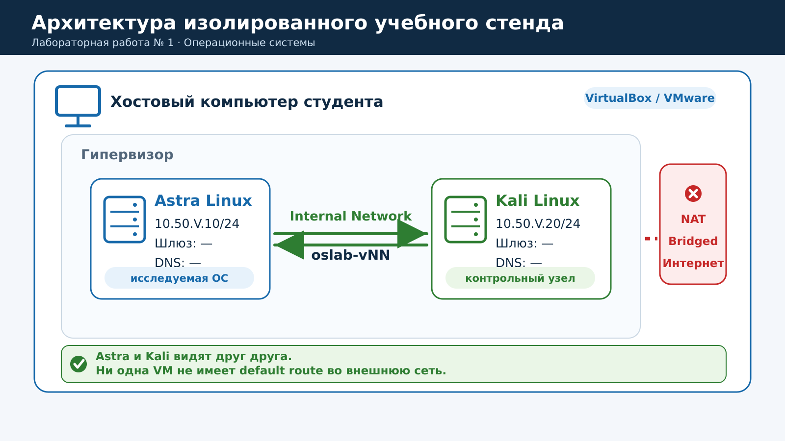
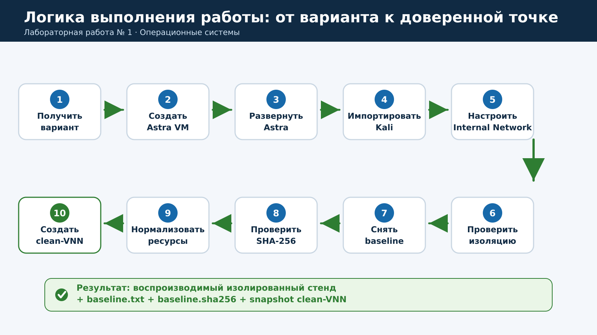
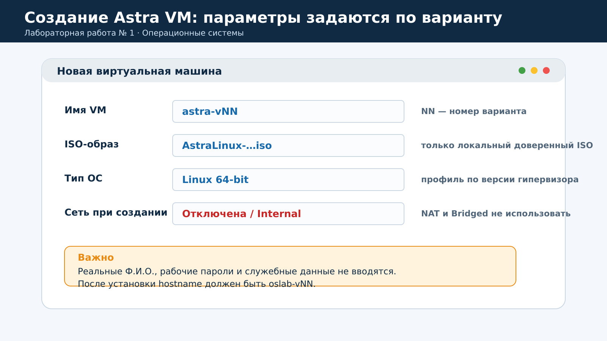
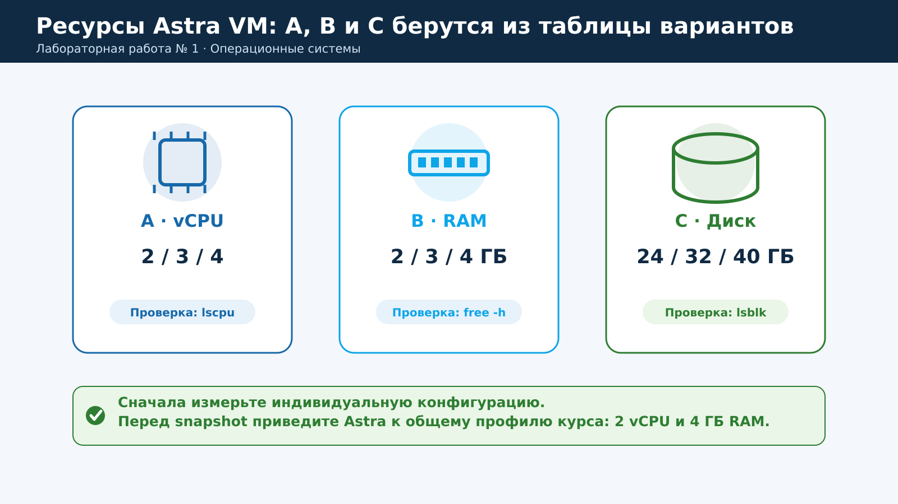
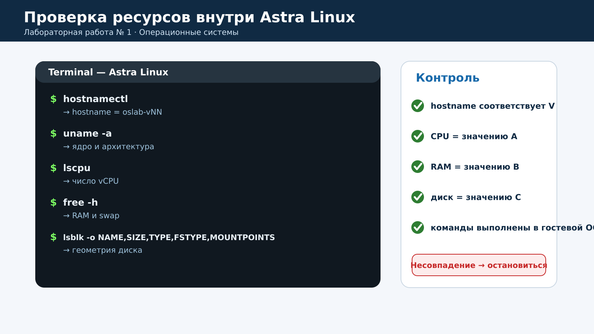
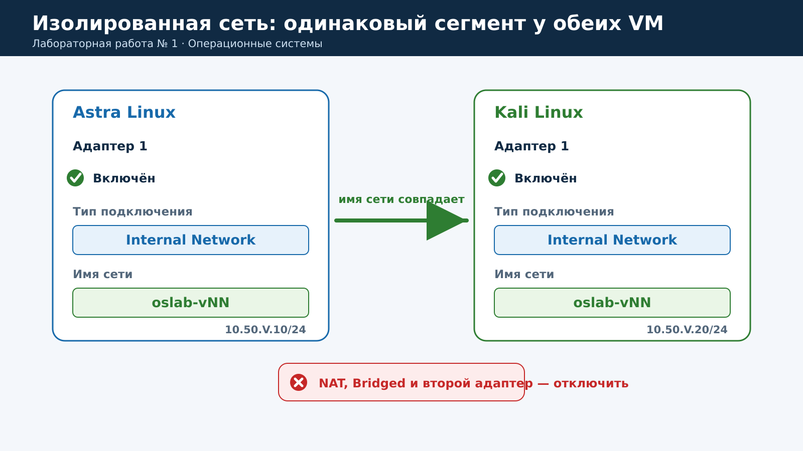
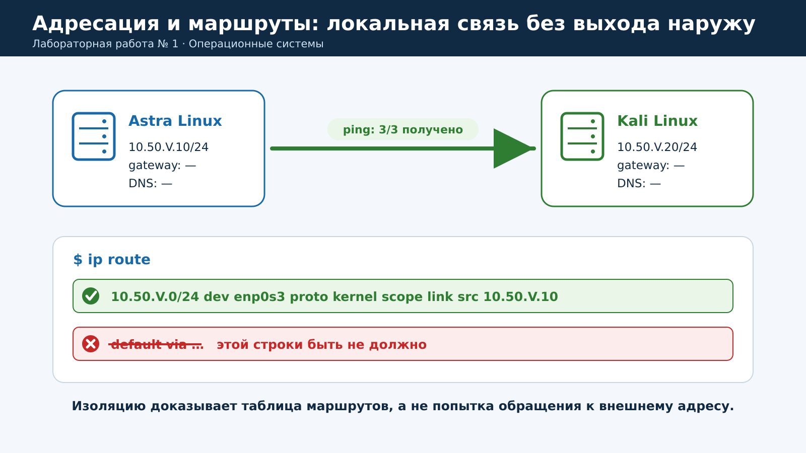
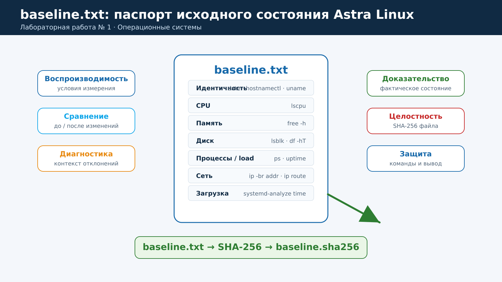
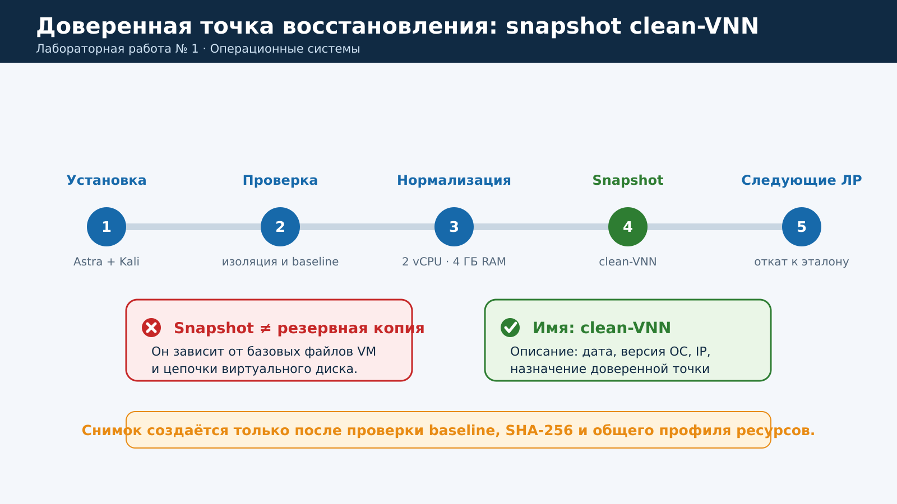
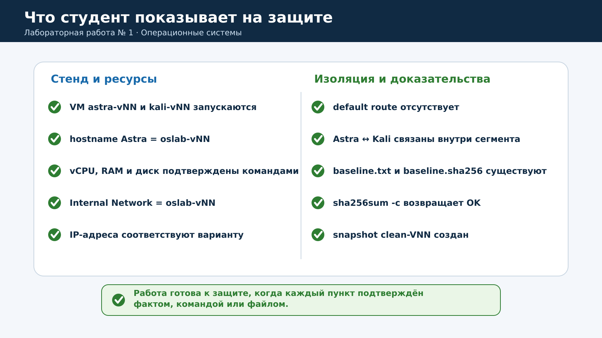

# Практическая работа № 1. Изолированный виртуальный стенд и паспорт операционной системы

**Дисциплина:** «Операционные системы»  
**Специальность:** 10.05.01 «Компьютерная безопасность»  
**Курс:** 2  
**Продолжительность:** 2 академических часа (90 минут)  
**Основные платформы:** Astra Linux, Kali Linux, VirtualBox или VMware Workstation

> В этой работе Kali Linux используется только как второй узел закрытого учебного сегмента. Поиск уязвимостей, эксплуатация, внешнее сканирование и воздействие на сторонние системы не выполняются.

## Содержание

1. [Цель и результаты работы](#1-цель-и-результаты-работы)
2. [Правила безопасности](#2-правила-безопасности)
3. [Краткие теоретические сведения](#3-краткие-теоретические-сведения)
4. [Архитектура стенда](#4-архитектура-стенда)
5. [Индивидуальные варианты](#5-индивидуальные-варианты)
6. [План работы на 90 минут](#6-план-работы-на-90-минут)
7. [Пошаговое выполнение](#7-пошаговое-выполнение)
8. [Таблица исходных метрик](#8-таблица-исходных-метрик)
9. [Самопроверка и защита](#9-самопроверка-и-защита)
10. [Требования к отчёту](#10-требования-к-отчёту)
11. [Критерии оценивания](#11-критерии-оценивания)
12. [Типичные ошибки](#12-типичные-ошибки)
13. [Шаблон паспорта стенда](#13-шаблон-паспорта-стенда)
14. [Контрольные вопросы](#14-контрольные-вопросы)
15. [Краткий справочник команд](#15-краткий-справочник-команд)

---

## 1. Цель и результаты работы

### Цель

Развернуть воспроизводимый изолированный стенд из двух виртуальных машин, связать параметры гипервизора с ресурсами гостевой операционной системы, доказать отсутствие внешнего маршрута, зафиксировать исходное состояние Astra Linux и создать доверенную точку восстановления для следующих практических работ.

### После выполнения работы студент должен уметь

- объяснять различие между хостовой ОС, гипервизором и гостевой ОС;
- назначать виртуальной машине vCPU, оперативную память и виртуальный диск;
- различать Internal Network, Host-only, NAT и Bridged;
- создавать Astra Linux VM и импортировать подготовленную Kali Linux VM;
- настраивать статические адреса в закрытом виртуальном сегменте;
- проверять IP-адреса и таблицу маршрутизации;
- снимать исходные показатели CPU, памяти, диска, процессов, нагрузки и загрузки ОС;
- создавать `baseline.txt` и проверять его целостность по SHA-256;
- создавать снимок доверенного состояния и отличать snapshot от резервной копии;
- оформлять паспорт стенда так, чтобы его мог воспроизвести другой специалист.

### Итоговые артефакты

| Объект | Ожидаемый результат |
|---|---|
| Astra Linux | VM `astra-vNN` запускается; hostname — `oslab-vNN` |
| Kali Linux | VM `kali-vNN` запускается как второй узел проверки |
| Виртуальная сеть | `Internal Network` с именем `oslab-vNN` |
| Адрес Astra | `10.50.V.10/24` |
| Адрес Kali | `10.50.V.20/24` |
| Внешний маршрут | Отсутствует |
| Файлы доказательств | `baseline.txt` и `baseline.sha256` |
| Точка восстановления | Snapshot `clean-VNN` |

Здесь `V` — номер варианта от 1 до 27, а `NN` — тот же номер с ведущим нулём для вариантов 1–9. Например, для варианта 7 используются `astra-v07`, `kali-v07`, `oslab-v07`, сеть `10.50.7.0/24`.

## 2. Правила безопасности

1. Используйте только VM, ISO/OVA и учебные учётные данные, предоставленные преподавателем.
2. Основной режим сети — `Internal Network`. Режим `Host-only` допускается только по указанию преподавателя.
3. Не включайте `Bridged Adapter`. Режим NAT в этой работе также не используется.
4. Не добавляйте второй сетевой адаптер для «исправления» связи между VM.
5. Не проверяйте и не сканируйте адреса за пределами своей пары Astra/Kali.
6. Не вводите реальные пароли, токены, персональные и служебные данные.
7. Не изменяйте BIOS/UEFI, Hyper-V, драйверы и политики безопасности хоста без разрешения преподавателя.
8. Не отключайте firewall или другие средства защиты автоматически, если `ping` не проходит.
9. Все изменения выполняйте так, чтобы стенд можно было вернуть к известному состоянию.

> **Критерий изоляции:** отсутствие внешнего маршрута подтверждается прежде всего выводом `ip route`. Не требуется обращаться к внешним IP-адресам, чтобы доказать изоляцию.

## 3. Краткие теоретические сведения

### 3.1. Хост, гипервизор и гостевая ОС

**Хост** — физический компьютер, на котором работает гипервизор. **Гипервизор** создаёт виртуальное аппаратное окружение: vCPU, RAM, диски, контроллеры и сетевые адаптеры. **Гостевая ОС** видит эти ресурсы как аппаратные и управляет ими обычными средствами операционной системы.

Параметры VM являются частью условий эксперимента. Если изменить число vCPU или объём RAM, результаты измерений могут измениться. Поэтому сначала фиксируется индивидуальная конфигурация, а перед последующими работами ресурсы приводятся к общему профилю курса.

### 3.2. Режимы виртуальной сети

| Режим | VM ↔ VM | VM ↔ хост | Внешняя сеть | Применение в работе |
|---|:---:|:---:|:---:|---|
| Internal Network | Да | Нет | Нет | Основной рекомендуемый режим |
| Host-only | Да | Да | Нет | Только по решению преподавателя |
| NAT | Зависит от конфигурации | Да | Да | Не используется |
| Bridged | Да | Да | Да | Запрещён для учебного стенда |

### 3.3. Статическая адресация без шлюза

Обе VM получают адреса из одной подсети `/24`. Шлюз и DNS не задаются, поэтому в таблице маршрутизации присутствует только маршрут к локальной сети. Отсутствие строки `default via ...` означает, что у гостевой ОС нет маршрута по умолчанию во внешнюю сеть.

### 3.4. Baseline

Baseline — зафиксированное исходное состояние системы. В этой работе он включает идентичность узла, ядро, CPU, память, диски, число процессов, нагрузку, адреса и маршруты. В следующих работах baseline позволит сравнивать состояние «до» и «после» изменения.

Файл `baseline.sha256` не скрывает содержимое и не является электронной подписью. Он позволяет обнаружить изменение `baseline.txt`: после изменения файла прежняя контрольная сумма перестанет совпадать.

### 3.5. Snapshot и резервная копия

Snapshot фиксирует состояние VM внутри конкретной цепочки виртуального диска. Он удобен для быстрого отката, но зависит от базовых файлов VM и не заменяет резервную копию. Потеря или повреждение базового диска может сделать снимок бесполезным.

## 4. Архитектура стенда



**Рисунок 1 — Архитектура изолированного учебного стенда**

Требования к компонентам:

| Компонент | Требование |
|---|---|
| Хост | Аппаратная виртуализация; по рабочей программе — не менее 16 ГБ RAM и 80 ГБ свободного места |
| Гипервизор | VirtualBox, VMware Workstation или иной разрешённый преподавателем |
| Astra Linux | ISO или шаблон из доверенного локального источника |
| Kali Linux | Подготовленная преподавателем VM/OVA |
| Сеть | `Internal Network` с именем `oslab-vNN` |
| Данные | Только искусственные учебные данные и локальные учебные записи |



**Рисунок 2 — Логика выполнения работы**

## 5. Индивидуальные варианты

| V | vCPU | RAM | Диск | Подсеть | Astra Linux | Kali Linux |
|---:|---:|---:|---:|---|---|---|
| 1 | 2 | 2 ГБ | 24 ГБ | `10.50.1.0/24` | `10.50.1.10` | `10.50.1.20` |
| 2 | 3 | 2 ГБ | 24 ГБ | `10.50.2.0/24` | `10.50.2.10` | `10.50.2.20` |
| 3 | 4 | 2 ГБ | 24 ГБ | `10.50.3.0/24` | `10.50.3.10` | `10.50.3.20` |
| 4 | 2 | 3 ГБ | 24 ГБ | `10.50.4.0/24` | `10.50.4.10` | `10.50.4.20` |
| 5 | 3 | 3 ГБ | 24 ГБ | `10.50.5.0/24` | `10.50.5.10` | `10.50.5.20` |
| 6 | 4 | 3 ГБ | 24 ГБ | `10.50.6.0/24` | `10.50.6.10` | `10.50.6.20` |
| 7 | 2 | 4 ГБ | 24 ГБ | `10.50.7.0/24` | `10.50.7.10` | `10.50.7.20` |
| 8 | 3 | 4 ГБ | 24 ГБ | `10.50.8.0/24` | `10.50.8.10` | `10.50.8.20` |
| 9 | 4 | 4 ГБ | 24 ГБ | `10.50.9.0/24` | `10.50.9.10` | `10.50.9.20` |
| 10 | 2 | 2 ГБ | 32 ГБ | `10.50.10.0/24` | `10.50.10.10` | `10.50.10.20` |
| 11 | 3 | 2 ГБ | 32 ГБ | `10.50.11.0/24` | `10.50.11.10` | `10.50.11.20` |
| 12 | 4 | 2 ГБ | 32 ГБ | `10.50.12.0/24` | `10.50.12.10` | `10.50.12.20` |
| 13 | 2 | 3 ГБ | 32 ГБ | `10.50.13.0/24` | `10.50.13.10` | `10.50.13.20` |
| 14 | 3 | 3 ГБ | 32 ГБ | `10.50.14.0/24` | `10.50.14.10` | `10.50.14.20` |
| 15 | 4 | 3 ГБ | 32 ГБ | `10.50.15.0/24` | `10.50.15.10` | `10.50.15.20` |
| 16 | 2 | 4 ГБ | 32 ГБ | `10.50.16.0/24` | `10.50.16.10` | `10.50.16.20` |
| 17 | 3 | 4 ГБ | 32 ГБ | `10.50.17.0/24` | `10.50.17.10` | `10.50.17.20` |
| 18 | 4 | 4 ГБ | 32 ГБ | `10.50.18.0/24` | `10.50.18.10` | `10.50.18.20` |
| 19 | 2 | 2 ГБ | 40 ГБ | `10.50.19.0/24` | `10.50.19.10` | `10.50.19.20` |
| 20 | 3 | 2 ГБ | 40 ГБ | `10.50.20.0/24` | `10.50.20.10` | `10.50.20.20` |
| 21 | 4 | 2 ГБ | 40 ГБ | `10.50.21.0/24` | `10.50.21.10` | `10.50.21.20` |
| 22 | 2 | 3 ГБ | 40 ГБ | `10.50.22.0/24` | `10.50.22.10` | `10.50.22.20` |
| 23 | 3 | 3 ГБ | 40 ГБ | `10.50.23.0/24` | `10.50.23.10` | `10.50.23.20` |
| 24 | 4 | 3 ГБ | 40 ГБ | `10.50.24.0/24` | `10.50.24.10` | `10.50.24.20` |
| 25 | 2 | 4 ГБ | 40 ГБ | `10.50.25.0/24` | `10.50.25.10` | `10.50.25.20` |
| 26 | 3 | 4 ГБ | 40 ГБ | `10.50.26.0/24` | `10.50.26.10` | `10.50.26.20` |
| 27 | 4 | 4 ГБ | 40 ГБ | `10.50.27.0/24` | `10.50.27.10` | `10.50.27.20` |

> **Нормализация:** перед финальным snapshot Astra Linux приводится к общему профилю курса — 2 vCPU и 4 ГБ RAM, если преподаватель не указал иной профиль. Размер динамического диска можно оставить по варианту. Kali Linux: 2 vCPU и 2 ГБ RAM.

## 6. План работы на 90 минут

| Время | Действие | Контрольный результат |
|---|---|---|
| 0–10 мин | Вариант, гипервизор, ISO/OVA, каталог работы | Вариант записан, исходные материалы доступны |
| 10–35 мин | Создание и установка/развёртывание Astra | Astra запускается, hostname задан |
| 35–45 мин | Импорт Kali Linux | Kali запускается |
| 45–60 мин | Internal Network и статические адреса | VM находятся в одном сегменте |
| 60–70 мин | Проверка адресов, маршрутов и связи | Нет default route; внутренняя связь подтверждена |
| 70–80 мин | Снятие baseline | Созданы `baseline.txt` и `baseline.sha256` |
| 80–85 мин | Нормализация ресурсов | Astra приведена к общему профилю |
| 85–90 мин | Создание snapshot | Создан `clean-VNN` |

## 7. Пошаговое выполнение

### Шаг 0. Проверьте исходные материалы

1. Запишите номер варианта `V`.
2. Запустите разрешённый гипервизор.
3. Найдите локальный ISO Astra Linux и образ Kali Linux, указанные преподавателем.
4. Проверьте свободное место для двух VM и снимков.
5. Не скачивайте образы из случайных источников.

Если 64-битная VM не запускается, зафиксируйте сообщение об ошибке и обратитесь к преподавателю. Не изменяйте BIOS/UEFI и компоненты хостовой ОС самостоятельно.

### Шаг 1. Создайте каталог результатов

После первого запуска Astra Linux выполните:

```bash
mkdir -p ~/oslab/lab01
cd ~/oslab/lab01
pwd
```

**Контроль:** `pwd` должен вывести путь, заканчивающийся на `/oslab/lab01`.

### Шаг 2. Создайте Astra Linux VM



**Рисунок 3 — Основные параметры новой Astra VM**

1. Создайте VM с именем `astra-vNN`.
2. Выберите профиль `Linux 64-bit`, соответствующий версии гипервизора.
3. Подключите локальный доверенный ISO Astra Linux.
4. Назначьте vCPU, RAM и динамический диск по варианту.
5. Не используйте NAT или Bridged.



**Рисунок 4 — Параметры A, B и C индивидуального варианта**

### Шаг 3. Установите или разверните Astra Linux

1. Запустите VM с ISO или предоставленным шаблоном.
2. Используйте только локальную учебную учётную запись.
3. Задайте hostname `oslab-vNN`.
4. Не вводите реальные Ф.И.О. и рабочие пароли.
5. Не подключайте гостевую ОС к NAT/Bridged.
6. После установки корректно перезагрузите VM и извлеките ISO.

Экраны установщика зависят от редакции Astra Linux. Ориентируйтесь на итоговое состояние: локальная учебная запись, hostname `oslab-vNN` и отсутствие внешней сетевой связности.

### Шаг 4. Проверьте ресурсы Astra Linux

```bash
hostnamectl
uname -a
lscpu
free -h
lsblk -o NAME,SIZE,TYPE,FSTYPE,MOUNTPOINTS
```



**Рисунок 5 — Сопоставление команд с ресурсами гостевой ОС**

| Команда | Что проверяется |
|---|---|
| `hostnamectl` | Hostname `oslab-vNN` |
| `uname -a` | Версия и архитектура ядра |
| `lscpu` | Число vCPU |
| `free -h` | RAM и swap |
| `lsblk` | Размер и структура виртуального диска |

Если параметры не соответствуют варианту, корректно выключите VM, исправьте настройки гипервизора и повторите проверку. Не снимайте baseline для ошибочной конфигурации.

### Шаг 5. Импортируйте Kali Linux

1. Импортируйте VM/OVA, подготовленную преподавателем.
2. Назовите VM `kali-vNN`.
3. Используйте профиль 2 vCPU и 2 ГБ RAM, если не указано иначе.
4. Не обновляйте Kali и не устанавливайте дополнительные пакеты.
5. Не запускайте средства сканирования: Kali нужна только для проверки внутренней связи.

### Шаг 6. Настройте Internal Network

Полностью выключите обе VM и настройте их первый сетевой адаптер одинаково:

- тип подключения — `Internal Network`;
- имя сети — `oslab-vNN`;
- дополнительные NAT/Bridged-адаптеры отсутствуют.



**Рисунок 6 — Обе VM должны находиться в одном внутреннем сегменте**

Разные имена Internal Network создают разные виртуальные сегменты. Даже при правильных IP-адресах VM не увидят друг друга, если имена сети различаются.

### Шаг 7. Задайте статические IP-адреса

| Узел | IPv4 | Gateway | DNS |
|---|---|---|---|
| Astra Linux | `10.50.V.10/24` | Не задавать | Не задавать |
| Kali Linux | `10.50.V.20/24` | Не задавать | Не задавать |

Можно использовать графический сетевой менеджер. Если применяется NetworkManager и преподаватель разрешил CLI, сначала определите имя соединения:

```bash
nmcli connection show
```

Пример для Astra Linux:

```bash
sudo nmcli connection modify "ИМЯ_СОЕДИНЕНИЯ" \
  ipv4.method manual \
  ipv4.addresses "10.50.V.10/24" \
  ipv4.gateway "" \
  ipv4.dns ""

sudo nmcli connection up "ИМЯ_СОЕДИНЕНИЯ"
```

Для Kali Linux укажите `10.50.V.20/24`. Если `nmcli` отсутствует, используйте штатный интерфейс установленной ОС или инструкцию преподавателя.

### Шаг 8. Проверьте адреса и маршруты

На обеих VM выполните:

```bash
ip -br addr
ip route
```

Ожидается маршрут к локальной сети `10.50.V.0/24`. Строки `default via ...` быть не должно.



**Рисунок 7 — Корректная адресация без внешнего маршрута**

Если обнаружен default route, выключите VM и проверьте второй адаптер, NAT, Bridged и поле Gateway. После исправления повторите обе команды.

### Шаг 9. Проверьте связь между Astra и Kali

На Astra Linux:

```bash
ping -c 3 10.50.V.20
```

На Kali Linux:

```bash
ping -c 3 10.50.V.10
```

Если `ping` не проходит:

1. сравните имена Internal Network;
2. проверьте IP-адреса и маску;
3. убедитесь, что интерфейсы имеют состояние `UP`;
4. не добавляйте NAT;
5. не отключайте firewall без разрешения;
6. при штатном запрете ICMP согласуйте с преподавателем диагностический тест.

### Шаг 10. Снимите baseline Astra Linux

Подождите 2–3 минуты после загрузки, чтобы снизилась фоновая активность. Выполните блок:

```bash
{
  echo '=== LAB01 BASELINE ==='
  date --iso-8601=seconds
  echo '--- HOSTNAME / OS ---'
  hostnamectl
  echo '--- KERNEL ---'
  uname -a
  echo '--- CPU ---'
  lscpu
  echo '--- MEMORY ---'
  free -h
  echo '--- DISKS ---'
  lsblk -o NAME,SIZE,TYPE,FSTYPE,MOUNTPOINTS
  df -hT
  echo '--- PROCESSES ---'
  echo -n 'process_count='
  ps -e --no-headers | wc -l
  echo '--- LOAD ---'
  uptime
  echo '--- NETWORK ---'
  ip -br addr
  ip route
  echo '--- BOOT ---'
  systemd-analyze time 2>/dev/null || true
} | tee ~/oslab/lab01/baseline.txt

sha256sum ~/oslab/lab01/baseline.txt \
  | tee ~/oslab/lab01/baseline.sha256
```



**Рисунок 8 — Состав файла исходного состояния**

Если `systemd-analyze` отсутствует или не поддерживается вашей средой, зафиксируйте ограничение в отчёте. Не придумывайте значение и не подменяйте его случайным измерением.

### Шаг 11. Заполните таблицу исходных метрик

Перенесите фактические значения в таблицу из [раздела 8](#8-таблица-исходных-метрик). Не используйте формулировки «много» или «мало» без численного значения и контекста.

### Шаг 12. Проверьте baseline и SHA-256

```bash
ls -lh ~/oslab/lab01/baseline.txt \
       ~/oslab/lab01/baseline.sha256

cat ~/oslab/lab01/baseline.sha256
sha256sum -c ~/oslab/lab01/baseline.sha256
```

Ожидаемый результат проверки — `OK`. Если `baseline.txt` изменить после вычисления хеша, проверка завершится ошибкой. В этом случае выясните причину изменения и, если требуется, снимите новый согласованный baseline.

### Шаг 13. Нормализуйте ресурсы

1. Корректно завершите работу обеих VM.
2. Для выключенной Astra VM установите общий профиль: 2 vCPU и 4 ГБ RAM, если преподаватель не указал иной.
3. Kali оставьте на профиле 2 vCPU и 2 ГБ RAM.
4. Запустите Astra и подтвердите новые значения через `lscpu` и `free -h`.
5. Снова корректно выключите обе VM.

Нормализация нужна для сопоставимости будущих экспериментов. Индивидуальные параметры позволяют увидеть связь гипервизора и гостевой ОС, но сравнивать производительность следует при одинаковом профиле.

### Шаг 14. Создайте snapshot

После проверки общего профиля создайте снимок Astra Linux:

- имя — `clean-VNN`;
- описание — «ЛР1 завершена; Internal Network oslab-vNN; baseline сохранён; профиль нормализован»;
- дополнительно укажите дату, версию ОС и IP-адрес.



**Рисунок 9 — Доверенная точка восстановления для следующих работ**

Не удаляйте и не переносите вручную базовые файлы виртуального диска или цепочку снимков.

## 8. Таблица исходных метрик

| Показатель | Ваше значение | Источник |
|---|---|---|
| vCPU |  | `lscpu` |
| RAM всего |  | `free -h` |
| RAM used после простоя |  | `free -h` |
| Swap всего/использовано |  | `free -h` |
| Размер виртуального диска |  | `lsblk` |
| Использовано корневой FS |  | `df -hT` |
| Число процессов |  | `ps -e --no-headers \| wc -l` |
| Load average |  | `uptime` |
| Время загрузки |  | `systemd-analyze time` |
| IPv4 Astra |  | `ip -br addr` |
| Default route | Отсутствует | `ip route` |

## 9. Самопроверка и защита



**Рисунок 10 — Минимальный комплект для защиты работы**

- [ ] VM называются `astra-vNN` и `kali-vNN`.
- [ ] Astra загружается; hostname — `oslab-vNN`.
- [ ] Фактические vCPU, RAM и диск подтверждены командами.
- [ ] Обе VM подключены к `Internal Network oslab-vNN`.
- [ ] IP-адреса соответствуют варианту.
- [ ] В `ip route` нет внешнего default route.
- [ ] Astra и Kali связаны внутри стенда либо ограничение ICMP корректно объяснено.
- [ ] Существуют `baseline.txt` и `baseline.sha256`.
- [ ] `sha256sum -c` возвращает `OK`.
- [ ] Astra приведена к общему профилю курса.
- [ ] Создан snapshot `clean-VNN`.
- [ ] Студент объясняет разницу между snapshot и резервной копией.

### Минимальная демонстрация на защите

```bash
hostnamectl
lscpu
free -h
lsblk
ip -br addr
ip route
systemd-analyze time
sha256sum -c ~/oslab/lab01/baseline.sha256
```

Недостаточно просто выполнить команды. Необходимо объяснить хотя бы одну значимую строку каждого вывода.

## 10. Требования к отчёту

Рекомендуемый объём — 4–6 страниц без полного копирования длинных листингов.

1. Ф.И.О., группа, вариант, дата.
2. Цель работы и индивидуальные параметры vCPU/RAM/диска.
3. Схема стенда с именами VM и IP-адресами.
4. Таблица параметров обеих VM.
5. Краткое описание установки или развёртывания.
6. Доказательство изоляции: `ip -br addr`, `ip route` и пояснение отсутствия внешнего маршрута.
7. Подтверждение внутренней связи Astra ↔ Kali.
8. Заполненная таблица исходных метрик.
9. SHA-256 baseline и результат проверки `OK`.
10. Имя и описание snapshot `clean-VNN`.
11. Вывод: какие ресурсы гипервизор предоставил ОС, как доказана изоляция и почему стенд воспроизводим.

На скриншоте должны быть видны команда, её результат и контекст VM. Обрезанное число без команды считается слабым доказательством.

## 11. Критерии оценивания

| Компонент | Баллы | Критерий |
|---|---:|---|
| VM и установка | 2 | Astra и Kali запускаются; параметры варианта соблюдены |
| Изоляция и snapshot | 2 | Internal/Host-only; нет внешнего маршрута; создан `clean-VNN` |
| Паспорт и метрики | 3 | Зафиксированы CPU, RAM, диск, процессы, load, boot, сеть |
| Объяснение механизмов | 2 | Студент объясняет гипервизор, сеть, default route, baseline и snapshot |
| Защита и воспроизводимость | 1 | Есть файлы, схема, хеш и возможность повторить ключевые проверки |
| **Итого** | **10** |  |

> **Критическое нарушение:** Bridged-подключение к реальной сети, намеренная проверка посторонних адресов, использование реальных учётных данных или продолжение опасного действия после указания преподавателя оцениваются по правилам безопасности независимо от технического результата.

## 12. Типичные ошибки

| Симптом | Что проверить | Корректирующее действие |
|---|---|---|
| VM не запускается | Аппаратную виртуализацию, RAM, конфликт гипервизоров | Показать ошибку преподавателю; не менять политики хоста самостоятельно |
| Astra видит другой CPU/RAM | `lscpu`, `free -h`, настройки выключенной VM | Исправить ресурсы и повторить измерения |
| Astra и Kali не видят друг друга | Имя Internal Network, IP/маску, интерфейс `UP` | Исправить сегмент или адрес; не добавлять NAT |
| В `ip route` есть `default` | Второй адаптер, NAT/Bridged, Gateway | Удалить внешний путь и проверить снова |
| `ping` не проходит | Имя сети, адреса, маску, ICMP policy | Не отключать защиту автоматически; согласовать диагностику |
| Нет `systemd-analyze` | Версию systemd и среду | Зафиксировать ограничение и собрать остальные метрики |
| SHA-256 возвращает `FAILED` | Изменение `baseline.txt` после хеширования | Установить причину; при необходимости переснять baseline и хеш |
| Snapshot занимает много места | Свободное место и цепочку снимков | Не удалять файлы VM вручную; сообщить преподавателю |

## 13. Шаблон паспорта стенда

| Поле | Значение |
|---|---|
| Ф.И.О. / группа |  |
| Вариант V |  |
| Гипервизор и версия |  |
| Astra Linux: версия / ядро |  |
| Astra: vCPU / RAM / диск по варианту |  |
| Astra: итоговый нормализованный профиль | 2 vCPU / 4 ГБ RAM |
| Kali: версия / vCPU / RAM | 2 vCPU / 2 ГБ RAM |
| Имя внутренней сети | `oslab-vNN` |
| IPv4 Astra | `10.50.V.10/24` |
| IPv4 Kali | `10.50.V.20/24` |
| Default route | Отсутствует |
| Результат Astra ↔ Kali |  |
| Имя snapshot | `clean-VNN` |
| SHA-256 `baseline.txt` |  |
| Дата и время фиксации |  |

## 14. Контрольные вопросы

1. Что виртуализирует гипервизор?
2. Чем хостовая ОС отличается от гостевой?
3. Почему число vCPU нужно подтвердить внутри гостевой ОС командой `lscpu`?
4. Чем vCPU отличается от физического ядра процессора?
5. Почему увеличение числа vCPU не гарантирует ускорение любой программы?
6. В чём различие Internal Network и Host-only?
7. Почему Bridged запрещён в данном учебном полигоне?
8. Чем отсутствие default route отличается от запрета внешнего трафика только firewall-правилом?
9. Почему snapshot не является полноценной резервной копией?
10. Что показывает load average и почему его нельзя оценивать без контекста?
11. Почему RAM used после загрузки не является достаточной оценкой «тяжести» ОС?
12. Что измеряет `systemd-analyze time`?
13. Зачем сохранять `baseline.txt` перед следующими работами?
14. Что подтверждает SHA-256 и чего она не подтверждает?
15. Какие параметры нужно зафиксировать для корректного сравнения будущих экспериментов?

## 15. Краткий справочник команд

### Идентичность и ресурсы

```bash
hostnamectl
uname -a
lscpu
free -h
lsblk -o NAME,SIZE,TYPE,FSTYPE,MOUNTPOINTS
df -hT
```

### Сеть

```bash
ip -br addr
ip route
ping -c 3 10.50.V.20   # с Astra
ping -c 3 10.50.V.10   # с Kali
```

### Процессы, нагрузка и загрузка

```bash
ps -e --no-headers | wc -l
uptime
systemd-analyze time
```

### Целостность baseline

```bash
sha256sum ~/oslab/lab01/baseline.txt \
  | tee ~/oslab/lab01/baseline.sha256

sha256sum -c ~/oslab/lab01/baseline.sha256
```

## Источники

1. Рабочая программа дисциплины «Операционные системы» для специальности 10.05.01 «Компьютерная безопасность».
2. [Документация Astra Linux Special Edition](https://docs.astralinux.ru/latest/doc/alse81/).
3. [Oracle VirtualBox User Manual — Virtual Networking](https://docs.oracle.com/en/virtualization/virtualbox/7.2/user/networkingdetails.html).
4. [Oracle VirtualBox — Security Guide](https://docs.oracle.com/en/virtualization/virtualbox/7.1/user/Security.html).
5. [systemd-analyze(1) — Linux manual page](https://man7.org/linux/man-pages/man1/systemd-analyze.1.html).

> Названия элементов интерфейса и некоторые команды зависят от версии Astra Linux и гипервизора. При расхождении приоритет имеют официальная документация используемой версии и локальные правила учебного полигона.
