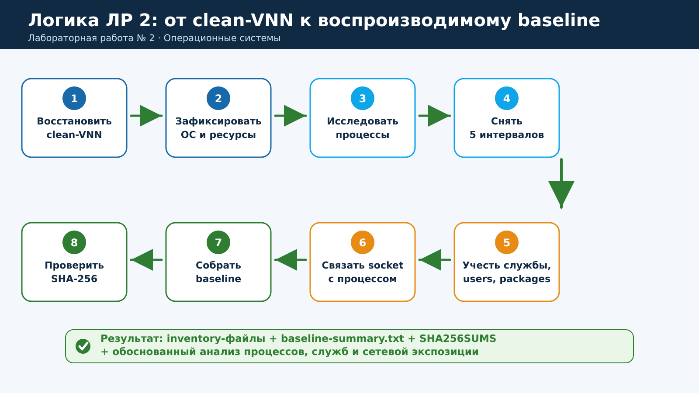
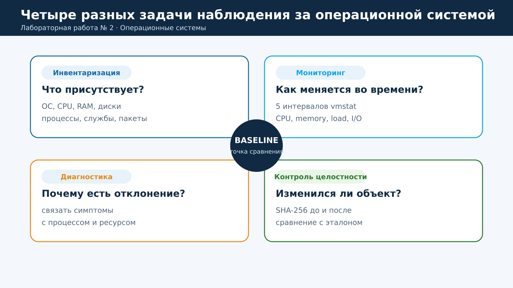
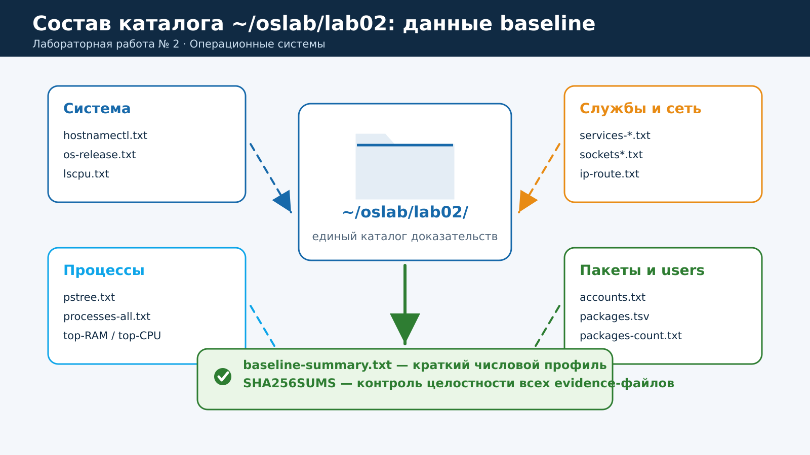
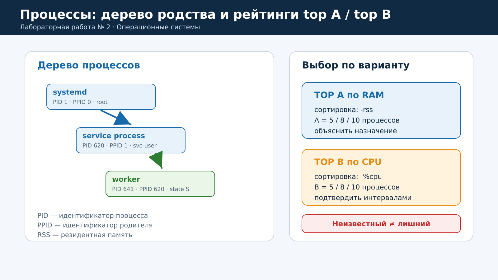
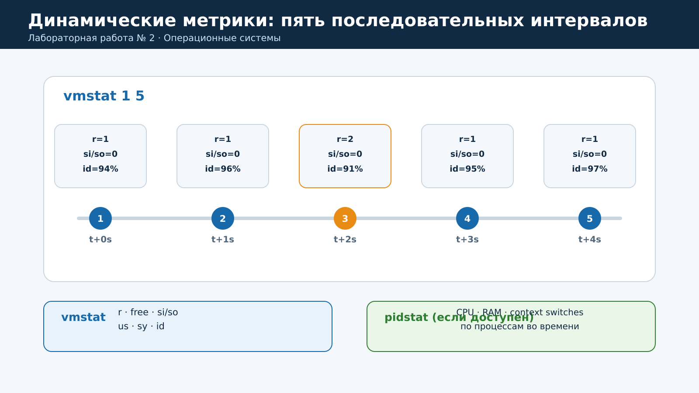
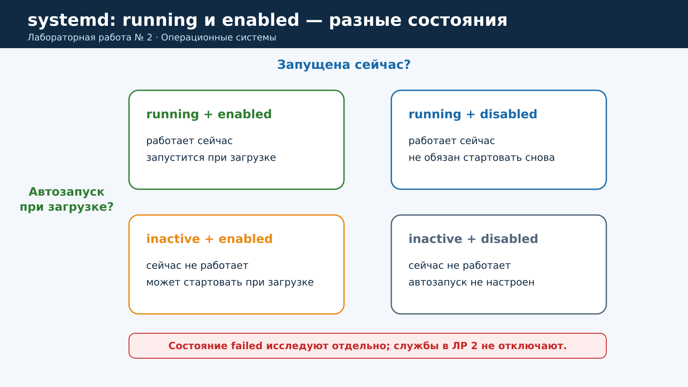
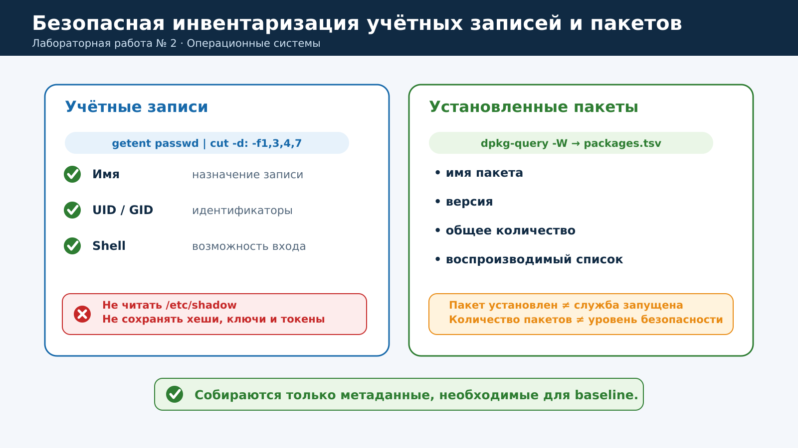
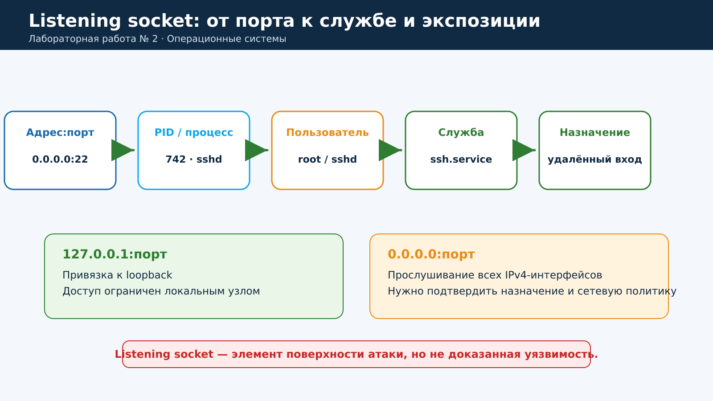
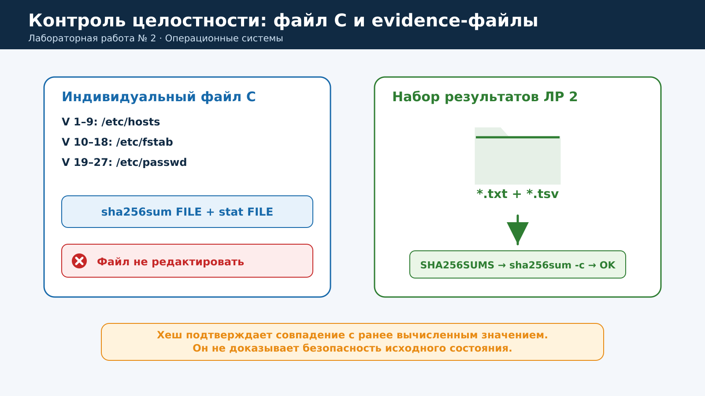
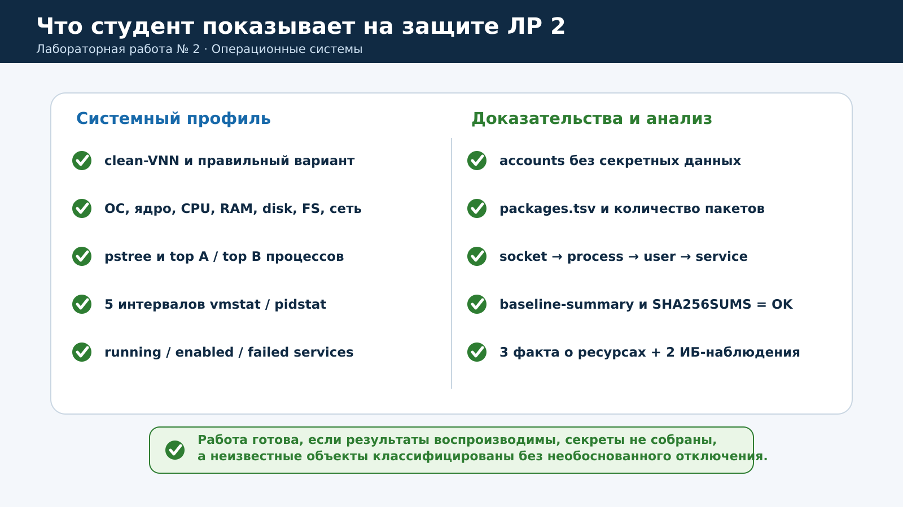

# Практическая работа № 2. Инвентаризация операционной системы и формирование baseline

**Дисциплина:** «Операционные системы»  
**Специальность:** 10.05.01 «Компьютерная безопасность»  
**Курс:** 2  
**Продолжительность:** 2 академических часа (90 минут)  
**Исследуемая система:** Astra Linux из практической работы № 1

> Работа выполняется преимущественно в режиме чтения. Запрещено удалять пакеты, отключать службы, менять учётные записи, редактировать контрольный файл или изменять сетевую конфигурацию без отдельного задания преподавателя.

## Содержание

1. [Цель и результаты](#1-цель-и-результаты)
2. [Правила безопасного выполнения](#2-правила-безопасного-выполнения)
3. [Теоретические сведения](#3-теоретические-сведения)
4. [Стенд и исходное состояние](#4-стенд-и-исходное-состояние)
5. [Индивидуальные варианты](#5-индивидуальные-варианты)
6. [План на 90 минут](#6-план-на-90-минут)
7. [Пошаговое выполнение](#7-пошаговое-выполнение)
8. [Таблица системного baseline](#8-таблица-системного-baseline)
9. [Анализ процессов](#9-анализ-процессов)
10. [Анализ служб и сокетов](#10-анализ-служб-и-сокетов)
11. [Анализ поверхности атаки](#11-анализ-поверхности-атаки)
12. [Самопроверка и защита](#12-самопроверка-и-защита)
13. [Требования к отчёту](#13-требования-к-отчёту)
14. [Критерии оценивания](#14-критерии-оценивания)
15. [Типичные ошибки](#15-типичные-ошибки)
16. [Контрольные вопросы](#16-контрольные-вопросы)
17. [Краткий справочник команд](#17-краткий-справочник-команд)

---

## 1. Цель и результаты

### Цель

Освоить системную инвентаризацию Linux и сформировать воспроизводимое эталонное описание Astra Linux: аппаратные ресурсы, файловые системы, процессы, динамические показатели, службы, учётные записи, пакеты и listening sockets. Связать сетевые объекты с процессами и службами, сохранить результаты в отдельных файлах и проверить их целостность по SHA-256.

### После выполнения работы студент должен уметь

- различать инвентаризацию, мониторинг, диагностику и контроль целостности;
- определять версию ОС, ядра и архитектуру;
- получать характеристики CPU, RAM, дисков и файловых систем;
- строить дерево процессов и интерпретировать PID, PPID, UID, state, RSS, `%CPU` и `%MEM`;
- формировать индивидуальные рейтинги top A по RAM и top B по CPU;
- снимать динамические показатели за пять последовательных интервалов;
- различать состояния systemd `running`, `enabled` и `failed`;
- безопасно инвентаризировать учётные записи без доступа к секретам;
- получать воспроизводимый список установленных пакетов;
- строить цепочку `адрес:порт → процесс → пользователь → служба → назначение`;
- создавать `baseline-summary.txt`, `SHA256SUMS` и проверять контрольные суммы;
- классифицировать неизвестные объекты без необоснованного отключения.



**Рисунок 1 — От доверенного snapshot к воспроизводимому baseline**

### Итоговые артефакты

| Группа | Файлы и результаты |
|---|---|
| Система | `hostnamectl.txt`, `os-release.txt`, `uname.txt`, `lscpu.txt`, `memory.txt` |
| Диски и сеть | `lsblk.txt`, `df.txt`, `findmnt.txt`, `ip-address.txt`, `ip-route.txt` |
| Процессы | `pstree.txt`, `processes-all.txt`, top A по RAM, top B по CPU |
| Динамика | `uptime.txt`, `loadavg.txt`, `vmstat.txt`, при наличии — `pidstat.txt` |
| Службы | `services-running.txt`, `services-enabled.txt`, `services-failed.txt` |
| Users и пакеты | `accounts.txt`, `login-capable.txt`, `packages.tsv`, `packages-count.txt` |
| Сокеты | `sockets.txt`, при разрешении — `sockets-processes.txt` |
| Загрузка | `boot-time.txt`, `boot-top15.txt` |
| Целостность | `control-file.sha256`, `control-file.stat`, `SHA256SUMS` |
| Сводка | `baseline-summary.txt` |

## 2. Правила безопасного выполнения

1. Восстановите доверенный snapshot `clean-VNN`, созданный после практической работы № 1.
2. Запускайте только Astra Linux. Kali Linux оставьте выключенной, если преподаватель не указал иное.
3. Не меняйте профиль vCPU/RAM в ходе измерения.
4. Не изменяйте сеть, маршруты, firewall и сетевые адаптеры.
5. Не отключайте и не перезапускайте службы ради «оптимизации».
6. Не удаляйте и не устанавливайте пакеты.
7. Не создавайте и не удаляйте пользователей и группы.
8. Не открывайте `/etc/shadow`, приватные ключи, токены и иные секреты.
9. Не включайте секреты и персональные данные в отчёт или архив доказательств.
10. Индивидуальный файл C используется только для `stat` и SHA-256; редактировать его нельзя.
11. `sudo` применяйте только для разрешённых преподавателем read-only команд.
12. Неизвестный процесс или listening socket не считается вредоносным без дополнительного анализа.

> **Главный принцип:** сначала наблюдение и доказательство, затем объяснение. Изменение конфигурации допускается только в отдельной работе и после подтверждения назначения объекта.

## 3. Теоретические сведения

### 3.1. Инвентаризация, мониторинг, диагностика и целостность



**Рисунок 2 — Четыре разные задачи наблюдения за ОС**

| Понятие | Основной вопрос | Пример результата |
|---|---|---|
| Инвентаризация | Что присутствует сейчас? | Процессы, службы, пакеты, сокеты |
| Мониторинг | Как состояние меняется во времени? | CPU, RAM, I/O, load за пять интервалов |
| Диагностика | Почему появилось отклонение? | Связь симптома с процессом и ресурсом |
| Baseline | С чем сравнивать будущее состояние? | Зафиксированный набор характеристик |
| Контроль целостности | Изменился ли выбранный объект? | SHA-256 совпадает или не совпадает |

Baseline не означает «абсолютно безопасное состояние». Это документированная точка отсчёта. Качество baseline определяется тем, насколько доверенным было исходное состояние, насколько полно собраны данные и насколько воспроизводимы условия измерения.

### 3.2. Процесс, служба и сокет

**Процесс** — выполняющийся экземпляр программы с PID и контекстом ресурсов. **Служба systemd** — управляемая единица, способная запускать один или несколько процессов. **Сокет** — объект ядра, через который процесс принимает или устанавливает соединение.

Простой список портов не объясняет назначение системы. Полезный анализ проходит всю цепочку:

```text
адрес:порт → PID/процесс → пользователь → unit systemd → назначение → экспозиция
```

### 3.3. Bind-адрес и экспозиция

- `127.0.0.1:PORT` — слушать только loopback; удалённый узел напрямую подключиться не может.
- `10.50.V.10:PORT` — слушать конкретный интерфейс учебной сети.
- `0.0.0.0:PORT` — слушать все локальные IPv4-интерфейсы.
- `[::]:PORT` — обычно слушать IPv6-интерфейсы; конкретное поведение зависит от настроек стека.

Listening socket является элементом поверхности атаки, но сам по себе не доказывает наличие уязвимости.

### 3.4. Snapshot и текстовый baseline

Snapshot нужен для быстрого восстановления VM. Текстовый baseline нужен для чтения, сравнения и отчёта. Снимок не показывает человеку, сколько было процессов, какие службы работали и какие сокеты слушали сеть. Поэтому применяются оба механизма.

### 3.5. Условия воспроизводимого измерения

- один и тот же snapshot `clean-VNN`;
- неизменные vCPU и RAM;
- ожидание 1–2 минуты после загрузки;
- одинаковый каталог и набор команд;
- фиксированные дата, время, hostname, ядро и вариант;
- несколько интервалов для динамических метрик;
- отсутствие параллельных тяжёлых задач на хосте, насколько это возможно.

## 4. Стенд и исходное состояние

| Компонент | Требование |
|---|---|
| Astra Linux | VM `astra-vNN`, восстановленная из `clean-VNN` |
| Kali Linux | Выключена, если не указано иное |
| Ресурсы Astra | Рекомендуется 2 vCPU, 4 ГБ RAM, диск не менее 24 ГБ |
| Сеть | Конфигурация из ЛР № 1; в этой работе не изменяется |
| Учётная запись | Локальная учебная; административные read-only команды — только через разрешённый `sudo` |
| Команды | bash, procps, systemd, iproute2, coreutils, dpkg-query; желательно sysstat |
| Каталог | `~/oslab/lab02/` |



**Рисунок 3 — Все результаты сохраняются в одном каталоге**

## 5. Индивидуальные варианты

Вариант определяет:

- `A` — количество процессов для анализа по RAM;
- `B` — количество процессов для анализа по CPU;
- `C` — системный файл для контрольной записи SHA-256.

| V | A: top по RAM | B: top по CPU | C: контрольный файл |
|---:|---:|---:|---|
| 1 | 5 | 5 | `/etc/hosts` |
| 2 | 8 | 5 | `/etc/hosts` |
| 3 | 10 | 5 | `/etc/hosts` |
| 4 | 5 | 8 | `/etc/hosts` |
| 5 | 8 | 8 | `/etc/hosts` |
| 6 | 10 | 8 | `/etc/hosts` |
| 7 | 5 | 10 | `/etc/hosts` |
| 8 | 8 | 10 | `/etc/hosts` |
| 9 | 10 | 10 | `/etc/hosts` |
| 10 | 5 | 5 | `/etc/fstab` |
| 11 | 8 | 5 | `/etc/fstab` |
| 12 | 10 | 5 | `/etc/fstab` |
| 13 | 5 | 8 | `/etc/fstab` |
| 14 | 8 | 8 | `/etc/fstab` |
| 15 | 10 | 8 | `/etc/fstab` |
| 16 | 5 | 10 | `/etc/fstab` |
| 17 | 8 | 10 | `/etc/fstab` |
| 18 | 10 | 10 | `/etc/fstab` |
| 19 | 5 | 5 | `/etc/passwd` |
| 20 | 8 | 5 | `/etc/passwd` |
| 21 | 10 | 5 | `/etc/passwd` |
| 22 | 5 | 8 | `/etc/passwd` |
| 23 | 8 | 8 | `/etc/passwd` |
| 24 | 10 | 8 | `/etc/passwd` |
| 25 | 5 | 10 | `/etc/passwd` |
| 26 | 8 | 10 | `/etc/passwd` |
| 27 | 10 | 10 | `/etc/passwd` |

Если файл C отсутствует в используемой версии ОС, замену назначает преподаватель. Файлы с паролями, ключами и секретами не используются.

## 6. План на 90 минут

| Время | Действие | Контрольный результат |
|---|---|---|
| 0–10 мин | Восстановление `clean-VNN`, вариант, каталог, время начала | Исходное состояние известно |
| 10–25 мин | ОС, ядро, CPU, RAM, диски, FS, сеть | Получен системный профиль |
| 25–40 мин | Дерево процессов, top A/B, динамические показатели | Сохранены процессы и пять интервалов |
| 40–55 мин | Службы, учётные записи, пакеты | Получены безопасные списки |
| 55–70 мин | Listening sockets и связь с процессами/службами | Заполнено не менее трёх цепочек |
| 70–80 мин | Время загрузки, файл C, baseline-summary | Получены количественные показатели |
| 80–87 мин | SHA256SUMS и проверка | `sha256sum -c` возвращает `OK` |
| 87–90 мин | Вывод и подготовка защиты | 3 факта о ресурсах и 2 ИБ-наблюдения |

## 7. Пошаговое выполнение

### Шаг 1. Восстановите snapshot и подготовьте каталог

1. Выключите VM, если она находится в изменённом состоянии.
2. Восстановите snapshot `clean-VNN`.
3. Запустите только Astra Linux.
4. Подождите 1–2 минуты после входа.
5. Создайте каталог:

```bash
mkdir -p ~/oslab/lab02
cd ~/oslab/lab02
date --iso-8601=seconds | tee start_time.txt
```

Запишите вариант, заменив `2` своим номером:

```bash
V=2
printf 'V=%02d\n' "$V" > variant.txt
cat variant.txt
```

### Шаг 2. Соберите сведения об ОС и ядре

```bash
hostnamectl | tee hostnamectl.txt
cat /etc/os-release | tee os-release.txt
uname -a | tee uname.txt
uname -r
uname -m
```

Зафиксируйте hostname, название и версию дистрибутива, версию ядра и архитектуру. Версия дистрибутива описывает выпуск пользовательской среды и пакетной базы, а `uname -r` — конкретное работающее ядро.

### Шаг 3. Инвентаризируйте CPU, память, диски и файловые системы

```bash
lscpu | tee lscpu.txt
free -h | tee memory.txt
lsblk -o NAME,SIZE,TYPE,FSTYPE,MOUNTPOINTS | tee lsblk.txt
df -hT | tee df.txt
findmnt | tee findmnt.txt
```

Сопоставьте значения с паспортом стенда из ЛР № 1. Если vCPU или RAM отличаются, не меняйте конфигурацию во время эксперимента: зафиксируйте расхождение и согласуйте повторное измерение.

### Шаг 4. Зафиксируйте сетевые интерфейсы и маршруты

```bash
ip -br address | tee ip-address.txt
ip route | tee ip-route.txt
```

Адрес должен соответствовать учебной подсети из ЛР № 1. Не исправляйте обнаруженный новый интерфейс или маршрут самостоятельно: отметьте его как отклонение и сообщите преподавателю.

### Шаг 5. Исследуйте процессы

Сохраните дерево и полный компактный список:

```bash
pstree -ap | tee pstree.txt

ps -eo pid,ppid,user,stat,ni,pri,%cpu,%mem,rss,comm \
  --sort=pid | tee processes-all.txt
```



**Рисунок 4 — PID/PPID и выбор top A/top B**

Задайте `A` и `B` по варианту:

```bash
A=5   # заменить на 5, 8 или 10 по варианту
B=5   # заменить на 5, 8 или 10 по варианту

ps -eo pid,ppid,user,stat,%mem,rss,%cpu,comm --sort=-rss \
  | head -n "$((A+1))" \
  | tee processes-top-ram.txt

ps -eo pid,ppid,user,stat,%cpu,%mem,rss,comm --sort=-%cpu \
  | head -n "$((B+1))" \
  | tee processes-top-cpu.txt
```

Для каждого выбранного процесса определите PID, PPID, владельца, состояние, RSS и назначение. Если назначение не установлено, запишите «требует уточнения».

> Однократный `%CPU` из `ps` не является полноценным временным профилем. Он используется для предварительного отбора, а динамика подтверждается следующими измерениями.

### Шаг 6. Снимите пять интервалов динамических метрик

```bash
uptime | tee uptime.txt
cat /proc/loadavg | tee loadavg.txt
vmstat 1 5 | tee vmstat.txt
```

Если `pidstat` установлен:

```bash
command -v pidstat >/dev/null \
  && pidstat -u -r -w 1 5 | tee pidstat.txt
```



**Рисунок 5 — Динамические показатели нужно наблюдать во времени**

В `vmstat` обратите внимание на:

- `r` — задачи, ожидающие CPU;
- `free` — свободная память;
- `si/so` — ввод/вывод swap;
- `us` — пользовательское время CPU;
- `sy` — системное время CPU;
- `id` — простой CPU.

Не делайте общий вывод по одной строке. Сравните все пять интервалов и укажите, были ли устойчивые отклонения.

### Шаг 7. Инвентаризируйте службы systemd

```bash
systemctl list-units --type=service --state=running --no-pager \
  | tee services-running.txt

systemctl list-unit-files --type=service --state=enabled --no-pager \
  | tee services-enabled.txt

systemctl --failed --no-pager \
  | tee services-failed.txt
```



**Рисунок 6 — Текущее состояние и автозапуск не совпадают автоматически**

Выберите минимум пять running-служб или все, если их меньше. Для каждой укажите назначение, наличие текущего процесса и состояние автозапуска.

### Шаг 8. Безопасно инвентаризируйте учётные записи

```bash
getent passwd \
  | cut -d: -f1,3,4,7 \
  | tee accounts.txt

awk -F: '$7 !~ /(nologin|false)$/ {print $1 ":" $3 ":" $7}' \
  /etc/passwd | tee login-capable.txt
```

Собираются имя записи, UID, GID и shell. Не открывайте `/etc/shadow` и не включайте в отчёт секреты.

### Шаг 9. Инвентаризируйте установленные пакеты

```bash
dpkg-query -W -f='${binary:Package}\t${Version}\n' \
  | sort > packages.tsv

wc -l packages.tsv | tee packages-count.txt
head -n 20 packages.tsv
```



**Рисунок 7 — Для baseline достаточно метаданных без секретов**

Количество пакетов — характеристика baseline, но не прямая оценка защищённости. Установленный пакет не обязательно означает работающую службу или доступный сетевой интерфейс.

### Шаг 10. Исследуйте listening sockets

Без повышения прав:

```bash
ss -lntu | tee sockets.txt
```

Если преподаватель разрешил `sudo`:

```bash
sudo ss -lntup | tee sockets-processes.txt
```

Для доступного PID:

```bash
PID=742   # заменить фактическим PID
ps -p "$PID" -o pid,ppid,user,comm,args
cat "/proc/$PID/cgroup"
```

По имени процесса или cgroup определите unit:

```bash
systemctl status ИМЯ.service --no-pager
```



**Рисунок 8 — От адреса и порта к назначению и экспозиции**

Составьте не менее трёх цепочек или проанализируйте все сокеты, если их меньше. Не называйте сокет уязвимостью без данных об ошибке или небезопасной конфигурации.

### Шаг 11. Оцените время загрузки

```bash
systemd-analyze | tee boot-time.txt

systemd-analyze blame \
  | head -n 15 \
  | tee boot-top15.txt
```

Медленная служба не отключается. Зафиксированное время потребуется для будущего сравнения после обоснованных изменений.

### Шаг 12. Создайте контрольную запись файла C

Выберите файл по варианту:

```bash
# варианты 1–9
CONTROL_FILE=/etc/hosts

# варианты 10–18
# CONTROL_FILE=/etc/fstab

# варианты 19–27
# CONTROL_FILE=/etc/passwd
```

Вычислите SHA-256 и сохраните метаданные:

```bash
sha256sum "$CONTROL_FILE" | tee control-file.sha256
stat "$CONTROL_FILE" | tee control-file.stat
```

Файл C не редактируйте.

### Шаг 13. Сформируйте baseline и SHA256SUMS

```bash
{
  echo 'LAB02 BASELINE'
  date --iso-8601=seconds
  hostnamectl --static
  uname -r
  echo -n 'Processes: '
  ps -e --no-headers | wc -l
  echo -n 'Running services: '
  systemctl list-units --type=service --state=running \
    --no-legend --no-pager | wc -l
  echo -n 'Listening sockets: '
  ss -lntuH | wc -l
  echo -n 'Installed packages: '
  dpkg-query -W -f='${binary:Package}\n' | wc -l
  free -h
  df -hT /
} | tee baseline-summary.txt
```

После завершения сбора создайте контрольные суммы всех `.txt` и `.tsv`:

```bash
rm -f SHA256SUMS

find . -maxdepth 1 -type f \
  \( -name '*.txt' -o -name '*.tsv' \) \
  -print0 \
  | sort -z \
  | xargs -0 sha256sum \
  | tee SHA256SUMS

sha256sum -c SHA256SUMS
```



**Рисунок 9 — Два уровня контроля целостности результатов**

После создания `SHA256SUMS` не редактируйте evidence-файлы. Если исправление необходимо, завершите его, пересоздайте `SHA256SUMS` и повторите проверку.

> SHA-256 подтверждает совпадение файла с ранее вычисленным значением, но не доказывает, что исходное состояние было безопасным.

## 8. Таблица системного baseline

Значения берутся из гостевой ОС, а не переписываются из интерфейса гипервизора.

| Показатель | Значение | Источник |
|---|---|---|
| ОС / версия |  | `/etc/os-release` |
| Ядро |  | `uname -r` |
| Архитектура |  | `uname -m` |
| vCPU |  | `lscpu` |
| RAM всего |  | `free -h` |
| RAM used после стабилизации |  | `free -h` |
| Корневая FS / размер |  | `df -hT /` |
| Число процессов |  | `ps -e` |
| Службы running |  | `systemctl` |
| Службы enabled |  | `systemctl` |
| Службы failed |  | `systemctl --failed` |
| Listening sockets |  | `ss -lntuH` |
| Установленные пакеты |  | `dpkg-query` |
| Load average |  | `uptime`, `/proc/loadavg` |
| Время загрузки |  | `systemd-analyze` |
| SHA-256 файла C |  | `sha256sum` |

## 9. Анализ процессов

Заполните не менее `max(A, B)` строк, объединив повторяющиеся процессы из двух рейтингов.

| № | Критерий | PID | PPID | Пользователь | State | %CPU | RSS | Процесс | Назначение |
|---:|---|---:|---:|---|---|---:|---:|---|---|
| 1 | RAM / CPU |  |  |  |  |  |  |  |  |
| 2 | RAM / CPU |  |  |  |  |  |  |  |  |
| 3 | RAM / CPU |  |  |  |  |  |  |  |  |
| 4 | RAM / CPU |  |  |  |  |  |  |  |  |
| 5 | RAM / CPU |  |  |  |  |  |  |  |  |
| 6 | RAM / CPU |  |  |  |  |  |  |  |  |
| 7 | RAM / CPU |  |  |  |  |  |  |  |  |
| 8 | RAM / CPU |  |  |  |  |  |  |  |  |
| 9 | RAM / CPU |  |  |  |  |  |  |  |  |
| 10 | RAM / CPU |  |  |  |  |  |  |  |  |

При объяснении учитывайте:

- `PID` идентифицирует процесс;
- `PPID` показывает непосредственного родителя;
- `RSS` — объём резидентной физической памяти;
- `state S` обычно означает прерываемый сон, а `R` — выполнение/готовность;
- системный пользователь может быть нормальной частью изоляции службы;
- неизвестное назначение требует документации, а не автоматического удаления.

## 10. Анализ служб и сокетов

### Таблица служб

| Служба | Running? | Enabled? | Failed? | PID / процесс | Назначение | Предварительная оценка |
|---|:---:|:---:|:---:|---|---|---|
|  |  |  |  |  |  |  |
|  |  |  |  |  |  |  |
|  |  |  |  |  |  |  |
|  |  |  |  |  |  |  |
|  |  |  |  |  |  |  |

### Цепочка socket → process → service

| Адрес:порт | Протокол | PID / процесс | Пользователь | Служба | Назначение | Экспозиция |
|---|---|---|---|---|---|---|
|  | TCP/UDP |  |  |  |  | localhost / учебная сеть / все интерфейсы |
|  | TCP/UDP |  |  |  |  |  |
|  | TCP/UDP |  |  |  |  |  |

## 11. Анализ поверхности атаки

Выберите три объекта: службу, listening socket, пакет или учётную запись. Используйте только осторожные предварительные категории:

- **обязательный / обоснованный**;
- **потенциально избыточный — требуется проверка**;
- **назначение не установлено**.

Категория «отключить/удалить» в этой работе не применяется.

| Объект | Тип | Наблюдение | Предварительная категория | Какие данные нужны для решения |
|---|---|---|---|---|
|  |  |  |  |  |
|  |  |  |  |  |
|  |  |  |  |  |

Примеры корректных выводов:

- «Служба слушает только `127.0.0.1`, поэтому сетевой доступ ограничен локальным узлом».
- «Служба слушает `0.0.0.0` в учебной сети; требуется подтвердить её назначение и фильтрацию».
- «Пакет установлен, но наличие пакета не подтверждает запуск процесса или сокета».

## 12. Самопроверка и защита



**Рисунок 10 — Минимальный комплект доказательств и анализа**

- [ ] Использованы правильный вариант и snapshot `clean-VNN`.
- [ ] Параметры VM не менялись в ходе измерения.
- [ ] Зафиксированы ОС, ядро, CPU, RAM, диски, FS и сеть.
- [ ] Созданы `pstree.txt`, top A по RAM и top B по CPU.
- [ ] Сохранены пять интервалов `vmstat`; `pidstat` выполнен при наличии.
- [ ] Есть running/enabled/failed services и объяснены минимум пять служб.
- [ ] Учётные записи собраны без `/etc/shadow` и секретов.
- [ ] Созданы `packages.tsv` и `packages-count.txt`.
- [ ] Построены минимум три цепочки socket → process → user → service.
- [ ] Создан SHA-256 индивидуального файла C.
- [ ] Созданы `baseline-summary.txt` и `SHA256SUMS`.
- [ ] `sha256sum -c SHA256SUMS` возвращает `OK`.
- [ ] Сформулированы три факта о ресурсах и два ИБ-наблюдения.
- [ ] Службы, пакеты, users и сеть не изменялись.

### Минимальные команды на защите

```bash
cd ~/oslab/lab02
cat variant.txt
hostnamectl
lscpu
free -h
ps -eo pid,ppid,user,stat,%cpu,%mem,rss,comm --sort=-rss | head
systemctl --failed --no-pager
ss -lntu
cat baseline-summary.txt
sha256sum -c SHA256SUMS
```

## 13. Требования к отчёту

Рекомендуемый объём основной части — 5–8 страниц. Полные списки пакетов и текстовые evidence-файлы прикладываются отдельно и не копируются в основной текст.

1. Ф.И.О., группа, вариант, дата.
2. Цель и описание исходного стенда со ссылкой на паспорт ЛР № 1.
3. Таблица системного baseline.
4. Таблица top A / top B процессов с назначением.
5. Краткая интерпретация пяти интервалов `vmstat`/`pidstat`.
6. Таблица running/enabled/failed services и пояснения к пяти службам.
7. Таблица socket → process → user → service.
8. Количество пакетов и безопасная характеристика учётных записей.
9. SHA-256 файла C и результат проверки `SHA256SUMS`.
10. Три объекта для дополнительного анализа поверхности атаки.
11. Вывод: не менее трёх количественных фактов о ресурсах и двух ИБ-наблюдений.

Скриншоты могут дополнять таблицы, но не заменяют сохранённые текстовые результаты. Не вставляйте в основной отчёт сотни строк `packages.tsv`.

### Шаблон краткого вывода

| Категория | Наблюдение |
|---|---|
| Ресурсы 1 |  |
| Ресурсы 2 |  |
| Ресурсы 3 |  |
| ИБ-наблюдение 1 |  |
| ИБ-наблюдение 2 |  |

## 14. Критерии оценивания

| Компонент | Баллы | Критерий |
|---|---:|---|
| Системная инвентаризация | 2 | ОС, ядро, CPU, RAM, диски, FS и сеть определены воспроизводимо |
| Процессы и динамика | 2 | Выполнены A/B, дерево процессов и пять интервалов с корректной интерпретацией |
| Службы, users и пакеты | 2 | Получены и объяснены списки без секретов и изменений конфигурации |
| Сокеты и ИБ-анализ | 2 | Построены цепочки и выполнена осторожная классификация экспозиции |
| Baseline, SHA-256 и защита | 2 | Созданы сводка, контрольные суммы и доказательный отчёт |
| **Итого** | **10** |  |

Ориентировочно: 9–10 — «отлично», 7–8 — «хорошо», 5–6 — «удовлетворительно», менее 5 — повторное выполнение или защита.

Существенными ошибками являются сбор секретов, необоснованное изменение конфигурации, отключение служб и несоответствие evidence-файлов представленному отчёту.

## 15. Типичные ошибки

| Ошибка | Причина | Корректное действие |
|---|---|---|
| CPU/RAM не совпадают с ЛР № 1 | VM запущена с другим профилем | Зафиксировать и согласовать повтор после нормализации |
| Неожиданный `%CPU` в `ps` | Однократная метрика зависит от момента | Сравнить пять интервалов `pidstat`/`vmstat` |
| `ss` не показывает PID | Недостаточно прав | Использовать данные без `-p` или разрешённый `sudo` |
| Unit enabled, но inactive | Enabled относится к автозапуску | Различать runtime state и unit-file state |
| Много системных пользователей | Сервисные записи нормальны для Linux | Анализировать UID, shell и назначение |
| Все sockets названы уязвимостями | Порт перепутан с доказанной ошибкой | Определить bind-адрес, процесс, unit и назначение |
| `SHA256SUMS` возвращает `FAILED` | Файл изменён после хеширования | Завершить редактирование, пересоздать суммы, проверить снова |
| В отчёт попал `/etc/shadow` или ключ | Нарушение минимизации данных | Удалить секрет, уведомить преподавателя, использовать метаданные |
| Неизвестная служба названа лишней | Назначение не исследовано | Использовать категорию «требует уточнения» |

## 16. Контрольные вопросы

1. Чем инвентаризация отличается от мониторинга?
2. Что такое baseline и почему он не равен backup или snapshot?
3. Почему при сравнении необходимо фиксировать vCPU и RAM?
4. Чем версия дистрибутива отличается от версии ядра?
5. Какие сведения дают PID и PPID?
6. Что такое RSS и чем он отличается от `%MEM`?
7. Чем running service отличается от enabled service?
8. Что означает состояние failed?
9. Что такое listening socket?
10. Почему цепочка «порт → процесс → пользователь → служба» полезнее списка портов?
11. Чем `127.0.0.1` отличается от `0.0.0.0` как bind-адрес?
12. Почему неизвестную службу нельзя автоматически считать лишней?
13. Что показывает load average и почему он не равен загрузке CPU?
14. Почему одно значение `%CPU` из `ps` недостаточно?
15. Что показывают `si` и `so` в `vmstat`?
16. Зачем хранить список установленных пакетов?
17. Что подтверждает SHA-256 и чего не подтверждает?
18. Почему `/etc/shadow` нельзя включать в учебный отчёт?
19. Чем наличие пакета отличается от наличия запущенной службы?
20. Какие показатели пригодятся для будущего анализа оптимизации ОС?

## 17. Краткий справочник команд

### Система и ресурсы

```bash
hostnamectl
cat /etc/os-release
uname -a
lscpu
free -h
lsblk -o NAME,SIZE,TYPE,FSTYPE,MOUNTPOINTS
df -hT
findmnt
ip -br address
ip route
```

### Процессы и динамика

```bash
pstree -ap
ps -eo pid,ppid,user,stat,ni,pri,%cpu,%mem,rss,comm --sort=pid
uptime
cat /proc/loadavg
vmstat 1 5
pidstat -u -r -w 1 5
```

### Службы

```bash
systemctl list-units --type=service --state=running --no-pager
systemctl list-unit-files --type=service --state=enabled --no-pager
systemctl --failed --no-pager
systemctl status ИМЯ.service --no-pager
```

### Users, packages и sockets

```bash
getent passwd | cut -d: -f1,3,4,7
dpkg-query -W -f='${binary:Package}\t${Version}\n'
ss -lntu
sudo ss -lntup   # только если разрешено
```

### Загрузка и целостность

```bash
systemd-analyze
systemd-analyze blame | head -n 15
sha256sum ФАЙЛ
stat ФАЙЛ
sha256sum -c SHA256SUMS
```

## Источники

1. Рабочая программа дисциплины «Операционные системы» для специальности 10.05.01 «Компьютерная безопасность».
2. Конспект лекций по дисциплине «Операционные системы».
3. [Linux kernel documentation — `/proc`](https://docs.kernel.org/filesystems/proc.html).
4. [systemd — `systemctl`](https://www.freedesktop.org/software/systemd/man/latest/systemctl.html).
5. [Linux man-pages — `proc_pid_status(5)`](https://man7.org/linux/man-pages/man5/proc_pid_status.5.html).
6. [iproute2 — `ss(8)`](https://man7.org/linux/man-pages/man8/ss.8.html).
7. [Debian manpages — `dpkg-query`](https://manpages.debian.org/dpkg-query).

> Набор полей и доступность команд зависят от версии Astra Linux, systemd, procps и iproute2. При расхождении приоритет имеют документация установленной версии и указания преподавателя.
