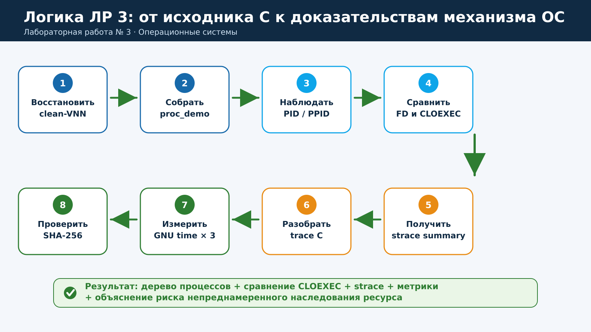
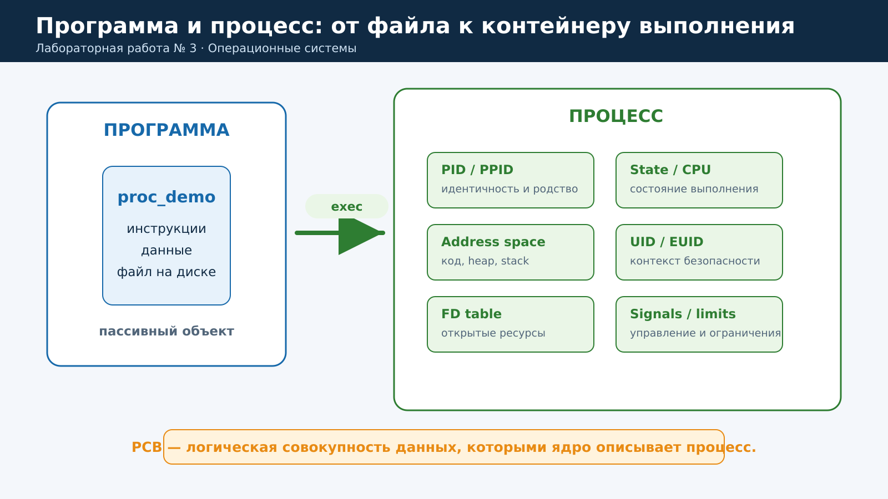
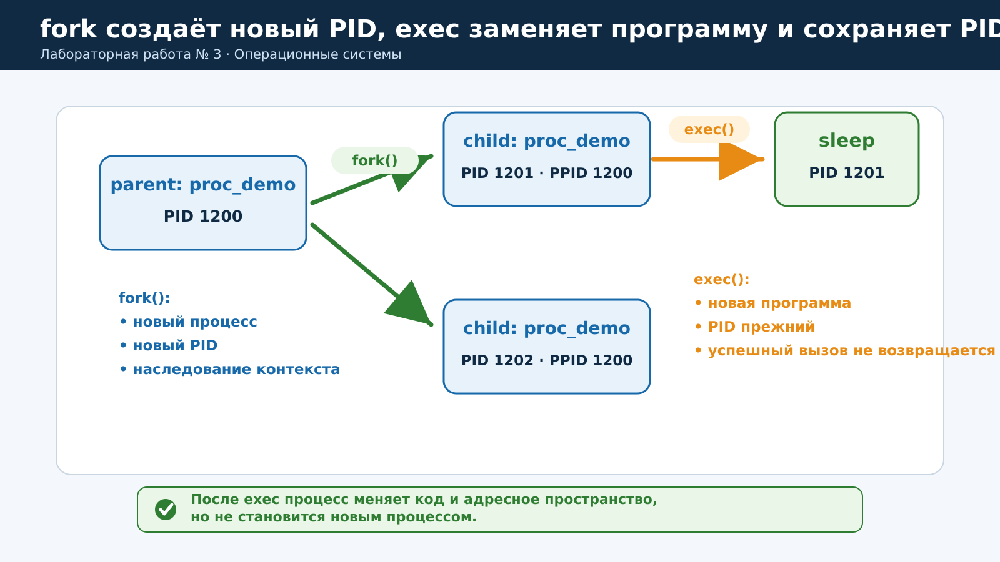
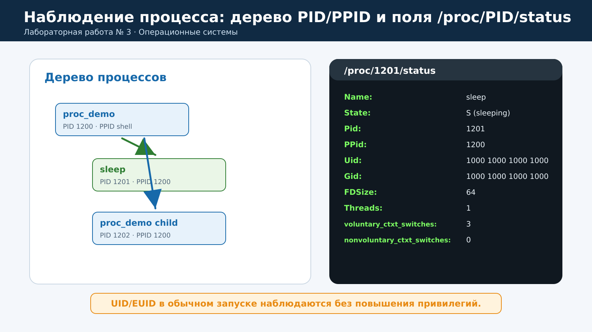
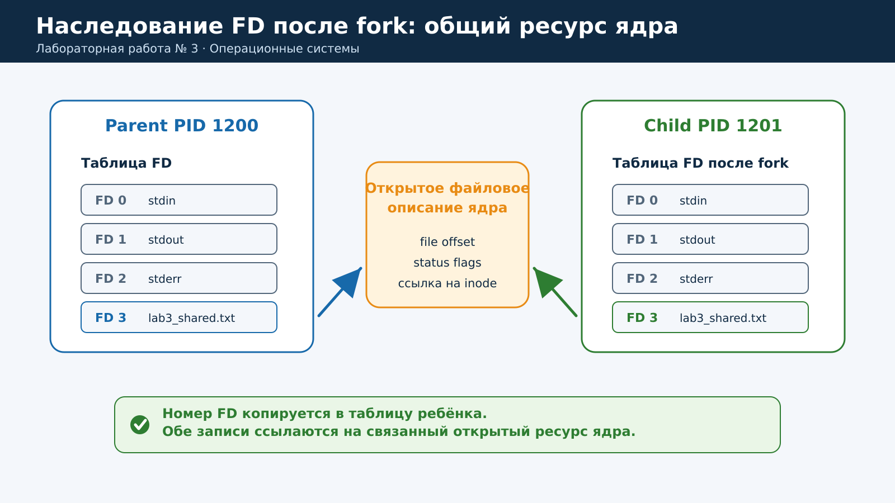
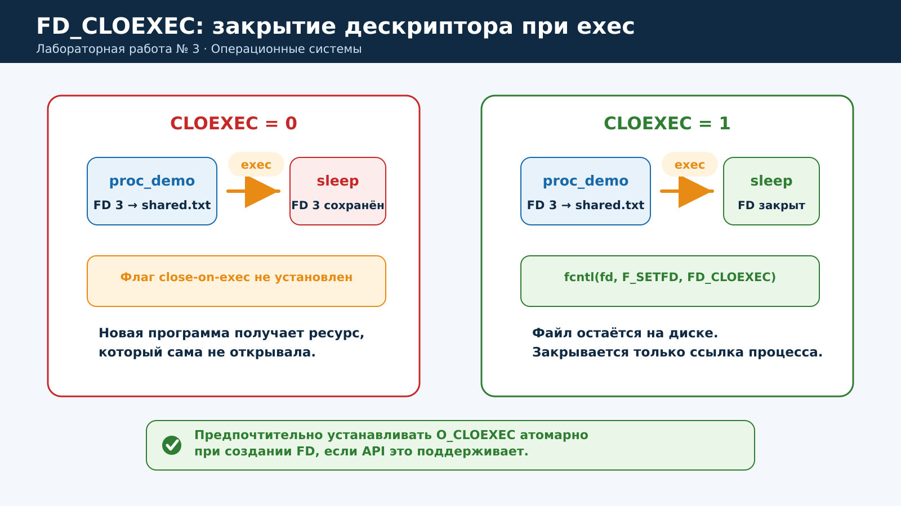
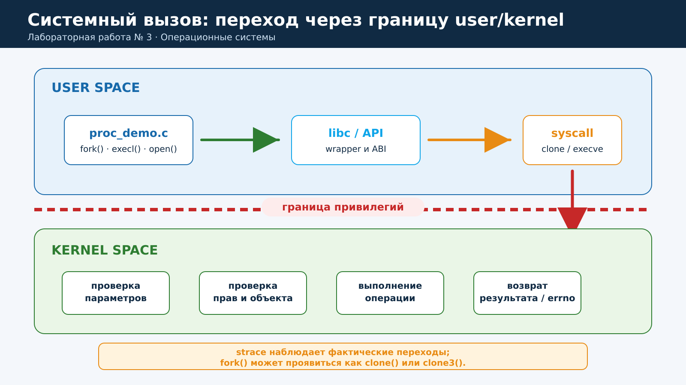
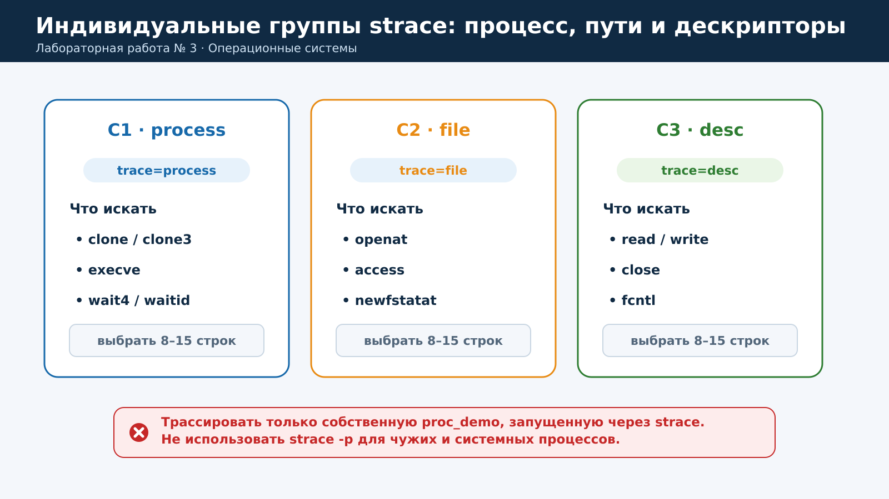
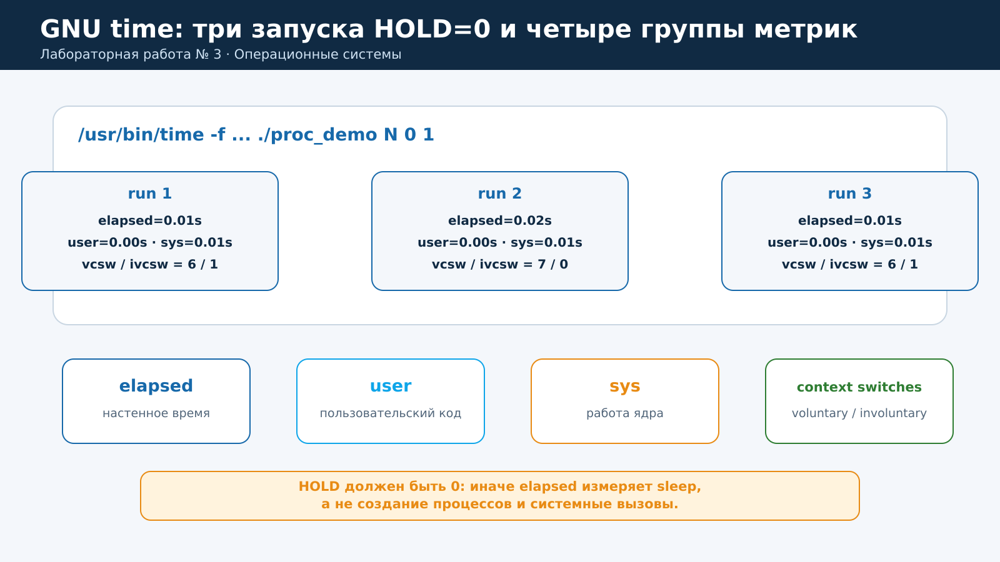
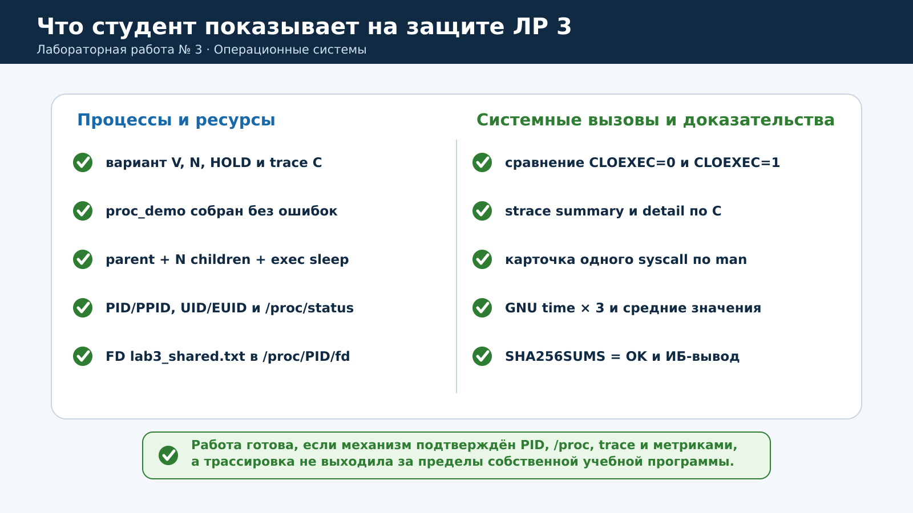

# Практическая работа № 3. Процессы, системные вызовы и файловые дескрипторы

**Дисциплина:** «Операционные системы»  
**Специальность:** 10.05.01 «Компьютерная безопасность»  
**Продолжительность:** 2 академических часа (90 минут)  
**Среда:** Astra Linux, обычная локальная учётная запись

> [!IMPORTANT]
> Работа выполняется только с собственной учебной программой. Не подключайте `strace` к чужим или системным процессам, не изменяйте SUID/SGID, capabilities, PAM, службы, межсетевой экран и параметры ядра. Если политика Astra Linux ограничивает `/proc` или трассировку, не ослабляйте её — зафиксируйте ограничение в отчёте.

## Содержание

1. [Цель и результаты](#1-цель-и-результаты)
2. [Краткая теория](#2-краткая-теория)
3. [Учебный стенд](#3-учебный-стенд)
4. [Индивидуальные варианты](#4-индивидуальные-варианты)
5. [План на 90 минут](#5-план-на-90-минут)
6. [Пошаговое выполнение](#6-пошаговое-выполнение)
7. [Таблицы результатов](#7-таблицы-результатов)
8. [Анализ и выводы](#8-анализ-и-выводы)
9. [Требования к отчёту](#9-требования-к-отчёту)
10. [Подготовка к защите](#10-подготовка-к-защите)
11. [Типовые ошибки](#11-типовые-ошибки)
12. [Контрольные вопросы](#12-контрольные-вопросы)
13. [Критерии оценивания](#13-критерии-оценивания)
14. [Источники](#14-источники)

---

## 1. Цель и результаты

**Цель:** исследовать процесс Linux как контейнер выполнения и ресурсов; экспериментально подтвердить создание процессов через `fork()`, замену программы через `exec()`, наследование файловых дескрипторов и действие `FD_CLOEXEC`; научиться наблюдать обращения к ядру и оценивать затраты ресурсов.

После выполнения работы студент должен уметь:

- различать программу и процесс, PID и PPID;
- объяснять отношения между родительским и дочерним процессами;
- находить состояния, UID/EUID и другие атрибуты в `ps` и `/proc/<PID>/status`;
- объяснять, почему `fork()` создаёт новый PID, а успешный `exec()` сохраняет PID;
- находить открытые файловые дескрипторы через `/proc/<PID>/fd`;
- демонстрировать наследование FD после `fork()`;
- предотвращать передачу ненужного FD новой программе с помощью `FD_CLOEXEC`;
- получать сводную и детальную трассировку собственной программы через `strace`;
- различать `elapsed`, `user`, `sys`, добровольные и недобровольные переключения контекста;
- фиксировать результаты и проверять их целостность по SHA-256.



---

## 2. Краткая теория

### 2.1. Программа и процесс

**Программа** — пассивный файл с инструкциями и данными. **Процесс** — выполняющийся экземпляр программы, которому ОС сопоставляет адресное пространство, состояние процессора, идентификаторы, таблицу открытых дескрипторов, сигналы, ограничения и контекст безопасности. Логическую совокупность этих данных называют PCB — Process Control Block; конкретное внутреннее представление зависит от ядра.



| Атрибут | Значение | Где наблюдать |
|---|---|---|
| PID | Идентификатор процесса в текущем PID namespace | `ps`, `/proc/<PID>` |
| PPID | PID родительского процесса | `ps`, `/proc/<PID>/status` |
| State | Текущее состояние | `ps` (`STAT`), `/proc/<PID>/status` |
| UID/EUID | Реальный и эффективный идентификаторы владельца | `ps`, `/proc/<PID>/status` |
| FD | Номер записи в таблице файловых дескрипторов | `/proc/<PID>/fd` |
| Context switches | Добровольные и недобровольные переключения | `/proc/<PID>/status`, GNU time |

### 2.2. `fork()` и `exec()`

`fork()` создаёт дочерний процесс. Родитель и ребёнок получают разные PID, а ребёнок наследует значительную часть контекста родителя. Возвращаемое значение позволяет различить ветви выполнения: в ребёнке это `0`, в родителе — PID ребёнка, при ошибке — `-1`.

Семейство `exec` не создаёт ещё один процесс. При успешном `execve()` ядро заменяет программу и адресное пространство текущего процесса новым образом, но сохраняет PID. Успешный `exec` не возвращается в старый код.

> [!NOTE]
> В Linux библиотечная функция `fork()` может использовать системный вызов `clone()` или `clone3()`. Поэтому отсутствие строки `fork` в `strace` не означает, что создание ребёнка не произошло: это различие API библиотеки и ABI ядра.



### 2.3. Наблюдение через `/proc`

Псевдофайловая система `/proc` предоставляет представление данных ядра. Каталог `/proc/<PID>` существует, пока существует процесс. В работе используются:

- `/proc/<PID>/status` — имя, состояние, PID/PPID, UID/GID, число потоков и счётчики переключений;
- `/proc/<PID>/fd` — символические ссылки на открытые ресурсы процесса.



### 2.4. Файловые дескрипторы и наследование

Файловый дескриптор — небольшое целое число в таблице процесса. Обычно `0`, `1` и `2` соответствуют `stdin`, `stdout` и `stderr`. После `open()`, `socket()`, `pipe()` и других операций появляются дополнительные FD.

После `fork()` родитель и ребёнок имеют отдельные таблицы FD, но соответствующие записи могут ссылаться на одно открытое файловое описание ядра. Поэтому ресурс, открытый до `fork()`, доступен ребёнку без нового `open()`.



Наследование через `exec()` иногда необходимо, но может стать утечкой ресурса: новая программа получает уже открытый файл, сокет или канал, который самостоятельно открыть не смогла бы. Флаг `FD_CLOEXEC` предписывает ядру закрыть конкретный дескриптор при успешном `exec()`.



> [!TIP]
> Для нового кода предпочтительно устанавливать close-on-exec атомарно при создании ресурса, например `open(..., O_CLOEXEC)`. Это исключает окно гонки между `open()` и отдельным `fcntl()` в многопоточной программе. В учебной программе используется `fcntl()`, чтобы действие флага было видно явно.

### 2.5. Системный вызов и граница привилегий

Пользовательская программа не изменяет структуры ядра напрямую. Она обращается к системным вызовам; ядро проверяет параметры и полномочия, выполняет операцию и возвращает результат либо код ошибки. `strace` показывает фактические переходы через эту границу.



Вариант определяет одну группу детальной трассировки:

- **C1 — process:** создание, `exec`, ожидание;
- **C2 — file:** операции с путями, метаданными и открытием;
- **C3 — desc:** чтение, запись, закрытие и управление FD.



### 2.6. Метрики GNU time

- `elapsed` — прошедшее настенное время;
- `user` — процессорное время пользовательского кода;
- `sys` — процессорное время ядра, затраченное на обслуживание workload;
- `vcsw` — добровольные переключения, например при ожидании;
- `ivcsw` — недобровольные переключения при вытеснении планировщиком.

Для измерений используется `HOLD=0`: иначе `elapsed` в основном отражал бы `sleep`, а не работу с процессами.



---

## 3. Учебный стенд

| Компонент | Требование |
|---|---|
| ОС | Astra Linux в учебной VM `astra-vNN` |
| Исходное состояние | Snapshot `clean-VNN` либо состояние, подтверждённое преподавателем |
| Ресурсы VM | Рекомендуется 2 vCPU и 4 ГБ RAM; во время измерений параметры не менять |
| Учётная запись | Обычная локальная, без `root` |
| ПО | `gcc`, заголовки libc, `ps`, `pstree`, `pgrep`, `strace`, `/usr/bin/time`, `coreutils` |
| Рабочий каталог | `~/oslab/lab03` |
| Kali Linux | Не требуется; VM должна быть выключена |

Проверка инструментов:

```bash
command -v gcc ps pstree pgrep strace sha256sum
test -x /usr/bin/time && echo "GNU time найден"
```

Если чего-то нет, остановитесь и сообщите преподавателю. Не устанавливайте пакеты из Интернета и не меняйте политики безопасности без разрешения.

---

## 4. Индивидуальные варианты

Параметры варианта:

- `N` — число дочерних процессов;
- `HOLD` — время удержания процессов для наблюдения, секунды;
- `TRACE_GROUP` — группа детальной трассировки.

| V | N | HOLD, с | TRACE_GROUP | Что анализировать |
|---:|---:|---:|---|---|
| 1 | 2 | 15 | `process` | `fork/clone`, `exec`, `wait` |
| 2 | 4 | 15 | `process` | `fork/clone`, `exec`, `wait` |
| 3 | 8 | 15 | `process` | `fork/clone`, `exec`, `wait` |
| 4 | 2 | 25 | `process` | `fork/clone`, `exec`, `wait` |
| 5 | 4 | 25 | `process` | `fork/clone`, `exec`, `wait` |
| 6 | 8 | 25 | `process` | `fork/clone`, `exec`, `wait` |
| 7 | 2 | 35 | `process` | `fork/clone`, `exec`, `wait` |
| 8 | 4 | 35 | `process` | `fork/clone`, `exec`, `wait` |
| 9 | 8 | 35 | `process` | `fork/clone`, `exec`, `wait` |
| 10 | 2 | 15 | `file` | `open`, `stat`, `access` |
| 11 | 4 | 15 | `file` | `open`, `stat`, `access` |
| 12 | 8 | 15 | `file` | `open`, `stat`, `access` |
| 13 | 2 | 25 | `file` | `open`, `stat`, `access` |
| 14 | 4 | 25 | `file` | `open`, `stat`, `access` |
| 15 | 8 | 25 | `file` | `open`, `stat`, `access` |
| 16 | 2 | 35 | `file` | `open`, `stat`, `access` |
| 17 | 4 | 35 | `file` | `open`, `stat`, `access` |
| 18 | 8 | 35 | `file` | `open`, `stat`, `access` |
| 19 | 2 | 15 | `desc` | `read`, `write`, `close`, `fcntl` |
| 20 | 4 | 15 | `desc` | `read`, `write`, `close`, `fcntl` |
| 21 | 8 | 15 | `desc` | `read`, `write`, `close`, `fcntl` |
| 22 | 2 | 25 | `desc` | `read`, `write`, `close`, `fcntl` |
| 23 | 4 | 25 | `desc` | `read`, `write`, `close`, `fcntl` |
| 24 | 8 | 25 | `desc` | `read`, `write`, `close`, `fcntl` |
| 25 | 2 | 35 | `desc` | `read`, `write`, `close`, `fcntl` |
| 26 | 4 | 35 | `desc` | `read`, `write`, `close`, `fcntl` |
| 27 | 8 | 35 | `desc` | `read`, `write`, `close`, `fcntl` |

---

## 5. План на 90 минут

| Время | Действие | Контрольный результат |
|---|---|---|
| 0–10 мин | Подготовить VM, каталог и вариант | Записаны `V`, `N`, `HOLD`, `TRACE_GROUP` |
| 10–25 мин | Создать, изучить и собрать программу | Бинарный файл запускается без ошибок |
| 25–42 мин | Наблюдать PID/PPID, UID/EUID, состояния и дерево | Найдены родитель, дети и `sleep` после `exec` |
| 42–57 мин | Сравнить FD при `CLOEXEC=0/1` | Подтверждено закрытие FD именно при `exec` |
| 57–72 мин | Выполнить `strace -c` и детальную трассировку | Есть summary и 8–15 объяснённых строк |
| 72–82 мин | Выполнить три измерения GNU time | Получены и усреднены пять метрик |
| 82–88 мин | Собрать evidence и SHA-256 | Проверка хешей завершается `OK` |
| 88–90 мин | Сформулировать выводы | Не менее 3 выводов по ОС и 2 по ИБ |

---

## 6. Пошаговое выполнение

### Шаг 1. Подготовить доверенную среду

Создайте отдельный каталог и зафиксируйте начало работы:

```bash
mkdir -p ~/oslab/lab03
cd ~/oslab/lab03
date --iso-8601=seconds | tee start_time.txt
uname -r | tee kernel.txt
```

Установите значения своего варианта. Ниже приведён пример для варианта 1:

```bash
V=1
N=2
HOLD=15
TRACE_GROUP=process
printf 'V=%02d N=%d HOLD=%d TRACE=%s\n' \
  "$V" "$N" "$HOLD" "$TRACE_GROUP" | tee variant.txt
```

**Проверьте:** в `variant.txt` находятся четыре параметра именно вашего варианта.

### Шаг 2. Создать учебную программу

Создайте `proc_demo.c`:

```c
#include <errno.h>
#include <fcntl.h>
#include <stdio.h>
#include <stdlib.h>
#include <sys/types.h>
#include <sys/wait.h>
#include <unistd.h>

static int to_int(const char *s, int min_v, int max_v) {
    char *end = NULL;
    long v = strtol(s, &end, 10);
    if (!s[0] || (end && *end) || v < min_v || v > max_v) {
        fprintf(stderr, "bad integer: %s\n", s);
        exit(2);
    }
    return (int)v;
}

int main(int argc, char **argv) {
    if (argc != 4) {
        fprintf(stderr, "usage: %s N HOLD CLOEXEC\n", argv[0]);
        return 2;
    }

    int n = to_int(argv[1], 1, 32);
    int hold = to_int(argv[2], 0, 120);
    int use_cloexec = to_int(argv[3], 0, 1);

    int fd = open("lab3_shared.txt",
                  O_CREAT | O_WRONLY | O_APPEND, 0640);
    if (fd < 0) {
        perror("open");
        return 1;
    }

    if (use_cloexec) {
        if (fcntl(fd, F_SETFD, FD_CLOEXEC) == -1) {
            perror("fcntl");
            close(fd);
            return 1;
        }
    }

    printf("PARENT pid=%ld ppid=%ld uid=%ld euid=%ld fd=%d cloexec=%d\n",
           (long)getpid(), (long)getppid(),
           (long)getuid(), (long)geteuid(), fd, use_cloexec);
    fflush(stdout);
    dprintf(fd, "parent pid=%ld\n", (long)getpid());

    for (int i = 0; i < n; ++i) {
        pid_t pid = fork();
        if (pid < 0) {
            perror("fork");
            close(fd);
            return 1;
        }
        if (pid == 0) {
            printf("CHILD index=%d pid=%ld ppid=%ld uid=%ld euid=%ld fd=%d\n",
                   i, (long)getpid(), (long)getppid(),
                   (long)getuid(), (long)geteuid(), fd);
            fflush(stdout);
            dprintf(fd, "child index=%d pid=%ld\n", i, (long)getpid());

            if (i == 0) {
                char sec[16];
                snprintf(sec, sizeof(sec), "%d", hold);
                execl("/bin/sleep", "sleep", sec, (char *)NULL);
                perror("execl");
                _exit(127);
            }

            sleep((unsigned)hold);
            close(fd);
            _exit(0);
        }
    }

    while (waitpid(-1, NULL, 0) > 0) {
        ;
    }
    if (errno != ECHILD) {
        perror("waitpid");
    }
    close(fd);
    return 0;
}
```

Найдите в коде `open()`, `fcntl()`, `fork()`, `execl()` и `waitpid()`. Для каждой операции определите, какой процесс её выполняет и какой ресурс меняется.

Соберите программу:

```bash
gcc -Wall -Wextra -O0 proc_demo.c -o proc_demo
file proc_demo
ls -l proc_demo
```

**Ожидается:** компилятор не выводит ошибок и предупреждений; `file` определяет исполняемый ELF-файл.

> [!NOTE]
> Файл открыт с `O_APPEND`, чтобы потомки не перезаписывали его начало. Это не является универсальной синхронизацией многопроцессной записи.

### Шаг 3. Выполнить контрольный запуск

```bash
./proc_demo "$N" 0 0 | tee run-foreground.txt
demo_rc=${PIPESTATUS[0]}
echo "exit_code=$demo_rc" | tee -a run-foreground.txt
cat lab3_shared.txt
```

`PIPESTATUS[0]` сохраняет код завершения `proc_demo`, а не последней команды конвейера `tee`.

**Зафиксируйте:** PID родителя; PID и индексы детей; UID/EUID; номер FD; код завершения. При `HOLD=0` процессы быстро исчезают — это нормально.

### Шаг 4. Наблюдать дерево процессов и контекст безопасности

Запустите программу в фоне с индивидуальным `HOLD`:

```bash
./proc_demo "$N" "$HOLD" 0 > run-background.txt 2>&1 &
PARENT=$!
echo "PARENT=$PARENT" | tee parent.pid
sleep 2

pstree -ap "$PARENT" | tee pstree-demo.txt
ps -o pid,ppid,user,uid,euid,stat,ni,pri,comm,args \
  -p "$PARENT" --ppid "$PARENT" | tee ps-demo.txt

EXEC_PID=$(pgrep -P "$PARENT" -x sleep | head -n 1)
echo "EXEC_PID=$EXEC_PID" | tee exec.pid

grep -E '^(Name|State|Pid|PPid|Uid|Gid|FDSize|Threads|voluntary|nonvoluntary)' \
  /proc/"$PARENT"/status | tee parent-status.txt

[ -n "$EXEC_PID" ] && \
grep -E '^(Name|State|Pid|PPid|Uid|Gid|FDSize|Threads|voluntary|nonvoluntary)' \
  /proc/"$EXEC_PID"/status | tee exec-status.txt
```

**Разберите результат:**

1. Сколько непосредственных детей имеет родитель?
2. Какой PID теперь отображается как `sleep`?
3. Почему его PID не изменился после `exec`?
4. Совпадают ли UID и EUID при обычном запуске?
5. В каких состояниях находятся процессы во время ожидания?

Не выполняйте `wait` — процесс ещё нужен для шага 5.

### Шаг 5. Исследовать дескрипторы при `CLOEXEC=0`

Пока процессы существуют:

```bash
ls -l /proc/"$PARENT"/fd | tee parent-fd.txt

if [ -n "$EXEC_PID" ]; then
  ls -l /proc/"$EXEC_PID"/fd | tee exec-fd-clo0.txt
  for f in /proc/"$EXEC_PID"/fd/*; do
    printf '%s -> ' "$f"
    readlink "$f"
  done | tee exec-fd-targets-clo0.txt
fi

wait "$PARENT"
```

Найдите ссылку на `lab3_shared.txt`. При `CLOEXEC=0` дескриптор должен сохраниться у `sleep` после `exec`, если политика ОС разрешает наблюдение `/proc`. Запишите фактический номер FD; он часто равен 3, но заранее полагаться на это нельзя.

### Шаг 6. Повторить опыт с `FD_CLOEXEC`

```bash
./proc_demo "$N" "$HOLD" 1 > run-cloexec.txt 2>&1 &
PARENT2=$!
sleep 2

EXEC_PID2=$(pgrep -P "$PARENT2" -x sleep | head -n 1)
echo "PARENT2=$PARENT2 EXEC_PID2=$EXEC_PID2" | tee cloexec-pids.txt

if [ -n "$EXEC_PID2" ]; then
  ls -l /proc/"$EXEC_PID2"/fd | tee exec-fd-clo1.txt
  for f in /proc/"$EXEC_PID2"/fd/*; do
    printf '%s -> ' "$f"
    readlink "$f"
  done | tee exec-fd-targets-clo1.txt
fi

wait "$PARENT2"
```

Сравните `exec-fd-clo0.txt` и `exec-fd-clo1.txt`. При `CLOEXEC=1` ссылка `sleep` на `lab3_shared.txt` должна исчезнуть. Файл остаётся на диске: флаг закрывает дескриптор процесса, а не удаляет объект.

### Шаг 7. Получить сводку системных вызовов

```bash
strace -f -c ./proc_demo "$N" 0 0 \
  > strace-program.out 2> strace-summary.txt
cat strace-summary.txt
```

`-f` включает потомков, `-c` агрегирует количество вызовов, ошибки и время. Найдите группы, связанные с созданием/ожиданием процессов, файлами и дескрипторами.

**Объясните:** почему в сводке есть обращения динамического загрузчика и libc, которых нет в исходнике явно.

### Шаг 8. Выполнить детальную трассировку своей группы

Выполните **одну** команду согласно варианту.

Группа C1 — процессы:

```bash
strace -f -e trace=process -o trace-detail.txt \
  ./proc_demo "$N" 0 0
```

Группа C2 — файлы и пути:

```bash
strace -f -e trace=file -o trace-detail.txt \
  ./proc_demo "$N" 0 0
```

Группа C3 — файловые дескрипторы:

```bash
strace -f -e trace=desc -o trace-detail.txt \
  ./proc_demo "$N" 0 0
```

Из `trace-detail.txt` выберите 8–15 строк, которые подтверждают механизм. Не вставляйте в основной отчёт всю трассировку.

> [!WARNING]
> Не используйте `strace -p` для присоединения к чужим процессам. В этой работе безопасный и достаточный способ — запустить собственную программу как дочерний процесс `strace`.

### Шаг 9. Разобрать один системный вызов

Выберите вызов из своей трассировки:

- C1: `execve` или `wait4`;
- C2: `openat`, `access` или `newfstatat`;
- C3: `write`, `close` или `fcntl`.

Откройте только нужную локальную страницу:

```bash
man 2 execve
# или: man 2 openat
# или: man 2 write
# или: man 2 fcntl
```

Заполните карточку из раздела 7.4: назначение, параметры, результат, не менее двух ошибок и проверки ядра.

### Шаг 10. Измерить ресурсы

Выполните три запуска с `HOLD=0` и включённым `CLOEXEC`:

```bash
rm -f metrics.txt
for i in 1 2 3; do
  /usr/bin/time -f \
    "run=$i elapsed=%e user=%U sys=%S vcsw=%w ivcsw=%c" \
    ./proc_demo "$N" 0 1 > /dev/null 2>> metrics.txt
done
cat metrics.txt
```

Рассчитайте средние значения автоматически:

```bash
awk '
{
  delete v
  for (i = 1; i <= NF; i++) {
    split($i, a, "=")
    v[a[1]] = a[2]
  }
  elapsed += v["elapsed"]
  user += v["user"]
  sys += v["sys"]
  vcsw += v["vcsw"]
  ivcsw += v["ivcsw"]
  n++
}
END {
  printf "avg elapsed=%.4f user=%.4f sys=%.4f vcsw=%.2f ivcsw=%.2f\n", \
    elapsed/n, user/n, sys/n, vcsw/n, ivcsw/n
}' metrics.txt | tee metrics-average.txt
```

Не сравнивайте абсолютные значения с другим компьютером без учёта числа vCPU, фоновой нагрузки и версии ПО.

### Шаг 11. Зафиксировать доказательства и проверить целостность

Сначала закончите редактирование evidence-файлов, затем создайте контрольные суммы:

```bash
date --iso-8601=seconds | tee finish_time.txt
rm -f SHA256SUMS sha256-check.txt

find . -maxdepth 1 -type f \
  \( -name '*.txt' -o -name '*.pid' \) \
  ! -name 'sha256-check.txt' -print0 \
  | sort -z \
  | xargs -0 sha256sum \
  | tee SHA256SUMS

sha256sum -c SHA256SUMS | tee sha256-check.txt
```

**Ожидается:** каждая строка проверки заканчивается `OK`. После этого не меняйте исходные evidence-файлы; иначе хеши закономерно перестанут совпадать.

---

## 7. Таблицы результатов

### 7.1. Атрибуты процессов

| Роль | PID | PPID | Команда | UID | EUID | State | Наблюдаемые FD | Комментарий |
|---|---:|---:|---|---:|---:|---|---|---|
| Родитель |  |  |  |  |  |  |  |  |
| Ребёнок 0 после `exec` |  |  | `sleep` |  |  |  |  |  |
| Ребёнок 1 |  |  |  |  |  |  |  |  |
| Другие дети |  |  |  |  |  |  |  |  |

### 7.2. Сравнение close-on-exec

| Проверка | `CLOEXEC=0` | `CLOEXEC=1` | Объяснение |
|---|---|---|---|
| FD `lab3_shared.txt` у родителя |  |  |  |
| FD у fork-потомка без `exec` |  |  |  |
| FD у `sleep` после `exec` |  |  |  |
| Файл остаётся на диске |  |  |  |
| ИБ-вывод |  |  |  |

### 7.3. Анализ фрагмента `strace`

Выберите 8–15 показательных строк.

| № | PID в trace | Системный вызов | Ключевые аргументы | Результат / `errno` | Что произошло в механизме ОС |
|---:|---:|---|---|---|---|
| 1 |  |  |  |  |  |
| 2 |  |  |  |  |  |
| 3 |  |  |  |  |  |
| 4 |  |  |  |  |  |
| 5 |  |  |  |  |  |
| 6 |  |  |  |  |  |
| 7 |  |  |  |  |  |
| 8 |  |  |  |  |  |

### 7.4. Карточка системного вызова

| Поле | Ответ |
|---|---|
| Имя вызова и номер раздела `man` |  |
| Назначение |  |
| Основные параметры |  |
| Возвращаемое значение |  |
| Ошибка 1 и условие |  |
| Ошибка 2 и условие |  |
| Какие объекты, параметры или права проверяет ядро |  |
| Что видно в вашей трассировке |  |

### 7.5. Измерения GNU time

| Запуск | elapsed, с | user, с | sys, с | voluntary CS | involuntary CS |
|---:|---:|---:|---:|---:|---:|
| 1 |  |  |  |  |  |
| 2 |  |  |  |  |  |
| 3 |  |  |  |  |  |
| **Среднее** |  |  |  |  |  |

### 7.6. Перечень evidence-файлов

| Файл | Что подтверждает |
|---|---|
| `variant.txt`, `kernel.txt` | Параметры варианта и ядро |
| `run-foreground.txt` | Корректный запуск и PID/FD |
| `pstree-demo.txt`, `ps-demo.txt` | Дерево, PID/PPID и состояния |
| `parent-status.txt`, `exec-status.txt` | Контекст и счётчики `/proc` |
| `exec-fd-clo0.txt`, `exec-fd-targets-clo0.txt` | FD после `exec` без close-on-exec |
| `exec-fd-clo1.txt`, `exec-fd-targets-clo1.txt` | FD после `exec` с close-on-exec |
| `strace-summary.txt` | Сводка системных вызовов |
| `trace-detail.txt` | Детальная трассировка группы варианта |
| `metrics.txt`, `metrics-average.txt` | Три измерения и средние значения |
| `SHA256SUMS`, `sha256-check.txt` | Целостность доказательств |

---

## 8. Анализ и выводы

Ответьте письменно:

1. Почему все непосредственные дети имеют один PPID?
2. Какой PID после `exec` стал `sleep` и почему не появился дополнительный PID?
3. Как соотносятся UID и EUID родителя и детей при обычном запуске?
4. Какой номер получил FD `lab3_shared.txt` и почему нельзя заранее утверждать, что это всегда 3?
5. Что именно изменилось между `CLOEXEC=0` и `CLOEXEC=1`?
6. Какие строки `strace` подтверждают создание ребёнка, замену программы, работу с файлом и ожидание?
7. Почему видны `openat`, `newfstatat`, `mmap` и другие вызовы, которых нет в исходнике явно?
8. Почему `sleep` увеличивает `elapsed`, почти не увеличивая `user` и `sys`?
9. С чем связаны добровольные и недобровольные переключения в вашем эксперименте?
10. Какое правило управления FD следует применять перед запуском другой программы?

Шаблон итоговых выводов:

| Категория | Вывод, подтверждённый наблюдением |
|---|---|
| Процессы 1 |  |
| Процессы 2 |  |
| Файловые дескрипторы |  |
| Системные вызовы |  |
| ИБ-вывод 1 |  |
| ИБ-вывод 2 |  |

---

## 9. Требования к отчёту

Рекомендуемый объём основной части — 6–9 страниц без полного листинга `trace-detail.txt`. Отчёт должен содержать:

1. Ф.И.О., группу, дату, вариант и параметры `N/HOLD/TRACE_GROUP`.
2. Цель и краткую схему `parent → fork children → exec sleep`.
3. Заполненную таблицу атрибутов процессов.
4. Сравнение `/proc/<PID>/fd` при `CLOEXEC=0` и `CLOEXEC=1`.
5. 8–15 строк детальной трассировки с объяснением.
6. Карточку одного системного вызова по `man 2`.
7. Три измерения GNU time и средние значения.
8. Объяснение различия API `fork/exec` и фактически наблюдаемых системных вызовов.
9. Не менее двух выводов об управлении ресурсами и двух выводов по безопасности.
10. `SHA256SUMS` и результат `sha256sum -c`.

Полные `trace-detail.txt` и evidence-файлы прикладываются отдельно. Не вставляйте десятки страниц трассировки в основной текст.

---

## 10. Подготовка к защите

Перед защитой последовательно покажите:

- параметры варианта и успешную сборку без предупреждений;
- родительский процесс, `N` детей и `sleep` после `exec`;
- связь PID/PPID и сохранение PID при `exec`;
- UID/EUID и ключевые поля `/proc/<PID>/status`;
- `lab3_shared.txt` в `/proc/<PID>/fd`;
- различие `CLOEXEC=0` и `CLOEXEC=1`;
- `strace-summary.txt` и выбранные строки `trace-detail.txt`;
- карточку одного системного вызова;
- три измерения и средние значения;
- успешную проверку SHA-256.



Работа готова к защите, если каждый вывод связан с конкретным PID, строкой `/proc`, трассировкой или измерением, а не только с теоретическим определением.

---

## 11. Типовые ошибки

| Симптом | Причина | Корректное действие |
|---|---|---|
| `pgrep` не находит `sleep` | `HOLD` слишком мал или процесс завершился | Повторить наблюдательный запуск с `HOLD` варианта |
| `pstree` показывает меньше `N` детей | Запуск сделан с `HOLD=0` или слишком поздно | Снять дерево через 1–2 секунды после запуска |
| В `strace` нет буквального `fork` | glibc использует `clone/clone3` | Объяснить различие API и syscall; использовать `trace=process` |
| У `sleep` нет FD при `CLOEXEC=0` | Процесс завершился, `/proc` ограничен или код изменён | Проверить PID, `HOLD` и исходник; политику ОС не ослаблять |
| У `sleep` остаётся FD при `CLOEXEC=1` | Флаг установлен не на тот FD или после `fork` | Проверить `fcntl(fd, F_SETFD, FD_CLOEXEC)` до цикла `fork` |
| В `strace -c` много «лишних» вызовов | Работают загрузчик и libc | Отделить инфраструктуру запуска от логики программы |
| Большой `elapsed`, но почти нулевые `user/sys` | В измерение попал `HOLD/sleep` | Для метрик использовать `HOLD=0` |
| Код завершения в контрольном запуске неверный | Считан код `tee`, а не программы | Использовать `${PIPESTATUS[0]}` |
| SHA-256 перестал проходить | Evidence изменён после хеширования | Завершить сбор и пересоздать `SHA256SUMS` |
| Доступ к `/proc/<PID>` запрещён | Действует защитная политика | Зафиксировать ограничение и обратиться к преподавателю |

---

## 12. Контрольные вопросы

1. Чем программа отличается от процесса?
2. Какую роль логически выполняет PCB?
3. Что обозначают PID и PPID?
4. Какие состояния процесса можно наблюдать в Linux?
5. Что создаёт `fork()` и что он возвращает родителю и ребёнку?
6. Почему вместо `fork()` в трассировке может быть `clone()` или `clone3()`?
7. Что делает `execve()` и изменяется ли PID?
8. Чем UID отличается от EUID?
9. Что такое файловый дескриптор?
10. Почему FD 0, 1 и 2 имеют особое значение?
11. Что происходит с FD после `fork()`?
12. Для чего предназначен `FD_CLOEXEC`?
13. Чем `FD_CLOEXEC` отличается от `close(fd)`?
14. Почему наследованный FD может быть проблемой безопасности?
15. Что показывает `strace` и откуда берутся дополнительные вызовы?
16. Чем `user` отличается от `sys`?
17. Что такое voluntary и involuntary context switch?
18. Почему `elapsed` может быть большим при почти нулевом CPU time?
19. Почему не требуется `strace -p` к системным процессам?
20. Как результаты работы связаны с планированием, IPC и разграничением доступа?

---

## 13. Критерии оценивания

| Компонент | Баллы | Критерий |
|---|---:|---|
| Процессы и `/proc` | 2 | Верно определены parent/children, PID/PPID, состояния, UID/EUID и `exec`-потомок |
| Файловые дескрипторы | 2 | Подтверждено наследование FD и различие `CLOEXEC=0/1` |
| Системные вызовы | 2 | Есть summary, индивидуальная трассировка и разбор одного syscall |
| Ресурсные метрики | 2 | Выполнены три измерения, рассчитаны средние и дана интерпретация |
| ИБ-анализ и защита | 2 | Объяснён риск утечки FD, evidence воспроизводимы, границы стенда соблюдены |

Ориентировочная шкала: 9–10 — «отлично», 7–8 — «хорошо», 5–6 — «удовлетворительно», менее 5 — повторное выполнение или защита. Трассировка чужих процессов и изменение защитных механизмов без задания считаются существенным нарушением методики.

---

## 14. Источники

1. [Linux man-pages: fork(2)](https://man7.org/linux/man-pages/man2/fork.2.html)
2. [Linux man-pages: execve(2)](https://man7.org/linux/man-pages/man2/execve.2.html)
3. [Linux man-pages: open(2)](https://man7.org/linux/man-pages/man2/open.2.html)
4. [Linux man-pages: fcntl(2)](https://man7.org/linux/man-pages/man2/fcntl.2.html)
5. [Linux man-pages: proc_pid_fd(5)](https://man7.org/linux/man-pages/man5/proc_pid_fd.5.html)
6. [Официальный проект strace](https://strace.io/)
7. [OSTEP: Processes and Process API](https://pages.cs.wisc.edu/~remzi/OSTEP/)
8. Рабочая программа дисциплины «Операционные системы» для специальности 10.05.01, 2026.
9. Конспект лекций по дисциплине «Операционные системы» для специальности 10.05.01, 2026.

Названия фактических системных вызовов и состав полей `/proc` могут отличаться между версиями ядра, libc, procps и strace. В отчёте следует указывать реально наблюдаемое поведение установленной системы.
