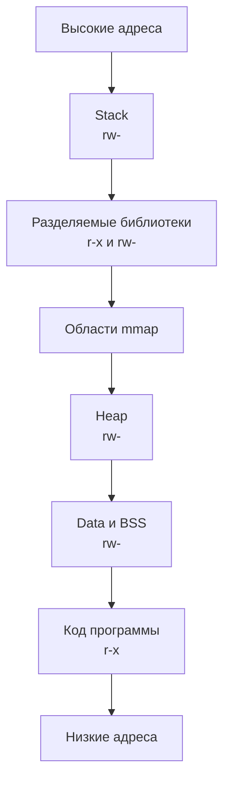
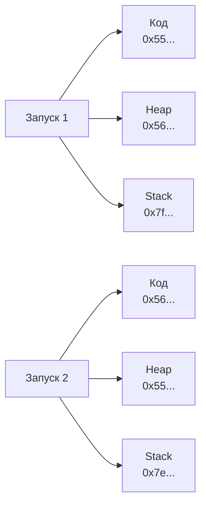

# Практическая работа № 4. Защита памяти и безопасные параметры ядра

**Дисциплина:** «Операционные системы»  
**Специальность:** 10.05.01 «Компьютерная безопасность»  
**Курс:** 2  
**Продолжительность:** 2 академических часа (90 минут)  
**Среда:** Astra Linux в изолированном стенде, созданном в практической работе № 1

> [!IMPORTANT]
> Работа выполняется только с собственной учебной программой и собственной виртуальной машиной Astra Linux. Запрещено отключать ASLR, ослаблять параметры ядра, исследовать память чужих процессов, запускать эксплуатационный код и изменять настройки хостовой ОС. Команды `sudo sysctl -w` выполняются только для усиления защиты и только после разрешения преподавателя.

## Содержание

1. [Цель и результаты](#1-цель-и-результаты)
2. [Правила безопасного выполнения](#2-правила-безопасного-выполнения)
3. [Краткая теория](#3-краткая-теория)
4. [Учебный стенд](#4-учебный-стенд)
5. [Индивидуальные варианты](#5-индивидуальные-варианты)
6. [План на 90 минут](#6-план-на-90-минут)
7. [Пошаговое выполнение](#7-пошаговое-выполнение)
8. [Таблицы результатов](#8-таблицы-результатов)
9. [Анализ и выводы](#9-анализ-и-выводы)
10. [Требования к отчёту](#10-требования-к-отчёту)
11. [Подготовка к защите](#11-подготовка-к-защите)
12. [Типовые ошибки](#12-типовые-ошибки)
13. [Контрольные вопросы](#13-контрольные-вопросы)
14. [Критерии оценивания](#14-критерии-оценивания)
15. [Источники](#15-источники)

---

## 1. Цель и результаты

**Цель:** исследовать размещение кода и данных процесса Linux в виртуальном адресном пространстве, экспериментально проверить действие ASLR и NX, сравнить свойства двух ELF-файлов, оценить безопасные параметры `sysctl` и подтвердить результат усиления повторной проверкой.

После выполнения работы студент должен уметь:

- различать виртуальный адрес, отображение памяти и физическую память;
- читать `/proc/<PID>/maps` и объяснять права `r`, `w`, `x`, тип отображения и назначение областей;
- находить код программы, библиотеки, heap и stack в карте памяти;
- объяснять действие ASLR и значение `kernel.randomize_va_space`;
- отличать PIE от обычного исполняемого ELF-файла;
- проверять NX по сегменту `GNU_STACK` и правам отображений;
- обнаруживать `RELRO`, `BIND_NOW` и stack protector по метаданным ELF;
- оценивать параметры `sysctl` по правилу «наблюдение — безопасное значение — повторная проверка»;
- не путать наличие защитного механизма с полной неуязвимостью программы;
- формировать воспроизводимый комплект доказательств и проверять его по SHA-256.

### Итоговые артефакты

| Артефакт | Содержание |
|---|---|
| `variant.txt` | Номер варианта и параметры `RUNS`, `PROFILE`, `SYSCTL_SET` |
| `mem_demo.c` | Исходный код собственной учебной программы |
| `mem_weak`, `mem_hardened` | Контрастная и усиленная сборки |
| `elf_weak.txt`, `elf_hardened.txt` | Результаты проверки PIE, NX, RELRO и символов |
| `maps_weak.txt`, `maps_hardened.txt` | Карты памяти запущенных процессов |
| `addresses_weak.tsv`, `addresses_hardened.tsv` | Адреса за несколько запусков |
| `sysctl_before.txt`, `sysctl_after.txt` | Параметры ядра до и после разрешённого усиления |
| `analysis.md` | Сравнение, оценка риска и выводы |
| `SHA256SUMS` | Контрольные суммы доказательств |

---

## 2. Правила безопасного выполнения

1. Восстановите snapshot `clean-VNN` из практической работы № 1 или используйте состояние, подтверждённое преподавателем.
2. Kali Linux в этой работе не требуется и должна быть выключена.
3. Исследуйте только процессы, которые запустили самостоятельно из каталога `~/oslab/lab04`.
4. Не используйте `gdb`, `ptrace`, отладчики и средства эксплуатации для чужих или системных процессов.
5. Не устанавливайте `kernel.randomize_va_space=0` и не создавайте постоянные настройки, ослабляющие защиту.
6. Контрастная сборка `mem_weak` предназначена только для анализа метаданных и адресов. Не добавляйте в неё уязвимый ввод и не создавайте exploit/payload.
7. Перед `sudo sysctl -w` покажите преподавателю таблицу исходных значений. Менять можно только ключи своего набора и только в сторону указанного безопасного значения.
8. Если параметр отсутствует в используемом ядре, запишите «не поддерживается» и не подбирайте замену самостоятельно.
9. Если безопасное значение уже установлено, не выполняйте лишнюю запись. Зафиксируйте, что усиление не потребовалось.
10. После работы создайте snapshot `lab04-hardened-VNN` либо верните VM к состоянию, указанному преподавателем.

---

## 3. Краткая теория

### 3.1. Виртуальное адресное пространство процесса

Каждый процесс работает в собственном виртуальном адресном пространстве. Ядро хранит набор виртуальных областей памяти и их права. Типичная карта включает код исполняемого файла, библиотеки, heap, stack и служебные отображения ядра.



Файл `/proc/<PID>/maps` содержит диапазон адресов, права, смещение, устройство, inode и связанный путь. Строка вида `r-xp` означает чтение и выполнение без записи; `rw-p` означает чтение и запись без выполнения.

### 3.2. Принцип W^X и NX

Практическое правило **W^X** требует, чтобы область памяти не была одновременно доступна для записи и выполнения. Механизм NX использует аппаратную поддержку запрета выполнения данных. Для ELF-файла свойство стека проверяют по программному заголовку `GNU_STACK`:

- `RW` — стек допускает чтение и запись, но не выполнение;
- `RWE` — стек помечен исполняемым и требует отдельного обоснования.

NX уменьшает риск выполнения внедрённых данных, но не исправляет ошибки границ, use-after-free и другие дефекты программы.

### 3.3. ASLR и PIE

ASLR меняет расположение областей памяти между запусками процесса. Параметр `kernel.randomize_va_space` обычно имеет значения:

| Значение | Смысл |
|---:|---|
| `0` | рандомизация отключена; в работе устанавливать запрещено |
| `1` | рандомизируются mmap, stack, VDSO и разделяемые библиотеки |
| `2` | дополнительно рандомизируется heap; целевое значение работы |

Чтобы основной исполняемый файл мог менять базовый адрес, он должен поддерживать позиционно-независимое выполнение. В выводе `readelf -h` обычный ELF-файл обычно имеет тип `EXEC`, а PIE — `DYN`.



### 3.4. Дополнительные свойства усиленной сборки

| Механизм | Назначение | Проверка |
|---|---|---|
| PIE | позволяет рандомизировать базу основного файла | `readelf -h`, тип `DYN` |
| NX stack | запрещает выполнение стека | `readelf -W -l`, `GNU_STACK` без `E` |
| Stack protector | обнаруживает повреждение контрольного значения стека | `readelf -s`, символ `__stack_chk_fail` |
| RELRO | защищает часть таблиц динамического связывания от записи | `GNU_RELRO` в program headers |
| Immediate binding | завершает связывание до передачи управления программе | `BIND_NOW` или `FLAGS: NOW` |
| Fortify | добавляет проверки для части библиотечных операций при оптимизации | флаг компиляции и анализ сборки |

### 3.5. Безопасные параметры `sysctl`

`sysctl` предоставляет интерфейс к параметрам ядра. Работа рассматривает только ограниченный набор защитных параметров.

| Ключ | Целевое значение | Назначение |
|---|---:|---|
| `kernel.randomize_va_space` | `2` | полная доступная рандомизация пользовательского адресного пространства |
| `kernel.kptr_restrict` | `2` | сокрытие указателей ядра |
| `kernel.dmesg_restrict` | `1` | ограничение чтения буфера сообщений ядра непривилегированными пользователями |
| `kernel.yama.ptrace_scope` | `1` | ограничение ptrace отношениями между процессами, если Yama доступен |
| `fs.protected_hardlinks` | `1` | защита от опасного создания hard link |
| `fs.protected_symlinks` | `1` | защита symlink в каталогах общего доступа |
| `fs.protected_fifos` | `2` | защита FIFO в каталогах общего доступа, если параметр доступен |
| `fs.protected_regular` | `2` | защита обычных файлов в каталогах общего доступа, если параметр доступен |

Указанное значение не объявляется универсальным профилем для любой системы. В реальной эксплуатации его сопоставляют с документацией конкретной версии Astra Linux, функциями узла и локальной политикой безопасности.

---

## 4. Учебный стенд

| Компонент | Требование |
|---|---|
| VM | `astra-vNN`, созданная в практической работе № 1 |
| Сеть | `Internal Network` или отключённый адаптер; внешний маршрут не требуется |
| Состояние | snapshot `clean-VNN` либо подтверждённая преподавателем точка |
| Учётная запись | обычная локальная; `sudo` только на шаге разрешённого усиления |
| ПО | `gcc`, `readelf`, `file`, `awk`, `grep`, `sed`, `sha256sum`, `sysctl` |
| Рабочий каталог | `~/oslab/lab04` |
| Kali Linux | не используется |

Проверьте инструменты:

```bash
command -v gcc readelf file awk grep sed sha256sum sysctl
```

Если обязательного инструмента нет, остановитесь и сообщите преподавателю. Не подключайте VM к Интернету и не устанавливайте пакеты из случайных источников.

---

## 5. Индивидуальные варианты

Параметры варианта:

- `RUNS` — число повторных запусков каждой сборки;
- `PROFILE` — профиль усиленной компиляции;
- `SYSCTL_SET` — набор параметров ядра для оценки и разрешённого усиления.

| Профиль | Флаги усиленной сборки |
|---|---|
| `P1` | PIE и неисполняемый стек |
| `P2` | P1, stack protector и полный RELRO |
| `P3` | P2, Fortify и защита от stack clash, если поддерживается компилятором |

| Набор | Параметры |
|---|---|
| `S1` | `kernel.randomize_va_space`, `kernel.kptr_restrict` |
| `S2` | `kernel.dmesg_restrict`, `kernel.yama.ptrace_scope` |
| `S3` | `fs.protected_hardlinks`, `fs.protected_symlinks`, `fs.protected_fifos`, `fs.protected_regular` |

| V | RUNS | PROFILE | SYSCTL_SET |
|---:|---:|---|---|
| 1 | 3 | `P1` | `S1` |
| 2 | 5 | `P1` | `S1` |
| 3 | 7 | `P1` | `S1` |
| 4 | 3 | `P2` | `S1` |
| 5 | 5 | `P2` | `S1` |
| 6 | 7 | `P2` | `S1` |
| 7 | 3 | `P3` | `S1` |
| 8 | 5 | `P3` | `S1` |
| 9 | 7 | `P3` | `S1` |
| 10 | 3 | `P1` | `S2` |
| 11 | 5 | `P1` | `S2` |
| 12 | 7 | `P1` | `S2` |
| 13 | 3 | `P2` | `S2` |
| 14 | 5 | `P2` | `S2` |
| 15 | 7 | `P2` | `S2` |
| 16 | 3 | `P3` | `S2` |
| 17 | 5 | `P3` | `S2` |
| 18 | 7 | `P3` | `S2` |
| 19 | 3 | `P1` | `S3` |
| 20 | 5 | `P1` | `S3` |
| 21 | 7 | `P1` | `S3` |
| 22 | 3 | `P2` | `S3` |
| 23 | 5 | `P2` | `S3` |
| 24 | 7 | `P2` | `S3` |
| 25 | 3 | `P3` | `S3` |
| 26 | 5 | `P3` | `S3` |
| 27 | 7 | `P3` | `S3` |

---

## 6. План на 90 минут

| Время | Действие | Контрольный результат |
|---|---|---|
| 0–10 мин | Восстановить стенд, создать каталог, записать вариант | `variant.txt`, исходные сведения об ОС |
| 10–25 мин | Создать программу и две сборки | `mem_weak`, `mem_hardened` запускаются |
| 25–38 мин | Проверить ELF-свойства | Определены PIE, NX, stack protector и RELRO |
| 38–53 мин | Получить две карты памяти | Найдены code, heap, stack и libraries |
| 53–65 мин | Выполнить повторные запуски | Заполнены два файла адресов |
| 65–75 мин | Снять исходные `sysctl`, оценить отклонения | `sysctl_before.txt`, таблица решения |
| 75–82 мин | Выполнить разрешённое усиление и повторную проверку | `sysctl_after.txt`, подтверждение результата |
| 82–88 мин | Сформировать анализ и SHA-256 | `analysis.md`, `SHA256SUMS` |
| 88–90 мин | Подготовить защиту | Сформулированы выводы и ограничения |

---

## 7. Пошаговое выполнение

### Шаг 1. Подготовьте доверенную среду

Восстановите `clean-VNN`, запустите только Astra Linux и создайте каталог:

```bash
mkdir -p ~/oslab/lab04
cd ~/oslab/lab04
date --iso-8601=seconds | tee start_time.txt
hostnamectl | tee hostnamectl.txt
uname -a | tee kernel.txt
ip route | tee route.txt
```

Установите значения своего варианта. Пример для варианта 1:

```bash
V=1
RUNS=3
PROFILE=P1
SYSCTL_SET=S1
printf 'V=%02d RUNS=%d PROFILE=%s SYSCTL_SET=%s\n' \
  "$V" "$RUNS" "$PROFILE" "$SYSCTL_SET" | tee variant.txt
```

**Проверьте:** в `variant.txt` записаны параметры именно вашего варианта.

### Шаг 2. Создайте учебную программу

Создайте файл `mem_demo.c`:

```c
#include <stdint.h>
#include <stdio.h>
#include <stdlib.h>
#include <unistd.h>

static int global_value = 42;

static void marker(void) {
    global_value++;
}

int main(int argc, char **argv) {
    int hold = 20;
    int stack_value = 7;
    int *heap_value = malloc(sizeof(*heap_value));

    if (argc == 2) {
        hold = atoi(argv[1]);
    }
    if (!heap_value || hold < 0 || hold > 120) {
        fprintf(stderr, "bad arguments or allocation failure\n");
        free(heap_value);
        return 2;
    }

    *heap_value = 99;
    marker();
    printf("pid=%ld\n", (long)getpid());
    printf("main=%p\n", (void *)(uintptr_t)&main);
    printf("marker=%p\n", (void *)(uintptr_t)&marker);
    printf("global=%p\n", (void *)&global_value);
    printf("heap=%p\n", (void *)heap_value);
    printf("stack=%p\n", (void *)&stack_value);
    printf("libc_printf=%p\n", (void *)(uintptr_t)&printf);
    fflush(stdout);
    sleep((unsigned)hold);
    free(heap_value);
    return 0;
}
```

Код не содержит переполнения буфера и не выполняет данные как команды. Он только выводит адреса объектов, принадлежащих собственному процессу.

### Шаг 3. Соберите контрастную версию

```bash
gcc -O0 -g -fno-pie -no-pie -fno-stack-protector \
  -Wl,-z,execstack -Wl,-z,norelro \
  -o mem_weak mem_demo.c
```

> [!CAUTION]
> `mem_weak` намеренно имеет ослабленные свойства ELF только для локального сравнения. Не копируйте этот способ сборки в реальные проекты и не добавляйте код эксплуатации.

### Шаг 4. Соберите усиленную версию по профилю

Для `P1`:

```bash
gcc -O2 -fPIE -pie -Wl,-z,noexecstack \
  -o mem_hardened mem_demo.c
```

Для `P2`:

```bash
gcc -O2 -fPIE -pie -fstack-protector-strong \
  -Wl,-z,noexecstack -Wl,-z,relro,-z,now \
  -o mem_hardened mem_demo.c
```

Для `P3` сначала проверьте поддержку флага:

```bash
printf 'int main(void){return 0;}\n' | \
  gcc -x c - -fstack-clash-protection -o /tmp/oslab-flag-test
```

Если проверка успешна:

```bash
gcc -O2 -D_FORTIFY_SOURCE=2 -fPIE -pie \
  -fstack-protector-strong -fstack-clash-protection \
  -Wl,-z,noexecstack -Wl,-z,relro,-z,now \
  -o mem_hardened mem_demo.c
```

Если компилятор не поддерживает `-fstack-clash-protection`, повторите команду без этого флага и зафиксируйте ограничение в отчёте.

```bash
file mem_weak mem_hardened | tee file_types.txt
./mem_weak 0 | tee weak_test.txt
./mem_hardened 0 | tee hardened_test.txt
```

### Шаг 5. Проверьте свойства ELF

```bash
{
  echo '=== ELF HEADER ==='
  readelf -h mem_weak
  echo '=== PROGRAM HEADERS ==='
  readelf -W -l mem_weak
  echo '=== DYNAMIC ==='
  readelf -W -d mem_weak
  echo '=== STACK CHECK SYMBOL ==='
  readelf -W -s mem_weak | grep -E 'stack_chk_fail|Symbol table' || true
} | tee elf_weak.txt

{
  echo '=== ELF HEADER ==='
  readelf -h mem_hardened
  echo '=== PROGRAM HEADERS ==='
  readelf -W -l mem_hardened
  echo '=== DYNAMIC ==='
  readelf -W -d mem_hardened
  echo '=== STACK CHECK SYMBOL ==='
  readelf -W -s mem_hardened | grep -E 'stack_chk_fail|Symbol table' || true
} | tee elf_hardened.txt
```

Создайте краткую сводку:

```bash
for f in mem_weak mem_hardened; do
  echo "=== $f ==="
  readelf -h "$f" | grep 'Type:'
  readelf -W -l "$f" | grep -E 'GNU_STACK|GNU_RELRO'
  readelf -W -d "$f" | grep -E 'BIND_NOW|FLAGS.*NOW' || true
  readelf -W -s "$f" | grep '__stack_chk_fail' || true
done | tee elf_summary.txt
```

**Интерпретация:** не ставьте отметку «защищено» только по имени флага. Запишите наблюдаемое доказательство: тип ELF, права `GNU_STACK`, наличие `GNU_RELRO`, `NOW` и символа stack protector.

### Шаг 6. Наблюдайте карты памяти

Запустите контрастную сборку:

```bash
./mem_weak 30 > weak_live.txt &
PID_WEAK=$!
sleep 1
cat "/proc/$PID_WEAK/maps" | tee maps_weak.txt
grep -E 'mem_weak|\[heap\]|\[stack\]|libc' maps_weak.txt \
  | tee maps_weak_key.txt
wait "$PID_WEAK"
```

Повторите для усиленной сборки:

```bash
./mem_hardened 30 > hardened_live.txt &
PID_HARD=$!
sleep 1
cat "/proc/$PID_HARD/maps" | tee maps_hardened.txt
grep -E 'mem_hardened|\[heap\]|\[stack\]|libc' maps_hardened.txt \
  | tee maps_hardened_key.txt
wait "$PID_HARD"
```

В каждой карте найдите:

1. исполняемое отображение программы;
2. записываемое отображение данных программы;
3. `[heap]`;
4. `[stack]`;
5. хотя бы одно отображение libc;
6. наличие или отсутствие `x` у stack;
7. наличие областей `rwx`.

Если чтение `/proc/<PID>/maps` запрещено политикой системы, не ослабляйте политику. Зафиксируйте сообщение об отказе и объясните, какой риск уменьшает такое ограничение.

### Шаг 7. Проверьте ASLR повторными запусками

```bash
: > addresses_weak.tsv
: > addresses_hardened.tsv

for i in $(seq 1 "$RUNS"); do
  ./mem_weak 0 | awk -v run="$i" -F= '
    /^(main|heap|stack|libc_printf)=/ {print run "\t" $1 "\t" $2}' \
    >> addresses_weak.tsv
done

for i in $(seq 1 "$RUNS"); do
  ./mem_hardened 0 | awk -v run="$i" -F= '
    /^(main|heap|stack|libc_printf)=/ {print run "\t" $1 "\t" $2}' \
    >> addresses_hardened.tsv
done

column -t addresses_weak.tsv | tee addresses_weak.txt
column -t addresses_hardened.tsv | tee addresses_hardened.txt
```

Если `column` отсутствует, просмотрите TSV напрямую:

```bash
cat addresses_weak.tsv
cat addresses_hardened.tsv
```

Ответьте по данным:

- меняется ли адрес `main` у `mem_weak`;
- меняется ли адрес `main` у `mem_hardened`;
- меняются ли heap, stack и libc;
- почему ASLR без PIE не обязан менять базу главного исполняемого файла;
- почему несколько разных адресов подтверждают рандомизацию, но не измеряют её энтропию.

### Шаг 8. Снимите исходные значения `sysctl`

Создайте функцию безопасного чтения:

```bash
read_key() {
  key="$1"
  if sysctl -n "$key" >/dev/null 2>&1; then
    printf '%s=%s\n' "$key" "$(sysctl -n "$key")"
  else
    printf '%s=NOT_SUPPORTED\n' "$key"
  fi
}
```

Снимите все контролируемые значения, чтобы отчёт был сопоставим между вариантами:

```bash
{
  read_key kernel.randomize_va_space
  read_key kernel.kptr_restrict
  read_key kernel.dmesg_restrict
  read_key kernel.yama.ptrace_scope
  read_key fs.protected_hardlinks
  read_key fs.protected_symlinks
  read_key fs.protected_fifos
  read_key fs.protected_regular
} | tee sysctl_before.txt
```

Дополнительно проверьте, что настройка ASLR согласуется с экспериментом:

```bash
sysctl kernel.randomize_va_space | tee aslr_sysctl.txt
```

### Шаг 9. Оцените и при необходимости усильте свой набор

Сначала заполните таблицу решения и покажите её преподавателю. Запись разрешена только после подтверждения.

#### Набор S1

```bash
sudo sysctl -w kernel.randomize_va_space=2
sudo sysctl -w kernel.kptr_restrict=2
```

#### Набор S2

```bash
sudo sysctl -w kernel.dmesg_restrict=1
if sysctl -n kernel.yama.ptrace_scope >/dev/null 2>&1; then
  sudo sysctl -w kernel.yama.ptrace_scope=1
fi
```

#### Набор S3

```bash
sudo sysctl -w fs.protected_hardlinks=1
sudo sysctl -w fs.protected_symlinks=1
if sysctl -n fs.protected_fifos >/dev/null 2>&1; then
  sudo sysctl -w fs.protected_fifos=2
fi
if sysctl -n fs.protected_regular >/dev/null 2>&1; then
  sudo sysctl -w fs.protected_regular=2
fi
```

Если текущее значение уже совпадает с целевым, пропустите соответствующую команду и запишите «изменение не требовалось». Не создавайте файл в `/etc/sysctl.d` без отдельного задания преподавателя.

### Шаг 10. Выполните повторную проверку

```bash
{
  read_key kernel.randomize_va_space
  read_key kernel.kptr_restrict
  read_key kernel.dmesg_restrict
  read_key kernel.yama.ptrace_scope
  read_key fs.protected_hardlinks
  read_key fs.protected_symlinks
  read_key fs.protected_fifos
  read_key fs.protected_regular
} | tee sysctl_after.txt

diff -u sysctl_before.txt sysctl_after.txt | tee sysctl_diff.txt || true
```

Повторная проверка должна подтвердить целевое значение либо документированное отсутствие параметра. Сам факт успешного выполнения `sysctl -w` без чтения результата доказательством не считается.

### Шаг 11. Сформируйте комплект доказательств

```bash
cat > analysis.md <<'EOF'
# Анализ результатов практической работы № 4

## Вариант и среда

## Сравнение ELF-свойств

## Карта памяти процесса

## Наблюдение ASLR

## Оценка параметров sysctl

## Риск, выполненная мера и повторная проверка

## Ограничения эксперимента

## Выводы
EOF

sha256sum \
  variant.txt mem_demo.c mem_weak mem_hardened \
  elf_weak.txt elf_hardened.txt elf_summary.txt \
  maps_weak.txt maps_hardened.txt \
  addresses_weak.tsv addresses_hardened.tsv \
  sysctl_before.txt sysctl_after.txt analysis.md \
  > SHA256SUMS

sha256sum -c SHA256SUMS | tee sha256_check.txt
```

Не редактируйте доказательства после вычисления хешей. Если исправление необходимо, пересоздайте `SHA256SUMS` и объясните причину.

### Шаг 12. Создайте точку завершения

1. сохраните каталог `~/oslab/lab04` способом, установленным для группы;
2. создайте snapshot `lab04-hardened-VNN`, если это указано преподавателем;
3. не удаляйте `clean-VNN`;
4. убедитесь, что Kali Linux остаётся выключенной;
5. не переносите контрастную сборку за пределы учебного каталога.

---

## 8. Таблицы результатов

### 8.1. Свойства ELF

| Проверка | `mem_weak` | `mem_hardened` | Доказательство |
|---|---|---|---|
| Тип ELF |  |  | `readelf -h` |
| PIE |  |  | `EXEC` или `DYN` |
| Права `GNU_STACK` |  |  | `readelf -W -l` |
| NX stack |  |  | отсутствует `E` |
| `GNU_RELRO` |  |  | program headers |
| `BIND_NOW` / `NOW` |  |  | dynamic section |
| `__stack_chk_fail` |  |  | symbol table |

### 8.2. Области памяти

| Область | Пример диапазона | Права | Связанный объект | Меняется между запусками |
|---|---|---|---|:---:|
| Код программы |  |  |  |  |
| Данные программы |  |  |  |  |
| Heap |  |  | `[heap]` |  |
| Stack |  |  | `[stack]` |  |
| libc |  |  | путь к библиотеке |  |

### 8.3. Решение по `sysctl`

| Параметр варианта | До | Цель | Решение | После | Риск при слабом значении |
|---|---:|---:|---|---:|---|
|  |  |  | изменить / уже безопасно / нет поддержки |  |  |
|  |  |  | изменить / уже безопасно / нет поддержки |  |  |
|  |  |  | изменить / уже безопасно / нет поддержки |  |  |
|  |  |  | изменить / уже безопасно / нет поддержки |  |  |

---

## 9. Анализ и выводы

В `analysis.md` необходимо:

1. объяснить различие между виртуальным адресом и физическим размещением данных;
2. указать, какие области карты памяти имеют права `r-x`, `rw-` и почему;
3. сравнить тип ELF и адрес `main` у двух сборок;
4. подтвердить или опровергнуть рандомизацию code, heap, stack и libc;
5. объяснить, как `GNU_STACK` связан с NX;
6. перечислить свойства усиленной сборки, подтверждённые выводом инструментов;
7. для каждого параметра своего набора записать актив, угрозу, исходное значение и принятое решение;
8. показать результат повторной проверки;
9. назвать не менее двух ограничений эксперимента;
10. сформулировать не менее трёх выводов по механизмам ОС и двух выводов по безопасности.

Корректный вывод не должен утверждать, что PIE, NX или stack protector «делают программу безопасной». Эти механизмы затрудняют отдельные классы атак и уменьшают последствия ошибок, но не заменяют безопасное программирование, разграничение доступа и обновления.

---

## 10. Требования к отчёту

Отчёт должен содержать:

1. тему, цель, номер варианта и параметры `RUNS`, `PROFILE`, `SYSCTL_SET`;
2. границы стенда и подтверждение использования собственной Astra Linux VM;
3. исходный код `mem_demo.c`;
4. команды компиляции обеих версий;
5. заполненную таблицу свойств ELF;
6. фрагменты карт памяти с code, heap, stack и libc;
7. таблицу повторных адресов;
8. исходные и итоговые значения `sysctl`;
9. таблицу решения по своему набору;
10. результат `sha256sum -c SHA256SUMS`;
11. анализ рисков, ограничения и выводы;
12. перечень ошибок и отклонений, если они возникли.

Не включайте в отчёт пароли, содержимое `/etc/shadow`, секреты, реальные данные и полные снимки чужих процессов.

---

## 11. Подготовка к защите

Студент должен уметь за 3–5 минут:

1. показать параметры варианта;
2. объяснить одну строку `/proc/<PID>/maps`;
3. доказать наличие или отсутствие PIE и NX;
4. показать, какие адреса менялись между запусками;
5. объяснить значение `kernel.randomize_va_space`;
6. обосновать целевое значение одного параметра своего набора;
7. показать сравнение `sysctl_before.txt` и `sysctl_after.txt`;
8. подтвердить целостность комплекта доказательств.

---

## 12. Типовые ошибки

| Ошибка | Почему это неверно | Как исправить |
|---|---|---|
| ASLR проверен одним запуском | нет сравнения адресов | выполнить `RUNS` запусков |
| ASLR отключён для демонстрации | ослаблена защита VM | сравнивать PIE и non-PIE при включённом ASLR |
| `DYN` автоматически назван библиотекой | PIE также может иметь тип `DYN` | сопоставить `file` и `readelf` |
| NX определён по отсутствию аварии | нет проверки метаданных | проверить `GNU_STACK` и карту памяти |
| В карте памяти исследован чужой PID | нарушены границы работы | запускать собственный процесс и сохранять `$!` |
| Параметры записаны без исходного снимка | невозможно доказать изменение | сначала создать `sysctl_before.txt` |
| Выполнен `sysctl -w`, но нет повторного чтения | результат не подтверждён | создать `sysctl_after.txt` и diff |
| Отсутствующий ключ заменён случайным параметром | вариант стал невоспроизводимым | записать `NOT_SUPPORTED` |
| Контрастная сборка названа уязвимой системой | исследуется только набор свойств ELF | формулировать вывод по наблюдаемым механизмам |
| Хеши вычислены до последнего изменения файлов | проверка завершится ошибкой | пересоздать `SHA256SUMS` после правок |

---

## 13. Контрольные вопросы

1. Чем виртуальный адрес отличается от физического адреса?
2. Что означает каждая буква в правах `r-xp`?
3. Почему stack обычно имеет права `rw-`, а код — `r-x`?
4. Что запрещает NX и чего он не предотвращает?
5. Почему PIE нужен для рандомизации базы главного исполняемого файла?
6. Какие области рандомизируются при `kernel.randomize_va_space=2`?
7. Почему один изменившийся адрес не позволяет оценить энтропию ASLR?
8. Как по `GNU_STACK` определить исполняемость стека?
9. В чём различие между partial RELRO и full RELRO?
10. Для чего нужен stack protector?
11. Что ограничивают `kptr_restrict` и `dmesg_restrict`?
12. Почему значение `sysctl` нельзя менять без учёта назначения узла?
13. Почему повторное чтение параметра обязательно после `sysctl -w`?
14. Почему усиленная сборка всё равно может содержать уязвимость?
15. Какие доказательства делают эксперимент воспроизводимым?

---

## 14. Критерии оценивания

| Оценка | Критерии |
|---|---|
| **Отлично** | Выполнены обе сборки; корректно интерпретированы PIE, NX, stack protector и RELRO; получены карты памяти и `RUNS` измерений; параметры своего набора обоснованы и повторно проверены; комплект доказательств целостен; выводы различают механизм, риск и ограничение. |
| **Хорошо** | Основные действия выполнены, но есть небольшие неточности в интерпретации одного свойства ELF, карты памяти или параметра `sysctl`; доказательства достаточны. |
| **Удовлетворительно** | Получен частичный результат; есть обе сборки и базовая карта памяти, но сравнение адресов, анализ параметров или повторная проверка неполны. Границы стенда соблюдены. |
| **Неудовлетворительно** | Нет воспроизводимых доказательств либо нарушены правила стенда; отключена защита, исследован чужой процесс, применены неразрешённые параметры или выполнены действия за пределами собственной VM. |

---

## 15. Источники

1. [Linux Kernel Documentation: параметры `/proc/sys/kernel/`](https://docs.kernel.org/admin-guide/sysctl/kernel.html)
2. [Linux Kernel Documentation: параметры `/proc/sys/fs/`](https://docs.kernel.org/admin-guide/sysctl/fs.html)
3. [Linux man-pages: `proc_pid_maps(5)`](https://man7.org/linux/man-pages/man5/proc_pid_maps.5.html)
4. [GNU GCC: Instrumentation Options](https://gcc.gnu.org/onlinedocs/gcc/Instrumentation-Options.html)
5. [GNU GCC: Link Options](https://gcc.gnu.org/onlinedocs/gcc/Link-Options.html)
6. [GNU Binutils: `readelf`](https://sourceware.org/binutils/docs/binutils/readelf.html)
7. Документация Astra Linux.

